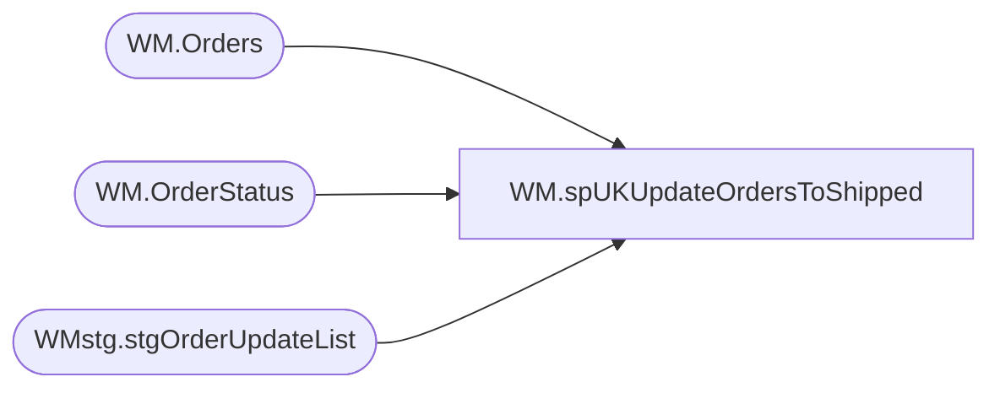

# WM.spUKUpdateOrdersToShipped

**Database:** WebOrderProcessing  
**Server:** bearcluster01  

## Architecture Diagram



## Table Dependencies

| Referenced Table |
|---|
| WM.Orders |
| WM.OrderStatus |
| WMstg.stgOrderUpdateList |

## Stored Procedure Code

```sql
CREATE PROCEDURE [WM].[spUKUpdateOrdersToShipped]

-- =============================================================================================================
-- Name: spUKUpdateOrdersToShipped
--
-- Description:	Temporary solve for GXO only sending SHIPPED notifications.  This bypasses the need for a WAVED notification
--
-- Output: 
--	
-- Dependencies: 
--
-- Revision History
--		Name:			Date:			Comments:
--		Ben Barud		6/30/2023		Initial Creation
-- =============================================================================================================
	
AS
BEGIN
	-- SET NOCOUNT ON added to prevent extra result sets from
	-- interfering with SELECT statements.
	SET NOCOUNT ON;

    -- Insert statements for procedure here
	 UPDATE [WebOrderProcessing].[WM].[Orders]
     SET OrderStatus = 'Waved'
     WHERE OrderNum IN (SELECT [OrderNum]
     FROM [STL-SSIS-P-01].[IntegrationStaging].[WMstg].[stgOrderUpdateList]
     WHERE LoadDate > '2023-6-24 19:00:00') AND [OrderStatus] IN ('Pending')

     SELECT os.*, o.OrderStatus
     FROM [WebOrderProcessing].[WM].[Orders] o
     INNER JOIN [WebOrderProcessing].[WM].[OrderStatus] os ON o.OrderId = os.OrderId
     WHERE OrderNum IN (SELECT [OrderNum]
     FROM [STL-SSIS-P-01].[IntegrationStaging].[WMstg].[stgOrderUpdateList]
     WHERE LoadDate > '2023-6-24 19:00:00') 
     AND CurrentStatus = 1 AND [Status] IN ('Pending')

     INSERT INTO [WebOrderProcessing].[WM].[OrderStatus] (OrderId, [Status], [StatusDate], CurrentStatus)
     SELECT o.OrderId, 'Waved', GETDATE(), 1
     FROM [WebOrderProcessing].[WM].[Orders] o
     INNER JOIN [WebOrderProcessing].[WM].[OrderStatus] os ON o.OrderId = os.OrderId
     WHERE OrderNum IN (SELECT [OrderNum]
     FROM [STL-SSIS-P-01].[IntegrationStaging].[WMstg].[stgOrderUpdateList]
     WHERE LoadDate > '2023-6-24 19:00:00') 
     AND [Status] = 'Pending' AND CurrentStatus = 1

     UPDATE os
     SET CurrentStatus = 0
     FROM [WebOrderProcessing].[WM].[Orders] o
     INNER JOIN [WebOrderProcessing].[WM].[OrderStatus] os ON o.OrderId = os.OrderId
     WHERE OrderNum IN (SELECT [OrderNum]
     FROM [STL-SSIS-P-01].[IntegrationStaging].[WMstg].[stgOrderUpdateList]
     WHERE LoadDate > '2023-6-24 19:00:00')
     AND [Status] = 'Pending' AND CurrentStatus = 1
END
```

