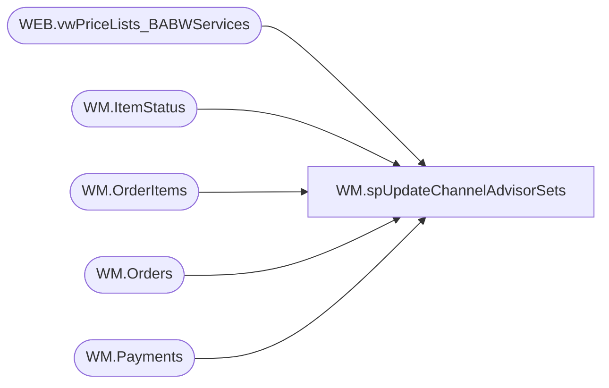

# WM.spUpdateChannelAdvisorSets

**Database:** WebOrderProcessing  
**Server:** bearcluster01  

## Architecture Diagram



## Table Dependencies

| Referenced Table |
|---|
| WEB.vwPriceLists_BABWServices |
| WM.ItemStatus |
| WM.OrderItems |
| WM.Orders |
| WM.Payments |

## Stored Procedure Code

```sql
CREATE PROCEDURE [WM].[spUpdateChannelAdvisorSets]

-- =============================================================================================================
-- Name: WM.spUpdateChannelAdvisorSets
--
-- Description:	Update Channel Advisor Set Pricing
--
-- Output: 
--	
-- Dependencies: 
--
-- Revision History
--		Name:			Date:			Comments:
--		Ben Barud		12/13/2021		Initial Creation
-- =============================================================================================================

AS
BEGIN

	SET NOCOUNT ON;

	SELECT o.OrderId, o.OrderDate, o.TransactionID
	INTO #tmp
	FROM WebOrderProcessing.[WM].[OrderItems] oi
	INNER JOIN [WebOrderProcessing].[WM].[Payments] p ON  oi.TransactionID = p.TransactionID
	INNER JOIN [WebOrderProcessing].[WM].[Orders] o ON oi.OrderId = o.OrderId
	WHERE p.PaymentMethod = 'Amazon' AND LEN(oi.sku) > 6 AND o.OrderStatus NOT IN ('Complete', 'Shipped')
	AND o.OrderDate > '2021-11-01 00:00:00'

	--SELECT * FROM #tmp

	WHILE (SELECT COUNT(*) FROM #tmp) > 0
	BEGIN

	  DECLARE @OrderId INT 
  
	  SELECT TOP 1 @OrderId = OrderId FROM #tmp

	  --SELECT @OrderId

	  UPDATE oi
	  SET Price = v.ListPrice, DiscountedPrice = v.ListPrice, PreviousOriginalPrice = v.ListPrice, PreviousDiscountedPrice = v.ListPrice
	  FROM [STL-SSIS-P-01].[IntegrationStaging].[WEB].[vwPriceLists_BABWServices] v
	  INNER JOIN WebOrderProcessing.[WM].[OrderItems] oi ON v.style_code = oi.sku AND oi.OrderId = @OrderId
	  INNER JOIN [WebOrderProcessing].[WM].[ItemStatus] ist ON oi.OrderItemID = ist.OrderItemID
	  WHERE oi.Price = 0.00 AND oi.DiscountedPrice = 0.00

	  UPDATE ist
	  SET Price = v.ListPrice, DiscountedPrice = v.ListPrice
	  FROM [STL-SSIS-P-01].[IntegrationStaging].[WEB].[vwPriceLists_BABWServices] v
	  INNER JOIN WebOrderProcessing.[WM].[OrderItems] oi ON v.style_code = oi.sku AND oi.OrderId = @OrderId
	  INNER JOIN [WebOrderProcessing].[WM].[ItemStatus] ist ON oi.OrderItemID = ist.OrderItemID
	  WHERE ist.Price = 0.00 AND ist.DiscountedPrice = 0.00

	  DELETE FROM #tmp WHERE OrderId = @OrderId

	END
END
```

