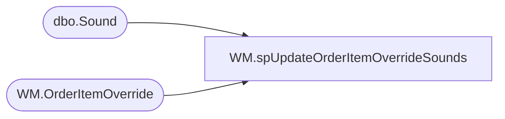

# WM.spUpdateOrderItemOverrideSounds

**Database:** WebOrderProcessing  
**Server:** bearcluster01  

## Architecture Diagram



## Table Dependencies

| Referenced Table |
|---|
| dbo.Sound |
| WM.OrderItemOverride |

## Stored Procedure Code

```sql
CREATE PROCEDURE [WM].[spUpdateOrderItemOverrideSounds]

AS
-- =============================================================================================================
-- Name: spUpdateOrderItemOverrideSounds
--
-- Description:	
--
--	Ben Barud	04/8/2021	Initial Creation
-- =============================================================================================================
BEGIN

	SET NOCOUNT ON;

	MERGE INTO [WebOrderProcessing].[WM].[OrderItemOverride] AS trg
	USING (SELECT StyleID, SoundName
		FROM KODIAK.BABW_Interactive.dbo.Sound
		) AS src ON trg.OriginalSku = '0' + CAST(src.StyleID AS VARCHAR(6))
	WHEN NOT MATCHED BY TARGET THEN
		INSERT (OriginalSku, OverrideSku, OverrideDescription)
		VALUES ('0' + CAST(src.StyleID AS VARCHAR(6)),  '027500', src.SoundName);
END
```

