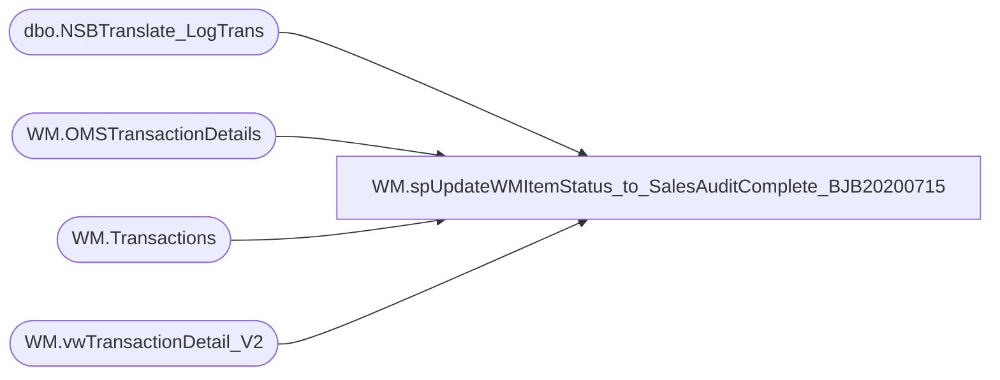

# WM.spUpdateWMItemStatus_to_SalesAuditComplete_BJB20200715

**Database:** WebOrderProcessing  
**Server:** bearcluster01  

## Architecture Diagram



## Table Dependencies

| Referenced Table |
|---|
| dbo.NSBTranslate_LogTrans |
| WM.OMSTransactionDetails |
| WM.Transactions |
| WM.vwTransactionDetail_V2 |

## Stored Procedure Code

```sql
CREATE PROCEDURE [WM].[spUpdateWMItemStatus_to_SalesAuditComplete_BJB20200715] 

-- =============================================================================================================
-- Name: WM.spUpdateWMItemStatus_to_SalesAuditComplete
--
-- Description:	Update WM Item Statuses to SalesAuditComplete
--
-- Output: 
--	
-- Dependencies: 
--
-- Revision History
--		Name:			Date:			Comments:
--		Ben Barud		9/10/2017		Initial Creation
--		Ben Barud		9/13/2017		Changed status from SalesAuditComplete to SAComplete
-- =============================================================================================================

AS
BEGIN
	-- SET NOCOUNT ON added to prevent extra result sets from
	-- interfering with SELECT statements.
	SET NOCOUNT ON;

	--SELECT oi.OrderItemId
	--      ,'SAComplete' AS 'Status'
	--	  ,GETDATE() AS 'StatusDate'
	--	  ,1 AS 'CurrentStatus'
	--	  ,oi.OrderId
	--	  ,v.TransactionID
	--	  ,ist.Status
 --   --INTO #tmpSalesAuditCompleteItems
	--FROM [WebOrderProcessing].[WM].[vwTransactionDetail] v
	--LEFT JOIN [WebOrderProcessing].[WM].[OrderItems] oi ON v.TransactionID = oi.TransactionID
	--LEFT JOIN [WebOrderProcessing].[WM].[ItemStatus] ist ON oi.OrderItemID = ist.OrderItemID
	--WHERE ((ist.[Status] = 'shipped' AND PaymentTransactionType = 'Sales') OR (ist.[Status] = 'IR' AND PaymentTransactionType = 'Return')) AND CurrentStatus = 1

	--UPDATE WM.ItemStatus
	--SET CurrentStatus = 0
	--WHERE OrderItemStatusId IN (
	--	SELECT OrderItemStatusId
	--	FROM [WebOrderProcessing].[WM].[vwTransactionDetail] v
	--	LEFT JOIN [WebOrderProcessing].[WM].[OrderItems] oi ON v.TransactionID = oi.TransactionID
	--	LEFT JOIN [WebOrderProcessing].[WM].[ItemStatus] ist ON oi.OrderItemID = ist.OrderItemID
	--	WHERE ((ist.[Status] = 'shipped' AND PaymentTransactionType = 'Sales') OR (ist.[Status] = 'IR' AND PaymentTransactionType = 'Return')) AND CurrentStatus = 1)

	--INSERT INTO WM.ItemStatus (OrderItemId, [Status], StatusDate, CurrentStatus, OrderID)
	--SELECT OrderItemId, [Status], StatusDate, CurrentStatus, OrderID FROM #tmpSalesAuditCompleteItems

	WITH ESOrders(TansactionDetailID
	               ,TransactionNum
    )
	AS (SELECT [TansactionDetailID]
              ,TransactionNum
        FROM [WebOrderProcessing].[WM].[OMSTransactionDetails] td WITH(NOLOCK)
        LEFT JOIN [WebOrderProcessing].[WM].[Transactions] t WITH(NOLOCK) ON td.TransactionID = t.TransactionID
		WHERE TransactionNum LIKE ('7_______') AND isSAProcessed = 0)
    UPDATE [WebOrderProcessing].[WM].OMSTransactionDetails 
	SET isSAProcessed = 1
	WHERE TansactionDetailID IN (SELECT TansactionDetailID FROM ESOrders)

	UPDATE [WebOrderProcessing].[WM].OMSTransactionDetails 
	SET isSAProcessed = 1
	WHERE TransactionID IN (SELECT TransactionID FROM [WebOrderProcessing].[WM].[vwTransactionDetail_V2] v INNER JOIN [BABWeCommerce].[dbo].[NSBTranslate_LogTrans] l WITH(NOLOCK) ON v.OrderNumber = sOrderNumber) 
	--OR TansactionDetailID IN (SELECT TansactionDetailID FROM ESOrders)
END
```

