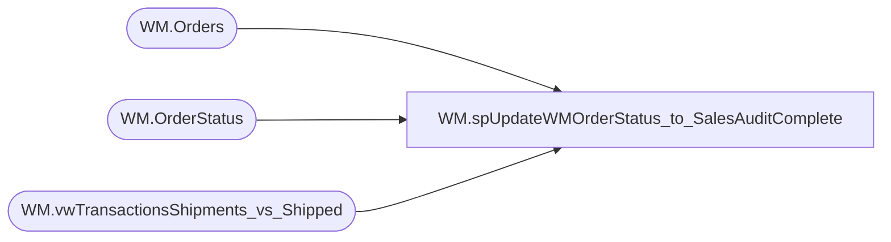

# WM.spUpdateWMOrderStatus_to_SalesAuditComplete

**Database:** WebOrderProcessing  
**Server:** bearcluster01  

## Architecture Diagram



## Table Dependencies

| Referenced Table |
|---|
| WM.Orders |
| WM.OrderStatus |
| WM.vwTransactionsShipments_vs_Shipped |

## Stored Procedure Code

```sql
CREATE PROCEDURE [WM].[spUpdateWMOrderStatus_to_SalesAuditComplete] 

-- =============================================================================================================
-- Name: WM.spUpdateWMOrderStatus_to_SalesAuditComplete
--
-- Description:	Update WM OrderStatuses to SalesAuditComplete
--
-- Output: 
--	
-- Dependencies: 
--
-- Revision History
--		Name:			Date:			Comments:
--		Ben Barud		9/10/2017		Initial Creation
--		Ben Barud		9/13/2017		Changed status from SalesAuditComplete to SAComplete
-- =============================================================================================================

AS
BEGIN
	-- SET NOCOUNT ON added to prevent extra result sets from
	-- interfering with SELECT statements.
	SET NOCOUNT ON;

	SELECT o.OrderId
	      ,'SAComplete' AS 'Status'
		  ,GETDATE() AS 'StatusDate'
		  ,1 AS 'CurentStatus'
    INTO #tmpSalesAuditCompleteOrders
	FROM [WebOrderProcessing].[WM].[Orders] o
	LEFT JOIN [WebOrderProcessing].[WM].[vwTransactionsShipments_vs_Shipped] svs ON o.TransactionID = svs.TransactionID
	WHERE svs.ShipmentsCount = svs.ShippedCount

	UPDATE WM.OrderStatus
	SET CurrentStatus = 0
	WHERE OrderStatusId IN (
		SELECT OrderStatusId
		FROM [WebOrderProcessing].[WM].[Orders] o
		LEFT JOIN [WebOrderProcessing].[WM].[OrderStatus] os ON o.OrderId = os.OrderId
		LEFT JOIN [WebOrderProcessing].[WM].[vwTransactionsShipments_vs_Shipped] svs ON o.TransactionID = svs.TransactionID
		WHERE svs.ShipmentsCount = svs.ShippedCount AND os.CurrentStatus = 1)

	INSERT INTO WM.OrderStatus (OrderId, [Status], StatusDate, CurrentStatus)
	SELECT * FROM #tmpSalesAuditCompleteOrders

END
```

