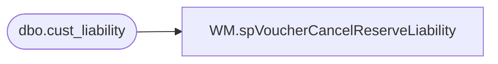

# WM.spVoucherCancelReserveLiability

**Database:** WebOrderProcessing  
**Server:** bearcluster01  

## Architecture Diagram



## Table Dependencies

| Referenced Table |
|---|
| dbo.cust_liability |

## Stored Procedure Code

```sql
CREATE PROCEDURE [WM].[spVoucherCancelReserveLiability] 
	@voucher_number varchar(20)

-- =============================================================================================================
-- Name: WM.spVoucherCancelReserveLiability 
--
-- Description:	Update pos_amount_1 value to amount_3 for the supplied reward coupon.  This cancels the reserve on funds so 
-- they can be redeemed
--
-- Output: 
--	
-- Dependencies: 
--
-- Revision History
--		Name:			Date:			Comments:
--		Ben Barud		02/18/2019		Initial Creation
-- =============================================================================================================

AS
BEGIN

	SET NOCOUNT ON;

	--SELECT *
	--FROM BEDROCKDB01.auditworks.dbo.cust_liability
	--WHERE reference_type = 35 AND reference_no LIKE '12502007933760548'

	DECLARE @issue_amount AS MONEY
	SELECT  @issue_amount = amount_3
	FROM BEDROCKDB01.auditworks.dbo.cust_liability
	WHERE reference_type = 35 AND reference_no LIKE @voucher_number

	IF @issue_amount IS NOT NULL
	BEGIN
		UPDATE BEDROCKDB01_WRITER.auditworks.dbo.cust_liability
		SET pos_amount_1 = amount_3
		WHERE reference_type = 35 AND reference_no LIKE @voucher_number
	END
	
END
```

