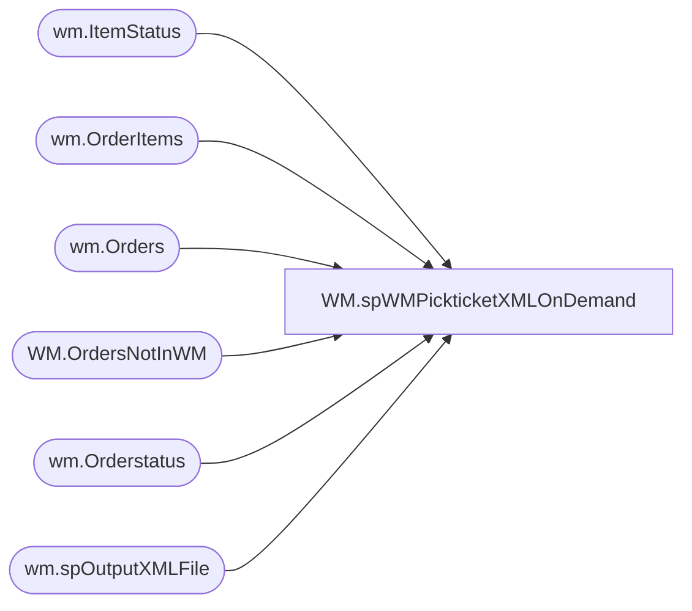

# WM.spWMPickticketXMLOnDemand

**Database:** WebOrderProcessing  
**Server:** bearcluster01  

## Architecture Diagram



## Table Dependencies

| Referenced Table |
|---|
| wm.ItemStatus |
| wm.OrderItems |
| wm.Orders |
| WM.OrdersNotInWM |
| wm.Orderstatus |
| wm.spOutputXMLFile |

## Stored Procedure Code

```sql
CREATE proc [WM].[spWMPickticketXMLOnDemand]

as 

set nocount on

-----------------------------------------------------------------------------------------------------------------------------------------------
---Dan Tweedie  2018-11-23	Creates web order pickticket.xml file for wm for web orders logged as having not been sent to WM but should have
------------------------------------------------------------------------------------------------------------------------------------------------

;
with 
ordersWithCancels as
	(
		select 
			distinct o.TransactionID 
		from wm.Orders O  
		inner join wm.Orderstatus s on o.Orderid = s.OrderID and s.currentstatus = 1
		inner join wm.ItemStatus S2 on O.orderid = s2.OrderID and s2.currentstatus = 1      
		where s2.status = 'IV' and s.status = 'Complete' and Isnull(pickticketflag,0) = 0
		and sourcesite = 'BABW-US'
	)

		select 
			OrderNum
		into #XX
		from 
			wm.Orders with (nolock)
		where 
			OrderNum in 
				(--single quoted commas separated list of order numbers--
				
					select OrderNumber from WM.OrdersNotInWM ---table is loaded from ssis validation 
				)
			and OrderID in (select OrderID from wm.OrderItems where len(sku) = 6)
			and OrderID not in 
				(
					select o.OrderID
					from wm.Orders o
					join wm.OrderStatus os 
						on o.OrderID = os.OrderID 
						and os.CurrentStatus = 1
					group by o.OrderID 
					having count(*) > 1
				) 
			and TransactionID not in (select TransactionID from ordersWithCancels)


if 	(select count(*) from #XX) > 0 

begin

	exec wm.spOutputXMLFile 
		@Query = 'select * from WebOrderProcessing.wm.vwWMPickticketXML_OnDEMAND', 
		@FileLocation = '\\wminteg01\Interfaces\PickTicket\', 
		@FileName = 'PickticketDMT.dmt'

end

WM,WareHouseQAapp_sp_GetOrder,creaTE PROCEDURE [dbo].[WareHouseQAapp_sp_GetOrder]
	@ordernum varchar(max)
AS
BEGIN

	select Orderid, OrderDate, OrderStatus, OrderType from wm.Orders where OrderNum=@ordernum;

END


WM,WareHouseQAapp_sp_GetOrderItem,CREATE PROCEDURE [WM].[WareHouseQAapp_sp_GetOrderItem]
	@orderid varchar(max)
AS
BEGIN

	select sku, ItemDescription, qty, isnull(ParentItem,0) ParentItem, orderitemid, 
	--isnull(convert(varchar(max),height),'') +
	--isnull(convert(varchar(max),weight),'') + 
	isnull(EyeColor,'') 
	--isnull(furcolor,'') + 
	--isnull(belongsto,'') + 
	--isnull(fullname,'') 
	as itemattr,
	idnum  
	from wm.OrderItems where OrderID=@orderid;

END

WM,WareHouseQAapp_sp_InsertLog,create PROCEDURE [dbo].[WareHouseQAapp_sp_InsertLog]

	@OrderNumber varchar(max),
	@StationID varchar(max),
	@UserID varchar(max)


AS
BEGIN

	insert into WM.qalog (ordernumber,stationid,UserID, LogDateTime) 
	values
	(@OrderNumber, @stationid, @userid, getdate());

END
WM,WareHouseQAapp_sp_SaveFindABear,create  PROCEDURE [dbo].[WareHouseQAapp_sp_SaveFindABear]
	@bearbarcode varchar(Max),
	@orderitemid int
AS
BEGIN

	update wm.orderitems set idnum=@bearbarcode where OrderItemID=@orderitemid;

END
```

