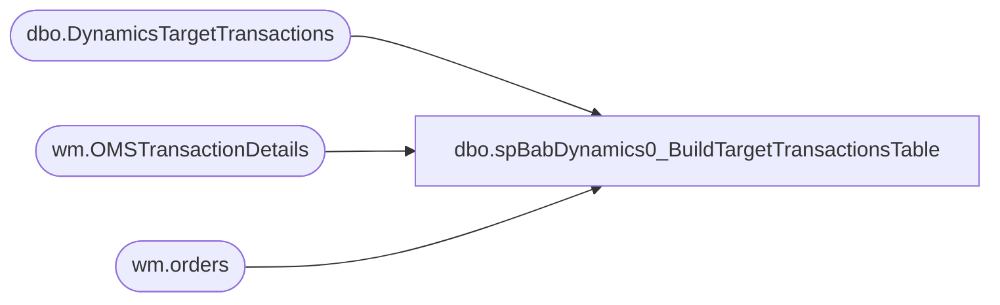

# dbo.spBabDynamics0_BuildTargetTransactionsTable

**Database:** WebOrderProcessing  
**Server:** bearcluster01  

## Architecture Diagram



## Table Dependencies

| Referenced Table |
|---|
| dbo.DynamicsTargetTransactions |
| wm.OMSTransactionDetails |
| wm.orders |

## Stored Procedure Code

```sql
---- =====================================================================================================
---- Name: spBabDynamics0_BuildTargetTransactionsTable
---- Revision History
----		Name:			Date:			Comments:
----		Tim Callahan	06/18/2024		Initial Release

---- =====================================================================================================
CREATE PROCEDURE [dbo].[spBabDynamics0_BuildTargetTransactionsTable]

@DaysBack int

as

set nocount on 

Truncate table DynamicsTargetTransactions
--;

----Variable Section for Manual Execution 
--Declare @DaysBack int
--set @Daysback = 9
--; 

---- This will be the deployment section for staging the target transacitons
---- Due to VPN issues as of 7/3/2024 we are going to limit the number of transactions temporarily 

insert into DynamicsTargetTransactions
select 
o.OrderNumber, 
cast (td.TransactionDate as date) as TransactionDate
from wm.orders o (nolock)
join wm.OMSTransactionDetails td (nolock) on td.TransactionID = o.TransactionID
where 1=1
and cast (td.TransactionDate  as date)  > = getdate()-@Daysback
and o.OrderNumber = '45FF0B15-3C29-4F3C-AC62-F0D30143ED98' -- Easy way to ensure not ordernumbers pull back
group by 
o.OrderNumber, 
cast (td.TransactionDate as date)
-- Targed Transactions
union 
select 
o.OrderNumber, 
cast (td.TransactionDate as date) as TransactionDate
--,O.PickupStore
from wm.orders o (nolock)
join wm.OMSTransactionDetails td (nolock) on td.TransactionID = o.TransactionID
where 1=1
--and cast (td.TransactionDate  as date)  > = getdate()-@Daysback
--and cast (td.TransactionDate  as date)  > = getdate()-1
--and (o.PickupStore not in ('0013','2013') and o.SourceSite = 'BABW-US') -- US BOSFS\BOPIS
--and o.OrderNumber in ('U2372460')
and o.OrderNumber = '45FF0B15-3C29-4F3C-AC62-F0D30143ED98' -- Easy way to ensure not ordernumbers pull back
group by 
o.OrderNumber, 
cast (td.TransactionDate as date)


-- End of Deployment Section 

/*
--Begin of Temp Limit Section 
insert into DynamicsTargetTransactions
select 
top 50 
o.OrderNumber, 
cast (td.TransactionDate as date) as TransactionDate
--,O.PickupStore
from wm.orders o (nolock)
join wm.OMSTransactionDetails td (nolock) on td.TransactionID = o.TransactionID
where 1=1
and cast (td.TransactionDate  as date)  > = getdate()-@Daysback
--and cast (td.TransactionDate  as date)  > = getdate()-1
and o.PickupStore = '2013' -- UK WEb 
group by 
o.OrderNumber, 
cast (td.TransactionDate as date)
--,O.PickupStore
union 
select 
top 50
o.OrderNumber, 
cast (td.TransactionDate as date) as TransactionDate
--,O.PickupStore
from wm.orders o (nolock)
join wm.OMSTransactionDetails td (nolock) on td.TransactionID = o.TransactionID
where 1=1
and cast (td.TransactionDate  as date)  > = getdate()-@Daysback
--and cast (td.TransactionDate  as date)  > = getdate()-1
and (o.PickupStore not in ('0013','2013') and o.SourceSite = 'BABW-UK') -- UK BOSFS\BOPIS
group by 
o.OrderNumber, 
cast (td.TransactionDate as date)
--,O.PickupStore
union 
select 
top 50
o.OrderNumber, 
cast (td.TransactionDate as date) as TransactionDate
--,O.PickupStore
from wm.orders o (nolock)
join wm.OMSTransactionDetails td (nolock) on td.TransactionID = o.TransactionID
where 1=1
and cast (td.TransactionDate  as date)  > = getdate()-@Daysback
--and cast (td.TransactionDate  as date)  > = getdate()-1
and (o.PickupStore not in ('0013','2013') and o.SourceSite = 'BABW-US') -- US BOSFS\BOPIS
group by 
o.OrderNumber, 
cast (td.TransactionDate as date)
*/
-- Targeted Transactions
--Added 7/17/2024 for testing dev related to BOPIS pickup tax 
/*
union 
select 
o.OrderNumber, 
cast (td.TransactionDate as date) as TransactionDate
--,O.PickupStore
from wm.orders o (nolock)
join wm.OMSTransactionDetails td (nolock) on td.TransactionID = o.TransactionID
where 1=1
--and cast (td.TransactionDate  as date)  > = getdate()-@Daysback
--and cast (td.TransactionDate  as date)  > = getdate()-1
--and (o.PickupStore not in ('0013','2013') and o.SourceSite = 'BABW-US') -- US BOSFS\BOPIS
and o.OrderNumber in ('U2372460')
group by 
o.OrderNumber, 
cast (td.TransactionDate as date)
*/

--End of Temp Limit Section
```

