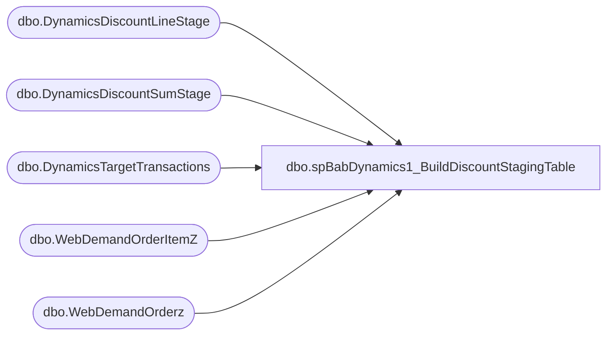

# dbo.spBabDynamics1_BuildDiscountStagingTable

**Database:** WebOrderProcessing  
**Server:** bearcluster01  

## Architecture Diagram



## Table Dependencies

| Referenced Table |
|---|
| dbo.DynamicsDiscountLineStage |
| dbo.DynamicsDiscountSumStage |
| dbo.DynamicsTargetTransactions |
| dbo.WebDemandOrderItemZ |
| dbo.WebDemandOrderz |

## Stored Procedure Code

```sql
---- =====================================================================================================
---- Name: spBabDynamics1_BuildDiscountStagingTable
---- Revision History
----		Name:			Date:			Comments:
----		Tim Callahan	06/13/2024		Initial Release
----		Tim Callahan	06/17/2024		Added Handling for Shipping Discounts as All Shipping information only available in the Header data source 
----		Tim Callahan	06/18/2024		We now have to use a different source for targeting eligible transactions and the date 
---- =====================================================================================================
CREATE PROCEDURE [dbo].[spBabDynamics1_BuildDiscountStagingTable]

@DaysBack int

as

set nocount on

---- Truncate STaging Tables 
truncate table DynamicsDiscountLineStage
truncate table DynamicsDiscountSumStage 
;

----Variable Section for Manual Execution 
--Declare @DaysBack int
--set @Daysback = 10
--declare @OrderNumber varchar (50)
--set @OrderNumber = 'U2340326'
--;


-- Build MaxOrderLine Table 
-- We will now join to DynamicsTargetTransactions rather than drive the date condition in here and the other related procedures 
IF OBJECT_ID(N'tempdb..#MaxOrderLine') IS NOT NULL
DROP TABLE #MaxOrderLine
; 

select 
i.OrderNumber
,i.OrderLineNumber
,max (LastUpdateDateUTC) as MaxLineUtc
,max(InsertDate) as MaxInsertDate
,dtt.TransactionDate 
into #MaxOrderLine
from WebDemandOrderItemZ i (nolock) 
join DynamicsTargetTransactions DTT on dtt.OrderNumber = i.OrderNumber
where 1=1
--and cast (i.LastUpdateDateUTC as date)  > = getdate()-@Daysback -- No Longer needed 
--and i.OrderNumber = @OrderNumber -- For Testing POC only 
group by
i.OrderNumber
,i.OrderLineNumber
,dtt.TransactionDate 
;


-- Added for Shipping Discount Section as we have to derive that from Header data 
IF OBJECT_ID(N'tempdb..#MaxOrder') IS NOT NULL
DROP TABLE #MaxOrder
; 
select 
u.OrderNumber 
,max (LastUpdateDateUTC) as MaxOrderUTC
,max(InsertDate) as MaxInsertDate
into #MaxOrder
from WebDemandOrderz  u (nolock)
join #MaxOrderLine mol on mol.OrderNumber = u.OrderNumber -- #MaxOrderLine Is setting  the table for the targeted transactions so joining to it ensure that it is only the transactions were targeting 
where 1=1 
group by 
u.OrderNumber

; 

IF OBJECT_ID(N'tempdb..#MaxOrderLineWarehouse') IS NOT NULL
DROP TABLE #MaxOrderLineWarehouse
; 

select 
u.OrderNumber
,case 
	when u.SiteCode = 'UK' and u.WarehouseCode is not null 
		then u.WarehouseCode
	when u.SiteCode = 'UK' and u.WarehouseCode is null 
		then '2013'
	when u.SiteCode = 'US'
		then concat ('1',right(u.WarehouseCode,3))
	else null 
end as WarehouseCode
,dtt.TransactionDate
into #MaxOrderLineWarehouse 
from WebDemandOrderItemZ u (nolock) 
join #MaxOrderLine mol on mol.OrderNumber = u.OrderNumber -- #MaxOrderLine Is setting  the table for the targeted transactions so joining to it ensure that it is only the transactions were targeting 
join DynamicsTargetTransactions DTT on dtt.OrderNumber = u.OrderNumber
where 1=1
and
(
	u.SiteCode = 'US' and u.WarehouseCode is not null and isnull(u.WarehouseCode,'0000') not in ('0013') -- Exclude US WebStore E Gift Cards  and  US Webstore 
		and u.ItemStatus in ('Delivered','Picked Up','Return','Store Shipped')  -- Statuses to Include as of 6/14/2024 Per Comments from  Dan Tweedie
	or 
	u.SiteCode = 'UK' 
		and u.ItemStatus in ('Store Shipped','Return','Shipped','Picked Up','Gift Card Processed','Donation Processed','Gift Card Devalued') -- Statuses to Include as of 6/14/2024 Per Comments from  Dan Tweedie
) 
group by
u.OrderNumber
,case 
	when u.SiteCode = 'UK' and u.WarehouseCode is not null 
		then u.WarehouseCode
	when u.SiteCode = 'UK' and u.WarehouseCode is null 
		then '2013'
	when u.SiteCode = 'US'
		then concat ('1',right(u.WarehouseCode,3))
	else null 
end
,dtt.TransactionDate

; 


-- End Shipping Discount  Max Trans Add 

--  Build DiscountLinePrep Temp Table 
IF OBJECT_ID(N'tempdb..#DiscountLinePrep') IS NOT NULL
DROP TABLE #DiscountLinePrep
; 

--Capture Transaction Level Discounts 
--Our Deck data does not have multiple lines for each discount 
select 
case
	when i.SiteCode = 'UK' and i.WarehouseCode is null 
		then concat('2013','-','002','-',convert (varchar,mol.TransactionDate,112),'-',i.OrderNumber) 
	when i.SiteCode = 'UK' and isnull(i.WarehouseCode,'0000') = '2013'
		then concat(i.WarehouseCode,'-','002','-',convert (varchar,mol.TransactionDate,112),'-',i.OrderNumber) 
	when i.SiteCode = 'UK' and isnull(i.WarehouseCode,'0000') <> '2013'
		then concat(i.WarehouseCode,'-','052','-',convert (varchar,mol.TransactionDate,112),'-',i.OrderNumber) 			
	when i.SiteCode = 'US'
		then concat('1',right(i.WarehouseCode,3),'-','052','-',convert (varchar,mol.TransactionDate,112),'-',i.OrderNumber) 
	else null 
end	as TransactionKey
,i.OrderDiscount  as Amount 
,i.OrderDiscount  as DiscountCost
,'Manual' as DiscountOriginType
, case 
	when i.SiteCode = 'UK' and i.WarehouseCode is not null 
		then concat(i.WarehouseCode,'INT') 
	when i.SiteCode = 'UK' and i.WarehouseCode is null 
		then concat('2013','INT') 
	when i.SiteCode = 'US'
		then concat ('1',right(i.WarehouseCode,3),'INT')
	else null 
end as RetailTerminalId
,case
	when i.SiteCode = 'UK' and i.WarehouseCode is null 
		then concat('2013','-','002','-',convert (varchar,mol.TransactionDate,112),'-',i.OrderNumber,'_1') 
	when i.SiteCode = 'UK' and isnull(i.WarehouseCode,'0000') = '2013'
		then concat(i.WarehouseCode,'-','002','-',convert (varchar,mol.TransactionDate,112),'-',i.OrderNumber,'_1') 
	when i.SiteCode = 'UK'and isnull(i.WarehouseCode,'0000') <> '2013'
		then concat(i.WarehouseCode,'-','052','-',convert (varchar,mol.TransactionDate,112),'-',i.OrderNumber,'_1') 		
	when i.SiteCode = 'US'
		then concat('1',right(i.WarehouseCode,3),'-','052','-',convert (varchar,mol.TransactionDate,112),'-',i.OrderNumber,'_1') 
	else null 
end	as RetailTransactionId
,'LookupRequired' as BABIntRetailOperatingUnitNumber
,null as Percentage
, case 
	when i.SiteCode = 'UK' and i.WarehouseCode is not null 
		then i.WarehouseCode
	when i.SiteCode = 'UK' and i.WarehouseCode is null 
		then '2013'
	when i.SiteCode = 'US'
		then concat ('1',right(i.WarehouseCode,3))
	else null 
end as RetailStoreId
,i.OrderLineNumber as SaleLineNum
,'None' as CustomerDiscountType
,null as BABIntRetailProcessed
,'TotalDiscountAmount' as ManualDiscountType 
,case 
	when i.GiftCardNumber is not null
		then 'GiftCardDis'
	when i.GiftCardNumber is null 
		then 'MerchDis'
		else null 
	end as PeriodicDiscountOfferId
,case
	when i.SiteCode = 'UK'
		then '2110'
	when i.SiteCode = 'US'
		then '1100'	
	end as Entity
, I.LastUpdateDateUTC as CreateTime
--, null as Barcode 
, i.OrderNumber as Barcode 
, case 
	when i.SiteCode = 'UK' and i.WarehouseCode is not null 
		then i.WarehouseCode
	when i.SiteCode = 'UK' and i.WarehouseCode is null 
		then '2013'
	when i.SiteCode = 'US'
		then concat ('1',right(i.WarehouseCode,3))
	else null 
end as InventLocationId
into #DiscountLinePrep
from WebDemandOrderItemZ i (nolock) 
join #MaxOrderLine mol on mol.OrderNumber = i.OrderNumber
	and mol.OrderLineNumber = i.OrderLineNumber
	and mol.MaxLineUtc = i.LastUpdateDateUTC
	and mol.MaxInsertDate = i.InsertDate
where 1=1
and 
(
	i.SiteCode = 'US' and i.WarehouseCode is not null and isnull(i.WarehouseCode,'0000') not in ('0013') -- Exclude US WebStore E Gift Cards  and  US Webstore 
		and i.ItemStatus in ('Delivered','Picked Up','Return','Store Shipped')  -- Statuses to Include as of 6/14/2024 Per Comments from  Dan Tweedie
	or 
	i.SiteCode = 'UK' 
		and i.ItemStatus in ('Store Shipped','Return','Shipped','Picked Up','Gift Card Processed','Donation Processed','Gift Card Devalued') -- Statuses to Include as of 6/14/2024 Per Comments from  Dan Tweedie
) 
--and cast (i.LastUpdateDateUTC as date)  > = getdate()-@Daysback
--and i.OrderNumber = @OrderNumber
and i.OrderDiscount <> 0.00 -- Header Level Transactions
union 
--Capture Line Level Discounts 
--Our Deck data does not have multiple lines for each discount 
select 
case
	when i.SiteCode = 'UK' and i.WarehouseCode is null 
		then concat('2013','-','002','-',convert (varchar,mol.TransactionDate,112),'-',i.OrderNumber) 
	when i.SiteCode = 'UK' and isnull(i.WarehouseCode,'0000') = '2013'
		then concat(i.WarehouseCode,'-','002','-',convert (varchar,mol.TransactionDate,112),'-',i.OrderNumber) 
	when i.SiteCode = 'UK'and isnull(i.WarehouseCode,'0000') <> '2013'
		then concat(i.WarehouseCode,'-','052','-',convert (varchar,mol.TransactionDate,112),'-',i.OrderNumber) 		
	when i.SiteCode = 'US'
		then concat('1',right(i.WarehouseCode,3),'-','052','-',convert (varchar,mol.TransactionDate,112),'-',i.OrderNumber) 
	else null 
end	as TransactionKey
,i.ItemDiscount  as Amount 
,i.ItemDiscount  as DiscountCost
,'Periodic' as DiscountOriginType
, case 
	when i.SiteCode = 'UK' and i.WarehouseCode is not null 
		then concat(i.WarehouseCode,'INT') 
	when i.SiteCode = 'UK' and i.WarehouseCode is null 
		then concat('2013','INT') 
	when i.SiteCode = 'US'
		then concat ('1',right(i.WarehouseCode,3),'INT')
	else null 
end as RetailTerminalId
,case
	when i.SiteCode = 'UK' and i.WarehouseCode is null 
		then concat('2013','-','002','-',convert (varchar,mol.TransactionDate,112),'-',i.OrderNumber,'_1') 
	when i.SiteCode = 'UK' and isnull(i.WarehouseCode,'0000') = '2013'
		then concat(i.WarehouseCode,'-','002','-',convert (varchar,mol.TransactionDate,112),'-',i.OrderNumber,'_1') 
	when i.SiteCode = 'UK'and isnull(i.WarehouseCode,'0000') <> '2013'
		then concat(i.WarehouseCode,'-','052','-',convert (varchar,mol.TransactionDate,112),'-',i.OrderNumber,'_1') 		
	when i.SiteCode = 'US'
		then concat('1',right(i.WarehouseCode,3),'-','052','-',convert (varchar,mol.TransactionDate,112),'-',i.OrderNumber,'_1') 
	else null 
end	as RetailTransactionId
,'LookupRequired' as BABIntRetailOperatingUnitNumber
,null as Percentage
, case 
	when i.SiteCode = 'UK' and i.WarehouseCode is not null 
		then i.WarehouseCode
	when i.SiteCode = 'UK' and i.WarehouseCode is null 
		then '2013'
	when i.SiteCode = 'US'
		then concat ('1',right(i.WarehouseCode,3))
	else null 
end as RetailStoreId
,i.OrderLineNumber as SaleLineNum
,'None' as CustomerDiscountType
,null as BABIntRetailProcessed
,'None' as ManualDiscountType 
,case 
	when i.GiftCardNumber is not null
		then 'GiftCardDis'
	when i.GiftCardNumber is null 
		then 'MerchDis'
		else null 
	end as PeriodicDiscountOfferId
,case
	when i.SiteCode = 'UK'
		then '2110'
	when i.SiteCode = 'US'
		then '1100'	
	end as Entity
, I.LastUpdateDateUTC as CreateTime
--, null as Barcode 
, i.OrderNumber as Barcode
, case 
	when i.SiteCode = 'UK' and i.WarehouseCode is not null 
		then i.WarehouseCode
	when i.SiteCode = 'UK' and i.WarehouseCode is null 
		then '2013'
	when i.SiteCode = 'US'
		then concat ('1',right(i.WarehouseCode,3))
	else null 
end as InventLocationId
from WebDemandOrderItemZ i (nolock) 
join #MaxOrderLine mol on mol.OrderNumber = i.OrderNumber
	and mol.OrderLineNumber = i.OrderLineNumber
	and mol.MaxLineUtc = i.LastUpdateDateUTC
	and mol.MaxInsertDate = i.InsertDate
where 1=1
and 
(
	i.SiteCode = 'US' and i.WarehouseCode is not null and isnull(i.WarehouseCode,'0000') not in ('0013') -- Exclude US WebStore E Gift Cards  and  US Webstore 
		and i.ItemStatus in ('Delivered','Picked Up','Return','Store Shipped')  -- Statuses to Include as of 6/14/2024 Per Comments from  Dan Tweedie
	or 
	i.SiteCode = 'UK' 
		and i.ItemStatus in ('Store Shipped','Return','Shipped','Picked Up','Gift Card Processed','Donation Processed','Gift Card Devalued') -- Statuses to Include as of 6/14/2024 Per Comments from  Dan Tweedie
) 
--and cast (i.LastUpdateDateUTC as date)  > = getdate()-@Daysback
--and i.OrderNumber = @OrderNumber
and i.ItemDiscount <> 0.00 -- Line Level Transactions


-- DiscountLineBase 
IF OBJECT_ID(N'tempdb..#DiscountLineBase ') IS NOT NULL
DROP TABLE #DiscountLineBase
; 
select 
p.TransactionKey, 
p.Amount, 
p.DiscountCost, 
p.DiscountOriginType, 
p.RetailTerminalId, 
p.RetailTransactionId, 
p.BABIntRetailOperatingUnitNumber, 
ROW_NUMBER() OVER(
    PARTITION BY p.RetailTransactionId, p.SaleLineNum
    ORDER BY p.SaleLineNum
) as LineNum,
p.Percentage, 
p.RetailStoreId, 
p.SaleLineNum, 
p.CustomerDiscountType, 
p.BABIntRetailProcessed, 
p.ManualDiscountType, 
p.PeriodicDiscountOfferId, 
ROW_NUMBER() OVER(
    PARTITION BY p.RetailTransactionId
    ORDER BY p.SaleLineNum
) as BabRetailDiscountTransUniqueLineNum,
p.Entity, 
p.CreateTime, 
p.Barcode,
p.InventLocationId
into #DiscountLineBase
from #DiscountLinePrep p
where 1=1
--order by p.RetailTransactionId, p.SaleLineNum

-- Build Staging Table dynamicsdiscountlinestage
Insert into DynamicsDiscountLineStage
select 
dlb.TransactionKey, 
dlb.Amount, 
dlb.DiscountCost, 
dlb.DiscountOriginType, 
dlb.RetailTerminalId, 
dlb.RetailTransactionId, 
dlb.BABIntRetailOperatingUnitNumber, 
dlb.LineNum, 
dlb.Percentage, 
dlb.RetailStoreId, 
dlb.SaleLineNum, 
dlb.CustomerDiscountType, 
dlb.BABIntRetailProcessed, 
dlb.ManualDiscountType, 
dlb.PeriodicDiscountOfferId, 
dlb.BabRetailDiscountTransUniqueLineNum, 
dlb.Entity, 
dlb.CreateTime, 
dlb.Barcode, 
dlb.InventLocationId
from #DiscountLineBase dlb 
group by 
dlb.TransactionKey, 
dlb.Amount, 
dlb.DiscountCost, 
dlb.DiscountOriginType, 
dlb.RetailTerminalId, 
dlb.RetailTransactionId, 
dlb.BABIntRetailOperatingUnitNumber, 
dlb.LineNum, 
dlb.Percentage, 
dlb.RetailStoreId, 
dlb.SaleLineNum, 
dlb.CustomerDiscountType, 
dlb.BABIntRetailProcessed, 
dlb.ManualDiscountType, 
dlb.PeriodicDiscountOfferId, 
dlb.BabRetailDiscountTransUniqueLineNum, 
dlb.Entity, 
dlb.CreateTime, 
dlb.Barcode,
dlb.InventLocationId
;
-- Get Max BabRetailDiscountTransUniqueLineNum by RetailTransId 
IF OBJECT_ID(N'tempdb..#DiscountTransUniqueLineNum') IS NOT NULL
DROP TABLE #DiscountTransUniqueLineNum
; 
select
RetailTransactionId
,max (BabRetailDiscountTransUniqueLineNum) as MaxBabRetailDiscountTransUniqueLineNum
into #DiscountTransUniqueLineNum
from DynamicsDiscountLineStage
group by 
RetailTransactionId


-- Find Shipping Discounts and Insert into dynamicsdiscountlinestage

IF OBJECT_ID(N'tempdb..#DiscountLineBaseShipping') IS NOT NULL
DROP TABLE #DiscountLineBaseShipping
; 
select 
case
	when i.SiteCode = 'UK' and ii.WarehouseCode is null 
		then concat('2013','-','002','-',convert (varchar,ii.TransactionDate,112),'-',i.OrderNumber) 
	when i.SiteCode = 'UK' and isnull(ii.WarehouseCode,'0000') = '2013'
		then concat(ii.WarehouseCode,'-','002','-',convert (varchar,ii.TransactionDate,112),'-',i.OrderNumber) 
	when i.SiteCode = 'UK'and isnull(ii.WarehouseCode,'0000') <> '2013'
		then concat(ii.WarehouseCode,'-','052','-',convert (varchar,ii.TransactionDate,112),'-',i.OrderNumber) 		
	when i.SiteCode = 'US'
		then concat('1',right(ii.WarehouseCode,3),'-','052','-',convert (varchar,ii.TransactionDate,112),'-',i.OrderNumber) 
	else null 
end	as TransactionKey
,i.ShippingDiscount  as Amount 
,i.ShippingDiscount  as DiscountCost
,'Periodic' as DiscountOriginType
, case 
	when i.SiteCode = 'UK' and ii.WarehouseCode is not null 
		then concat(ii.WarehouseCode,'INT') 
	when i.SiteCode = 'UK' and ii.WarehouseCode is null 
		then concat('2013','INT') 
	when i.SiteCode = 'US'
		then concat ('1',right(ii.WarehouseCode,3),'INT')
	else null 
end as RetailTerminalId
,case
	when i.SiteCode = 'UK' and ii.WarehouseCode is null 
		then concat('2013','-','002','-',convert (varchar,ii.TransactionDate,112),'-',i.OrderNumber,'_1') 
	when i.SiteCode = 'UK' and isnull(ii.WarehouseCode,'0000') = '2013'
		then concat(ii.WarehouseCode,'-','002','-',convert (varchar,ii.TransactionDate,112),'-',i.OrderNumber,'_1') 
	when i.SiteCode = 'UK'and isnull(ii.WarehouseCode,'0000') <> '2013'
		then concat(ii.WarehouseCode,'-','052','-',convert (varchar,ii.TransactionDate,112),'-',i.OrderNumber,'_1') 		
	when i.SiteCode = 'US'
		then concat('1',right(ii.WarehouseCode,3),'-','052','-',convert (varchar,ii.TransactionDate,112),'-',i.OrderNumber,'_1') 
	else null 
end	as RetailTransactionId
,'LookupRequired' as BABIntRetailOperatingUnitNumber
,'1' AS LineNum -- I believe there will only ever be a single discount on a Deck shipping discount 
,null as Percentage
, case 
	when i.SiteCode = 'UK' and iI.WarehouseCode is not null 
		then Ii.WarehouseCode
	when i.SiteCode = 'UK' and iI.WarehouseCode is null 
		then '2013'
	when i.SiteCode = 'US'
		then concat ('1',right(iI.WarehouseCode,3))
	else null 
end as RetailStoreId
,'SHIPPING' as SaleLineNum
,'None' as CustomerDiscountType
,null as BABIntRetailProcessed
,'None' as ManualDiscountType 
,'MerchDis' as PeriodicDiscountOfferId
,'hold' as BabRetailDiscountTransUniqueLineNum
,case
	when i.SiteCode = 'UK'
		then '2110'
	when i.SiteCode = 'US'
		then '1100'	
	end as Entity
, I.LastUpdateDateUTC as CreateTime
, i.OrderNumber as Barcode
, case 
	when i.SiteCode = 'UK' and ii.WarehouseCode is not null 
		then ii.WarehouseCode
	when i.SiteCode = 'UK' and ii.WarehouseCode is null 
		then '2013'
	when i.SiteCode = 'US'
		then concat ('1',right(ii.WarehouseCode,3))
	else null 
end as InventLocationId
into #DiscountLineBaseShipping
from WebDemandOrderz  i (nolock)
join #MaxOrder mo on mo.OrderNumber = i.OrderNumber
	and mo.MaxOrderUTC  = i.LastUpdateDateUTC
	and mo.MaxInsertDate = i.InsertDate
join #MaxOrderLineWarehouse  ii on ii.OrderNumber =mo.OrderNumber
where 1=1 
and i.OrderStatus = 'Completed'

--and cast (ml.LastUpdateDateUTC as date)  > = getdate()-@Daysback
--and i.OrderNumber = @OrderNumber
--and i.OriginalShipping <> 0.00 
--and i.ShippingTax <> 0.00


-- Final Hop For Shipping Discount
Insert into dynamicsdiscountlinestage
select 
dlb.TransactionKey
,dlb.Amount
,dlb.DiscountCost
,dlb.DiscountOriginType
,dlb.RetailTerminalId
,dlb.RetailTransactionId
,dlb.BABIntRetailOperatingUnitNumber
,dlb.LineNum
,dlb.Percentage
,dlb.RetailStoreId
,dlb.SaleLineNum
,dlb.CustomerDiscountType
,dlb.BABIntRetailProcessed
,dlb.ManualDiscountType
,dlb.PeriodicDiscountOfferId
,max(isnull(uln.MaxBabRetailDiscountTransUniqueLineNum,0))+1 as BabRetailDiscountTransUniqueLineNum
,dlb.Entity
,dlb.CreateTime
,dlb.Barcode
,dlb.InventLocationId
from #DiscountLineBaseShipping  dlb
left join #DiscountTransUniqueLineNum uln on dlb.RetailTransactionId = uln.RetailTransactionId
where 1=1
and dlb.Amount <> 0.00
group by 
dlb.TransactionKey
,dlb.Amount
,dlb.DiscountCost
,dlb.DiscountOriginType
,dlb.RetailTerminalId
,dlb.RetailTransactionId
,dlb.BABIntRetailOperatingUnitNumber
,dlb.LineNum
,dlb.Percentage
,dlb.RetailStoreId
,dlb.SaleLineNum
,dlb.CustomerDiscountType
,dlb.BABIntRetailProcessed
,dlb.ManualDiscountType
,dlb.PeriodicDiscountOfferId
,dlb.Entity
,dlb.CreateTime
,dlb.Barcode
,dlb.InventLocationId


-- Build Discount Sum Tables 

--  Build dynamicsheaderdiscountssummed Temp Table 
IF OBJECT_ID(N'tempdb..#DynamicsHeaderDiscountSum') IS NOT NULL
DROP TABLE #DynamicsHeaderDiscountSum
; 

select
s.TransactionKey,
sum(s.amount) AS SumHeaderDiscounts,
s.RetailtransactionId,
s.Entity
into #DynamicsHeaderDiscountSum
FROM dynamicsdiscountlinestage s
WHERE 1 = 1 
AND s.discountorigintype = 'Manual'
GROUP BY 
s.TransactionKey,
s.RetailtransactionId,
s.Entity;

-- Build line dynamicslinediscountssum Table 
IF OBJECT_ID(N'tempdb..#DynamicsLineDiscountSum') IS NOT NULL
DROP TABLE #DynamicsLineDiscountSum
; 

select
s.TransactionKey,
sum(s.amount) AS SumlineDiscounts,
s.RetailtransactionId,
s.Entity
into #DynamicsLineDiscountSum
FROM dynamicsdiscountlinestage s
WHERE 1 = 1 
AND s.discountorigintype = 'Periodic'
GROUP BY 
s.TransactionKey,
s.RetailtransactionId,
s.Entity;


insert into DynamicsDiscountSumStage
select
dsl.RetailTransactionId,
isnull(h.sumheaderdiscounts,0.00)+isnull(l.sumlinediscounts,0.00) as DiscAmount,
isnull(h.sumheaderdiscounts,0.00) as TotalDiscAmount
--, l.sumlinediscounts
from dynamicsdiscountlinestage dsl
left join #DynamicsHeaderDiscountSum h  on h.RetailTransactionId = dsl.RetailTransactionId
left join #DynamicsLineDiscountSum l on l.RetailTransactionId = dsl.RetailTransactionId
where 1=1
group by 
dsl.RetailTransactionId,
isnull(h.sumheaderdiscounts,0.00)+isnull(l.sumlinediscounts,0.00) ,
h.sumheaderdiscounts
--, l.sumlinediscounts


-- Testing Only 
-- Review Staged Tables 
/*

select *
from DynamicsDiscountLineStage ds
where 1=1
--and RetailStoreId is NULL
order by ds.entity, ds.RetailTransactionId


select *
from DynamicsDiscountSumStage ds
where 1=1
order by ds.RetailTransactionId

*/
```

