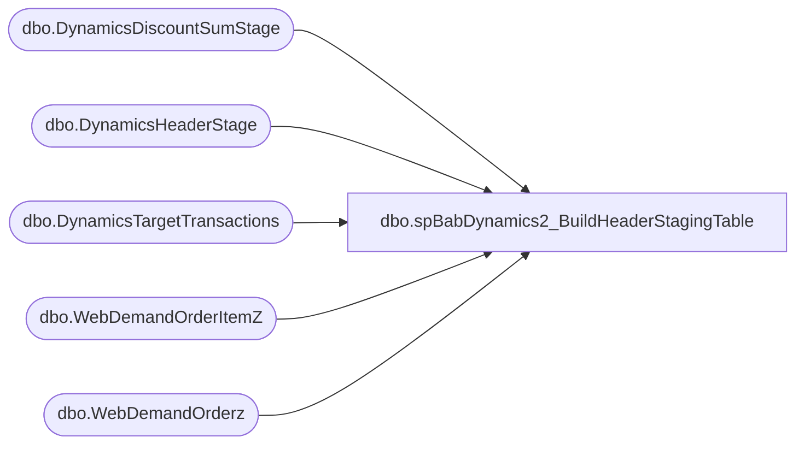

# dbo.spBabDynamics2_BuildHeaderStagingTable

**Database:** WebOrderProcessing  
**Server:** bearcluster01  

## Architecture Diagram



## Table Dependencies

| Referenced Table |
|---|
| dbo.DynamicsDiscountSumStage |
| dbo.DynamicsHeaderStage |
| dbo.DynamicsTargetTransactions |
| dbo.WebDemandOrderItemZ |
| dbo.WebDemandOrderz |

## Stored Procedure Code

```sql
---- =====================================================================================================
---- Name: spBabDynamics2_BuildHeaderStagingTable
---- Revision History
----		Name:			Date:			Comments:
----		Tim Callahan	06/13/2024		Initial Release
----		Tim Callahan	06/18/2024		We now have to use a different source for targeting eligible transactions and the date 
----		Tim Callahan	06//2024		Added Customer Number Field

---- =====================================================================================================
CREATE PROCEDURE [dbo].[spBabDynamics2_BuildHeaderStagingTable]

@DaysBack int

as

SET NOCOUNT ON 

-- Truncate Staging Table 
truncate table DynamicsHeaderStage
;


-- Build MaxOrderLine Table 
-- We will now join to DynamicsTargetTransactions rather than drive the date condition in here and the other related procedures 
IF OBJECT_ID(N'tempdb..#MaxOrderLine') IS NOT NULL
DROP TABLE #MaxOrderLine
; 

select 
i.OrderNumber
,i.OrderLineNumber
,max (LastUpdateDateUTC) as MaxLineUtc
,max(InsertDate) as MaxInsertDate
,dtt.TransactionDate 
into #MaxOrderLine
from WebDemandOrderItemZ i (nolock) 
join DynamicsTargetTransactions DTT on dtt.OrderNumber = i.OrderNumber
where 1=1
--and cast (i.LastUpdateDateUTC as date)  > = getdate()-@Daysback -- No Longer needed 
--and i.OrderNumber = @OrderNumber -- For Testing POC only 
group by
i.OrderNumber
,i.OrderLineNumber
,dtt.TransactionDate 
;


-- Build Header Base Temp  Table 
IF OBJECT_ID(N'tempdb..#HeaderPrep') IS NOT NULL
DROP TABLE #HeaderPrep
; 
select 
case
	when i.SiteCode = 'UK' and i.WarehouseCode is null 
		then concat('2013','-','002','-',convert (varchar,mol.TransactionDate,112),'-',i.OrderNumber) 
	when i.SiteCode = 'UK' and isnull(i.WarehouseCode,'0000') = '2013'
		then concat(i.WarehouseCode,'-','002','-',convert (varchar,mol.TransactionDate,112),'-',i.OrderNumber) 
	when i.SiteCode = 'UK' and isnull(i.WarehouseCode,'0000') <> '2013'
		then concat(i.WarehouseCode,'-','052','-',convert (varchar,mol.TransactionDate,112),'-',i.OrderNumber) 			
	when i.SiteCode = 'US'
		then concat('1',right(i.WarehouseCode,3),'-','052','-',convert (varchar,mol.TransactionDate,112),'-',i.OrderNumber) 
	else null 
end	as TransactionKey
, case 
	when i.SiteCode = 'UK' and i.WarehouseCode is not null 
		then concat(i.WarehouseCode,'INT') 
	when i.SiteCode = 'UK' and i.WarehouseCode is null 
		then concat('2013','INT') 
	when i.SiteCode = 'US'
		then concat ('1',right(i.WarehouseCode,3),'INT')
	else null 
end as RetailTerminalId
, null as CustAccount
, case 
	when i.SiteCode = 'UK' and i.WarehouseCode is not null 
		then i.WarehouseCode
	when i.SiteCode = 'UK' and i.WarehouseCode is null 
		then '2013'
	when i.SiteCode = 'US'
		then concat ('1',right(i.WarehouseCode,3))
	else null 
end as InventLocationId
, i.OrderNumber as RetailReceiptId
, case 
	when i.SiteCode = 'UK' and i.WarehouseCode is not null 
		then i.WarehouseCode
	when i.SiteCode = 'UK' and i.WarehouseCode is null 
		then '2013'
	when i.SiteCode = 'US'
		then concat ('1',right(i.WarehouseCode,3))
	else null 
end as RetailStaffId
,case
	when i.SiteCode = 'UK' and i.WarehouseCode is null 
		then concat('2013','-','002','-',convert (varchar,mol.TransactionDate,112),'-',i.OrderNumber,'_1') 
	when i.SiteCode = 'UK' and isnull(i.WarehouseCode,'0000') = '2013'
		then concat(i.WarehouseCode,'-','002','-',convert (varchar,mol.TransactionDate,112),'-',i.OrderNumber,'_1') 
	when i.SiteCode = 'UK'and isnull(i.WarehouseCode,'0000') <> '2013'
		then concat(i.WarehouseCode,'-','052','-',convert (varchar,mol.TransactionDate,112),'-',i.OrderNumber,'_1') 		
	when i.SiteCode = 'US'
		then concat('1',right(i.WarehouseCode,3),'-','052','-',convert (varchar,mol.TransactionDate,112),'-',i.OrderNumber,'_1') 
	else null 
end	as RetailTransactionId
,'LookupRequired' as BABIntRetailOperatingUnitNumber 
,cast (mol.TransactionDate as date) as TransDate
,'Sales' as RetailTransactionType
,null as BABIntRetailProcessed
,case
	when i.SiteCode = 'UK'
		then '2110'
	when i.SiteCode = 'US'
		then '1100'	
	end as Entity
, max(I.LastUpdateDateUTC) as CreateTime
, i.OrderNumber as Barcode 
into #HeaderPrep
from WebDemandOrderItemZ i (nolock) 
join DynamicsTargetTransactions DTT on dtt.OrderNumber = i.OrderNumber
join #MaxOrderLine mol on mol.OrderNumber = i.OrderNumber
	and mol.OrderLineNumber = i.OrderLineNumber
	and mol.MaxLineUtc = i.LastUpdateDateUTC
	and mol.MaxInsertDate = i.InsertDate
where 1=1
--and 
--(
--	i.SiteCode = 'US' and i.WarehouseCode is not null and isnull(i.WarehouseCode,'0000') not in ('0013') -- Exclude US WebStore E Gift Cards  and  US Webstore 
--		and i.ItemStatus in ('Delivered','Picked Up','Return','Store Shipped')  -- Statuses to Include as of 6/14/2024 Per Comments from  Dan Tweedie
--	or 
--	i.SiteCode = 'UK' 
--		and i.ItemStatus in ('Store Shipped','Return','Shipped','Picked Up','Gift Card Processed','Donation Processed','Gift Card Devalued') -- Statuses to Include as of 6/14/2024 Per Comments from  Dan Tweedie
--) 
--and cast (i.LastUpdateDateUTC as date)  > = getdate()-@Daysback
--and i.OrderNumber = @OrderNumber
group by 
case
	when i.SiteCode = 'UK' and i.WarehouseCode is null 
		then concat('2013','-','002','-',convert (varchar,mol.TransactionDate,112),'-',i.OrderNumber) 
	when i.SiteCode = 'UK' and isnull(i.WarehouseCode,'0000') = '2013'
		then concat(i.WarehouseCode,'-','002','-',convert (varchar,mol.TransactionDate,112),'-',i.OrderNumber) 
	when i.SiteCode = 'UK' and isnull(i.WarehouseCode,'0000') <> '2013'
		then concat(i.WarehouseCode,'-','052','-',convert (varchar,mol.TransactionDate,112),'-',i.OrderNumber) 			
	when i.SiteCode = 'US'
		then concat('1',right(i.WarehouseCode,3),'-','052','-',convert (varchar,mol.TransactionDate,112),'-',i.OrderNumber) 
	else null 
end	
, case 
	when i.SiteCode = 'UK' and i.WarehouseCode is not null 
		then concat(i.WarehouseCode,'INT') 
	when i.SiteCode = 'UK' and i.WarehouseCode is null 
		then concat('2013','INT') 
	when i.SiteCode = 'US'
		then concat ('1',right(i.WarehouseCode,3),'INT')
	else null 
end
, case 
	when i.SiteCode = 'UK' and i.WarehouseCode is not null 
		then i.WarehouseCode
	when i.SiteCode = 'UK' and i.WarehouseCode is null 
		then '2013'
	when i.SiteCode = 'US'
		then concat ('1',right(i.WarehouseCode,3))
	else null 
end 
, i.OrderNumber
, case 
	when i.SiteCode = 'UK' and i.WarehouseCode is not null 
		then i.WarehouseCode
	when i.SiteCode = 'UK' and i.WarehouseCode is null 
		then '2013'
	when i.SiteCode = 'US'
		then concat ('1',right(i.WarehouseCode,3))
	else null 
end
,case
	when i.SiteCode = 'UK' and i.WarehouseCode is null 
		then concat('2013','-','002','-',convert (varchar,mol.TransactionDate,112),'-',i.OrderNumber,'_1') 
	when i.SiteCode = 'UK' and isnull(i.WarehouseCode,'0000') = '2013'
		then concat(i.WarehouseCode,'-','002','-',convert (varchar,mol.TransactionDate,112),'-',i.OrderNumber,'_1') 
	when i.SiteCode = 'UK'and isnull(i.WarehouseCode,'0000') <> '2013'
		then concat(i.WarehouseCode,'-','052','-',convert (varchar,mol.TransactionDate,112),'-',i.OrderNumber,'_1') 		
	when i.SiteCode = 'US'
		then concat('1',right(i.WarehouseCode,3),'-','052','-',convert (varchar,mol.TransactionDate,112),'-',i.OrderNumber,'_1') 
	else null 
end
,cast (mol.TransactionDate as date) 
,case
	when i.SiteCode = 'UK'
		then '2110'
	when i.SiteCode = 'US'
		then '1100'	
	end
--, I.LastUpdateDateUTC
, i.OrderNumber


--Build CustomerNumber
IF OBJECT_ID(N'tempdb..#CustomerNumber') IS NOT NULL
DROP TABLE #CustomerNumber
; 
select 
i.OrderNumber
,max(i.Custom3) as CustomerNumber
into #CustomerNumber
from WebDemandOrderz i (nolock) 
join DynamicsTargetTransactions DTT on dtt.OrderNumber = i.OrderNumber
group by
i.OrderNumber


-- Build DynamicsHeaderStage
insert into DynamicsHeaderStage
select
hp.TransactionKey
,hp.RetailTerminalId
,hp.CustAccount
,hp.InventLocationId
,hp.RetailReceiptId
,hp.RetailStaffId
,hp.RetailTransactionId
,hp.BABIntRetailOperatingUnitNumber
,hp.TransDate
,hp.RetailTransactionType
,hp.BABIntRetailProcessed
,hp.Entity
,isnull(ds.DiscAmount,0.00) as DiscAmount
,isnull(ds.TotalDiscAmount,0.00) as TotalDiscAmount
,hp.CreateTime
,hp.Barcode
,cn.CustomerNumber
from #HeaderPrep hp 
left join DynamicsDiscountSumStage ds on ds.RetailTransactionId = hp.RetailTransactionId
join #CustomerNumber cn on cn.OrderNumber  = hp.Barcode
```

