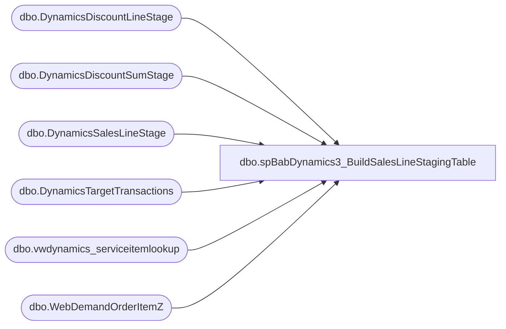

# dbo.spBabDynamics3_BuildSalesLineStagingTable

**Database:** WebOrderProcessing  
**Server:** bearcluster01  

## Architecture Diagram



## Table Dependencies

| Referenced Table |
|---|
| dbo.DynamicsDiscountLineStage |
| dbo.DynamicsDiscountSumStage |
| dbo.DynamicsSalesLineStage |
| dbo.DynamicsTargetTransactions |
| dbo.vwdynamics_serviceitemlookup |
| dbo.WebDemandOrderItemZ |

## Stored Procedure Code

```sql
---- =====================================================================================================
---- Name: spBabDynamics3_BuildSalesLineStagingTable
---- Revision History
----		Name:			Date:			Comments:
----		Tim Callahan	06/17/2024		Initial Release
----		Tim Callahan	06/18/2024		We now have to use a different source for targeting eligible transactions and the date 

---- =====================================================================================================
CREATE PROCEDURE [dbo].[spBabDynamics3_BuildSalesLineStagingTable]

@DaysBack int

as

set nocount on

---- Truncate STaging Tables 
truncate table DynamicsSalesLineStage

;

----Variable Section for Manual Execution 
--Declare @DaysBack int
--set @Daysback = 2
--declare @OrderNumber varchar (50)
--set @OrderNumber = 'W6838189'
--;
;

-- Build MaxOrderLine Table 
-- We will now join to DynamicsTargetTransactions rather than drive the date condition in here and the other related procedures 
IF OBJECT_ID(N'tempdb..#MaxOrderLine') IS NOT NULL
DROP TABLE #MaxOrderLine
; 

select 
i.OrderNumber
,i.OrderLineNumber
,max (LastUpdateDateUTC) as MaxLineUtc
,max(InsertDate) as MaxInsertDate
,dtt.TransactionDate 
into #MaxOrderLine
from WebDemandOrderItemZ i (nolock) 
join DynamicsTargetTransactions DTT on dtt.OrderNumber = i.OrderNumber
where 1=1
--and cast (i.LastUpdateDateUTC as date)  > = getdate()-@Daysback -- No Longer needed 
--and i.OrderNumber = @OrderNumber -- For Testing POC only 
group by
i.OrderNumber
,i.OrderLineNumber
,dtt.TransactionDate 
;


-- Build Sales Line Prep Table 
IF OBJECT_ID(N'tempdb..#SalesLinePrep') IS NOT NULL
DROP TABLE #SalesLinePrep
select 
case
	when i.SiteCode = 'UK' and i.WarehouseCode is null 
		then concat('2013','-','002','-',convert (varchar,mol.TransactionDate,112),'-',i.OrderNumber) 
	when i.SiteCode = 'UK' and isnull(i.WarehouseCode,'0000') = '2013'
		then concat(i.WarehouseCode,'-','002','-',convert (varchar,mol.TransactionDate,112),'-',i.OrderNumber) 
	when i.SiteCode = 'UK' and isnull(i.WarehouseCode,'0000') <> '2013'
		then concat(i.WarehouseCode,'-','052','-',convert (varchar,mol.TransactionDate,112),'-',i.OrderNumber) 			
	when i.SiteCode = 'US'
		then concat('1',right(i.WarehouseCode,3),'-','052','-',convert (varchar,mol.TransactionDate,112),'-',i.OrderNumber) 
	else null 
end	as TransactionKey
,null as CustAccount
, case 
	when i.SiteCode = 'UK' and i.WarehouseCode is not null 
		then i.WarehouseCode
	when i.SiteCode = 'UK' and i.WarehouseCode is null 
		then '2013'
	when i.SiteCode = 'US'
		then concat ('1',right(i.WarehouseCode,3))
	else null 
end as InventLocationId
,i.OrderLineNumber as LineNum
--,i.Price as OriginalPrice
,case
	when i.SiteCode = 'UK' and i.ItemStatus in ('Return','Gift Card Devalued')
		then (i.Price-isnull(i.Tax,0.00))*-1 -- Deduct VAT Tax From Price -- This may change 
	when i.SiteCode = 'US' and  i.ItemStatus in ('Return','Gift Card Devalued')
		then i.Price*-1
	when i.SiteCode = 'UK' 
		then (i.Price-isnull(i.Tax,0.00)) -- Deduct VAT Tax From Price -- This may change 
	when i.SiteCode = 'US'
		then i.Price
	--else i.Price
end as OriginalPrice 
--,i.Price as Price
,case
	when i.SiteCode = 'UK' and i.ItemStatus in ('Return','Gift Card Devalued')
		then (i.Price-isnull(i.Tax,0.00))*-1 -- Deduct VAT Tax From Price -- This may change 
	when i.SiteCode = 'US' and  i.ItemStatus in ('Return','Gift Card Devalued')
		then i.Price*-1
	when i.SiteCode = 'UK' 
		then (i.Price-isnull(i.Tax,0.00)) -- Deduct VAT Tax From Price -- This may change 
	when i.SiteCode = 'US'
		then i.Price
	--else i.Price
end as Price 
--,i.Quantity*-1 as Qty
,case
	when i.ItemStatus in ('Return','Gift Card Devalued')
		then i.Quantity
	else i.Quantity*-1 -- Sold Quantity are negative when transmitted to Dyn
end as Qty 
,i.OrderNumber as RetailReceiptId
,case
	when i.SiteCode = 'UK' and i.WarehouseCode is null 
		then concat('2013','-','002','-',convert (varchar,mol.TransactionDate,112),'-',i.OrderNumber,'_1') 
	when i.SiteCode = 'UK' and isnull(i.WarehouseCode,'0000') = '2013'
		then concat(i.WarehouseCode,'-','002','-',convert (varchar,mol.TransactionDate,112),'-',i.OrderNumber,'_1') 
	when i.SiteCode = 'UK'and isnull(i.WarehouseCode,'0000') <> '2013'
		then concat(i.WarehouseCode,'-','052','-',convert (varchar,mol.TransactionDate,112),'-',i.OrderNumber,'_1') 		
	when i.SiteCode = 'US'
		then concat('1',right(i.WarehouseCode,3),'-','052','-',convert (varchar,mol.TransactionDate,112),'-',i.OrderNumber,'_1') 
	else null 
end	as RetailTransactionId
,'LookupRequired' as BABIntRetailOperatingUnitNumber
, case 
	when i.SiteCode = 'UK' and i.WarehouseCode is not null 
		then concat(i.WarehouseCode,'INT') 
	when i.SiteCode = 'UK' and i.WarehouseCode is null 
		then concat('2013','INT') 
	when i.SiteCode = 'US'
		then concat ('1',right(i.WarehouseCode,3),'INT')
	else null 
end as RetailTerminalId
,cast (mol.TransactionDate as date) as TransDate
,i.SKU as ItemId -- No lookup appears to be required for Deck GCs 
,'TBD' as LineDscAmount
,'TBD' as DiscAmount
,i.GiftCardNumber 
,null as BABIntRetailProcessed
,case
	when i.SiteCode = 'UK'
		then '2110'
	when i.SiteCode = 'US'
		then '1100'	
	end as Entity
,'TBD' as PeriodicPercentageDiscount
,'TBD' as TotalDiscAmount
,'TBD'as TotalDiscPct
, I.LastUpdateDateUTC as CreateTime
, i.OrderNumber as Barcode 
into #SalesLinePrep
from WebDemandOrderItemZ i (nolock) 
join DynamicsTargetTransactions DTT on dtt.OrderNumber = i.OrderNumber
join #MaxOrderLine mol on mol.OrderNumber = i.OrderNumber
	and mol.OrderLineNumber = i.OrderLineNumber
	and mol.MaxLineUtc = i.LastUpdateDateUTC
	and mol.MaxInsertDate = i.InsertDate
where 1=1
and 
(
	i.SiteCode = 'US' and i.WarehouseCode is not null and isnull(i.WarehouseCode,'0000') not in ('0013') -- Exclude US WebStore E Gift Cards  and  US Webstore 
		and i.ItemStatus in ('Delivered','Picked Up','Return','Store Shipped')  -- Statuses to Include as of 6/14/2024 Per Comments from  Dan Tweedie
	or 
	i.SiteCode = 'UK' 
		and i.ItemStatus in ('Store Shipped','Return','Shipped','Picked Up','Gift Card Processed','Donation Processed','Gift Card Devalued') -- Statuses to Include as of 6/14/2024 Per Comments from  Dan Tweedie
)  
--and cast (i.LastUpdateDateUTC as date)  > = getdate()-@Daysback
--and i.OrderNumber = @OrderNumber
--order by i.OrderLineNumber

-- Insert staged line data into DynamicsSalesLineStage

Insert into DynamicsSalesLineStage
select 
su.TransactionKey, 
su.CustAccount, 
su.InventLocationId, 
su.LineNum,
su.OriginalPrice, 
su.Price, 
su.Qty, 
su.RetailReceiptId, 
su.RetailTransactionid, 
su.BABIntRetailOperatingUnitNumber, 
su.RetailTerminalId, 
su.TransDate, 
--su.ItemId, 
case when sil.ItemNumber is not null 
		then sil.dynamicsItemId
	else su.itemid end as itemid, 
coalesce (vdp.amount,0.00) as LineDscAmount, 
coalesce (vdp.amount,0.00) + coalesce (vd.amount,0.00) as DiscAmount,
su.GiftCardNumber, 
su.BABIntRetailProcessed, 
su.Entity,  
case when su.price = 0.00
	then 0.00
	else coalesce (vdp.amount,0.00)/su.price end as PeriodicPercentageDiscount, 
coalesce (vd.amount,0.00) as TotalDiscamount,
case when hd.TotalDiscAmount is null 
		then 0.00
	when hd.TotalDiscAmount  = 0.00
		then  0.00
	else isnull(vd.amount/hd.TotalDiscAmount,0.00) end as TotalDiscPct,
su.CreateTime,
su.Barcode,
null as ShippingDescription, 
null as LineItemType, 
su.itemid as NativeItemId
,null as BearId -- We are exposing this in the JumpMind Data so we need the field in the Deck data even though its not available 
from #SalesLinePrep su
left join DynamicsDiscountLineStage vd on vd.retailtransactionid  = su.retailtransactionid and vd.salelinenum = su.linenum
			and vd.discountorigintype = 'Manual'
left join dynamicsdiscountlinestage vdp on vdp.retailtransactionid  = su.retailtransactionid and vdp.salelinenum = su.linenum
			and vdp.discountorigintype = 'Periodic'
left join DynamicsDiscountSumStage hd on hd.retailtransactionid  = su.retailtransactionid 
left join vwdynamics_serviceitemlookup sil on sil.ItemNumber = su.itemid
group by 
su.transactionkey, 
su.custaccount, 
su.inventlocationid, 
su.linenum, 
su.originalprice, 
su.price, 
su.qty, 
su.retailreceiptid, 
su.retailtransactionid, 
su.babintretailoperatingunitnumber, 
su.retailterminalid, 
su.transdate, 
--su.itemid, 
case when sil.ItemNumber is not null 
	then sil.dynamicsItemId
	else su.itemid end , 
coalesce (vdp.amount,0.00), 
coalesce (vdp.amount,0.00) + coalesce (vd.amount,0.00),
su.giftcardnumber, 
su.babintretailprocessed, 
su.entity,  
case when su.price = 0.00
	then 0.00
	else coalesce (vdp.amount,0.00)/su.price end,
coalesce (vd.amount,0.00),
case when hd.TotalDiscAmount is null 
		then 0.00
	when hd.TotalDiscAmount  = 0.00
		then  0.00
	else isnull(vd.amount/hd.TotalDiscAmount,0.00) end,
su.CreateTime,
su.barcode, 
su.itemid
```

