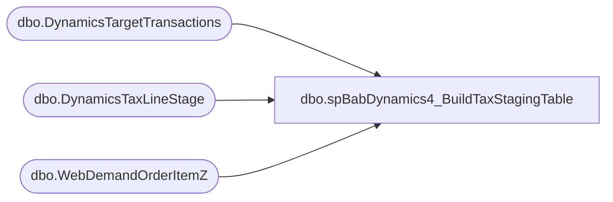

# dbo.spBabDynamics4_BuildTaxStagingTable

**Database:** WebOrderProcessing  
**Server:** bearcluster01  

## Architecture Diagram



## Table Dependencies

| Referenced Table |
|---|
| dbo.DynamicsTargetTransactions |
| dbo.DynamicsTaxLineStage |
| dbo.WebDemandOrderItemZ |

## Stored Procedure Code

```sql
---- =====================================================================================================
---- Name: spBabDynamics1_BuildTaxStagingTable
---- Revision History
----		Name:			Date:			Comments:
----		Tim Callahan	06/17/2024		Initial Release
----		Tim Callahan	06/18/2024		We now have to use a different source for targeting eligible transactions and the date 

---- =====================================================================================================
CREATE PROCEDURE [dbo].[spBabDynamics4_BuildTaxStagingTable]

@DaysBack int

as

set nocount on

---- Truncate STaging Tables 
truncate table DynamicsTaxLineStage

;

----Variable Section for Manual Execution 
--Declare @DaysBack int
--set @Daysback = 10
--declare @OrderNumber varchar (50)
--set @OrderNumber = 'W6838189'
--;


-- Build MaxOrderLine Table 
-- We will now join to DynamicsTargetTransactions rather than drive the date condition in here and the other related procedures 
IF OBJECT_ID(N'tempdb..#MaxOrderLine') IS NOT NULL
DROP TABLE #MaxOrderLine
; 

select 
i.OrderNumber
,i.OrderLineNumber
,max (LastUpdateDateUTC) as MaxLineUtc
,max(InsertDate) as MaxInsertDate
,dtt.TransactionDate 
into #MaxOrderLine
from WebDemandOrderItemZ i (nolock) 
join DynamicsTargetTransactions DTT on dtt.OrderNumber = i.OrderNumber
where 1=1
--and cast (i.LastUpdateDateUTC as date)  > = getdate()-@Daysback -- No Longer needed 
--and i.OrderNumber = @OrderNumber -- For Testing POC only 
group by
i.OrderNumber
,i.OrderLineNumber
,dtt.TransactionDate 
;

--  TaxLinePrep Temp Table 
IF OBJECT_ID(N'tempdb..#TaxLinePrep') IS NOT NULL
DROP TABLE #TaxLinePrep
; 
select 
case
	when i.SiteCode = 'UK' and i.WarehouseCode is null 
		then concat('2013','-','002','-',convert (varchar,mol.TransactionDate,112),'-',i.OrderNumber) 
	when i.SiteCode = 'UK' and isnull(i.WarehouseCode,'0000') = '2013'
		then concat(i.WarehouseCode,'-','002','-',convert (varchar,mol.TransactionDate,112),'-',i.OrderNumber) 
	when i.SiteCode = 'UK' and isnull(i.WarehouseCode,'0000') <> '2013'
		then concat(i.WarehouseCode,'-','052','-',convert (varchar,mol.TransactionDate,112),'-',i.OrderNumber) 			
	when i.SiteCode = 'US'
		then concat('1',right(i.WarehouseCode,3),'-','052','-',convert (varchar,mol.TransactionDate,112),'-',i.OrderNumber) 
	else null 
end	as TransactionKey
,i.Tax as Amount
,i.OrderLineNumber as LineNum
,'INT' as TaxCode
, case 
	when i.SiteCode = 'UK' and i.WarehouseCode is not null 
		then concat(i.WarehouseCode,'INT') 
	when i.SiteCode = 'UK' and i.WarehouseCode is null 
		then concat('2013','INT') 
	when i.SiteCode = 'US'
		then concat ('1',right(i.WarehouseCode,3),'INT')
	else null 
end as RetailTerminalId
,case
	when i.SiteCode = 'UK' and i.WarehouseCode is null 
		then concat('2013','-','002','-',convert (varchar,mol.TransactionDate,112),'-',i.OrderNumber,'_1') 
	when i.SiteCode = 'UK' and isnull(i.WarehouseCode,'0000') = '2013'
		then concat(i.WarehouseCode,'-','002','-',convert (varchar,mol.TransactionDate,112),'-',i.OrderNumber,'_1') 
	when i.SiteCode = 'UK'and isnull(i.WarehouseCode,'0000') <> '2013'
		then concat(i.WarehouseCode,'-','052','-',convert (varchar,mol.TransactionDate,112),'-',i.OrderNumber,'_1') 		
	when i.SiteCode = 'US'
		then concat('1',right(i.WarehouseCode,3),'-','052','-',convert (varchar,mol.TransactionDate,112),'-',i.OrderNumber,'_1') 
	else null 
end	as RetailTransactionId
,'LookupRequired' as BABIntRetailOperatingUnitNumber
,null as BABIntRetailProcessed
,case
	when i.SiteCode = 'UK'
		then '2110'
	when i.SiteCode = 'US'
		then '1100'	
	end as Entity
, cast (mol.TransactionDate as date)  as TransDate
, I.LastUpdateDateUTC as CreateTime
--, null as Barcode 
, i.OrderNumber as Barcode 
, case 
	when i.SiteCode = 'UK' and i.WarehouseCode is not null 
		then i.WarehouseCode
	when i.SiteCode = 'UK' and i.WarehouseCode is null 
		then '2013'
	when i.SiteCode = 'US'
		then concat ('1',right(i.WarehouseCode,3))
	else null 
end as InventLocationId
into #TaxLinePrep
from WebDemandOrderItemZ i (nolock) 
join DynamicsTargetTransactions DTT on dtt.OrderNumber = i.OrderNumber
join #MaxOrderLine mol on mol.OrderNumber = i.OrderNumber
	and mol.OrderLineNumber = i.OrderLineNumber
	and mol.MaxLineUtc = i.LastUpdateDateUTC
	and mol.MaxInsertDate = i.InsertDate
where 1=1
and 
(
	i.SiteCode = 'US' and i.WarehouseCode is not null and isnull(i.WarehouseCode,'0000') not in ('0013') -- Exclude US WebStore E Gift Cards  and  US Webstore 
		and i.ItemStatus in ('Delivered','Picked Up','Return','Store Shipped')  -- Statuses to Include as of 6/14/2024 Per Comments from  Dan Tweedie
	or 
	i.SiteCode = 'UK' 
		and i.ItemStatus in ('Store Shipped','Return','Shipped','Picked Up','Gift Card Processed','Donation Processed','Gift Card Devalued') -- Statuses to Include as of 6/14/2024 Per Comments from  Dan Tweedie
) 

-- Insert Staged Data into DynamicsTaxLineStage
Insert into DynamicsTaxLineStage
Select
tlp.TransactionKey
,isnull(tlp.Amount,0.00) as Amount
,tlp.LineNum
,tlp.TaxCode
,tlp.RetailTerminalId
,tlp.RetailTransactionId
,tlp.BABIntRetailOperatingUnitNumber
,tlp.BABIntRetailProcessed
,tlp.Entity
,tlp.TransDate
,tlp.CreateTime
,tlp.Barcode
,tlp.InventLocationId
from #TaxLinePrep tlp 
group by 
tlp.TransactionKey
,isnull(tlp.Amount,0.00)
,tlp.LineNum
,tlp.TaxCode
,tlp.RetailTerminalId
,tlp.RetailTransactionId
,tlp.BABIntRetailOperatingUnitNumber
,tlp.BABIntRetailProcessed
,tlp.Entity
,tlp.TransDate
,tlp.CreateTime
,tlp.Barcode
,tlp.InventLocationId
```

