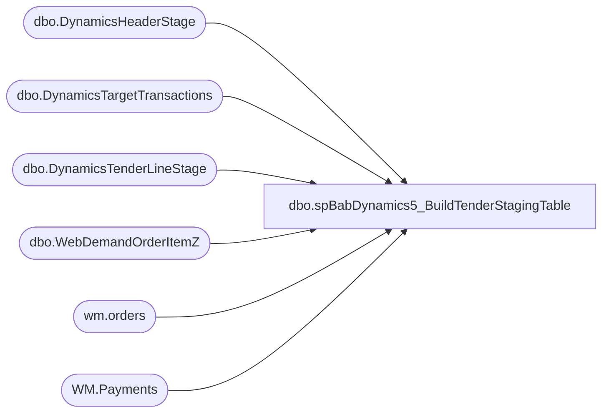

# dbo.spBabDynamics5_BuildTenderStagingTable

**Database:** WebOrderProcessing  
**Server:** bearcluster01  

## Architecture Diagram



## Table Dependencies

| Referenced Table |
|---|
| dbo.DynamicsHeaderStage |
| dbo.DynamicsTargetTransactions |
| dbo.DynamicsTenderLineStage |
| dbo.WebDemandOrderItemZ |
| wm.orders |
| WM.Payments |

## Stored Procedure Code

```sql
---- =====================================================================================================
---- Name: spBabDynamics1_BuildTaxStagingTable
---- Revision History
----		Name:			Date:			Comments:
----		Tim Callahan	06/18/2024		Initial Release
------		Tim Callahan	06/18/2024		We now have to use a different source for targeting eligible transactions and the date 
------		Tim Callahan	07/17/2024		Need to Sum\Group By Tender Type - Do not want multiple entries for GiftCards, cash etc. 
---- =====================================================================================================
CREATE PROCEDURE [dbo].[spBabDynamics5_BuildTenderStagingTable]

@DaysBack int

as

set nocount on

---- Truncate STaging Tables 
truncate table DynamicsTenderLineStage

;

----Variable Section for Manual Execution 
--Declare @DaysBack int
--set @Daysback = 10
--declare @OrderNumber varchar (50)
--set @OrderNumber = 'W6838189'
;

-- This table is basically going to be the mechanism to target transactions
-- Date Filter shouldn't be needed anywhere else 
IF OBJECT_ID(N'tempdb..#MaxOrderLine') IS NOT NULL
DROP TABLE #MaxOrderLine
; 

select 
i.OrderNumber
,i.SiteCode
,case when i.SiteCode = 'UK' and i.WarehouseCode is null 
	then '2013'
	else i.WarehouseCode end as WarehouseCode
,max(i.LastUpdateDateUTC) as LastUpdateDateUTC
,dtt.TransactionDate 
into #MaxOrderLine
from WebDemandOrderItemZ i (nolock) 
join DynamicsTargetTransactions DTT on dtt.OrderNumber = i.OrderNumber
join DynamicsHeaderStage dhs on dhs.Barcode = dtt.OrderNumber -- This is ensure we only capture tender information for already staged transactions
where 1=1
--and cast (i.LastUpdateDateUTC as date)  > = getdate()-@Daysback
--and i.OrderNumber = @OrderNumber
--and 
--(
--	i.SiteCode = 'US' and i.WarehouseCode is not null and isnull(i.WarehouseCode,'0000') not in ('0013') -- Exclude US WebStore E Gift Cards  and  US Webstore 
--		and i.ItemStatus in ('Delivered','Picked Up','Return','Store Shipped')  -- Statuses to Include as of 6/14/2024 Per Comments from  Dan Tweedie
--	or 
--	i.SiteCode = 'UK' 
--		and i.ItemStatus in ('Store Shipped','Return','Shipped','Picked Up','Gift Card Processed','Donation Processed','Gift Card Devalued') -- Statuses to Include as of 6/14/2024 Per Comments from  Dan Tweedie
--) 
group by
i.OrderNumber
,i.SiteCode
,case when i.SiteCode = 'UK' and i.WarehouseCode is null 
	then '2013'
	else i.WarehouseCode end 
,dtt.TransactionDate 
;


-- Get Payment Transaction Ids
IF OBJECT_ID(N'tempdb..#OrderNumberTransId') IS NOT NULL
DROP TABLE #OrderNumberTransId 
; 

select 
mol.OrderNumber
,mol.SiteCode
,mol.WarehouseCode
,mol.LastUpdateDateUTC
,u.TransactionID
,mol.TransactionDate
into #OrderNumberTransId 
from wm.orders u (nolock)
join DynamicsTargetTransactions DTT on dtt.OrderNumber = u.OrderNumber
join #MaxOrderLine mol on mol.OrderNumber = u.OrderNumber
where 1=1
group by 
mol.OrderNumber
,mol.SiteCode
,mol.WarehouseCode
,mol.LastUpdateDateUTC
,u.TransactionID
,mol.TransactionDate


IF OBJECT_ID(N'tempdb..#TenderLinePrep') IS NOT NULL
DROP TABLE #TenderLinePrep
; 
select 
case
	when i.SiteCode = 'UK' and i.WarehouseCode is null 
		then concat('2013','-','002','-',convert (varchar,i.TransactionDate,112),'-',i.OrderNumber) 
	when i.SiteCode = 'UK' and isnull(i.WarehouseCode,'0000') = '2013'
		then concat(i.WarehouseCode,'-','002','-',convert (varchar,i.TransactionDate,112),'-',i.OrderNumber) 
	when i.SiteCode = 'UK' and isnull(i.WarehouseCode,'0000') <> '2013'
		then concat(i.WarehouseCode,'-','052','-',convert (varchar,i.TransactionDate,112),'-',i.OrderNumber) 			
	when i.SiteCode = 'US'
		then concat('1',right(i.WarehouseCode,3),'-','052','-',convert (varchar,i.TransactionDate,112),'-',i.OrderNumber) 
	else null 
end	as TransactionKey
,p.PaymentAmount as AmountCur
,p.PaymentAmount as AmountMst
,p.PaymentAmount as RetailAmountTendered
,p.PaymentMethod as NativePaymentMethod
,p.CardType as NativeCardType
,'NEED MAPPING' as RetailCardTypeId
,i.OrderNumber as RetailReceiptId
,'der' as LineNum
,case
	when i.SiteCode = 'UK' and i.WarehouseCode is null 
		then concat('2013','-','002','-',convert (varchar,i.TransactionDate,112),'-',i.OrderNumber,'_1') 
	when i.SiteCode = 'UK' and isnull(i.WarehouseCode,'0000') = '2013'
		then concat(i.WarehouseCode,'-','002','-',convert (varchar,i.TransactionDate,112),'-',i.OrderNumber,'_1') 
	when i.SiteCode = 'UK'and isnull(i.WarehouseCode,'0000') <> '2013'
		then concat(i.WarehouseCode,'-','052','-',convert (varchar,i.TransactionDate,112),'-',i.OrderNumber,'_1') 		
	when i.SiteCode = 'US'
		then concat('1',right(i.WarehouseCode,3),'-','052','-',convert (varchar,i.TransactionDate,112),'-',i.OrderNumber,'_1') 
	else null 
end	as RetailTransactionId
, 'NEED MAPPING' as RetailTenderTypeId
, case 
	when i.SiteCode = 'UK' and i.WarehouseCode is not null 
		then concat(i.WarehouseCode,'INT') 
	when i.SiteCode = 'UK' and i.WarehouseCode is null 
		then concat('2013','INT') 
	when i.SiteCode = 'US'
		then concat ('1',right(i.WarehouseCode,3),'INT')
	else null 
end as RetailTerminalId
,'LookupRequired' as BABIntRetailOperatingUnitNumber
, cast (i.TransactionDate as date)  as TransDate
,null as AccountNum
,null as RetailCardNum
,'No' as ChangeLine
,null as PaymentAuthorization
,case
	when i.SiteCode = 'UK'
		then 'GBP'
	when i.SiteCode = 'US'
		then 'USD'	
	end as CurrencyCode
,case
	when i.SiteCode = 'UK'
		then '2110'
	when i.SiteCode = 'US'
		then '1100'	
	end as Entity
, null as BABIntRetailProcessed
, i.LastUpdateDateUTC as CreateTime
, i.OrderNumber as Barcode 
, case 
	when i.SiteCode = 'UK' and i.WarehouseCode is not null 
		then i.WarehouseCode
	when i.SiteCode = 'UK' and i.WarehouseCode is null 
		then '2013'
	when i.SiteCode = 'US'
		then concat ('1',right(i.WarehouseCode,3))
	else null 
end as InventLocationId
into #TenderLinePrep
from [WM].[Payments] p (nolock)
join #OrderNumberTransId i on i.OrderNumber = p.TransactionNum and i.TransactionID = p.TransactionID 
where 1=1 


-- Insert into  DynamicsTenderLineStage

IF OBJECT_ID(N'tempdb..#TenderLinePrepSummed') IS NOT NULL
DROP TABLE #TenderLinePrepSummed

select
p.TransactionKey
,sum(p.AmountCur) as AmountCur
,sum(p.AmountMst) as AmountMst
,sum(p.RetailAmountTendered) as RetailAmountTendered
,p.NativePaymentMethod
,p.NativeCardType
,p.RetailCardTypeId
,p.RetailReceiptId
,p.LineNum
,p.RetailTransactionId
,p.RetailTenderTypeId
,p.RetailTerminalId
,p.BABIntRetailOperatingUnitNumber
,p.TransDate
,p.AccountNum
,p.RetailCardNum
,p.ChangeLine
,p.PaymentAuthorization
,p.CurrencyCode
,p.Entity
,p.BABIntRetailProcessed
,p.CreateTime
,p.Barcode
,p.InventLocationId
into #TenderLinePrepSummed
From #TenderLinePrep  p
where 1=1
group by 
p.TransactionKey
,p.NativePaymentMethod
,p.NativeCardType
,p.RetailCardTypeId
,p.RetailReceiptId
,p.LineNum
,p.RetailTransactionId
,p.RetailTenderTypeId
,p.RetailTerminalId
,p.BABIntRetailOperatingUnitNumber
,p.TransDate
,p.AccountNum
,p.RetailCardNum
,p.ChangeLine
,p.PaymentAuthorization
,p.CurrencyCode
,p.Entity
,p.BABIntRetailProcessed
,p.CreateTime
,p.Barcode
,p.InventLocationId


; 


Insert into DynamicsTenderLineStage
Select 
tlp.TransactionKey
,tlp.AmountCur
,tlp.AmountMst
,tlp.RetailAmountTendered
,tlp.NativePaymentMethod
,tlp.NativeCardType
,tlp.RetailCardTypeId
,tlp.RetailReceiptId
,ROW_NUMBER() OVER(
    PARTITION BY tlp.RetailTransactionId
    ORDER BY tlp.NativePaymentMethod
	--ORDER BY tlp.RetailTenderTypeId -- Once I have the mapping 
) as LineNum
,tlp.RetailTransactionId
,tlp.RetailTenderTypeId
,tlp.RetailTerminalId
,tlp.BABIntRetailOperatingUnitNumber
,tlp.TransDate
,tlp.AccountNum
,tlp.RetailCardNum
,tlp.ChangeLine
,tlp.PaymentAuthorization
,tlp.CurrencyCode
,tlp.Entity
,tlp.BABIntRetailProcessed
,tlp.CreateTime
,tlp.Barcode
,tlp.InventLocationId
From #TenderLinePrepSummed tlp
where 1=1
```

