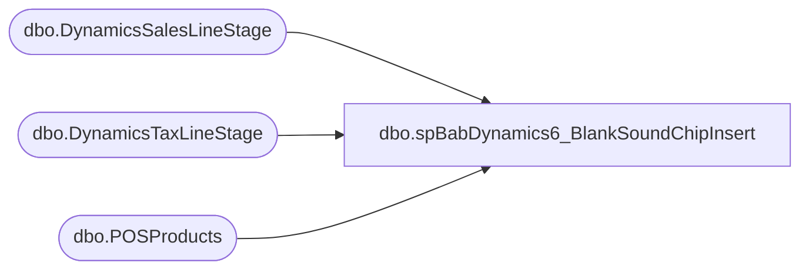

# dbo.spBabDynamics6_BlankSoundChipInsert

**Database:** WebOrderProcessing  
**Server:** bearcluster01  

## Architecture Diagram



## Table Dependencies

| Referenced Table |
|---|
| dbo.DynamicsSalesLineStage |
| dbo.DynamicsTaxLineStage |
| dbo.POSProducts |

## Stored Procedure Code

```sql
---- =====================================================================================================
---- Name: spBabDynamics6_BlankSoundChipInsert
---- Revision History
----		Name:			Date:			Comments:
----		Tim Callahan	06/19/2024		Initial Release
---- =====================================================================================================
CREATE PROCEDURE [dbo].[spBabDynamics6_BlankSoundChipInsert]

@DaysBack int

as

set nocount on

---- Truncate STaging Tables 

----Variable Section for Manual Execution 
--Declare @DaysBack int
--set @Daysback = 10
--declare @OrderNumber varchar (50)
--set @OrderNumber = 'U2340326'
--;


-- Build MaxSalesLineNumber Table 
IF OBJECT_ID(N'tempdb..#MaxSalesLineNumber') IS NOT NULL
DROP TABLE #MaxSalesLineNumber
; 

select 
d.RetailTransactionId,
max (d.linenum) as MaxSalesLineNum, 
max (d.createtime) as MaxCreateTime
into #MaxSalesLineNumber
from DynamicsSalesLineStage d
where 1=1
group by 
d.RetailTransactionId
;

-- Build Sound Lookup Table 
IF OBJECT_ID(N'tempdb..#SoundLookupTable') IS NOT NULL
DROP TABLE #SoundLookupTable
; 

select 
pp.StyleCode as ItemId,
pp.ItemName
into #SoundLookupTable
from POSProducts pp
where 1=1
and pp.StyleCode not in ('027500','127500','427500') -- no need to look up any blank sound chips if sold as such 
group 
by
pp.StyleCode ,
pp.ItemName
 

 -- Build SoundSkuStage Table 
IF OBJECT_ID(N'tempdb..#SoundSkuStage') IS NOT NULL
DROP TABLE #SoundSkuStage
; 

select 
d.transactionkey
,d.CustAccount
,d.inventlocationid
,msl.MaxSalesLineNum+1 as LineNum
,0.00 as OriginalPrice
,0.00 as Price
,sum (qty) as Qty
,d.RetailReceiptId
,d.RetailTransactionid
,d.BABIntRetailOperatingUnitNumber
,d.RetailTerminalId
,d.TransDate
,case when d.entity = '1100'
		then '027500'
	when d.entity = '1700'
		then '127500' 
	when d.entity = '2110'
		then '427500'
	else null end as ItemId
,0.00 as LineDscAmount
,0.00 as DiscAmount
,d.GiftCardNumber
,d.BABIntRetailProcessed
,d.Entity
,0.00 as periodicpercentagediscount
,0.00 as TotalDiscamount
,0.00 as TotalDiscPct
,max(d.CreateTime) as CreateTime
,d.Barcode
,null as ShippingDescription
,null as LineItemType
,null as NativeItemId
,null as BearId
into #SoundSkuStage
from Dynamicssaleslinestage d 
join #soundlookuptable slt on slt.itemid = d.itemid
join #MaxSalesLineNumber  msl on msl.retailtransactionid = d.retailtransactionid
where 1=1
--and d.barcode = 'W6838189' -- just for poc\testing 
group by
d.transactionkey
,d.CustAccount
,d.inventlocationid
,msl.MaxSalesLineNum+1
,d.RetailReceiptId
,d.RetailTransactionid
,d.BABIntRetailOperatingUnitNumber
,d.RetailTerminalId
,d.TransDate
,case when d.entity = '1100'
		then '027500'
	when d.entity = '1700'
		then '127500' 
	when d.entity = '2110'
		then '427500'
	else null end
,d.GiftCardNumber
,d.BABIntRetailProcessed
,d.Entity
--,d.CreateTime
,d.Barcode


-- Insert Sound Sku Record in DynamicsSalesLineStage

insert into DynamicsSalesLineStage
select *
from #SoundSkuStage s
where 1=1
and s.qty <> 0 -- Avoid sendig a net zero line Ex: customer returns one digital sound purchases another
;


-- Insert 0.00 tax line for sound chips line into tax table 
insert into DynamicsTaxLineStage
select 
s.TransactionKey
,0.00 as Amount 
,s.LineNum  
,'INT' as TaxCode
,s.RetailTerminalId 
,s.RetailTransactionId 
,s.BabIntRetailOperatingUnitNumber 
,s.BabIntRetailProcessed 
,s.Entity 
,s.TransDate 
,s.CreateTime 
,s.Barcode 
,s.InventLocationId
from #SoundSkuStage s
where 1=1
```

