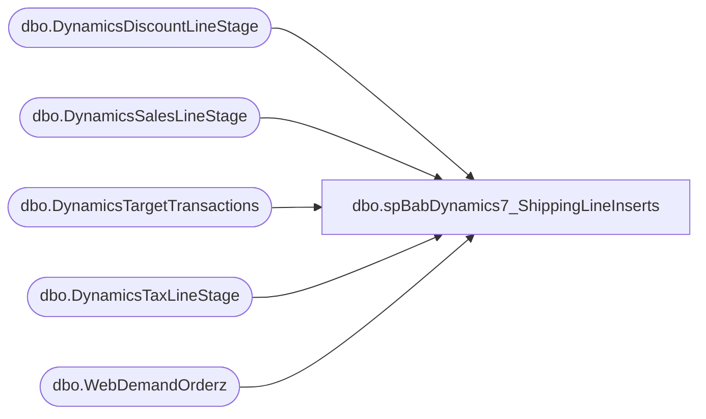

# dbo.spBabDynamics7_ShippingLineInserts

**Database:** WebOrderProcessing  
**Server:** bearcluster01  

## Architecture Diagram



## Table Dependencies

| Referenced Table |
|---|
| dbo.DynamicsDiscountLineStage |
| dbo.DynamicsSalesLineStage |
| dbo.DynamicsTargetTransactions |
| dbo.DynamicsTaxLineStage |
| dbo.WebDemandOrderz |

## Stored Procedure Code

```sql
---- =====================================================================================================
---- Name: spBabDynamics7_ShippingLineInserts
---- Revision History
----		Name:			Date:			Comments:
----		Tim Callahan	06/19/2024		Initial Release
----		Tim Callahan	07/17/2024		Added handling for BOPIS Tax -- In some states (Colorado) there is a pickup tax, so we have to insert a 0.00 shipping line and the tax for it 
---- =====================================================================================================
CREATE PROCEDURE [dbo].[spBabDynamics7_ShippingLineInserts]

@DaysBack int

as

set nocount on

-- Build MaxSalesLineNumber Table 
IF OBJECT_ID(N'tempdb..#MaxSalesLineNumber') IS NOT NULL
DROP TABLE #MaxSalesLineNumber
; 

select 
d.RetailTransactionId,
max (d.linenum) as MaxSalesLineNum, 
max (d.createtime) as MaxCreateTime
into #MaxSalesLineNumber
from DynamicsSalesLineStage d
where 1=1
group by 
d.RetailTransactionId
;

-- Identify Shipping Lines 
IF OBJECT_ID(N'tempdb..#ShippingLines') IS NOT NULL
DROP TABLE #ShippingLines
; 
select 
i.OrderNumber
,i.OriginalShipping as ShippingPrice
,i.Shipping as ShippingAfterDiscount
,i.ShippingTax
,i.ShippingMethod
,i.ShippingMethodCode
into #ShippingLines
from WebDemandOrderz i
join DynamicsTargetTransactions DTT on dtt.OrderNumber = i.OrderNumber
where 1=1
and 
(
i.OriginalShipping <> 0.00 -- Only want to insert a sales\tax line if the original shipping was not $0.00
	or 
(i.OriginalShipping = 0.00 and i.ShippingTax <> 0.00) -- Added 7/17/2024 -- BOPIS but local pickup tax  
) 
group by 
i.OrderNumber
,i.OriginalShipping
,i.Shipping
,i.ShippingTax
,i.ShippingMethod
,i.ShippingMethodCode
;

--Build ShippingSkuStage Table 
IF OBJECT_ID(N'tempdb..#ShippingSkuStage') IS NOT NULL
DROP TABLE #ShippingSkuStage
; 

select
d.transactionkey
,d.CustAccount
,d.inventlocationid
,msl.MaxSalesLineNum+1 as LineNum
,sl.ShippingPrice as OriginalPrice
,sl.ShippingPrice as Price
,-1 as Qty
,d.RetailReceiptId
,d.RetailTransactionid
,d.BABIntRetailOperatingUnitNumber
,d.RetailTerminalId
,d.TransDate
,'SV00001' as ItemId
,isnull(vd.Amount,0.00) as LineDscAmount
,isnull(vd.Amount,0.00) as DiscAmount
,null as GiftCardNumber
,d.BABIntRetailProcessed
,d.Entity
--,0.00 as periodicpercentagediscount
,case when sl.ShippingPrice = 0.00
	then 0.00
else coalesce (vd.amount,0.00)/sl.ShippingPrice end as periodicpercentagediscount
,0.00 as TotalDiscamount
,0.00 as TotalDiscPct
,max (d.CreateTime) as CreateTime
,d.Barcode
,sl.ShippingMethod as ShippingDescription
,null as LineItemType
,null as NativeItemId
,null as BearId
into #ShippingSkuStage
from DynamicsSalesLineStage d 
join #ShippingLines sl on sl.OrderNumber = d.barcode
join #MaxSalesLineNumber  msl on msl.retailtransactionid = d.retailtransactionid
left join DynamicsDiscountLineStage vd on vd.RetailTransactionId = d.retailtransactionid
	and vd.SaleLineNum = 'SHIPPING'
where 1=1
group by 
d.transactionkey
,d.CustAccount
,d.inventlocationid
,sl.ShippingPrice 
,sl.ShippingPrice 
,msl.MaxSalesLineNum+1
,d.RetailReceiptId
,d.RetailTransactionid
,d.BABIntRetailOperatingUnitNumber
,d.RetailTerminalId
,d.TransDate
,isnull(vd.Amount,0.00)
,d.BABIntRetailProcessed
,d.Entity
,case when sl.ShippingPrice = 0.00
	then 0.00
else coalesce (vd.amount,0.00)/sl.ShippingPrice end
,d.Barcode
,sl.ShippingMethod
-- Insert Shipping Record into DynamicsSalesLineStage

insert into DynamicsSalesLineStage
select *
from #ShippingSkuStage s
where 1=1

-- Insert Tax Line for Shipping Line into tax table 
insert into DynamicsTaxLineStage
select 
s.TransactionKey
,sl.ShippingTax as Amount 
,s.LineNum  
,'INT' as TaxCode
,s.RetailTerminalId 
,s.RetailTransactionId 
,s.BabIntRetailOperatingUnitNumber 
,s.BabIntRetailProcessed 
,s.Entity 
,s.TransDate 
,max (s.CreateTime) as CreateTime
,s.Barcode 
,s.InventLocationId
from #ShippingSkuStage s
join #ShippingLines sl on sl.OrderNumber = s.barcode
where 1=1
group by
s.TransactionKey
,sl.ShippingTax
,s.LineNum  
,s.RetailTerminalId 
,s.RetailTransactionId 
,s.BabIntRetailOperatingUnitNumber 
,s.BabIntRetailProcessed 
,s.Entity 
,s.TransDate 
,s.Barcode 
,s.InventLocationId


--Update Discount Table SaleLineNum field from SHIPPING to Derived Line Number  Generated Above 

--select sks.LineNum, 
--dsl.*
--from DynamicsDiscountLineStage dsl
--join  #ShippingSkuStage sks on sks.barcode = dsl.barcode
--where 1=1
--and dsl.SaleLineNum = 'SHIPPING'
--and dsl.barcode = 'W6838189'

update DynamicsDiscountLineStage  
set DynamicsDiscountLineStage.SaleLineNum = sks.LineNum
from DynamicsDiscountLineStage 
join  #ShippingSkuStage sks on sks.barcode = DynamicsDiscountLineStage.barcode
where 1=1
and DynamicsDiscountLineStage.SaleLineNum = 'SHIPPING'
```

