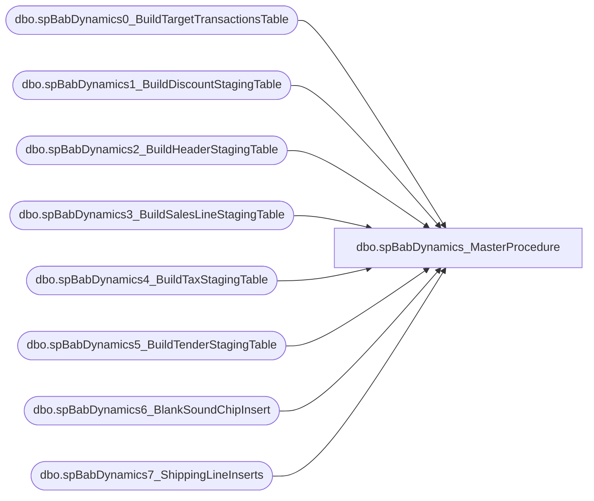

# dbo.spBabDynamics_MasterProcedure

**Database:** WebOrderProcessing  
**Server:** bearcluster01  

## Architecture Diagram



## Table Dependencies

| Referenced Table |
|---|
| dbo.spBabDynamics0_BuildTargetTransactionsTable |
| dbo.spBabDynamics1_BuildDiscountStagingTable |
| dbo.spBabDynamics2_BuildHeaderStagingTable |
| dbo.spBabDynamics3_BuildSalesLineStagingTable |
| dbo.spBabDynamics4_BuildTaxStagingTable |
| dbo.spBabDynamics5_BuildTenderStagingTable |
| dbo.spBabDynamics6_BlankSoundChipInsert |
| dbo.spBabDynamics7_ShippingLineInserts |

## Stored Procedure Code

```sql
---- =====================================================================================================
---- Name: spBabDynamics_MasterProcedure
---- Revision History
----		Name:			Date:			Comments:
----		Tim Callahan	06/19/2024		Initial Release
---- =====================================================================================================
CREATE PROCEDURE [dbo].[spBabDynamics_MasterProcedure]

@DaysBack int
--, @Result bit OUTPUT
--,@ResultTime datetime OUTPUT

as

set nocount on
SET ANSI_WARNINGS OFF 

----Variable Section for Manual Execution 
--Declare @DaysBack int
--Declare @Result bit 
--Declare @ResultTime datetime  
--set @Daysback = 10

;

Begin 

	Begin 
		exec [dbo].[spBabDynamics0_BuildTargetTransactionsTable] @DaysBack 
		; 

	End 

	Begin 
		exec [dbo].[spBabDynamics1_BuildDiscountStagingTable] 1 -- This Parameter Is a Relic of Version 1.0,  The 0 Proc Sets the table for targeting transactions 
		;
	End 

	Begin 
		exec [dbo].[spBabDynamics2_BuildHeaderStagingTable] 1-- This Parameter Is a Relic of Version 1.0,  The 0 Proc Sets the table for targeting transactions 
		; 

		exec [dbo].[spBabDynamics3_BuildSalesLineStagingTable] 1-- This Parameter Is a Relic of Version 1.0,  The 0 Proc Sets the table for targeting transactions 
		;

		exec [dbo].[spBabDynamics4_BuildTaxStagingTable] 1-- This Parameter Is a Relic of Version 1.0,  The 0 Proc Sets the table for targeting transactions 
		; 

		exec [dbo].[spBabDynamics5_BuildTenderStagingTable] 1-- This Parameter Is a Relic of Version 1.0,  The 0 Proc Sets the table for targeting transactions 
		;

	End 

	Begin 
		exec [dbo].[spBabDynamics6_BlankSoundChipInsert] 1 -- This Parameter Is a Relic of Version 1.0,  The 0 Proc Sets the table for targeting transactions 
		; 
	End 

	Begin 

		exec [dbo].[spBabDynamics7_ShippingLineInserts] 1-- This Parameter Is a Relic of Version 1.0,  The 0 Proc Sets the table for targeting transactions 
		;
	End 
	


end
```

