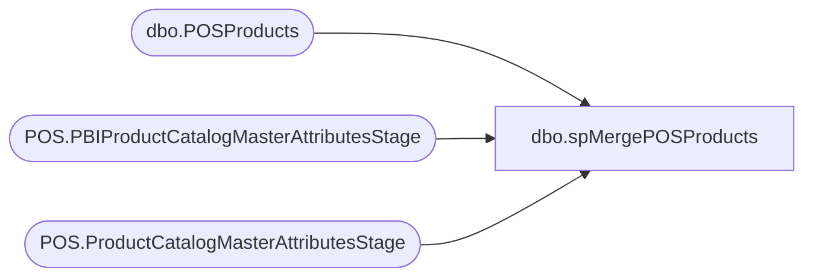

# dbo.spMergePOSProducts

**Database:** WebOrderProcessing  
**Server:** bearcluster01  

## Architecture Diagram



## Table Dependencies

| Referenced Table |
|---|
| dbo.POSProducts |
| POS.PBIProductCatalogMasterAttributesStage |
| POS.ProductCatalogMasterAttributesStage |

## Stored Procedure Code

```sql
CREATE proc spMergePOSProducts 

as 

set nocount on

select 
	ProductSellingGeography, 
	case 
		when ProductSellingGeography='CA' then '1700'
		when ProductSellingGeography='US' then '1100'
		when ProductSellingGeography='UK' then '2110'
	end as Entity,
	StyleCode, 
	ItemName, 
	Sound 
into #Stage
from [stl-ssis-p-01].IntegrationStaging.POS.ProductCatalogMasterAttributesStage
where ProductSellingGeography in ('CA', 'US', 'UK')
and Sound=1
UNION
select 
	ProductSellingGeography, 
	case 
		when ProductSellingGeography='CA' then '1700'
		when ProductSellingGeography='US' then '1100'
		when ProductSellingGeography='UK' then '2110'
	end as Entity,
	StyleCode, 
	ItemName, 
	Sound 
from [stl-ssis-p-01].IntegrationStaging.POS.PBIProductCatalogMasterAttributesStage
where ProductSellingGeography in ('CA', 'US', 'UK')
and Sound=1
;
merge into POSProducts as target
using #Stage as source
	on target.StyleCode=source.StyleCode
	and target.Entity=source.Entity
when not matched by target 
	then insert 
		(
			ProductSellingGeography,
			Entity,
			StyleCode,
			ItemName,
			Sound
		)
	values
		(
			source.ProductSellingGeography,
			source.Entity,
			source.StyleCode,
			source.ItemName,
			source.Sound
		)
when matched
	then update
		set
			target.ProductSellingGeography=source.ProductSellingGeography,
			target.Entity=source.Entity,
			target.ItemName=source.ItemName,
			target.Sound=source.Sound
when not matched by source
	then delete;
```

