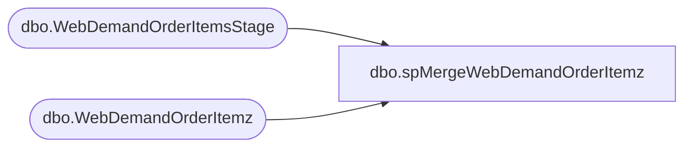

# dbo.spMergeWebDemandOrderItemz

**Database:** WebOrderProcessing  
**Server:** bearcluster01  

## Architecture Diagram



## Table Dependencies

| Referenced Table |
|---|
| dbo.WebDemandOrderItemsStage |
| dbo.WebDemandOrderItemz |

## Stored Procedure Code

```sql
CREATE proc [dbo].[spMergeWebDemandOrderItemz]

as 

set nocount on

merge into WebDemandOrderItemz as target
using WebDemandOrderItemsStage as source
on 
	target.OrderNumber=source.OrderNumber
	and target.OrderLineNumber=source.OrderLineNumber
when not matched by target
	then insert
		(
			OrderNumber,	
			UPC,	
			ItemStatus,	
			OrderItemTypeName,	
			OrderDiscount,	
			ItemDiscount,	
			GiftCardNumber,	
			ToName,	
			ToEmail,	
			FromName,	
			FromEmail,	
			Message,	
			OrderLineNumber,	
			LastUpdateDateUTC,	
			SKU,	
			Quantity,	
			Price,	
			SubTotal,	
			SalesTotal,	
			VAT,
			Tax,	
			Total,	
			Custom1,	
			Custom2,	
			Custom3,	
			Custom4,	
			Custom5,	
			CustomExtendedAttributes,	
			OrderShipmentID,	
			EstimatedShipDateUTC,	
			EndEstimatedShipDateUTC,	
			ShippingMethod,	
			ShippingMethodCode,	
			ShippedDateUTC,	
			OrderReturnID,	
			DateReturnedUTC,
			ReturnReason,	
			ReturnType,	
			ItemStatusCode,	
			GiftCardType,	
			Balance,	
			DeliveryType,	
			WarehouseCode,	
			WarehouseLocation,	
			ShippingErrorID,	
			OrderPaymentID,	
			OrderItemPromotionIds,	
			OrderItemCampaignIds,	
			OrderItemCoupons,	
			OrderPromotionIds,	
			OrderCampaignIds,	
			OrderCoupons,	
			OrderPlacementDateUTC,	
			ReturnNodeLocation,	
			ReturnNodeCode,	
			ReturnUser,	
			FulfillmentNodeType,	
			Brand,	
			Cost,		
			SiteCode,
			InsertDate
		)
	values
		(
			source.OrderNumber,	
			source.UPC,	
			source.ItemStatus,	
			source.OrderItemTypeName,	
			source.OrderDiscount,	
			source.ItemDiscount,	
			source.GiftCardNumber,	
			source.ToName,	
			source.ToEmail,	
			source.FromName,	
			source.FromEmail,	
			source.Message,	
			source.OrderLineNumber,	
			source.LastUpdateDateUTC,	
			source.SKU,	
			source.Quantity,	
			source.Price,	
			source.SubTotal,	
			source.SalesTotal,	
			source.VAT,
			source.Tax,	
			source.Total,	
			source.Custom1,	
			source.Custom2,	
			source.Custom3,	
			source.Custom4,	
			source.Custom5,	
			source.CustomExtendedAttributes,	
			source.OrderShipmentID,	
			source.EstimatedShipDateUTC,	
			source.EndEstimatedShipDateUTC,	
			source.ShippingMethod,	
			source.ShippingMethodCode,	
			source.ShippedDateUTC,	
			source.OrderReturnID,	
			source.DateReturnedUTC,
			source.ReturnReason,	
			source.ReturnType,	
			source.ItemStatusCode,	
			source.GiftCardType,	
			source.Balance,	
			source.DeliveryType,	
			source.WarehouseCode,	
			source.WarehouseLocation,	
			source.ShippingErrorID,	
			source.OrderPaymentID,	
			source.OrderItemPromotionIds,	
			source.OrderItemCampaignIds,	
			source.OrderItemCoupons,	
			source.OrderPromotionIds,	
			source.OrderCampaignIds,	
			source.OrderCoupons,	
			source.OrderPlacementDateUTC,	
			source.ReturnNodeLocation,	
			source.ReturnNodeCode,	
			source.ReturnUser,	
			source.FulfillmentNodeType,	
			source.Brand,	
			source.Cost,		
			source.SiteCode,
			getdate()
		)
when matched 
	then update
		set 
			target.OrderNumber=source.OrderNumber,	
			target.UPC=source.UPC,	
			target.ItemStatus=source.ItemStatus,	
			target.OrderItemTypeName=source.OrderItemTypeName,	
			target.OrderDiscount=source.OrderDiscount,	
			target.ItemDiscount=source.ItemDiscount,	
			target.GiftCardNumber=source.GiftCardNumber,	
			target.ToName=source.ToName,	
			target.ToEmail=source.ToEmail,	
			target.FromName=source.FromName,	
			target.FromEmail=source.FromEmail,	
			target.Message=source.Message,	
			target.OrderLineNumber=source.OrderLineNumber,	
			target.LastUpdateDateUTC=source.LastUpdateDateUTC,	
			target.SKU=source.SKU,	
			target.Quantity=source.Quantity,	
			target.Price=source.Price,	
			target.SubTotal=source.SubTotal,	
			target.SalesTotal=source.SalesTotal,	
			target.VAT=source.VAT,
			target.Tax=source.Tax,	
			target.Total=source.Total,	
			target.Custom1=source.Custom1,	
			target.Custom2=source.Custom2,	
			target.Custom3=source.Custom3,	
			target.Custom4=source.Custom4,	
			target.Custom5=source.Custom5,	
			target.CustomExtendedAttributes=source.CustomExtendedAttributes,
			target.OrderShipmentID=source.OrderShipmentID,	
			target.EstimatedShipDateUTC=source.EstimatedShipDateUTC,	
			target.EndEstimatedShipDateUTC=source.EndEstimatedShipDateUTC,	
			target.ShippingMethod=source.ShippingMethod,	
			target.ShippingMethodCode=source.ShippingMethodCode,	
			target.ShippedDateUTC=source.ShippedDateUTC,	
			target.OrderReturnID=source.OrderReturnID,	
			target.DateReturnedUTC=source.DateReturnedUTC,
			target.ReturnReason=source.ReturnReason,	
			target.ReturnType=source.ReturnType,	
			target.ItemStatusCode=source.ItemStatusCode,	
			target.GiftCardType=source.GiftCardType,	
			target.Balance=source.Balance,	
			target.DeliveryType=source.DeliveryType,	
			target.WarehouseCode=source.WarehouseCode,	
			target.WarehouseLocation=source.WarehouseLocation,	
			target.ShippingErrorID=source.ShippingErrorID,	
			target.OrderPaymentID=source.OrderPaymentID,	
			target.OrderItemPromotionIds=source.OrderItemPromotionIds,	
			target.OrderItemCampaignIds=source.OrderItemCampaignIds,	
			target.OrderItemCoupons=source.OrderItemCoupons,	
			target.OrderPromotionIds=source.OrderPromotionIds,	
			target.OrderCampaignIds=source.OrderCampaignIds,	
			target.OrderCoupons=source.OrderCoupons,	
			target.OrderPlacementDateUTC=source.OrderPlacementDateUTC,	
			target.ReturnNodeLocation=source.ReturnNodeLocation,	
			target.ReturnNodeCode=source.ReturnNodeCode,	
			target.ReturnUser=source.ReturnUser,	
			target.FulfillmentNodeType=source.FulfillmentNodeType,	
			target.Brand=source.Brand,	
			target.Cost=source.Cost,		
			target.SiteCode=source.SiteCode,
			target.UpdateDate=getdate()
;
```

