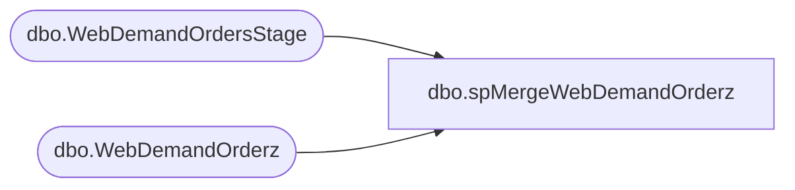

# dbo.spMergeWebDemandOrderz

**Database:** WebOrderProcessing  
**Server:** bearcluster01  

## Architecture Diagram



## Table Dependencies

| Referenced Table |
|---|
| dbo.WebDemandOrdersStage |
| dbo.WebDemandOrderz |

## Stored Procedure Code

```sql
CREATE proc [dbo].[spMergeWebDemandOrderz]

as 

set nocount on
;

merge into WebDemandOrderz as target
using WebDemandOrdersStage as source
on 
	target.OrderNumber=source.OrderNumber

when not matched by target
	then insert
		(
			OrderNumber,	
			OrderDateUTC,	
			LastUpdateDateUTC,	
			CustomerID,	
			OrderStatus,	
			OrderStatusCode,	
			BillingProvince,	
			BillingPostalCode,	
			BillingCountry,	
			ShippingProvince,	
			ShippingPostalCode,	
			ShippingCountry,	
			SubTotal,	
			SalesTotal,	
			ShippingTotal,	
			VAT,
			VATShipping,
			TotalTax,	
			ShippingTax,	
			OriginalShipping,	
			Shipping,	
			ShippingMethod,	
			ShippingMethodCode,	
			OrderDiscount,	
			ShippingDiscount,	
			OrderGrossTotal,	
			GiftReceipt,	
			GiftWrap,	
			OrderSource,	
			Source1,	
			Source2,	
			Source3,	
			Custom1,	
			Custom2,	
			Custom3,	
			Custom4,	
			Custom5,	
			CustomOrderAttributes,	
			ChannelName,	
			OrderPromotionIDs,	
			OrderCampaignIDs,	
			OrderCoupons,		
			SiteCode,
			InsertDate
		)
	values
		(
			source.OrderNumber,	
			source.OrderDateUTC,	
			source.LastUpdateDateUTC,	
			source.CustomerID,	
			source.OrderStatus,	
			source.OrderStatusCode,	
			source.BillingProvince,	
			source.BillingPostalCode,	
			source.BillingCountry,	
			source.ShippingProvince,	
			source.ShippingPostalCode,	
			source.ShippingCountry,	
			source.SubTotal,	
			source.SalesTotal,	
			source.ShippingTotal,	
			source.VAT,
			source.VATShipping,
			source.TotalTax,	
			source.ShippingTax,	
			source.OriginalShipping,	
			source.Shipping,	
			source.ShippingMethod,	
			source.ShippingMethodCode,	
			source.OrderDiscount,	
			source.ShippingDiscount,	
			source.OrderGrossTotal,	
			source.GiftReceipt,	
			source.GiftWrap,	
			source.OrderSource,	
			source.Source1,	
			source.Source2,	
			source.Source3,	
			source.Custom1,	
			source.Custom2,	
			source.Custom3,	
			source.Custom4,	
			source.Custom5,	
			source.CustomOrderAttributes,	
			source.ChannelName,	
			source.OrderPromotionIDs,	
			source.OrderCampaignIDs,	
			source.OrderCoupons,		
			source.SiteCode,
			getdate()
		)
when matched 
	then update
		set
			target.OrderNumber	=source.OrderNumber,	
			target.OrderDateUTC	=source.OrderDateUTC,	
			target.LastUpdateDateUTC	=source.LastUpdateDateUTC,	
			target.CustomerID	=source.CustomerID,	
			target.OrderStatus	=source.OrderStatus,
			target.OrderStatusCode	=source.OrderStatusCode,	
			target.BillingProvince	=source.BillingProvince,	
			target.BillingPostalCode	=source.BillingPostalCode,	
			target.BillingCountry	=source.BillingCountry,	
			target.ShippingProvince	=source.ShippingProvince,	
			target.ShippingPostalCode	=source.ShippingPostalCode,	
			target.ShippingCountry	=source.ShippingCountry,	
			target.SubTotal	=source.SubTotal,	
			target.SalesTotal	=source.SalesTotal,	
			target.ShippingTotal	=source.ShippingTotal,	
			target.VAT=source.VAT,
			target.VATShipping=source.VATShipping,
			target.TotalTax	=source.TotalTax,	
			target.ShippingTax	=source.ShippingTax,	
			target.OriginalShipping	=source.OriginalShipping,	
			target.Shipping	=source.Shipping,	
			target.ShippingMethod	=source.ShippingMethod,	
			target.ShippingMethodCode	=source.ShippingMethodCode,	
			target.OrderDiscount	=source.OrderDiscount,	
			target.ShippingDiscount	=source.ShippingDiscount,	
			target.OrderGrossTotal	=source.OrderGrossTotal,	
			target.GiftReceipt	=source.GiftReceipt,	
			target.GiftWrap	=source.GiftWrap,	
			target.OrderSource	=source.OrderSource,	
			target.Source1	=source.Source1,	
			target.Source2	=source.Source2,	
			target.Source3	=source.Source3,	
			target.Custom1	=source.Custom1,	
			target.Custom2	=source.Custom2,	
			target.Custom3	=source.Custom3,	
			target.Custom4	=source.Custom4,	
			target.Custom5	=source.Custom5,	
			target.CustomOrderAttributes	=source.CustomOrderAttributes,	
			target.ChannelName	=source.ChannelName,	
			target.OrderPromotionIDs	=source.OrderPromotionIDs,	
			target.OrderCampaignIDs	=source.OrderCampaignIDs,	
			target.OrderCoupons		=source.OrderCoupons,		
			target.SiteCode=source.SiteCode,
			target.UpdateDate=getdate()

;

dbo,spRptWebProductionOrderItem,CREATE proc [dbo].[spRptWebProductionOrderItem]

as

set nocount on

---------------------------------------------------------------------------------------------------------------------------------
--Dan Tweedie 2017-10-30 -- Created proc to stage web item data for email report for finance team
---------------------------------------------------------------------------------------------------------------------------------


truncate table WebRptProductionOrderItem

IF (Object_ID('tempdb..#IsAGift') IS NOT NULL) DROP TABLE #IsAGift
select distinct OrderID
into #IsAGift
from WM.Orders with (nolock)
where GiftSender is not null

IF (Object_ID('tempdb..#BundleNames') IS NOT NULL) DROP TABLE #BundleNames
select 
	cast(left(replace(replace(replace(sku, '_',''),'please', ''), 'select', ''),6) as int) as SKU,
	ItemDescription
into #BundleNames 
from wm.OrderItems
where len(sku) > 6

IF (Object_ID('tempdb..#IsBundle') IS NOT NULL) DROP TABLE #IsBundle
select 
	concat(cast(oi.OrderID as varchar),cast(oi.OrderItemID as varchar)) as OrderItemID,  
	1 as IsBundle,
	case 
		when oi.ItemID in (select ParentItem from wm.OrderItems where len(sku) = 6 and ParentItem is not NULL)
			then 1
		else 0
	end as IsParent,
	case 
		when oi.ItemID in (select ParentItem from wm.OrderItems where len(sku) = 6 and ParentItem is not NULL)
			then 0
		else 1
	end as IsChild,
	bn.ItemDescription as BundleName
into #IsBundle
from wm.OrderItems oi with (nolock)
left join #BundleNames bn on cast(oi.sku as int) = bn.SKU
where len(oi.sku) = 6
and (
		oi.ParentItem is not NULL
		or 
		oi.ItemID in (select ParentItem from wm.OrderItems where len(sku) = 6 and ParentItem is not NULL)
	)
	


--IF (Object_ID('tempdb..#ProductionOrderSummary') IS NOT NULL) DROP TABLE #ProductionOrderSummary
--select *
--into #ProductionOrderSummary
--from wm.vwProductionOrderSummary

insert WebRptProductionOrderItem
select 
	cast(concat(cast(oi.OrderID as varchar),cast(oi.OrderItemID as varchar)) as bigint) as ProductionOrderItemId, 
	cast(oi.ItemID as nvarchar(50)) as ProductionOrderItemWebCartOrderItemId, 
	oi.ParentItem as ProductionOrderItemParentWebCartOrderItemId, 
	oi.OrderID as ProductionOrderId, 
	cast(oi.SKU as nvarchar(32)) as ProductionOrderItemSku, 
	oi.SKU as StyleCode,
	cast(oi.ItemDescription as nvarchar(80)) as ProductionOrderItemName, 
	--case when isnull(b.IsParent,0) = 1 then cast(b.BundleName as nvarchar(80)) else NULL end as ProductionOrderItemWebCartKitDisplayName, --need to revisit this because not coming out in email
	case when isnull(b.IsParent,0) = 1 then cast(oi.ItemDescription as nvarchar(80)) else NULL end as ProductionOrderItemWebCartKitDisplayName,
	oi.qty as ProductionOrderItemQuantity, 
	oi.price as ProductionOrderItemUnitPrice, 
	(oi.price * oi.qty) as ProductionOrderItemExtendedPrice, 
	cast(oi.EyeColor as nvarchar(50)) as ProductionOrderItemFriendEyeColor, 
	cast(oi.FurColor as nvarchar(50)) as ProductionOrderItemFriendFurColor, 
	oi.Height as ProductionOrderItemFriendHeight, 
	oi.Weight as ProductionOrderItemFriendWeight, 
	cast(oi.FullName as nvarchar(50)) as ProductionOrderItemNameMeName, 
	oi.DateOfBirth as ProductionOrderItemNameMeBirthday, 
	case when isnull(g.OrderID, 0) = 0 then 0 else 1 end as ProductionOrderItemNameMeIsGift, 
	os.ProductionOrderShippingStateProvince as ProductionOrderItemRecipientStateProvince, 
	os.ProductionOrderShippingZipPostalCode as ProductionOrderItemRecipientZipPostalCode, 
	os.ProductionOrderShippingCountry as ProductionOrderItemRecipientCountry,  
	os.ProductionOrderBillingStateProvince as ProductionOrderItemSenderStateProvince, 
	os.ProductionOrderBillingZipPostalCode as ProductionOrderItemSenderZipPostalCode, 
	os.ProductionOrderBillingCountry as ProductionOrderItemSenderCountry, 
	oi.RecordYourVoiceOrder as ProductionOrderItemBuildASoundId, 
	case when oi.RecordYourVoiceOrder is not NULL then 1 else 0 end as ProductionOrderItemIsBuildASound,
	isnull(b.IsBundle,0) as ProductionOrderItemIsKit 
from wm.OrderItems oi with (nolock)
left join #IsAGift g on oi.OrderID = g.OrderID
--join #ProductionOrderSummary os on oi.OrderID = os.ProductionOrderID
join tmpWebProductionOrderSummary os on oi.OrderID = os.ProductionOrderID
left join #IsBundle b on concat(cast(oi.OrderID as varchar),cast(oi.OrderItemID as varchar)) = b.OrderItemID
where len(oi.SKU) = 6 --excludes kit sku
and oi.GiftCardNumber is NULL --excludes virtual giftcards??
```

