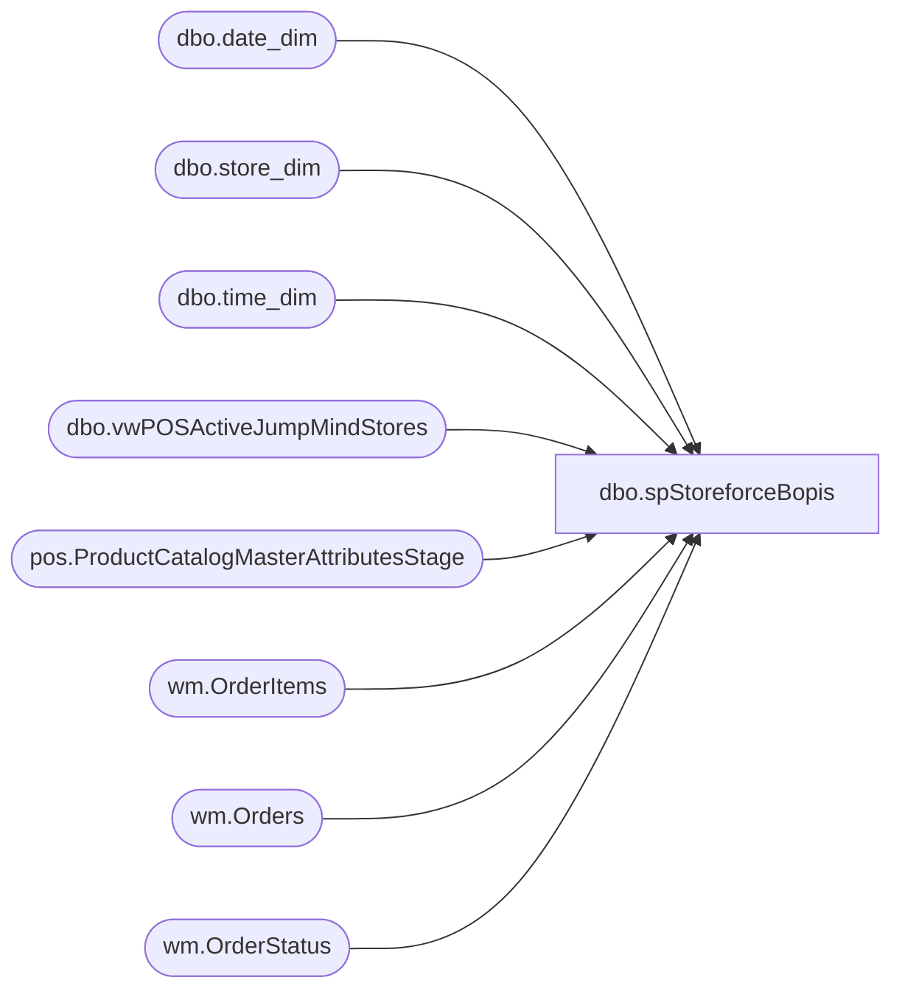

# dbo.spStoreforceBopis

**Database:** WebOrderProcessing  
**Server:** bearcluster01  

## Architecture Diagram



## Table Dependencies

| Referenced Table |
|---|
| dbo.date_dim |
| dbo.store_dim |
| dbo.time_dim |
| dbo.vwPOSActiveJumpMindStores |
| pos.ProductCatalogMasterAttributesStage |
| wm.OrderItems |
| wm.Orders |
| wm.OrderStatus |

## Stored Procedure Code

```sql
CREATE proc [dbo].[spStoreforceBopis]

as

set nocount on


IF (Object_ID('tempdb..#AllTime') IS NOT null) DROP TABLE #AllTime;
select '00:00' as Slot
into #AllTime
UNION	select '00:30'	UNION	select '01:00'	UNION	select '01:30'	UNION	select '02:00'	UNION	select '02:30'	UNION	select '03:00'	UNION	select '03:30'
UNION	select '04:00'	UNION	select '04:30'	UNION	select '05:00'	UNION	select '05:30'	UNION	select '06:00'	UNION	select '06:30'	UNION	select '07:00'	UNION	select '07:30'
UNION	select '08:00'	UNION	select '08:30'	UNION	select '09:00'	UNION	select '09:30'	UNION	select '10:00'	UNION	select '10:30'	UNION	select '11:00'	UNION	select '11:30'
UNION	select '12:00'	UNION	select '12:30'	UNION	select '13:00'	UNION	select '13:30'	UNION	select '14:00'	UNION	select '14:30'	UNION	select '15:00'  UNION	select '15:30'
UNION	select '16:00'	UNION	select '16:30'	UNION	select '17:00'	UNION	select '17:30'	UNION	select '18:00'	UNION	select '18:30'	UNION	select '19:00'	UNION	select '19:30'
UNION	select '20:00'	UNION	select '20:30'	UNION	select '21:00'	UNION	select '21:30'	UNION	select '22:00'	UNION	select '22:30'	UNION	select '23:00'	UNION	select '23:30'

IF (Object_ID('tempdb..#DateTimes') IS NOT null) DROP TABLE #DateTimes;
select distinct
	cast(dd.actual_date as date) as RawDate,
	convert(varchar, dd.actual_date, 103) as Date,
	alt.Slot
into #DateTimes
from date_dim dd with (nolock) 
cross join #AllTime alt
where (datepart(hh,getdate())>2 and datediff(dd, dd.actual_date,getdate()) =0 )
or (datepart(hh,getdate())<=2 and cast(dd.actual_date as date)=cast(getdate()-1 as date))


IF (Object_ID('tempdb..#StoreDateTime') IS NOT null) DROP TABLE #StoreDateTime;
select 
	dt.RawDate,
	dt.Date,
	case 
		when v.StoreID < 2000 
			then 1000 + v.StoreID
		else v.StoreID
	end StoreCode,
	dt.Slot,
	v.StoreID as StoreCodeRaw,
	sd.country
into #StoreDateTime
from papamart.dw.dbo.vwPOSActiveJumpMindStores v 
join papamart.dw.dbo.store_dim sd on v.storeID=sd.store_id
cross join #DateTimes dt
where (datepart(hh, getdate())>2 and v.StoreID>0)
	OR (datepart(hh, getdate())<=2 and v.StoreID<2000) ---EXCLUDES UK WHEN IT RUNS BETWEEN 12AM AND 2AM BECAUSE IT MESSES UP THE SALES TOTAL SOMEHOW FOR UK DURING THIS TIME


IF OBJECT_ID(N'tempdb..#StyleLookup') IS NOT NULL
DROP TABLE #StyleLookup
select a.ProductNumber, a.ProductDescription, a.Department, a.DepartmentCode, a.ProductSellingGeography, a.ItemType,
	case 
		when a.ProductNumber in ('427634','427582','427152','426821','426749','426378','426369','426286','426259','426219','426132','425617','425354','425152','424965','424685','424443','424286','424244','422963','422962','422824','422823','422049','421816','421815','420551','420550','415836','127634','127582','127152','126821','126749','126378','126286','126132','125617','125354','125152','124965','124685','124443','124244','122824','122823','122049','121816','121815','120551','120550','027634','027582','027217','027152','026980','026838','026821','026749','026603','026378','026369','026286','026166','026132','025617','025354','025152','024965','024685','024443','024290','024286','024244','023842','023834','022889','022888','022887','022886','022831','022830','022829','022828','022824','022823','022141','022049','021816','021815','020559','020558','020557','020556','020555','020554','020553','020552','020551','020550','018194','017295','015833','015831','015830','015281','014258','031829','027765','026378','025617','030306','031696','031659','028925','028552','025354','028895','022831','022830','022888','030394','027217','026603','022829','030418','028855','022886','026166','031977','022887','031451','031510','031408','031059','026915','024290','030174','028741','032063','028559','029984','026749','022824','028403','026980','027910','024244','021815','022141','032078','032096','032008','028473','027582','028405','027893','027634','029842','024965','026838','030548','131829','127765','126378','125617','130306','131696','131659','128925','128552','125354','128895','130394','130418','131977','131451','131408','131059','130174','128741','132063','129984','126749','122824','128403','127910','124244','121815','132078','132008','128473','127582','128405','127893','127634','129842','124965','130548','431829','427765','426378','425617','430306','431696','431659','428925','428552','425354','428895','430394','430418','431977','431451','431408','431059','430174','428741','432063','429984','426749','422824','428403','427910','424244','421815','432078','432008','428473','427582','428405','427893','427634','429842','424965','430548','426369','422963','422962','432067')
			then 1
		else 0
	end as isBackpack
into #StyleLookup
from [stl-ssis-p-01].IntegrationStaging.pos.ProductCatalogMasterAttributesStage a 
group by a.ProductNumber, a.ProductDescription, a.Department, a.DepartmentCode, a.ProductSellingGeography, a.ItemType


CREATE NONCLUSTERED INDEX [NCI_GEOBackPck]
ON [dbo].[#StyleLookup] ([ProductNumber])
INCLUDE ([DepartmentCode],[ProductSellingGeography],[isBackpack])


IF (Object_ID('tempdb..#BopisPre') IS NOT NULL) DROP TABLE #BopisPre;
select  
	cast(o.PickupStore as int) as StoreNumber,
	case 
		when cast(o.PickupStore as int) < 2000 
			then 1000 + cast(o.PickupStore as int)
		else cast(o.PickupStore as int)
	end StoreCode,
	cast(os.StatusDate as date) as ShipDate,
	right((cast('00' as varchar) + cast(td.hour as varchar)),2)
		+ ':' + case when td.Minute < 30 then '00' else '30' end as Slot,

	case when o.ShippingMethod = 'InStore' then 1 else 0 end as isPickupFromStore, 
	case when o.ShippingMethod = 'curbSide' then 1 else 0 end as isCurbside,
	case when o.ShippingMethod = 'sameDay' or o.ShippingMethod not in ('InStore', 'curbSide') then 1 else 0 end as isShipFromStore,

	o.OrderNum,
	oi.SKU,
	max(oi.Price) as Price,
	max(oi.DiscountedPrice) as SubTotal, 
	max(oi.qty) Qty
into #BopisPre
from wm.Orders o with (nolock)
join wm.OrderItems oi with (nolock) on o.OrderID=oi.OrderID
join wm.OrderStatus os with (nolock)
	on o.OrderID=os.OrderID
	and os.CurrentStatus=1
join date_dim dd on cast(os.StatusDate as date) =dd.actual_date
join time_dim td 
	on datepart(hh,os.StatusDate)=td.hour
	and datepart(mi,os.StatusDate)=td.minute
where 1=1
and datediff(dd, os.StatusDate, getdate())=0
and isnull(o.PickupStore,'') not in ('', '0013', '2013')
and	os.Status in ('Shipped','Complete')
and not exists (select g.ProductNumber from #StyleLookup g where g.ProductNumber=oi.SKU and g.ItemType='Gift Card')
group by 
	o.OrderNum,
	oi.SKU,
	cast(o.PickupStore as int),
	case 
		when cast(o.PickupStore as int) < 2000 
			then 1000 + cast(o.PickupStore as int)
		else cast(o.PickupStore as int)
	end,
	cast(os.StatusDate as date),
	right((cast('00' as varchar) + cast(td.hour as varchar)),2)
		+ ':' + case when td.Minute < 30 then '00' else '30' end,
	case when o.ShippingMethod = 'InStore' then 1 else 0 end, 
	case when o.ShippingMethod = 'curbSide' then 1 else 0 end,
	case when o.ShippingMethod = 'sameDay' or o.ShippingMethod not in ('InStore', 'curbSide') then 1 else 0 end

IF (Object_ID('tempdb..#BopisPre2') IS NOT NULL) DROP TABLE #BopisPre2;
select 
	sdt.StoreCode,
	sdt.RawDate BopisDate,
	sdt.Slot,
	case 
		when s.ItemType='STOCK' 
		and s.DepartmentCode not in ('R-B-D-47')
			then 
				case when isnull(bp.isPickupFromStore,0)=1 then sum(isnull(bp.SubTotal,0)) else 0 end 
			else 0
	end as PickupFromStoreSales,
	case 
		when s.ItemType='STOCK' 
		and s.DepartmentCode not in ('R-B-D-47')
			then 
				case when isnull(bp.isPickupFromStore,0)=1 then sum(isnull(bp.Qty,0)) else 0 end 
		else 0
	end as PickupFromStoreUnits,
	case 
		when s.ItemType='STOCK' 
		and s.DepartmentCode not in ('R-B-D-47')
			then 
				isnull(case when isnull(bp.isPickupFromStore,0)=1 then count(distinct bp.OrderNum) end,0) 
		else 0
	end as PickupFromStoreTransactions,

	case 
		when s.ItemType='STOCK' 
		and s.DepartmentCode not in ('R-B-D-47')
			then 
				case when isnull(bp.isCurbside,0)=1 then sum(isnull(bp.SubTotal,0)) else 0 end 
		else 0
	end as CurbsideSales,
	case 
		when s.ItemType='STOCK' 
		and s.DepartmentCode not in ('R-B-D-47')
			then 
				case when isnull(bp.isCurbside,0)=1 then sum(isnull(bp.Qty,0)) else 0 end 
		else 0
	end as CurbsideUnits,
	case 
		when s.ItemType='STOCK' 
		and s.DepartmentCode not in ('R-B-D-47')
			then 
				isnull(case when isnull(bp.isCurbside,0)=1 then count(distinct bp.OrderNum) end,0) 
		else 0
	end as CurbsideTransactions,

	case 
		when s.ItemType='STOCK' 
		and s.DepartmentCode not in ('R-B-D-47')
			then 
				case when isnull(bp.isShipFromStore, 0)=1 then sum(isnull(bp.SubTotal,0)) else 0 end 
		else 0
	end as ShipFromStoreSales,
	case 
		when s.ItemType='STOCK' 
		and s.DepartmentCode not in ('R-B-D-47')
			then 
				case when isnull(bp.isShipFromStore, 0)=1 then sum(isnull(bp.Qty,0)) else 0 end 
		else 0
	end as ShipFromStoreUnits,
	case 
		when s.ItemType='STOCK' 
		and s.DepartmentCode not in ('R-B-D-47')
			then 
				isnull(case when isnull(bp.isShipFromStore, 0)=1 then count(distinct bp.OrderNum) end,0) 
		else 0
	end as ShipFromStoreTransactions
into #BopisPre2
from #StoreDateTime sdt
left join #BopisPre bp 
	on sdt.StoreCode=bp.StoreCode
	and sdt.RawDate=cast(bp.ShipDate as date)
	and sdt.Slot=bp.Slot
left join #StyleLookup s 
	on s.productnumber=bp.sku -- Added 6/20/2023
	and s.ProductSellingGeography=sdt.country
group by 
	sdt.StoreCode,
	sdt.RawDate,
	sdt.Slot,
	bp.isPickupFromStore,
	bp.isCurbside,
	bp.isShipFromStore,
	s.ItemType,
	s.DepartmentCode


select 
	StoreCode,	
	BopisDate,	
	Slot,	
	sum(PickupFromStoreSales)	PickupFromStoreSales,
	sum(PickupFromStoreUnits)	PickupFromStoreUnits,
	sum(PickupFromStoreTransactions) PickupFromStoreTransactions,	
	sum(CurbsideSales)	CurbsideSales,
	sum(CurbsideUnits)	CurbsideSales,
	sum(CurbsideTransactions)	CurbsideTransactions,
	sum(ShipFromStoreSales)	ShipFromStoreSales,
	sum(ShipFromStoreUnits)	ShipFromStoreUnits,
	sum(ShipFromStoreTransactions) ShipFromStoreTransactions
from #BopisPre2
group by 
	StoreCode,	
	BopisDate,	
	Slot
order by 1,2,3
```

