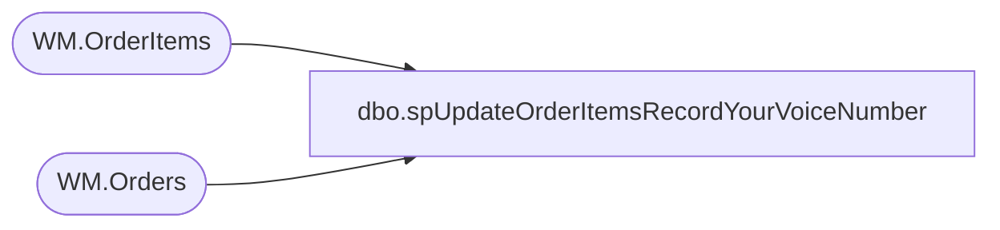

# dbo.spUpdateOrderItemsRecordYourVoiceNumber

**Database:** WebOrderProcessing  
**Server:** bearcluster01  

## Architecture Diagram



## Table Dependencies

| Referenced Table |
|---|
| WM.OrderItems |
| WM.Orders |

## Stored Procedure Code

```sql
CREATE PROCEDURE [dbo].[spUpdateOrderItemsRecordYourVoiceNumber] 
	-- Add the parameters for the stored procedure here
	@WebOrderNumber VARCHAR(10)
   ,@curRYVNumber VARCHAR (12)
   ,@newRYVNumber VARCHAR (12)

AS

-- =============================================
-- Author:		Ben Barud
-- Create date:	10/22/2020
-- Description:	Used to help modify HouseOrders and order assigned new RYV numbers for the new RYV QA flow
-- Revision History
--		Name:			Date:			Comments:
--		Ben Barud		10/22/2020		Initial Creation
-- =============================================

BEGIN
	-- SET NOCOUNT ON added to prevent extra result sets from
	-- interfering with SELECT statements.
	SET NOCOUNT ON;

    DECLARE @orderId INT, @OrderItemId INT
	
	SELECT @orderId = OrderId
	FROM [WebOrderProcessing].[WM].[Orders]
	WHERE OrderNum = @WebOrderNumber

	IF @orderId IS NOT NULL
	BEGIN
		SELECT TOP 1 @OrderItemId = OrderitemId FROM [WebOrderProcessing].[WM].[OrderItems] WHERE OrderId = @orderId AND RecordYourVoiceOrder = @curRYVNumber
		UPDATE [WebOrderProcessing].[WM].[OrderItems]
		SET RecordYourVoiceOrder = @newRYVNumber
		WHERE OrderItemID = @OrderItemId
	END

	SELECT @OrderItemId
END
```

