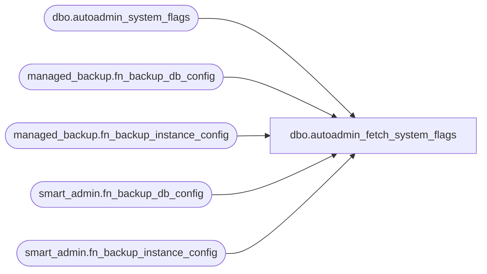

# dbo.autoadmin_fetch_system_flags

**Database:** msdb  
**Server:** bearcluster01  

## Architecture Diagram



## Table Dependencies

| Referenced Table |
|---|
| dbo.autoadmin_system_flags |
| managed_backup.fn_backup_db_config |
| managed_backup.fn_backup_instance_config |
| smart_admin.fn_backup_db_config |
| smart_admin.fn_backup_instance_config |

## Stored Procedure Code

```sql
CREATE PROCEDURE autoadmin_fetch_system_flags
AS
BEGIN
	BEGIN TRANSACTION
		DECLARE @value NVARCHAR(MAX)

		SELECT @value = value FROM autoadmin_system_flags WHERE LOWER(name) = LOWER(N'SSMBackup2WAEverConfigured')
		
		IF (LOWER(ISNULL(@value, '')) <> N'true')
		BEGIN
			DECLARE @is_configured BIT
			SET @is_configured = 0
			
			IF EXISTS (SELECT TOP 1 container_url FROM managed_backup.fn_backup_db_config(NULL) WHERE container_url IS NOT NULL)
			BEGIN
				SET @is_configured = 1	
			END
			ELSE IF EXISTS (SELECT TOP 1 container_url FROM managed_backup.fn_backup_instance_config() WHERE container_url IS NOT NULL)
			BEGIN
				SET @is_configured = 1	
			END
			ELSE IF EXISTS (SELECT TOP 1 credential_name FROM smart_admin.fn_backup_db_config(NULL) WHERE credential_name IS NOT NULL)
			BEGIN
				SET @is_configured = 1	
			END
			ELSE IF EXISTS (SELECT TOP 1 credential_name FROM smart_admin.fn_backup_instance_config() WHERE credential_name IS NOT NULL)
			BEGIN
				SET @is_configured = 1	
			END
			
			IF (@is_configured = 1)
			BEGIN
				MERGE autoadmin_system_flags AS target
				USING (SELECT LOWER(N'SSMBackup2WAEverConfigured') as name) AS source
				ON source.name = target.name
				WHEN MATCHED THEN UPDATE SET target.value = N'true'
				WHEN NOT MATCHED THEN INSERT VALUES (N'SSMBackup2WAEverConfigured', N'true');
			END
		END
	COMMIT TRANSACTION
	
    SELECT name,
	value 
	FROM autoadmin_system_flags
END

dbo,autoadmin_metadata_cleanup,-- Procedure to cleanup managed backup metadata( internal only ) 
CREATE PROC autoadmin_metadata_cleanup
	@schema_version INT,
	@agent_started BIT       = 0, -- flag to specify if agent was started atleast once
	@instance_configured BIT = 0  -- flag to specify managed backup was configured at instance level
AS
BEGIN
    -- Validations

    -- If agent is running state, let us not proceed
    DECLARE @agent_service_status INT
    SELECT @agent_service_status = [status]
    FROM sys.dm_server_services
    WHERE servicename like'%SQL Server Agent%'
    
    -- Status 4 is running - http://msdn.microsoft.com/en-us/library/hh204542.aspx
    IF(@agent_service_status = 4)
    BEGIN
		RAISERROR ('Cannot perform cleanup while SQL Server Agent is currently running', -- Message text
				   17, -- Severity,
				   1); -- State
        RETURN
    END
	
	-- if schema version is 2 & @instance_configured is 1, then report back that user can configure managed backup via V2 API
	IF((@schema_version = 2) AND (@instance_configured = 1))
	BEGIN
		RAISERROR ('Managed backup V2 instance configuration as part of cleanup is not supported', -- Message text
				   17, -- Severity,
				   2); -- State
        RETURN
	END

	BEGIN TRANSACTION

	DECLARE @task_agent_data xml

	IF(@schema_version = 2)
	BEGIN
	    -- V2 default task data xml
		SET @task_agent_data = '<AutoBackupGlobalDataV2 xmlns:i="http://www.w3.org/2001/XMLSchema-instance" xmlns="http://schemas.datacontract.org/2004/07/Microsoft.SqlServer.SmartAdmin.SmartBackupAgent">
  <defaultAutoBackupSetting>false</defaultAutoBackupSetting>
  <defaultBackupBeginTime>0001-01-01T00:00:00</defaultBackupBeginTime>
  <defaultBackupDuration>-P10675199DT2H48M5.4775808S</defaultBackupDuration>
  <defaultContainerUrl i:nil="true" />
  <defaultDaysOfWeek>NoDay</defaultDaysOfWeek>
  <defaultEncryptionAlgorithm i:nil="true" />
  <defaultEncryptorName i:nil="true" />
  <defaultEncryptorType i:nil="true" />
  <defaultFullBackupFreqType i:nil="true" />
  <defaultLocalCachePath i:nil="true" />
  <defaultLogBackupFreq>-P10675199DT2H48M5.4775808S</defaultLogBackupFreq>
  <defaultRetentionPeriod>0</defaultRetentionPeriod>
  <defaultSchedulingOption>SYSTEM</defaultSchedulingOption>
  <firstConfiguredAt>0001-01-01T00:00:00</firstConfiguredAt>
</AutoBackupGlobalDataV2>'

		EXEC autoadmin_metadata_delete

	END
	ELSE
	BEGIN
		IF(@instance_configured = 0)
		BEGIN
			-- V1 default task data -instance not configured
			SET @task_agent_data = '<AutoBackupGlobalData xmlns:i="http://www.w3.org/2001/XMLSchema-instance" xmlns="http://schemas.datacontract.org/2004/07/Microsoft.SqlServer.SmartAdmin.SmartBackupAgent">
	  <defaultAutoBackupSetting>false</defaultAutoBackupSetting>
	  <defaultCredentialName i:nil="true" />
	  <defaultEncryptionAlgorithm i:nil="true" />
	  <defaultEncryptorName i:nil="true" />
	  <defaultEncryptorType i:nil="true" />
	  <defaultRetentionPeriod>0</defaultRetentionPeriod>
	  <defaultURL i:nil="true" />
	  <firstConfiguredAt>0001-01-01T00:00:00</firstConfiguredAt>
	</AutoBackupGlobalData>'
		END
		ELSE
		BEGIN
		    -- V1 default task data -instance configured
			SET @task_agent_data = '<AutoBackupGlobalData xmlns:i="http://www.w3.org/2001/XMLSchema-instance" xmlns="http://schemas.datacontract.org/2004/07/Microsoft.SqlServer.SmartAdmin.SmartBackupAgent">
  <defaultAutoBackupSetting>false</defaultAutoBackupSetting>
   <defaultCredentialName>AzureCredential</defaultCredentialName>
  <defaultEncryptionAlgorithm i:nil="true" />
  <defaultEncryptorName i:nil="true" />
  <defaultEncryptorType i:nil="true" />
  <defaultRetentionPeriod>0</defaultRetentionPeriod>
  <defaultURL i:nil="true" />
  <firstConfiguredAt>0001-01-01T00:00:00</firstConfiguredAt>
</AutoBackupGlobalData>'
		END

		IF(ISNULL(@agent_started, 0) = 0)
		BEGIN
		    -- SQL Agent was never started, Remove all entries in managed backup tables
			EXEC autoadmin_metadata_delete
		END
		ELSE
		BEGIN
			UPDATE autoadmin_task_agent_metadata
			SET schema_version = 1
			WHERE  task_agent_data IS NULL
		END
	END
		
	-- Only if SQL Agent was started atleast once, or instance was configured
	-- we could see default V1/V2 in table autoadmin_metadata_insert_task_agent_global_data
	IF(ISNULL(@agent_started, 0) = 1) OR (ISNULL(@instance_configured, 0) = 1)
	BEGIN
	   -- Insert or update global instance metadata
		EXEC autoadmin_metadata_insert_task_agent_global_data @schema_version = @schema_version, 
			@task_agent_guid = '6DF5825B-945C-4081-A4E3-292556E99B99',
			@task_agent_data = @task_agent_data

		-- Turn on Master Switch
		EXEC autoadmin_set_master_switch @state = 1
	END

	COMMIT TRANSACTION
END

dbo,autoadmin_metadata_delete,-- Procedure to delete entries in metadata tables
CREATE PROC autoadmin_metadata_delete
AS
BEGIN
	PRINT 'Cleaning up managed backup metadata tables...'

	PRINT 'Deleting entries from autoadmin_managed_databases...'
	DELETE FROM autoadmin_managed_databases

	PRINT 'Deleting entries from autoadmin_task_agent_metadata...'
	DELETE FROM autoadmin_task_agent_metadata

	PRINT 'Deleting entries from autoadmin_system_flags...'
	DELETE FROM autoadmin_system_flags

	PRINT 'Deleting entries from autoadmin_master_switch...'
	DELETE FROM autoadmin_master_switch

	PRINT 'Deleting entries from smart_backup_files...'
	DELETE FROM smart_backup_files

END
```

