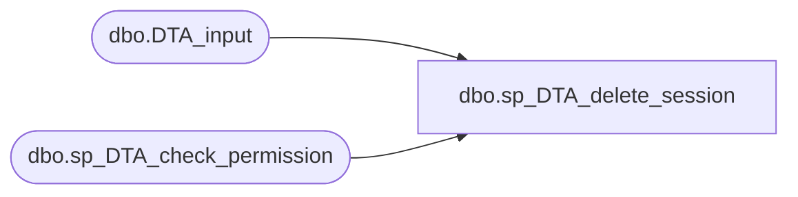

# dbo.sp_DTA_delete_session

**Database:** msdb  
**Server:** bearcluster01  

## Architecture Diagram



## Table Dependencies

| Referenced Table |
|---|
| dbo.DTA_input |
| dbo.sp_DTA_check_permission |

## Stored Procedure Code

```sql
create procedure sp_DTA_delete_session 
	@SessionID int 
as 
begin
	declare @retval  int							
	set nocount on

	exec @retval =  sp_DTA_check_permission @SessionID

	if @retval = 1
	begin
		raiserror(31002,-1,-1)
		return(1)
	end	

	delete from msdb.dbo.DTA_input where SessionID=@SessionID
end

dbo,sp_DTA_end_xmlprefix,create procedure sp_DTA_end_xmlprefix
as
begin
	declare @endTags nvarchar(128)
	set @endTags = N'</AnalysisReport></DTAOutput></DTAXML>'
	select @endTags
end

dbo,sp_DTA_event_weight_helper_relational, create procedure sp_DTA_event_weight_helper_relational
			@SessionID		int
			as
			begin	select "Event String"= EventString, "Weight" = CAST(EventWeight as decimal(38,2)) 	from [msdb].[dbo].[DTA_reports_query]
					where SessionID=@SessionID and EventWeight>0
					order by EventWeight desc  end 
dbo,sp_DTA_event_weight_helper_xml,create procedure sp_DTA_event_weight_helper_xml 
	@SessionID int 
as 
begin
	select 1            as Tag, 
			NULL          as Parent,
			'' as [EventWeightReport!1!!element],
			NULL as [EventDetails!2!EventString!ELEMENT] ,
			NULL as [EventDetails!2!Weight!ELEMENT]
	union all

	select 2         as Tag, 
			1         as Parent,
			NULL as [QueryCost!1!!element],
			EventString as [EventDetails!2!EventString!ELEMENT] ,
			CAST(EventWeight as decimal(38,2)) as [EventDetails!2!Weight!ELEMENT]
			from [msdb].[dbo].[DTA_reports_query]
			where SessionID=@SessionID and EventWeight>0
	order by Tag,[EventDetails!2!Weight!ELEMENT] desc  
	FOR XML EXPLICIT	
end

dbo,sp_DTA_get_columntableids,create procedure sp_DTA_get_columntableids
	@SessionID	int
as
begin
	declare @retval  int							
	set nocount on

	exec @retval =  sp_DTA_check_permission @SessionID

	if @retval = 1
	begin
		raiserror(31002,-1,-1)
		return(1)
	end	

	select ColumnID,DatabaseName,SchemaName,TableName,ColumnName 
	from [msdb].[dbo].[DTA_reports_column] as C,
	[msdb].[dbo].[DTA_reports_table] as T,[msdb].[dbo].[DTA_reports_database] as D 
	where C.TableID = T.TableID and T.DatabaseID = D.DatabaseID and D.SessionID = @SessionID


end	

dbo,sp_DTA_get_databasetableids,create procedure sp_DTA_get_databasetableids
	@SessionID	int
as
begin
	declare @retval  int							
	set nocount on

	exec @retval =  sp_DTA_check_permission @SessionID

	if @retval = 1
	begin
		raiserror(31002,-1,-1)
		return(1)
	end	

	select DatabaseID,DatabaseName 
	from [msdb].[dbo].[DTA_reports_database] as D 
	where D.SessionID = @SessionID

end	

dbo,sp_DTA_get_indexableids,create procedure sp_DTA_get_indexableids
	@SessionID	int
as
begin
	declare @retval  int							
	set nocount on

	exec @retval =  sp_DTA_check_permission @SessionID

	if @retval = 1
	begin
		raiserror(31002,-1,-1)
		return(1)
	end	

	select IndexID,DatabaseName,SchemaName,TableName,IndexName,SessionUniquefier 
	from [msdb].[dbo].[DTA_reports_index] as I,[msdb].[dbo].[DTA_reports_table] as T,
	[msdb].[dbo].[DTA_reports_database] as D 
	where I.TableID = T.TableID and T.DatabaseID = D.DatabaseID and D.SessionID = @SessionID 

end	

dbo,sp_DTA_get_interactivestatus,create procedure sp_DTA_get_interactivestatus
	@SessionID int 

as 
begin
	declare @retval  int							
	set nocount on

	exec @retval =  sp_DTA_check_permission @SessionID

	if @retval = 1
	begin
		raiserror(31002,-1,-1)
		return(1)
	end	
	select InteractiveStatus from [msdb].[dbo].[DTA_input] where SessionID = @SessionID
end	

dbo,sp_DTA_get_pftableids,create procedure sp_DTA_get_pftableids
	@SessionID	int
as
begin
	declare @retval  int							
	set nocount on

	exec @retval =  sp_DTA_check_permission @SessionID

	if @retval = 1
	begin
		raiserror(31002,-1,-1)
		return(1)
	end	

	select PartitionFunctionID ,DatabaseName ,PartitionFunctionName  
	from [msdb].[dbo].[DTA_reports_partitionfunction]  as PF,
	[msdb].[dbo].[DTA_reports_database] as D 
	where PF.DatabaseID = D.DatabaseID 
	and D.SessionID = @SessionID
	
end	

dbo,sp_DTA_get_pstableids,create procedure sp_DTA_get_pstableids
	@SessionID	int
as
begin
	declare @retval  int							
	set nocount on

	exec @retval =  sp_DTA_check_permission @SessionID

	if @retval = 1
	begin
		raiserror(31002,-1,-1)
		return(1)
	end	

	select PartitionSchemeID,DatabaseName,PartitionSchemeName   
	from [msdb].[dbo].[DTA_reports_partitionfunction]  as PF, 
	[msdb].[dbo].[DTA_reports_partitionscheme]  as PS, 
	[msdb].[dbo].[DTA_reports_database] as D 
	where PS.PartitionFunctionID  = PF.PartitionFunctionID and 
	PF.DatabaseID = D.DatabaseID and D.SessionID = @SessionID	
	
end	

dbo,sp_DTA_get_session_report,create procedure sp_DTA_get_session_report 
	@SessionID int, 
	@ReportID int,
	@ReportType int
as 
begin

	declare @retval  int							
	set nocount on

	exec @retval =  sp_DTA_check_permission @SessionID

	if @retval = 1
	begin
		raiserror(31002,-1,-1)
		return(1)
	end	
	
	if @ReportType = 0
	begin
		/**************************************************************/
		/* Query Cost Report                                          */
		/**************************************************************/
		if @ReportID = 2
		begin
			exec sp_DTA_query_cost_helper_relational @SessionID	
		end
		/**************************************************************/
		/* Event Frequency Report                                     */
		/**************************************************************/
		else if @ReportID = 3
		begin
			exec sp_DTA_event_weight_helper_relational @SessionID								
		end	
		/**************************************************************/
		/* Query Detail Report                                        */
		/**************************************************************/
		else if @ReportID = 4
		begin
			exec sp_DTA_query_detail_helper_relational  @SessionID	
		end	
		/**************************************************************/
		/* Current Query Index Relations Report                        */
		/**************************************************************/
		else if @ReportID = 5
		begin
			exec sp_DTA_query_indexrelations_helper_relational  @SessionID,0
		end	
		/**************************************************************/
		/* Recommended Query Index Relations Report                   */
		/**************************************************************/
		else if @ReportID = 6
		begin
			exec sp_DTA_query_indexrelations_helper_relational  @SessionID,1
		end	
		/**************************************************************/
		/* Current Query Cost Range		                             */
		/**************************************************************/
		else if @ReportID = 7
		begin
			exec sp_DTA_query_costrange_helper_relational @SessionID
		end
		/**************************************************************/
		/* Recommended Query Cost Range		                            */
		/**************************************************************/
		else if @ReportID = 8
		begin
			exec sp_DTA_query_costrange_helper_relational @SessionID
		end
		/**************************************************************/
		/* Current Query Index Usage Report		                       */
		/**************************************************************/
		else if @ReportID = 9
		begin
			exec sp_DTA_index_usage_helper_relational @SessionID,0
		end
		/**************************************************************/
		/* Recommended Query Index Usage Report		                   */
		/**************************************************************/
		else if @ReportID = 10
		begin
			exec sp_DTA_index_usage_helper_relational @SessionID,1
		end
		/**************************************************************/
		/* Current Index Detail Report                                */
		/**************************************************************/
		else if @ReportID = 11
		begin
			exec sp_DTA_index_detail_current_helper_relational  @SessionID
		end	
		/**************************************************************/
		/* Recommended Index Detail Report                                */
		/**************************************************************/
		else if @ReportID = 12
		begin
			exec sp_DTA_index_detail_recommended_helper_relational  @SessionID
		end	
		/**************************************************************/
		/* View Table Relations Report                                */
		/**************************************************************/
		else if @ReportID = 13
		begin
			exec sp_DTA_view_table_helper_relational  @SessionID
		end
		/**************************************************************/
		/* Workload Analysis Report                                   */
		/**************************************************************/
		else if @ReportID = 14
		begin
			exec sp_DTA_wkld_analysis_helper_relational @SessionID
		end	
		/**************************************************************/
		/* All object access reports                                   */
		/**************************************************************/
		else if @ReportID = 15
		begin
			exec sp_DTA_database_access_helper_relational @SessionID
		end
		else if @ReportID = 16
		begin
			exec sp_DTA_table_access_helper_relational @SessionID
		end
		else if @ReportID = 17
		begin
			exec sp_DTA_column_access_helper_relational @SessionID
		end
	end
	-- XML Reports
	else if @ReportType = 1
	begin
		/**************************************************************/
		/* Query Cost Report                                          */
		/**************************************************************/
		if @ReportID = 2
		begin
			exec sp_DTA_query_cost_helper_xml @SessionID	
		end
		/**************************************************************/
		/* Event Frequency Report                                     */
		/**************************************************************/
		else if @ReportID = 3
		begin
			exec sp_DTA_event_weight_helper_xml @SessionID								
		end	
		/**************************************************************/
		/* Query Detail Report                                        */
		/**************************************************************/
		else if @ReportID = 4
		begin
			exec sp_DTA_query_detail_helper_xml  @SessionID	
		end	
		/**************************************************************/
		/* Current Query Index Relations Report                        */
		/**************************************************************/
		else if @ReportID = 5
		begin
			exec sp_DTA_query_indexrelations_helper_xml  @SessionID,0
		end	
		/**************************************************************/
		/* Recommended Query Index Relations Report                   */
		/**************************************************************/
		else if @ReportID = 6
		begin
			exec sp_DTA_query_indexrelations_helper_xml  @SessionID,1
		end	
		/**************************************************************/
		/* Current Query Cost Range		                             */
		/**************************************************************/
		else if @ReportID = 7
		begin
			exec sp_DTA_query_costrange_helper_xml @SessionID
		end
		/**************************************************************/
		/* Recommended Query Cost Range		                            */
		/**************************************************************/
		else if @ReportID = 8
		begin
			exec sp_DTA_query_costrange_helper_xml @SessionID
		end
		/**************************************************************/
		/* Current Query Index Usage Report		                       */
		/**************************************************************/
		else if @ReportID = 9
		begin
			exec sp_DTA_index_usage_helper_xml @SessionID,0
		end
		/**************************************************************/
		/* Recommended Query Index Usage Report		                   */
		/**************************************************************/
		else if @ReportID = 10
		begin
			exec sp_DTA_index_usage_helper_xml @SessionID,1
		end
		/**************************************************************/
		/* Current Index Detail Report                                */
		/**************************************************************/
		else if @ReportID = 11
		begin
			exec sp_DTA_index_current_detail_helper_xml  @SessionID
		end	
		/**************************************************************/
		/* Recommended Index Detail Report                                */
		/**************************************************************/
		else if @ReportID = 12
		begin
			exec sp_DTA_index_recommended_detail_helper_xml  @SessionID
		end	
		/**************************************************************/
		/* View Table Relations Report                                */
		/**************************************************************/
		else if @ReportID = 13
		begin
			exec sp_DTA_view_table_helper_xml  @SessionID
		end
		/**************************************************************/
		/* Workload Analysis Report                                   */
		/**************************************************************/
		else if @ReportID = 14
		begin
			exec sp_DTA_wkld_analysis_helper_xml @SessionID
		end	
		/**************************************************************/
		/* All object access reports                                   */
		/**************************************************************/
		else if @ReportID = 15
		begin
			exec sp_DTA_database_access_helper_xml @SessionID
		end
		else if @ReportID = 16
		begin
			exec sp_DTA_table_access_helper_xml @SessionID
		end
		else if @ReportID = 17
		begin
			exec sp_DTA_column_access_helper_xml @SessionID
		end
	end		
end	

dbo,sp_DTA_get_session_tuning_results,create procedure sp_DTA_get_session_tuning_results 
	@SessionID int 
as 
begin
	set nocount on
	declare @retval  int							
	exec @retval =  sp_DTA_check_permission @SessionID

	if @retval = 1
	begin
		raiserror(31002,-1,-1)
		return(1)
	end	
	select	FinishStatus,TuningResults 
	from	msdb.dbo.DTA_output 
	where	SessionID=@SessionID
end	

dbo,sp_DTA_get_tableids,create procedure sp_DTA_get_tableids
	@SessionID	int
as
begin
	declare @retval  int							
	set nocount on

	exec @retval =  sp_DTA_check_permission @SessionID

	if @retval = 1
	begin
		raiserror(31002,-1,-1)
		return(1)
	end	

	select TableID,DatabaseName,SchemaName,TableName 
	from [msdb].[dbo].[DTA_reports_table] as T,[msdb].[dbo].[DTA_reports_database] as D 
	where T.DatabaseID = D.DatabaseID and D.SessionID = @SessionID


end
```

