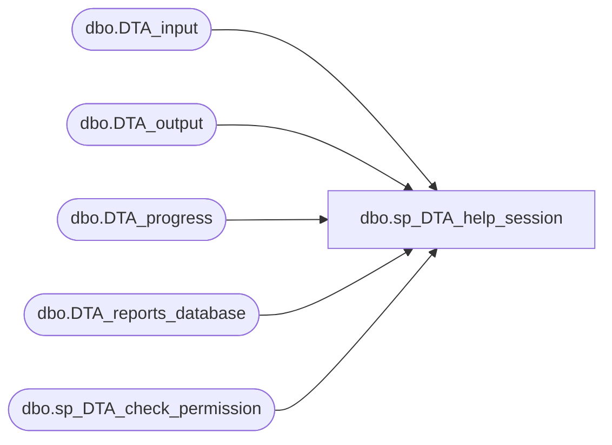

# dbo.sp_DTA_help_session

**Database:** msdb  
**Server:** bearcluster01  

## Architecture Diagram



## Table Dependencies

| Referenced Table |
|---|
| dbo.DTA_input |
| dbo.DTA_output |
| dbo.DTA_progress |
| dbo.DTA_reports_database |
| dbo.sp_DTA_check_permission |

## Stored Procedure Code

```sql
create procedure sp_DTA_help_session 
	@SessionID int = 0,
	@IncludeTuningOptions int = 0
as 
begin
	declare @tuning_owner nvarchar(256)
	declare @retval  int
	declare @InteractiveStatus tinyint
	declare @delta int

	declare @cursessionID int
	declare @dbname nvarchar(128)
	declare @dbid int
	declare @retcode int
	declare @sql nvarchar(256)
	
	set nocount on

	-- List all Sessions mode
	if @SessionID = 0
	begin
		-- If sysadmin role then rowset has all the rows in the table
		-- Return everything
		if (isnull(IS_SRVROLEMEMBER(N'sysadmin'), 0) = 1)
		begin
		
			if (@IncludeTuningOptions = 0) 
			begin
				select	I.SessionID, I.SessionName, I.InteractiveStatus,
						I.CreationTime, I.ScheduledStartTime, O.StopTime,I.GlobalSessionID
						from msdb.dbo.DTA_input I left outer join msdb.dbo.DTA_output  O
						on I.SessionID = O.SessionID	
				order by
						I.SessionID	desc					
			end
			
			else if (@IncludeTuningOptions = 1)
			begin
				select	I.SessionID, I.SessionName, I.InteractiveStatus,
						I.CreationTime, I.ScheduledStartTime, O.StopTime,I.TuningOptions,I.GlobalSessionID
						from msdb.dbo.DTA_input  I left outer join msdb.dbo.DTA_output as O
						on I.SessionID = O.SessionID
				order by
						I.SessionID	desc
			end									
	
		end
		
		else 
		begin
			-- Temporary table to store sessionid and databases passed in by user
			create table #allDistinctDbIds (DatabaseID int)
			-- Init variables			
			set @dbid = 0
			set @retcode = 1
			-- Get all database names passed in by user (IsDatabaseSelectedToTune =1)
			declare db_cursor cursor for
			select distinct(DatabaseName) from DTA_reports_database
			where  IsDatabaseSelectedToTune  = 1
			-- Open cursor
			open db_cursor
			-- Fetch first session id and db name
			fetch next from db_cursor
			into @dbname
			
			-- loop and get all the databases selected to tune
			while @@fetch_status = 0
			-- Loop
			begin
				-- set @retcode = 1 in the beginning to indicate success
				set @retcode = 1
				-- Get database id
				select  @dbid = DB_ID(@dbname)
				-- In Yukon this masks the error messages.If not owner dont return
				-- error message in SP
				set @sql = N'begin try
					dbcc autopilot(5,@dbid) WITH NO_INFOMSGS 
				end try
				begin catch
					set @dbid = 0
					set @retcode = 0
				end catch'
				execute sp_executesql @sql
					, N'@dbid int output, @retcode int OUTPUT' 
					, @dbid output 
					, @retcode output
		
				-- dbid is 0 if user doesnt have permission to do dbcc call
				insert into #allDistinctDbIds(DatabaseID) values
								(@dbid)
				-- fetch next								
				fetch from db_cursor into @dbname		
			-- end the cursor loop				
			end		
			-- clean up cursor
			close db_cursor
			deallocate db_cursor


			select SessionID 
			into #allValidSessionIds
			from DTA_input as I
			where
				((select count(*) from
				#allDistinctDbIds ,DTA_reports_database as D
				where #allDistinctDbIds.DatabaseID = DB_ID(D.DatabaseName)
				and I.SessionID = D.SessionID
				group by D.SessionID ) = 
				(select count(*) from DTA_reports_database as D
				where I.SessionID = D.SessionID
				and D.IsDatabaseSelectedToTune = 1
				group by D.SessionID )
				) 
			group by I.SessionID
			

			-- Return only sessions with matching user name
			-- If count of rows with DatabaseID = 0 is > 0 then permission denied
			if ( @IncludeTuningOptions = 0 )
			begin
				select	I.SessionID , I.SessionName, I.InteractiveStatus,
						I.CreationTime, I.ScheduledStartTime, O.StopTime,I.GlobalSessionID
						from msdb.dbo.DTA_input I left outer join msdb.dbo.DTA_output  O 
						on  I.SessionID = O.SessionID
						inner  join #allValidSessionIds S
						on	I.SessionID = S.SessionID
								
						
				order by
						I.SessionID	desc					
			end
			
			else if (@IncludeTuningOptions = 1)
			begin
				select	I.SessionID , I.SessionName, I.InteractiveStatus,
						I.CreationTime, I.ScheduledStartTime, O.StopTime,I.TuningOptions,I.GlobalSessionID
						from msdb.dbo.DTA_input I left outer join msdb.dbo.DTA_output O 
						on  I.SessionID = O.SessionID
						inner  join #allValidSessionIds S
						on	I.SessionID = S.SessionID

						
				order by
						I.SessionID	desc					
										
			end
			drop table #allDistinctDbIds
			drop table #allValidSessionIds
		end
	end

	else
	begin
		exec @retval =  sp_DTA_check_permission @SessionID
		if @retval = 1
		begin
			raiserror(31002,-1,-1)
			return(1)
		end	
	
		if ( @IncludeTuningOptions = 0) 
		begin
			select	I.SessionID, I.SessionName, I.InteractiveStatus,
					I.CreationTime, I.ScheduledStartTime, O.StopTime,I.GlobalSessionID
			from msdb.dbo.DTA_input I left outer join msdb.dbo.DTA_output O
			on  I.SessionID = O.SessionID
			where I.SessionID = @SessionID	
		end
		else if (@IncludeTuningOptions = 1)
		begin
			select	I.SessionID, I.SessionName, I.InteractiveStatus,
					I.CreationTime, I.ScheduledStartTime, O.StopTime,I.TuningOptions,I.GlobalSessionID
			from msdb.dbo.DTA_input I left outer join msdb.dbo.DTA_output O
			on  I.SessionID = O.SessionID
			where	I.SessionID = @SessionID				
		end
	
		-- Second rowset returned for DTA to process progress information
		select	ProgressEventID,TuningStage,WorkloadConsumption,EstImprovement,
				ProgressEventTime ,ConsumingWorkLoadMessage,PerformingAnalysisMessage,GeneratingReportsMessage
		from	msdb.dbo.DTA_progress 
		where	SessionID=@SessionID
		order by ProgressEventID
				

		-- Set interactive status to 6 if a time of 5 mins has elapsed
		-- Next time help session is called DTA will exit
		
		select	 @InteractiveStatus=InteractiveStatus
		from msdb.dbo.DTA_input
		where SessionID = @SessionID	

		if (@InteractiveStatus IS NOT NULL and( @InteractiveStatus <> 4 and  @InteractiveStatus <> 6)) 
		begin
			select @delta=DATEDIFF(minute ,ProgressEventTime,getdate())
			from msdb.dbo.DTA_progress 
			where  SessionID =@SessionID	
			order by TuningStage ASC
			
			if(@delta > 30)
			begin
				update [msdb].[dbo].[DTA_input] set InteractiveStatus = 6
				where SessionID = @SessionID
			end
		end

		
	end
end								

dbo,sp_DTA_index_current_detail_helper_xml,create procedure sp_DTA_index_current_detail_helper_xml
						@SessionID		int
as						
begin
select 1            as Tag, 
		NULL          as Parent,
		'' as [IndexDetailReport!1!!ELEMENT],
		'true' as [IndexDetailReport!1!Current],
		NULL as [Database!2!DatabaseID!hide],
		NULL  as [Database!2!Name!ELEMENT] ,
		NULL  as [Schema!3!Name!ELEMENT] ,
		NULL as [Table!4!TableID!hide],
		NULL as [Table!4!Name!ELEMENT],
		NULL as [Index!5!IndexID!hide],
		NULL as [Index!5!Name!ELEMENT],
		NULL as [Index!5!Clustered],
		NULL as [Index!5!Unique],
		NULL as [Index!5!Heap],
		NULL as [Index!5!FilteredIndex],
		NULL as [Index!5!IndexSizeInMB],
		NULL as [Index!5!NumberOfRows],
		NULL as [Index!5!FilterDefinition]
	union all
	select 2            as Tag, 
		1          as Parent,
		NULL as [IndexDetailReport!1!!ELEMENT],
		NULL as [IndexDetailReport!1!Recommended],
		D.DatabaseID as [Database!2!DatabaseID!hide],
		D.DatabaseName  as [Database!2!Name!ELEMENT] ,
		NULL  as [Schema!3!Name!ELEMENT] ,
		NULL as [Table!4!TableID!hide],
		NULL as [Table!4!Name!ELEMENT],
		NULL as [Index!5!IndexID!hide],
		NULL as [Index!5!Name!ELEMENT],
		NULL as [Index!5!Clustered],
		NULL as [Index!5!Unique],
		NULL as [Index!5!Heap],
		NULL as [Index!5!FilteredIndex],
		NULL as [Index!5!IndexSizeInMB],
		NULL as [Index!5!NumberOfRows],
		NULL as [Index!5!FilterDefinition]
	from [msdb].[dbo].[DTA_reports_database] as D
	where
	D.SessionID = @SessionID and
	D.DatabaseID in
	(select D.DatabaseID from
			[msdb].[dbo].[DTA_reports_table] as T,
			[msdb].[dbo].[DTA_reports_database] as D,
			[msdb].[dbo].[DTA_reports_index] as I
			where
			D.SessionID = @SessionID and
			D.DatabaseID = T.DatabaseID and
			T.TableID = I.TableID and
			I.IsExisting = 1
			group by D.DatabaseID)
union all
	select 3            as Tag, 
		2          as Parent,
		NULL as [IndexDetailReport!1!!ELEMENT],
		NULL as [IndexDetailReport!1!Recommended],
		D.DatabaseID as [Database!2!DatabaseID!hide],
		D.DatabaseName  as [Database!2!Name!ELEMENT] ,
		R.SchemaName  as [Schema!3!Name!ELEMENT] ,
		NULL as [Table!4!TableID!hide],
		NULL as [Table!4!Name!ELEMENT],
		NULL as [Index!5!IndexID!hide],
		NULL as [Index!5!Name!ELEMENT],
		NULL as [Index!5!Clustered],
		NULL as [Index!5!Unique],
		NULL as [Index!5!Heap],
		NULL as [Index!5!FilteredIndex],	
		NULL as [Index!5!IndexSizeInMB],
		NULL as [Index!5!NumberOfRows],
		NULL as [Index!5!FilterDefinition]
		from [msdb].[dbo].[DTA_reports_database] as D,
		(
			select D.DatabaseID,T.SchemaName 
			from
			[msdb].[dbo].[DTA_reports_table] as T,
			[msdb].[dbo].[DTA_reports_database] as D,
			[msdb].[dbo].[DTA_reports_index] as I
			where
			D.SessionID = @SessionID and
			D.DatabaseID = T.DatabaseID and
			T.TableID = I.TableID and
			I.IsExisting = 1
			group by D.DatabaseID,T.SchemaName
		) R
	where
	D.SessionID = @SessionID and
	D.DatabaseID = R.DatabaseID
union all
	select 4            as Tag, 
		3          as Parent,
		NULL as [IndexDetailReport!1!!ELEMENT],
		NULL as [IndexDetailReport!1!Recommended],
		D.DatabaseID as [Database!2!DatabaseID!hide],
		D.DatabaseName  as [Database!2!Name!ELEMENT] ,
		R.SchemaName  as [Schema!3!Name!ELEMENT] ,
		R.TableID as [Table!4!TableID!hide],
		T.TableName  as [Table!4!Name!ELEMENT],
		NULL as [Index!5!IndexID!hide],
		NULL as [Index!5!Name!ELEMENT],
		NULL as [Index!5!Clustered],
		NULL as [Index!5!Unique],
		NULL as [Index!5!Heap],
		NULL as [Index!5!FilteredIndex],	
		NULL as [Index!5!IndexSizeInMB],
		NULL as [Index!5!NumberOfRows],
		NULL as [Index!5!FilterDefinition]
		from [msdb].[dbo].[DTA_reports_database] as D,
		 [msdb].[dbo].[DTA_reports_table] as T,
		(
			select D.DatabaseID,T.SchemaName,T.TableID
			from
				[msdb].[dbo].[DTA_reports_table] as T,
				[msdb].[dbo].[DTA_reports_database] as D,
				[msdb].[dbo].[DTA_reports_index] as I
			where
				D.SessionID = @SessionID and
				D.DatabaseID = T.DatabaseID and
				T.TableID = I.TableID and
				I.IsExisting = 1
			group by D.DatabaseID,T.SchemaName,T.TableID
		) R
		where
		D.SessionID = @SessionID and
		D.DatabaseID = R.DatabaseID and
		R.TableID = T.TableID and
		T.DatabaseID = D.DatabaseID
union all

	select 5            as Tag, 
		4          as Parent,
		NULL as [IndexDetailReport!1!!ELEMENT],
		NULL as [IndexDetailReport!1!Recommended],
		D.DatabaseID as [Database!2!DatabaseID!hide],
		D.DatabaseName  as [Database!2!Name!ELEMENT] ,
		T.SchemaName  as [Schema!3!Name!ELEMENT] ,
		T.TableID as [Table!4!TableID!hide],
		T.TableName  as [Table!4!Name!ELEMENT],
		I.IndexID as [Index!5!IndexID!hide],
		I.IndexName  as [Index!5!Name!ELEMENT],
		CASE
			WHEN I.IsClustered = 1 THEN 'true'	
			WHEN I.IsClustered = 0 THEN 'false'
		end
		as [Index!5!Clustered],
		CASE
			WHEN I.IsUnique = 1 THEN 'true'		
			WHEN I.IsUnique = 0 THEN 'false'
		end
		as [Index!5!Unique],	
		CASE
			WHEN I.IsHeap = 1 THEN 'true'		
			WHEN I.IsHeap = 0 THEN 'false'
		end
		as [Index!5!Heap],
		CASE
			WHEN I.IsFiltered = 1 THEN 'true'		
			WHEN I.IsFiltered = 0 THEN 'false'
		end
		as [Index!5!IsFiltered],				
		CAST(I.Storage as decimal(38,2)) as [Index!5!IndexSizeInMB],
		I.NumRows as [Index!5!NumberOfRows],
		I.FilterDefinition as [Index!5!FilterDefinition]
		from
		[msdb].[dbo].[DTA_reports_database]  D,
		[msdb].[dbo].[DTA_reports_table] T,
		[msdb].[dbo].[DTA_reports_index] as I
		where
		D.SessionID = @SessionID and
		D.DatabaseID = T.DatabaseID and
		T.TableID = I.TableID and
		I.IsExisting = 1
		order by [Database!2!DatabaseID!hide],[Schema!3!Name!ELEMENT],[Table!4!TableID!hide],[Index!5!IndexID!hide] 
	FOR XML EXPLICIT

end						

dbo,sp_DTA_index_detail_current_helper_relational,	create procedure sp_DTA_index_detail_current_helper_relational
						@SessionID		int
						as
						begin	select "Database Name" = D.DatabaseName, "Schema Name" = T.SchemaName, "Table/View Name" = T.TableName, "Index Name" = I.IndexName, "Clustered" =	CASE
						WHEN I.IsClustered = 1 THEN 'Yes'	
						WHEN I.IsClustered = 0 THEN 'No'
						end, "Unique" =	CASE
						WHEN I.IsUnique = 1 THEN 'Yes'		
						WHEN I.IsUnique = 0 THEN 'No'
						end	, "Heap" =	CASE
						WHEN I.IsHeap = 1 THEN 'Yes'		
						WHEN I.IsHeap = 0 THEN 'No'
						end	, "Filtered" =	CASE
						WHEN I.IsFiltered = 1 THEN 'Yes'		
						WHEN I.IsFiltered = 0 THEN 'No'
						end	, "Index Size (MB)"= CAST(I.Storage as decimal(38,2)) , "Number of Rows"= NumRows ,  "Filter Definition"= I.FilterDefinition 	from 
					DTA_reports_database  D,
					DTA_reports_table T,
					DTA_reports_index as I
					where
					D.SessionID = @SessionID and
					D.DatabaseID = T.DatabaseID and
					T.TableID = I.TableID and
					I.IsExisting = 1  end 
dbo,sp_DTA_index_detail_recommended_helper_relational,	create procedure sp_DTA_index_detail_recommended_helper_relational
						@SessionID		int
						as
						begin	select "Database Name" = D.DatabaseName, "Schema Name" = T.SchemaName, "Table/View Name" = T.TableName, "Index Name" = I.IndexName, "Clustered" =	CASE
						WHEN I.IsClustered = 1 THEN 'Yes'	
						WHEN I.IsClustered = 0 THEN 'No'
						end, "Unique" =	CASE
						WHEN I.IsUnique = 1 THEN 'Yes'		
						WHEN I.IsUnique = 0 THEN 'No'
						end	, "Heap" =	CASE
						WHEN I.IsHeap = 1 THEN 'Yes'		
						WHEN I.IsHeap = 0 THEN 'No'
						end	, "Filtered" =	CASE
						WHEN I.IsFiltered = 1 THEN 'Yes'		
						WHEN I.IsFiltered = 0 THEN 'No'
						end	, "Index Size (MB)"= CAST(I.RecommendedStorage as decimal(38,2)) , "Number of Rows"= NumRows , "Filter Definition"= I.FilterDefinition 	from 
					DTA_reports_database  D,
					DTA_reports_table T,
					DTA_reports_index as I
					where
					D.SessionID = @SessionID and
					D.DatabaseID = T.DatabaseID and
					T.TableID = I.TableID and
					I.IsRecommended = 1  end 
dbo,sp_DTA_index_recommended_detail_helper_xml,create procedure sp_DTA_index_recommended_detail_helper_xml
						@SessionID		int
as						
begin
select 1            as Tag, 
		NULL          as Parent,
		'' as [IndexDetailReport!1!!ELEMENT],
		'false' as [IndexDetailReport!1!Current],
		NULL as [Database!2!DatabaseID!hide],
		NULL  as [Database!2!Name!ELEMENT] ,
		NULL  as [Schema!3!Name!ELEMENT] ,
		NULL as [Table!4!TableID!hide],
		NULL as [Table!4!Name!ELEMENT],
		NULL as [Index!5!IndexID!hide],
		NULL as [Index!5!Name!ELEMENT],
		NULL as [Index!5!Clustered],
		NULL as [Index!5!Unique],
		NULL as [Index!5!Heap],
		NULL as [Index!5!FilteredIndex],
		NULL as [Index!5!IndexSizeInMB],
		NULL as [Index!5!NumberOfRows],
		NULL as [Index!5!FilterDefinition]		
	union all
	select 2            as Tag, 
		1          as Parent,
		NULL as [IndexDetailReport!1!!ELEMENT],
		NULL as [IndexDetailReport!1!Recommended],
		D.DatabaseID as [Database!2!DatabaseID!hide],
		D.DatabaseName  as [Database!2!Name!ELEMENT] ,
		NULL  as [Schema!3!Name!ELEMENT] ,
		NULL as [Table!4!TableID!hide],
		NULL as [Table!4!Name!ELEMENT],
		NULL as [Index!5!IndexID!hide],
		NULL as [Index!5!Name!ELEMENT],
		NULL as [Index!5!Clustered],
		NULL as [Index!5!Unique],
		NULL as [Index!5!Heap],
		NULL as [Index!5!FilteredIndex],		
		NULL as [Index!5!IndexSizeInMB],
		NULL as [Index!5!NumberOfRows],
		NULL as [Index!5!FilterDefinition]
	from [msdb].[dbo].[DTA_reports_database] as D
	where
	D.SessionID = @SessionID and
	D.DatabaseID in
	(select D.DatabaseID from
			[msdb].[dbo].[DTA_reports_table] as T,
			[msdb].[dbo].[DTA_reports_database] as D,
			[msdb].[dbo].[DTA_reports_index] as I
			where
			D.SessionID = @SessionID and
			D.DatabaseID = T.DatabaseID and
			T.TableID = I.TableID and
			IsRecommended = 1
			group by D.DatabaseID)
union all
	select 3            as Tag, 
		2          as Parent,
		NULL as [IndexDetailReport!1!!ELEMENT],
		NULL as [IndexDetailReport!1!Recommended],
		D.DatabaseID as [Database!2!DatabaseID!hide],
		D.DatabaseName  as [Database!2!Name!ELEMENT] ,
		R.SchemaName  as [Schema!3!Name!ELEMENT] ,
		NULL as [Table!4!TableID!hide],
		NULL as [Table!4!Name!ELEMENT],
		NULL as [Index!5!IndexID!hide],
		NULL as [Index!5!Name!ELEMENT],
		NULL as [Index!5!Clustered],
		NULL as [Index!5!Unique],
		NULL as [Index!5!Heap],
		NULL as [Index!5!FilteredIndex],		
		NULL as [Index!5!IndexSizeInMB],
		NULL as [Index!5!NumberOfRows],
		NULL as [Index!5!FilterDefinition]
		from [msdb].[dbo].[DTA_reports_database] as D,
		(
			select D.DatabaseID,T.SchemaName 
			from
			[msdb].[dbo].[DTA_reports_table] as T,
			[msdb].[dbo].[DTA_reports_database] as D,
			[msdb].[dbo].[DTA_reports_index] as I
			where
			D.SessionID = @SessionID and
			D.DatabaseID = T.DatabaseID and
			T.TableID = I.TableID and
			IsRecommended = 1
			group by D.DatabaseID,T.SchemaName
		) R
	where
	D.SessionID = @SessionID and
	D.DatabaseID = R.DatabaseID
union all
	select 4            as Tag, 
		3          as Parent,
		NULL as [IndexDetailReport!1!!ELEMENT],
		NULL as [IndexDetailReport!1!Recommended],
		D.DatabaseID as [Database!2!DatabaseID!hide],
		D.DatabaseName  as [Database!2!Name!ELEMENT] ,
		R.SchemaName  as [Schema!3!Name!ELEMENT] ,
		R.TableID as [Table!4!TableID!hide],
		T.TableName  as [Table!4!Name!ELEMENT],
		NULL as [Index!5!IndexID!hide],
		NULL as [Index!5!Name!ELEMENT],
		NULL as [Index!5!Clustered],
		NULL as [Index!5!Unique],
		NULL as [Index!5!Heap],
		NULL as [Index!5!FilteredIndex],		
		NULL as [Index!5!IndexSizeInMB],
		NULL as [Index!5!NumberOfRows],
		NULL as [Index!5!FilterDefinition]
		from [msdb].[dbo].[DTA_reports_database] as D,
		 [msdb].[dbo].[DTA_reports_table] as T,
		(
			select D.DatabaseID,T.SchemaName,T.TableID
			from
				[msdb].[dbo].[DTA_reports_table] as T,
				[msdb].[dbo].[DTA_reports_database] as D,
				[msdb].[dbo].[DTA_reports_index] as I
			where
				D.SessionID = @SessionID and
				D.DatabaseID = T.DatabaseID and
				T.TableID = I.TableID and
				I.IsRecommended = 1
			group by D.DatabaseID,T.SchemaName,T.TableID
		) R
		where
		D.SessionID = @SessionID and
		D.DatabaseID = R.DatabaseID and
		R.TableID = T.TableID and
		T.DatabaseID = D.DatabaseID
union all

	select 5            as Tag, 
		4          as Parent,
		NULL as [IndexDetailReport!1!!ELEMENT],
		NULL as [IndexDetailReport!1!Recommended],
		D.DatabaseID as [Database!2!DatabaseID!hide],
		D.DatabaseName  as [Database!2!Name!ELEMENT] ,
		T.SchemaName  as [Schema!3!Name!ELEMENT] ,
		T.TableID as [Table!4!TableID!hide],
		T.TableName  as [Table!4!Name!ELEMENT],
		I.IndexID as [Index!5!IndexID!hide],
		I.IndexName  as [Index!5!Name!ELEMENT],
		CASE
			WHEN I.IsClustered = 1 THEN 'true'	
			WHEN I.IsClustered = 0 THEN 'false'
		end
		as [Index!5!Clustered],
		CASE
			WHEN I.IsUnique = 1 THEN 'true'		
			WHEN I.IsUnique = 0 THEN 'false'
		end
		as [Index!5!Unique],	
		CASE
			WHEN I.IsHeap = 1 THEN 'true'		
			WHEN I.IsHeap = 0 THEN 'false'
		end
		as [Index!5!Heap],
		CASE
			WHEN I.IsFiltered = 1 THEN 'true'		
			WHEN I.IsFiltered = 0 THEN 'false'
		end
		as [Index!5!FilteredIndex],				
		CAST(I.RecommendedStorage as decimal(38,2)) as [Index!5!IndexSizeInMB],
		I.NumRows as [Index!5!NumberOfRows],
		I.FilterDefinition as [Index!5!FilterDefinition]
		from
		[msdb].[dbo].[DTA_reports_database]  D,
		[msdb].[dbo].[DTA_reports_table] T,
		[msdb].[dbo].[DTA_reports_index] as I
		where
		D.SessionID = @SessionID and
		D.DatabaseID = T.DatabaseID and
		T.TableID = I.TableID and
		I.IsRecommended = 1
		order by [Database!2!DatabaseID!hide],[Schema!3!Name!ELEMENT],[Table!4!TableID!hide],[Index!5!IndexID!hide] 
	FOR XML EXPLICIT

end						

dbo,sp_DTA_index_usage_helper_relational,create procedure sp_DTA_index_usage_helper_relational
	@SessionID		int,
	@IsRecommended	int
	as begin select D1.DatabaseName as "Database Name" ,T1.SchemaName as "Schema Name" ,T1.TableName as "Table/View Name" ,I1.IndexName as "Index Name" ,R.Count as "Number of references" ,CAST(R.Usage as decimal(38,2)) as "Percent Usage" from 
				DTA_reports_database as D1 ,
				DTA_reports_index as I1,
				DTA_reports_table as T1,
				(
					select D.DatabaseID,T.TableID ,
							I.IndexID  ,SUM(Q.Weight) as Count,
							100.0 *  SUM(Q.Weight) / 
							( 1.0 * (	select	CASE WHEN SUM(Q.Weight) > 0 THEN  SUM(Q.Weight)
												else 1
												end	
									
										from [msdb].[dbo].[DTA_reports_query] as Q
										where Q.SessionID = @SessionID ))
				as Usage
		from 
				[msdb].[dbo].[DTA_reports_index] as I	
				LEFT OUTER JOIN
				[msdb].[dbo].[DTA_reports_queryindex] as QI ON QI.IndexID = I.IndexID
				LEFT OUTER JOIN
				[msdb].[dbo].[DTA_reports_query] as Q ON QI.QueryID = Q.QueryID
				JOIN
				[msdb].[dbo].[DTA_reports_table] as T ON I.TableID = T.TableID
				JOIN
				[msdb].[dbo].[DTA_reports_database] as D ON T.DatabaseID = D.DatabaseID
				and Q.SessionID = QI.SessionID and 
				QI.IsRecommendedConfiguration = @IsRecommended and
				Q.SessionID = @SessionID
				
				GROUP BY I.IndexID,T.TableID,D.DatabaseID) as R
				where R.DatabaseID = D1.DatabaseID and
				R.TableID = T1.TableID and
				R.IndexID = I1.IndexID and
				D1.SessionID = @SessionID  and
				R.Count > 0
				order by R.Count desc end
dbo,sp_DTA_index_usage_helper_xml,create procedure sp_DTA_index_usage_helper_xml
	@SessionID		int,
	@IsRecommended	int
as	
begin
select 1            as Tag, 
		NULL          as Parent,
		'' as [IndexUsageReport!1!!ELEMENT],
		case when @IsRecommended = 1 then 'false'
		else 'true' end as [IndexUsageReport!1!Current],
		NULL as [Database!2!DatabaseID!hide],
		NULL  as [Database!2!Name!ELEMENT] ,
		NULL  as [Schema!3!Name!ELEMENT] ,
		NULL as [Table!4!TableID!hide],
		NULL as [Table!4!Name!ELEMENT],
		NULL as [Index!5!IndexID!hide],
		NULL as [Index!5!Name!ELEMENT],
		NULL as [Index!5!NumberOfReferences!ELEMENT],
		NULL as [Index!5!PercentUsage!ELEMENT]
	union all
select 2            as Tag, 
		1          as Parent,
		NULL as [IndexUsageReport!1!!ELEMENT],
		NULL as [IndexUsageReport!1!Current],
		D.DatabaseID as [Database!2!DatabaseID!hide],
		D.DatabaseName  as [Database!2!Name!ELEMENT] ,
		NULL  as [Schema!3!Name!ELEMENT] ,
		NULL as [Table!4!TableID!hide],
		NULL as [Table!4!Name!ELEMENT],
		NULL as [Index!5!IndexID!hide],
		NULL as [Index!5!Name!ELEMENT],
		NULL as [Index!5!NumberOfReferences!ELEMENT],
		NULL as [Index!5!PercentUsage!ELEMENT]
	from [msdb].[dbo].[DTA_reports_database] as D
	where
	D.SessionID = @SessionID and
	D.DatabaseID in
	(select D.DatabaseID from
			[msdb].[dbo].[DTA_reports_queryindex] as QI,
			[msdb].[dbo].[DTA_reports_index] as I,
			[msdb].[dbo].[DTA_reports_table] as T,
			[msdb].[dbo].[DTA_reports_database] as D
			where
			QI.IndexID = I.IndexID  and
			I.TableID = T.TableID and
			T.DatabaseID = D.DatabaseID and
			D.SessionID = @SessionID and
			QI.IsRecommendedConfiguration = @IsRecommended
			GROUP BY D.DatabaseID)
	union all
select 3            as Tag, 
		2          as Parent,
		NULL as [IndexUsageReport!1!!ELEMENT],
		NULL as [IndexUsageReport!1!Current],
		D.DatabaseID as [Database!2!DatabaseID!hide],
		D.DatabaseName  as [Database!2!Name!ELEMENT] ,
		R.SchemaName  as [Schema!3!Name!ELEMENT] ,
		NULL as [Table!4!TableID!hide],
		NULL as [Table!4!Name!ELEMENT],
		NULL as [Index!5!IndexID!hide],
		NULL as [Index!5!Name!ELEMENT],
		NULL as [Index!5!NumberOfReferences!ELEMENT],
		NULL as [Index!5!PercentUsage!ELEMENT]
	from [msdb].[dbo].[DTA_reports_database] as D,
	(
		select D.DatabaseID,T.SchemaName from
		[msdb].[dbo].[DTA_reports_queryindex] as QI,
		[msdb].[dbo].[DTA_reports_index] as I,
		[msdb].[dbo].[DTA_reports_table] as T,
		[msdb].[dbo].[DTA_reports_database] as D
		where
		QI.IndexID = I.IndexID  and
		I.TableID = T.TableID and
		T.DatabaseID = D.DatabaseID and
		QI.IsRecommendedConfiguration = @IsRecommended and
		D.SessionID = @SessionID
		GROUP BY D.DatabaseID,T.SchemaName
	) R
	where
	D.SessionID = @SessionID and
	D.DatabaseID = R.DatabaseID
union all

select 4            as Tag, 
		3          as Parent,
		NULL as [IndexUsageReport!1!!ELEMENT],
		NULL as [IndexUsageReport!1!Current],
		D.DatabaseID as [Database!2!DatabaseID!hide],
		D.DatabaseName as [Database!2!Name!ELEMENT] ,
		R.SchemaName  as [Schema!3!Name!ELEMENT] ,
		R.TableID as [Table!4!TableID!hide],
		T.TableName as [Table!4!Name!ELEMENT],
		NULL as [Index!5!IndexID!hide],
		NULL as [Index!5!Name!ELEMENT],
		NULL as [Index!5!NumberOfReferences!ELEMENT],
		NULL as [Index!5!PercentUsage!ELEMENT]

	from	 [msdb].[dbo].[DTA_reports_database] as D,
			[msdb].[dbo].[DTA_reports_table] as T,
	(
		select D.DatabaseID,T.SchemaName,T.TableID from
		[msdb].[dbo].[DTA_reports_queryindex] as QI,
		[msdb].[dbo].[DTA_reports_index] as I,
		[msdb].[dbo].[DTA_reports_table] as T,
		[msdb].[dbo].[DTA_reports_database] as D
		where
		QI.IndexID = I.IndexID  and
		I.TableID = T.TableID and
		T.DatabaseID = D.DatabaseID and
		D.SessionID = @SessionID and
		QI.IsRecommendedConfiguration = @IsRecommended
		GROUP BY D.DatabaseID,T.SchemaName, T.TableID
	) R
	where
	D.SessionID = @SessionID and
	D.DatabaseID = R.DatabaseID and
	R.TableID = T.TableID and
	T.DatabaseID = D.DatabaseID

union all
select 5            as Tag, 
		4          as Parent,
		NULL as [IndexUsageReport!1!!ELEMENT],
		NULL as [IndexUsageReport!1!Current],
		D1.DatabaseID as [Database!2!DatabaseID!hide],
		D1.DatabaseName as [Database!2!Name!ELEMENT] ,
		T1.SchemaName  as [Schema!3!Name!ELEMENT] ,
		T1.TableID as [Table!4!TableID!hide],
		T1.TableName as [Table!4!Name!ELEMENT],
		I1.IndexID as [Index!5!IndexID!hide],
		I1.IndexName as [Index!5!Name!ELEMENT],
		R.Count as [Index!5!NumberOfReferences!ELEMENT],
		CAST(R.Usage as decimal(38,2))  as [Index!5!PercentUsage!ELEMENT]
		from
			[msdb].[dbo].[DTA_reports_database] as D1 ,
			[msdb].[dbo].[DTA_reports_index] as I1,
			[msdb].[dbo].[DTA_reports_table] as T1,
			(
				select D.DatabaseID,T.TableID ,
						I.IndexID  ,SUM(Q.Weight) as Count,
						100.0 *  SUM(Q.Weight) / 
						( 1.0 * (	select	CASE WHEN SUM(Q.Weight) > 0 THEN  SUM(Q.Weight)
											else 1
											end	
								
									from [msdb].[dbo].[DTA_reports_query] as Q
									where Q.SessionID = @SessionID ))
			as Usage
		from 
			[msdb].[dbo].[DTA_reports_index] as I	
			LEFT OUTER JOIN
			[msdb].[dbo].[DTA_reports_queryindex] as QI ON QI.IndexID = I.IndexID
			LEFT OUTER JOIN
			[msdb].[dbo].[DTA_reports_query] as Q ON QI.QueryID = Q.QueryID
			JOIN
			[msdb].[dbo].[DTA_reports_table] as T ON I.TableID = T.TableID
			JOIN
			[msdb].[dbo].[DTA_reports_database] as D ON T.DatabaseID = D.DatabaseID
			and Q.SessionID = QI.SessionID and 
			QI.IsRecommendedConfiguration = @IsRecommended and
			Q.SessionID = @SessionID
			GROUP BY I.IndexID,T.TableID,D.DatabaseID) as R
			where R.DatabaseID = D1.DatabaseID and
			R.TableID = T1.TableID and
			R.IndexID = I1.IndexID and
			D1.SessionID = @SessionID  and
			R.Count > 0
	order by [Database!2!DatabaseID!hide],[Schema!3!Name!ELEMENT],[Table!4!TableID!hide],
			[Index!5!NumberOfReferences!ELEMENT] , [Index!5!IndexID!hide] 

	FOR XML EXPLICIT
end	

dbo,sp_DTA_insert_DTA_tuninglog,create procedure sp_DTA_insert_DTA_tuninglog
	@SessionID int,
	@RowID int,
	@CategoryID char(4),
	@Event nvarchar(max),
	@Statement nvarchar(max),
	@Frequency int,
	@Reason nvarchar(max)
as
begin
	declare @retval  int							
	set nocount on

	exec @retval =  sp_DTA_check_permission @SessionID

	if @retval = 1
	begin
		raiserror(31002,-1,-1)
		return(1)
	end	
	insert into [msdb].[dbo].[DTA_tuninglog]([SessionID], [RowID], [CategoryID], [Event], [Statement], [Frequency], [Reason])
	values(@SessionID, @RowID, @CategoryID, @Event, @Statement, @Frequency, @Reason)
end	

dbo,sp_DTA_insert_progressinformation,create procedure sp_DTA_insert_progressinformation
	@SessionID int,
	@TuningStage int
as 
begin
	declare @retval  int							
	set nocount on

	exec @retval =  sp_DTA_check_permission @SessionID

	if @retval = 1
	begin
		raiserror(31002,-1,-1)
		return(1)
	end	

	INSERT into [msdb].[dbo].[DTA_progress]
		(SessionID,WorkloadConsumption,EstImprovement,TuningStage,ConsumingWorkLoadMessage,PerformingAnalysisMessage,GeneratingReportsMessage)
	values(@SessionID,0,0,@TuningStage,N'',N'',N'')
	
end	

dbo,sp_DTA_insert_reports_column,create procedure sp_DTA_insert_reports_column
	@SessionID	int,
	@TableID int,
	@ColumnName sysname
as
begin
	declare @retval  int							
	set nocount on

	exec @retval =  sp_DTA_check_permission @SessionID

	if @retval = 1
	begin
		raiserror(31002,-1,-1)
		return(1)
	end	
	
	insert into [msdb].[dbo].[DTA_reports_column]([TableID], [ColumnName])
		values(	@TableID ,@ColumnName)

end	

dbo,sp_DTA_insert_reports_database,create procedure sp_DTA_insert_reports_database
	@SessionID	int,
	@DatabaseName sysname,
	@IsDatabaseSelectedToTune int
as
begin
	declare @retval  int							
	set nocount on

	exec @retval =  sp_DTA_check_permission @SessionID

	if @retval = 1
	begin
		raiserror(31002,-1,-1)
		return(1)
	end	
	
	Insert into [msdb].[dbo].[DTA_reports_database]([SessionID],[DatabaseName],[IsDatabaseSelectedToTune]) values(@SessionID,@DatabaseName,@IsDatabaseSelectedToTune)
end	

dbo,sp_DTA_insert_reports_index,create procedure sp_DTA_insert_reports_index
	@SessionID			int,
	@TableID			int,
	@IndexName			sysname,
	@IsClustered		bit,
	@IsUnique			bit,
	@IsHeap				bit,
	@IsExisting			bit,
	@IsFiltered			bit,
	@Storage			int,
	@NumRows			bigint,
	@IsRecommended		bit,
	@RecommendedStorage int,
	@PartitionSchemeID	int,
	@SessionUniquefier  int,
	@FilterDefinition	nvarchar(1024)
as
begin
	declare @retval  int							
	set nocount on

	exec @retval =  sp_DTA_check_permission @SessionID

	if @retval = 1
	begin
		raiserror(31002,-1,-1)
		return(1)
	end	
	insert into [msdb].[dbo].[DTA_reports_index]([TableID], [IndexName], [IsClustered], [IsUnique], [IsHeap],[IsExisting], [IsFiltered],[Storage], [NumRows], [IsRecommended], [RecommendedStorage], [PartitionSchemeID],[SessionUniquefier],[FilterDefinition])	
	values(@TableID,@IndexName,@IsClustered,@IsUnique,@IsHeap,@IsExisting,@IsFiltered,@Storage,@NumRows,@IsRecommended,@RecommendedStorage,@PartitionSchemeID,@SessionUniquefier,@FilterDefinition)
end	

dbo,sp_DTA_insert_reports_indexcolumn,create procedure sp_DTA_insert_reports_indexcolumn
	@SessionID		int,
	@IndexID		int,
	@ColumnID		int,
	@ColumnOrder	int,
	@PartitionColumnOrder	int,
	@IsKeyColumn	bit,
	@IsDescendingColumn	bit
as
begin
	declare @retval  int							
	set nocount on

	exec @retval =  sp_DTA_check_permission @SessionID

	if @retval = 1
	begin
		raiserror(31002,-1,-1)
		return(1)
	end	
	insert into [msdb].[dbo].[DTA_reports_indexcolumn]([IndexID], [ColumnID], [ColumnOrder], [PartitionColumnOrder], [IsKeyColumn], [IsDescendingColumn])
	values(@IndexID,@ColumnID,@ColumnOrder,@PartitionColumnOrder,@IsKeyColumn,@IsDescendingColumn)
end	

dbo,sp_DTA_insert_reports_partitionfunction,create procedure sp_DTA_insert_reports_partitionfunction
	@SessionID	int,
	@DatabaseID int,
	@PartitionFunctionName sysname,
	@PartitionFunctionDefinition nvarchar(max)
as
begin
	declare @retval  int							
	set nocount on

	exec @retval =  sp_DTA_check_permission @SessionID

	if @retval = 1
	begin
		raiserror(31002,-1,-1)
		return(1)
	end	
	
	Insert into [msdb].[dbo].[DTA_reports_partitionfunction]([DatabaseID],[PartitionFunctionName],[PartitionFunctionDefinition]) 
	values(@DatabaseID,@PartitionFunctionName,@PartitionFunctionDefinition)
end	

dbo,sp_DTA_insert_reports_partitionscheme,create procedure sp_DTA_insert_reports_partitionscheme
	@SessionID	int,   
	@PartitionFunctionID int,
	@PartitionSchemeName sysname,
	@PartitionSchemeDefinition nvarchar(max)
as
begin
	declare @retval  int							
	set nocount on

	exec @retval =  sp_DTA_check_permission @SessionID

	if @retval = 1
	begin
		raiserror(31002,-1,-1)
		return(1)
	end	
	
	Insert into [msdb].[dbo].[DTA_reports_partitionscheme]( [PartitionFunctionID],[PartitionSchemeName],[PartitionSchemeDefinition]) values(@PartitionFunctionID,@PartitionSchemeName,@PartitionSchemeDefinition)
end	

dbo,sp_DTA_insert_reports_query,create procedure sp_DTA_insert_reports_query
	@SessionID			int,
	@QueryID			int,
	@StatementType		smallint,
	@StatementString	nvarchar(max),
	@CurrentCost		float,
	@RecommendedCost	float,
	@Weight				float,
	@EventString		nvarchar(max),
	@EventWeight		float
as
begin
	declare @retval  int							
	set nocount on

	exec @retval =  sp_DTA_check_permission @SessionID

	if @retval = 1
	begin
		raiserror(31002,-1,-1)
		return(1)
	end	

	insert into [msdb].[dbo].[DTA_reports_query]([SessionID],[QueryID], [StatementType], [StatementString], [CurrentCost], [RecommendedCost], [Weight], [EventString], [EventWeight])
	values(@SessionID,@QueryID,@StatementType,@StatementString,@CurrentCost,@RecommendedCost,@Weight,@EventString,@EventWeight)
	

end	

dbo,sp_DTA_insert_reports_querycolumn,create procedure sp_DTA_insert_reports_querycolumn
	@SessionID		int,
	@QueryID		int,
	@ColumnID		int
as	
begin
	declare @retval  int							
	set nocount on

	exec @retval =  sp_DTA_check_permission @SessionID

	if @retval = 1
	begin
		raiserror(31002,-1,-1)
		return(1)
	end	
	insert into [msdb].[dbo].[DTA_reports_querycolumn]([QueryID], [ColumnID],[SessionID])
	values(@QueryID,@ColumnID,@SessionID )
end	

dbo,sp_DTA_insert_reports_querydatabase,create procedure sp_DTA_insert_reports_querydatabase
	@SessionID		int,
	@QueryID		int,
	@DatabaseID		int
as
begin
	declare @retval  int							
	set nocount on

	exec @retval =  sp_DTA_check_permission @SessionID

	if @retval = 1
	begin
		raiserror(31002,-1,-1)
		return(1)
	end	
	insert into [msdb].[dbo].[DTA_reports_querydatabase]([SessionID], [QueryID],[DatabaseID])
	values(@SessionID,@QueryID,@DatabaseID)
end	

dbo,sp_DTA_insert_reports_queryindex,create procedure sp_DTA_insert_reports_queryindex
	@SessionID	int,
	@QueryID	int,
	@IndexID	int,
	@IsRecommendedConfiguration	bit
as
begin
	declare @retval  int							
	set nocount on

	exec @retval =  sp_DTA_check_permission @SessionID

	if @retval = 1
	begin
		raiserror(31002,-1,-1)
		return(1)
	end	
	insert into [msdb].[dbo].[DTA_reports_queryindex]([SessionID],[QueryID],[IndexID], [IsRecommendedConfiguration])
	values(@SessionID,@QueryID,@IndexID,@IsRecommendedConfiguration)
	
end	

dbo,sp_DTA_insert_reports_querytable,create procedure sp_DTA_insert_reports_querytable
	@SessionID		int,
	@QueryID		int,
	@TableID		int
as
begin
	declare @retval  int							
	set nocount on

	exec @retval =  sp_DTA_check_permission @SessionID

	if @retval = 1
	begin
		raiserror(31002,-1,-1)
		return(1)
	end	
	insert into [msdb].[dbo].[DTA_reports_querytable]([SessionID], [QueryID],[TableID])
	values(@SessionID,@QueryID,@TableID)
end	

dbo,sp_DTA_insert_reports_table,create procedure sp_DTA_insert_reports_table
	@SessionID	int,
	@DatabaseID	int,
	@SchemaName	sysname,
	@TableName	sysname,
	@IsView		bit
as
begin
	declare @retval  int							
	set nocount on

	exec @retval =  sp_DTA_check_permission @SessionID

	if @retval = 1
	begin
		raiserror(31002,-1,-1)
		return(1)
	end	
	insert into [msdb].[dbo].[DTA_reports_table]([DatabaseID], [SchemaName], [TableName], [IsView])
	values(@DatabaseID,@SchemaName,@TableName,@IsView)
end	

dbo,sp_DTA_insert_reports_tableview,create procedure sp_DTA_insert_reports_tableview
	@SessionID	int,
	@TableID	int,
	@ViewID		int
as
begin
	declare @retval  int							
	set nocount on

	exec @retval =  sp_DTA_check_permission @SessionID

	if @retval = 1
	begin
		raiserror(31002,-1,-1)
		return(1)
	end	

	insert into [msdb].[dbo].[DTA_reports_tableview]([TableID], [ViewID])
	values(@TableID,@ViewID)
	

end	

dbo,sp_DTA_query_cost_helper_relational, create procedure sp_DTA_query_cost_helper_relational
			@SessionID		int
			as
			begin 	select "Statement Id" = QueryID, "Statement String" = StatementString, "Percent Improvement" = 	
					CASE
						WHEN CurrentCost = 0 THEN 0.00
						WHEN CurrentCost <> 0 THEN
						CAST((100.0*(CurrentCost - RecommendedCost)/CurrentCost) as decimal (20,2))
					end , "Statement Type" = CASE 
							WHEN StatementType = 0 THEN 'Select'
							WHEN StatementType = 1 THEN 'Update'
							WHEN StatementType = 2 THEN 'Insert'
							WHEN StatementType = 3 THEN 'Delete'
							WHEN StatementType = 4 THEN 'Merge'
							end 	from [msdb].[dbo].[DTA_reports_query]
					where SessionID=@SessionID
					order by "Percent Improvement" desc  end 
dbo,sp_DTA_query_cost_helper_xml,create procedure sp_DTA_query_cost_helper_xml 
	@SessionID int 
as 
begin
	select 1            as Tag, 
			NULL          as Parent,
			'' as [StatementCostReport!1!!element],
			NULL as [Statement!2!StatementID!ELEMENT],
			NULL as [Statement!2!StatementString!ELEMENT] ,
			NULL as [Statement!2!PercentImprovement!ELEMENT],
			NULL as [Statement!2!Type!ELEMENT]
	union all

	select 2            as Tag, 
			1          as Parent,
			NULL as [StatementCostReport!1!!element],
			QueryID as [Statement!2!StatementID!ELEMENT],
			StatementString as [Statement!2!StatementString!ELEMENT] ,
			CASE
				WHEN CurrentCost = 0 THEN 0.00
				WHEN CurrentCost <> 0 THEN
				CAST((100.0*(CurrentCost - RecommendedCost)/CurrentCost) as decimal (20,2))
			end as [Statement!2!PercentImprovement!ELEMENT],
			CASE 
				WHEN StatementType = 0 THEN 'Select'
				WHEN StatementType = 1 THEN 'Update'
				WHEN StatementType = 2 THEN 'Insert'
				WHEN StatementType = 3 THEN 'Delete'
				WHEN StatementType = 4 THEN 'Merge'
			end  as  [Statement!2!Type!ELEMENT]

	from [msdb].[dbo].[DTA_reports_query]
	where SessionID=@SessionID
	order by Tag,[Statement!2!PercentImprovement!ELEMENT] desc
	FOR XML EXPLICIT
end

dbo,sp_DTA_query_costrange_helper_relational,create procedure sp_DTA_query_costrange_helper_relational
			@SessionID	int
			as
			begin
			declare @maxCost float
			declare @minCost float
			declare @maxCurrentCost float
			declare @minCurrentCost float
			declare @maxRecommendedCost float
			declare @minRecommendedCost float

			set nocount on
			select @minCurrentCost = min(CurrentCost*Weight),@maxCurrentCost = max(CurrentCost*Weight),
					@minRecommendedCost = min(RecommendedCost*Weight),
					@maxRecommendedCost = max(RecommendedCost*Weight)
			from [msdb].[dbo].[DTA_reports_query]
			where SessionID = @SessionID

			-- Set the bucket boundaries
			if @maxCurrentCost > @maxRecommendedCost
				set @maxCost =  @maxCurrentCost
			else
				set @maxCost =  @maxRecommendedCost

			if @minCurrentCost < @minRecommendedCost
				set @minCost =  @minCurrentCost
			else
				set @minCost =  @minRecommendedCost

			create table #stringmap(OutputString nvarchar(30),num int)
				insert into #stringmap values(N'0% - 10%',0)
				insert into #stringmap values(N'11% - 20%',1)
				insert into #stringmap values(N'21% - 30%',2)
				insert into #stringmap values(N'31% - 40%',3)
				insert into #stringmap values(N'41% - 50%',4)
				insert into #stringmap values(N'51% - 60%',5)
				insert into #stringmap values(N'61% - 70%',6)
				insert into #stringmap values(N'71% - 80%',7)
				insert into #stringmap values(N'81% - 90%',8)
				insert into #stringmap values(N'91% - 100%',9)


			select num,count(*) as cnt
			into #c
			from
			(	
				select case 
				when (@maxCost=@minCost) then 9 
				when (CurrentCost*Weight-@minCost)/(@maxCost-@minCost) = 1 then 9
				else convert(int,floor(10*(CurrentCost*Weight-@minCost)/(@maxCost-@minCost)))
				end as num
				from
				[msdb].[dbo].[DTA_reports_query]
				where CurrentCost*Weight >= @minCost and 
				CurrentCost*Weight <= @maxCost
				and SessionID = @SessionID
			) t
			group by num

			select num,count(*) as cnt
			into #r
			from
			(	select case 
				when (@maxCost=@minCost) then 9 
				when (RecommendedCost*Weight-@minCost)/(@maxCost-@minCost) = 1 then 9
				else convert(int,floor(10*(RecommendedCost*Weight-@minCost)/(@maxCost-@minCost)))
				end as num
				from
				[msdb].[dbo].[DTA_reports_query]
				where RecommendedCost*Weight >= @minCost and 
				RecommendedCost*Weight <= @maxCost
				and SessionID = @SessionID
			) t
			group by num  select "Cost Range" =OutputString, "Number of statements (Current)" = ISNULL(c.cnt,0) , "Number of statements (Recommended)" = ISNULL(r.cnt,0)  from
			(
			select #stringmap.num, #r.cnt
			from #stringmap LEFT OUTER JOIN #r
			ON #stringmap.num = #r.num
			) r,
			(
			select #stringmap.num, #c.cnt
			from #stringmap LEFT OUTER JOIN #c
			ON #stringmap.num = #c.num
			) c,
			#stringmap
			where #stringmap.num = r.num and
			#stringmap.num = c.num
			drop table #r
			drop table #c
			drop table #stringmap
			end
			
dbo,sp_DTA_query_costrange_helper_xml,create procedure sp_DTA_query_costrange_helper_xml
			@SessionID	int
			as
begin
	declare @maxCost float
	declare @minCost float
	declare @maxCurrentCost float
	declare @minCurrentCost float
	declare @maxRecommendedCost float
	declare @minRecommendedCost float
	set nocount on
	select @minCurrentCost = min(CurrentCost*Weight),@maxCurrentCost = max(CurrentCost*Weight),
			@minRecommendedCost = min(RecommendedCost*Weight),
			@maxRecommendedCost = max(RecommendedCost*Weight)
	from [msdb].[dbo].[DTA_reports_query]
	where SessionID = @SessionID
	-- Set the bucket boundaries
	if @maxCurrentCost > @maxRecommendedCost
		set @maxCost =  @maxCurrentCost
	else
		set @maxCost =  @maxRecommendedCost

	if @minCurrentCost < @minRecommendedCost
		set @minCost =  @minCurrentCost
	else
		set @minCost =  @minRecommendedCost

	create table #stringmap(OutputString nvarchar(30),num int)
	insert into #stringmap values(N'0% - 10%',0)
	insert into #stringmap values(N'11% - 20%',1)
	insert into #stringmap values(N'21% - 30%',2)
	insert into #stringmap values(N'31% - 40%',3)
	insert into #stringmap values(N'41% - 50%',4)
	insert into #stringmap values(N'51% - 60%',5)
	insert into #stringmap values(N'61% - 70%',6)
	insert into #stringmap values(N'71% - 80%',7)
	insert into #stringmap values(N'81% - 90%',8)
	insert into #stringmap values(N'91% - 100%',9)


	select num,count(*) as cnt
	into #c
	from
	(	select case 
		when (@maxCost=@minCost) then 9 
		when (CurrentCost*Weight-@minCost)/(@maxCost-@minCost) = 1 then 9
		else convert(int,floor(10*(CurrentCost*Weight-@minCost)/(@maxCost-@minCost)))
		end as num
		from
		[msdb].[dbo].[DTA_reports_query]
		where CurrentCost*Weight >= @minCost and 
		CurrentCost*Weight <= @maxCost
		and SessionID = @SessionID
	) t
	group by num

	select num,count(*) as cnt
	into #r
	from
	(	select case 
		when (@maxCost=@minCost) then 9 
		when (RecommendedCost*Weight-@minCost)/(@maxCost-@minCost) = 1 then 9
		else convert(int,floor(10*(RecommendedCost*Weight-@minCost)/(@maxCost-@minCost)))
		end as num
		from
		[msdb].[dbo].[DTA_reports_query]
		where RecommendedCost*Weight >= @minCost and 
		RecommendedCost*Weight <= @maxCost
		and SessionID = @SessionID
	) t
	group by num

	select 1            as Tag, 
			NULL          as Parent,
			'' as [StatementCostRangeReport!1!!ELEMENT],
			NULL as [CostRange!2!Percent] ,
			NULL as [CostRange!2!NumStatementsCurrent!ELEMENT],
			NULL as [CostRange!2!NumStatementsRecommended!ELEMENT]
	union all
	select 2            as Tag, 
			1          as Parent,
			NULL as [StatementCostRangeReport!1!!ELEMENT],
			OutputString as [CostRange!2!ELEMENT] ,
			ISNULL(c.cnt,0) as [CostRange!2!NumStatementsCurrent!ELEMENT],
			ISNULL(r.cnt,0) as [CostRange!2!NumStatementsRecommended!ELEMENT]
	from
	(
	select #stringmap.num, #r.cnt
	from #stringmap LEFT OUTER JOIN #r
	ON #stringmap.num = #r.num
	) r,
	(
	select #stringmap.num, #c.cnt
	from #stringmap LEFT OUTER JOIN #c
	ON #stringmap.num = #c.num
	) c,
	#stringmap
	where #stringmap.num = r.num and
	#stringmap.num = c.num

	FOR XML EXPLICIT

	drop table #r
	drop table #c
	drop table #stringmap
end

dbo,sp_DTA_query_detail_helper_relational, create procedure sp_DTA_query_detail_helper_relational
			@SessionID		int
			as
			begin select "Statement Id" =QueryID, "Statement String" =StatementString, "Statement Type" = CASE 
					WHEN StatementType = 0 THEN 'Select'
					WHEN StatementType = 1 THEN 'Update'
					WHEN StatementType = 2 THEN 'Insert'
					WHEN StatementType = 3 THEN 'Delete'
					WHEN StatementType = 4 THEN 'Merge'
					end,"Current Statement Cost" =CAST(CurrentCost as decimal(38,7)), "Recommended Statement Cost" =CAST(RecommendedCost as decimal(38,7)), "Event String" =EventString	from [msdb].[dbo].[DTA_reports_query]
						where SessionID=@SessionID  order by QueryID ASC end 
dbo,sp_DTA_query_detail_helper_xml,create procedure sp_DTA_query_detail_helper_xml 
	@SessionID int 
as 
begin
	select 1            as Tag, 
			NULL          as Parent,
			'' as [StatementDetailReport!1!!element],
			NULL as [Statement!2!StatementID!ELEMENT] ,
			NULL as [Statement!2!StatementString!ELEMENT] ,
			NULL as [Statement!2!Type!ELEMENT],
			NULL as [Statement!2!CurrentCost!ELEMENT],
			NULL as [Statement!2!RecommendedCost!ELEMENT],
			NULL as [Statement!2!EventString!ELEMENT]
	union all

	select 2            as Tag, 
			1          as Parent,
			NULL as [QueryCost!1!!element],
			QueryID as [Statement!2!StatementID!ELEMENT],
			StatementString as [Statement!2!StatementString!ELEMENT] ,
			CASE 
				WHEN StatementType = 0 THEN 'Select'
				WHEN StatementType = 1 THEN 'Update'
				WHEN StatementType = 2 THEN 'Insert'
				WHEN StatementType = 3 THEN 'Delete'
				WHEN StatementType = 4 THEN 'Merge'
			end  as  [Statement!2!Type!ELEMENT!element],
			CAST(CurrentCost as decimal(38,7)) as	 [Statement!2!CurrentCost!ELEMENT],
			CAST(RecommendedCost as decimal(38,7)) as  [Statement!2!RecommendedCost!ELEMENT],
			EventString as [Statement!2!EventString!ELEMENT]
	from [msdb].[dbo].[DTA_reports_query]
	where SessionID=@SessionID
	FOR XML EXPLICIT
end

dbo,sp_DTA_query_indexrelations_helper_relational,	create procedure sp_DTA_query_indexrelations_helper_relational
							@SessionID		int,
							@Recommended	int
							as
							begin 	select "Statement Id" =Q.QueryID, "Statement String" =Q.StatementString,"Database Name" =D.DatabaseName, "Schema Name" =T.SchemaName, "Table/View Name" =T.TableName, "Index Name" =I.IndexName 	 from 
						[msdb].[dbo].[DTA_reports_query] Q, 
						[msdb].[dbo].[DTA_reports_queryindex] QI, 
						[msdb].[dbo].[DTA_reports_index] I, 
						[msdb].[dbo].[DTA_reports_table] T,
						[msdb].[dbo].[DTA_reports_database] D
						where 
						Q.SessionID=QI.SessionID and 
						Q.QueryID=QI.QueryID and 
						QI.IndexID=I.IndexID and 
						I.TableID=T.TableID and 
						T.DatabaseID = D.DatabaseID and
						QI.IsRecommendedConfiguration = @Recommended and
						Q.SessionID=@SessionID order by Q.QueryID  end 
dbo,sp_DTA_query_indexrelations_helper_xml,create procedure sp_DTA_query_indexrelations_helper_xml 
	@SessionID int ,
	@Recommended	int
as 
begin

	select 1            as Tag, 
			NULL          as Parent,
			'' as [StatementIndexReport!1!!ELEMENT],
			case when @Recommended = 1 then 'false'
			else'true' end
			as [StatementIndexReport!1!Current],	
			NULL as [StatementIndexDetail!2!stmtID!hide],
			NULL  as [StatementIndexDetail!2!StatementString!ELEMENT] ,
			NULL as [Database!3!DatabaseID!hide],
			NULL  as [Database!3!Name!ELEMENT] ,
			NULL  as [Schema!4!Name!ELEMENT] ,
			NULL as [Table!5!TableID!hide],
			NULL as [Table!5!Name!ELEMENT],
			NULL as [Index!6!IndexID!hide],
			NULL as [Index!6!Name!ELEMENT]
	union all
	select 2            as Tag, 
			1          as Parent,
			NULL as [StatementIndexReport!1!!ELEMENT],
			NULL as [StatementIndexReport!1!Current],
			Q.QueryID as [StatementIndexDetail!2!stmtID!hide],
			Q.StatementString  as [StatementIndexDetail!2!StatementString!ELEMENT] ,
			NULL as [Database!3!DatabaseID!hide],
			NULL  as [Database!3!Name!ELEMENT] ,
			NULL  as [Schema!4!Name!ELEMENT] ,
			NULL as [Table!5!TableID!hide],
			NULL as [Table!5!Name!ELEMENT],
			NULL as [Index!6!IndexID!hide],
			NULL as [Index!6!Name!ELEMENT]
			from [msdb].[dbo].[DTA_reports_database] as D,
			[msdb].[dbo].[DTA_reports_query] Q,
			(	select Q.QueryID,D.DatabaseID
				from
				[msdb].[dbo].[DTA_reports_query] Q, 
				[msdb].[dbo].[DTA_reports_queryindex] QI, 
				[msdb].[dbo].[DTA_reports_index] I, 
				[msdb].[dbo].[DTA_reports_table] T,
				[msdb].[dbo].[DTA_reports_database] D
				where 
				Q.SessionID=QI.SessionID and 
				Q.QueryID=QI.QueryID and 
				QI.IndexID=I.IndexID and 
				I.TableID=T.TableID and 
				T.DatabaseID = D.DatabaseID and
				QI.IsRecommendedConfiguration = @Recommended and
				Q.SessionID=@SessionID
				group by Q.QueryID,D.DatabaseID) as R
				where
				R.QueryID = Q.QueryID and
				R.DatabaseID = D.DatabaseID and
				Q.SessionID = @SessionID
				and R.DatabaseID IS NOT NULL
	union all
	select 3            as Tag, 
			2          as Parent,
			NULL as [StatementIndexReport!1!!ELEMENT],
			NULL as [StatementIndexReport!1!Current],
			Q.QueryID as [StatementIndexDetail!2!stmtID!hide],
			Q.StatementString  as [StatementIndexDetail!2!StatementString!ELEMENT] ,
			D.DatabaseID as [Database!3!DatabaseID!hide],
			D.DatabaseName  as [Database!3!Name!ELEMENT] ,
			NULL  as [Schema!4!Name!ELEMENT] ,
			NULL as [Table!5!TableID!hide],
			NULL as [Table!5!Name!ELEMENT],
			NULL as [Index!6!IndexID!hide],
			NULL as [Index!6!Name!ELEMENT]
			from [msdb].[dbo].[DTA_reports_database] as D,
			[msdb].[dbo].[DTA_reports_query] Q,
			(	select Q.QueryID,D.DatabaseID
				from
				[msdb].[dbo].[DTA_reports_query] Q, 
				[msdb].[dbo].[DTA_reports_queryindex] QI, 
				[msdb].[dbo].[DTA_reports_index] I, 
				[msdb].[dbo].[DTA_reports_table] T,
				[msdb].[dbo].[DTA_reports_database] D
				where 
				Q.SessionID=QI.SessionID and 
				Q.QueryID=QI.QueryID and 
				QI.IndexID=I.IndexID and 
				I.TableID=T.TableID and 
				T.DatabaseID = D.DatabaseID and
				QI.IsRecommendedConfiguration = @Recommended and
				Q.SessionID=@SessionID
				group by Q.QueryID,D.DatabaseID) as R
				where
				R.QueryID = Q.QueryID and
				R.DatabaseID = D.DatabaseID and
				Q.SessionID = @SessionID
	union all
	select 4            as Tag, 
			3          as Parent,
			NULL as [StatementIndexReport!1!!ELEMENT],
			NULL as [StatementIndexReport!1!Current],
			Q.QueryID as [StatementIndexDetail!2!stmtID!hide],
			Q.StatementString  as [StatementIndexDetail!2!StatementString!ELEMENT] ,
			D.DatabaseID as [Database!3!DatabaseID!hide],
			D.DatabaseName  as [Database!3!Name!ELEMENT] ,
			R.SchemaName  as [Schema!4!Name!ELEMENT] ,
			NULL as [Table!5!TableID!hide],
			NULL as [Table!5!Name!ELEMENT],
			NULL as [Index!6!IndexID!hide],
			NULL as [Index!6!Name!ELEMENT]
			from [msdb].[dbo].[DTA_reports_database] as D,
			[msdb].[dbo].[DTA_reports_query] Q,
			(	select Q.QueryID,D.DatabaseID,T.SchemaName
				from
				[msdb].[dbo].[DTA_reports_query] Q, 
				[msdb].[dbo].[DTA_reports_queryindex] QI, 
				[msdb].[dbo].[DTA_reports_index] I, 
				[msdb].[dbo].[DTA_reports_table] T,
				[msdb].[dbo].[DTA_reports_database] D
				where 
				Q.SessionID=QI.SessionID and 
				Q.QueryID=QI.QueryID and 
				QI.IndexID=I.IndexID and 
				I.TableID=T.TableID and 
				T.DatabaseID = D.DatabaseID and
				QI.IsRecommendedConfiguration = @Recommended and
				Q.SessionID=@SessionID
				group by Q.QueryID,D.DatabaseID,T.SchemaName) as R
				where
				R.QueryID = Q.QueryID and
				R.DatabaseID = D.DatabaseID and
				Q.SessionID = @SessionID

	union all
	select 5            as Tag, 
			4          as Parent,
			NULL as [StatementIndexReport!1!!ELEMENT],
			NULL as [StatementIndexReport!1!Current],
			Q.QueryID as [StatementIndexDetail!2!stmtID!hide],
			Q.StatementString  as [StatementIndexDetail!2!StatementString!ELEMENT] ,
			D.DatabaseID as [Database!3!DatabaseID!hide],
			D.DatabaseName  as [Database!3!Name!ELEMENT] ,
			R.SchemaName  as [Schema!4!Name!ELEMENT] ,
			R.TableID as [Table!5!TableID!hide],
			T.TableName as [Table!5!Name!ELEMENT],
			NULL as [Index!6!IndexID!hide],
			NULL as [Index!6!Name!ELEMENT]
			from [msdb].[dbo].[DTA_reports_database] as D,
			[msdb].[dbo].[DTA_reports_query] Q,
			[msdb].[dbo].[DTA_reports_table] T,
			(	select Q.QueryID,D.DatabaseID,T.SchemaName,T.TableID
				from
				[msdb].[dbo].[DTA_reports_query] Q, 
				[msdb].[dbo].[DTA_reports_queryindex] QI, 
				[msdb].[dbo].[DTA_reports_index] I, 
				[msdb].[dbo].[DTA_reports_table] T,
				[msdb].[dbo].[DTA_reports_database] D
				where 
				Q.SessionID=QI.SessionID and 
				Q.QueryID=QI.QueryID and 
				QI.IndexID=I.IndexID and 
				I.TableID=T.TableID and 
				T.DatabaseID = D.DatabaseID and
				QI.IsRecommendedConfiguration = @Recommended and
				Q.SessionID=@SessionID
				group by Q.QueryID,D.DatabaseID,T.SchemaName,T.TableID) as R
				where
				R.QueryID = Q.QueryID and
				R.DatabaseID = D.DatabaseID and
				Q.SessionID = @SessionID and
				R.TableID = T.TableID
	union all
	select 6            as Tag, 
			5          as Parent,
			NULL as [StatementIndexReport!1!!ELEMENT],
			NULL as [StatementIndexReport!1!Current],
			Q.QueryID as [StatementIndexDetail!2!stmtID!hide],
			Q.StatementString  as [StatementIndexDetail!2!StatementString!ELEMENT] ,
			D.DatabaseID as [Database!3!DatabaseID!hide],
			D.DatabaseName  as [Database!3!Name!ELEMENT] ,
			T.SchemaName  as [Schema!4!Name!ELEMENT] ,
			T.TableID as [Table!5!TableID!hide],
			T.TableName as [Table!5!Name!ELEMENT],
			I.IndexID as [Index!6!IndexID!hide],
			I.IndexName as [Index!6!Name!ELEMENT]
			from 		
				[msdb].[dbo].[DTA_reports_query] Q, 
				[msdb].[dbo].[DTA_reports_queryindex] QI, 
				[msdb].[dbo].[DTA_reports_index] I, 
				[msdb].[dbo].[DTA_reports_table] T,
				[msdb].[dbo].[DTA_reports_database] D
				where 
				Q.SessionID=QI.SessionID and 
				Q.QueryID=QI.QueryID and 
				QI.IndexID=I.IndexID and 
				I.TableID=T.TableID and 
				T.DatabaseID = D.DatabaseID and
				QI.IsRecommendedConfiguration = @Recommended and
				Q.SessionID=@SessionID
	order by [StatementIndexDetail!2!stmtID!hide],[Database!3!DatabaseID!hide],
			[Schema!4!Name!ELEMENT],[Table!5!TableID!hide],[Index!6!IndexID!hide]
	FOR XML EXPLICIT
end

dbo,sp_DTA_set_interactivestatus,create procedure sp_DTA_set_interactivestatus
	@InterActiveStatus int,
	@SessionID int 

as 
begin
	declare @retval  int							
	set nocount on

	exec @retval =  sp_DTA_check_permission @SessionID

	if @retval = 1
	begin
		raiserror(31002,-1,-1)
		return(1)
	end	

	update [msdb].[dbo].[DTA_input] set InteractiveStatus = @InterActiveStatus where SessionID = @SessionID

end	

dbo,sp_DTA_set_outputinformation,create procedure sp_DTA_set_outputinformation
	@SessionID int,
	@TuningResults nvarchar(max),
	@FinishStatus tinyint
as 
begin
	declare @retval  int							
	set nocount on

	exec @retval =  sp_DTA_check_permission @SessionID

	if @retval = 1
	begin
		raiserror(31002,-1,-1)
		return(1)
	end	
	
	Insert into [msdb].[dbo].[DTA_output]([SessionID], [TuningResults],[FinishStatus]) values(@SessionID,@TuningResults,@FinishStatus)
end	

dbo,sp_DTA_set_progressinformation,create procedure sp_DTA_set_progressinformation
	@SessionID int,
	@WorkloadConsumption int,
	@TuningStage int,
	@EstImprovement int,
	@ConsumingWorkLoadMessage nvarchar(256) = N'',
	@PerformingAnalysisMessage nvarchar(256)= N'',
	@GeneratingReportsMessage nvarchar(256)= N''


as 
begin
	declare @retval  int							
	set nocount on

	exec @retval =  sp_DTA_check_permission @SessionID

	if @retval = 1
	begin
		raiserror(31002,-1,-1)
		return(1)
	end	
	update [msdb].[dbo].[DTA_progress]
	set WorkloadConsumption = @WorkloadConsumption,
	EstImprovement = @EstImprovement,
	ProgressEventTime = GetDate(),
	ConsumingWorkLoadMessage =	@ConsumingWorkLoadMessage ,
	PerformingAnalysisMessage =	@PerformingAnalysisMessage,
	GeneratingReportsMessage =	@GeneratingReportsMessage
	where SessionID=@SessionID
	and TuningStage = @TuningStage
end	

dbo,sp_DTA_set_tuninglogtablename,create procedure sp_DTA_set_tuninglogtablename
	@LogTableName nvarchar(1280), 
	@SessionID int 

as 
begin
	declare @retval  int							
	set nocount on

	exec @retval =  sp_DTA_check_permission @SessionID

	if @retval = 1
	begin
		raiserror(31002,-1,-1)
		return(1)
	end	

	update [msdb].[dbo].[DTA_input] set LogTableName = @LogTableName where SessionID = @SessionID
	

end	

dbo,sp_DTA_set_tuningresults,create procedure sp_DTA_set_tuningresults
	@SessionID int,	
	@FinishStatus tinyint,
	@LastPartNumber int
as 
begin
	declare @retval  int							
	set nocount on

	exec @retval =  sp_DTA_check_permission @SessionID

	if @retval = 1
	begin
		raiserror(31002,-1,-1)
		return(1)
	end	
	
	Insert into [msdb].[dbo].[DTA_tuningresults]([SessionID], [LastPartNumber],[FinishStatus]) values(@SessionID,@LastPartNumber,@FinishStatus)
end	

dbo,sp_DTA_set_tuningresults_part,create procedure sp_DTA_set_tuningresults_part
	@SessionID int,	
	@Content nvarchar(3500),
	@PartNumber int
as 
begin
	declare @retval  int							
	set nocount on

	exec @retval =  sp_DTA_check_permission @SessionID

	if @retval = 1
	begin
		raiserror(31002,-1,-1)
		return(1)
	end	
	
	Insert into [msdb].[dbo].[DTA_tuningresults_part]([SessionID], [PartNumber],[Content]) values(@SessionID,@PartNumber,@Content)
end	

dbo,sp_DTA_start_xmlprefix,create procedure sp_DTA_start_xmlprefix
as
begin
	declare @startTags nvarchar(128)
	set @startTags = N'<DTAXML><DTAOutput><AnalysisReport>'
	select @startTags
end

dbo,sp_DTA_table_access_helper_relational, create procedure sp_DTA_table_access_helper_relational
			@SessionID		int
			as
			begin select D1.DatabaseName as "Database Name" ,T1.SchemaName as "Schema Name" ,T1.TableName as "Table Name" ,R.Count as "Number of references" ,CAST(R.Usage as decimal(38,2)) as "Percent Usage" from 
				[msdb].[dbo].[DTA_reports_database] as D1 ,
				[msdb].[dbo].[DTA_reports_table] as T1,
				(
					select D.DatabaseID,T.TableID 
							,SUM(Q.Weight) as Count,
							100.0 *  SUM(Q.Weight) / 
							( 1.0 * (	select	CASE WHEN SUM(Q.Weight) > 0 THEN  SUM(Q.Weight)
												else 1
												end	
									
										from [msdb].[dbo].[DTA_reports_query] as Q
										where Q.SessionID = @SessionID ))
				as Usage
		from 
				[msdb].[dbo].[DTA_reports_table] as T
				LEFT OUTER JOIN
				[msdb].[dbo].[DTA_reports_querytable] as QT ON QT.TableID = T.TableID
				LEFT OUTER JOIN
				[msdb].[dbo].[DTA_reports_query] as Q ON QT.QueryID = Q.QueryID
				JOIN
				DTA_reports_database as D ON T.DatabaseID = D.DatabaseID
				and Q.SessionID = QT.SessionID and 
				Q.SessionID = @SessionID		
				GROUP BY T.TableID,D.DatabaseID) as R
				where R.DatabaseID = D1.DatabaseID and
				R.TableID = T1.TableID and
				D1.SessionID = @SessionID and
				R.Count > 0
				order by R.Count desc  end 
dbo,sp_DTA_table_access_helper_xml,create procedure sp_DTA_table_access_helper_xml
			@SessionID		int
as
begin
select 1            as Tag, 
		NULL          as Parent,
		'' as [TableAccessReport!1!!ELEMENT],
		NULL as [Database!2!DatabaseID!hide],
		NULL  as [Database!2!Name!ELEMENT] ,
		NULL  as [Schema!3!Name!ELEMENT] ,
		NULL as [Table!4!TableID!hide],
		NULL as [Table!4!Name!ELEMENT],
		NULL as [Table!4!NumberOfReferences!ELEMENT],
		NULL as [Table!4!PercentUsage!ELEMENT]
	union all
	select 
		2            as Tag, 
		1          as Parent,
		NULL as [TableAccessReport!1!!ELEMENT],
		D.DatabaseID as [Database!2!DatabaseID!hide],
		D.DatabaseName  as [Database!2!Name!ELEMENT] ,
		NULL  as [Schema!3!Name!ELEMENT] ,
		NULL as [Table!4!TableID!hide],
		NULL as [Table!4!Name!ELEMENT],
		NULL as [Table!4!NumberOfReferences!ELEMENT],
		NULL as [Table!4!PercentUsage!ELEMENT]
	from [msdb].[dbo].[DTA_reports_database] as D
	where
	D.SessionID = @SessionID and
	D.DatabaseID in
	(select D.DatabaseID from
			[msdb].[dbo].[DTA_reports_querytable] as QT,
			[msdb].[dbo].[DTA_reports_table] as T,
			[msdb].[dbo].[DTA_reports_database] as D
			where
			QT.TableID = T.TableID  and
			T.DatabaseID = D.DatabaseID and
			D.SessionID = @SessionID
			group by D.DatabaseID)
	

union all

	select 3 as Tag, 2 as Parent, 
		NULL as [TableAccessReport!1!!ELEMENT],
		D.DatabaseID as [Database!2!DatabaseID!hide],
		D.DatabaseName  as [Database!2!Name!ELEMENT] ,
		R.SchemaName  as [Schema!3!Name!ELEMENT] ,
		NULL as [Table!4!TableID!hide],
		NULL as [Table!4!Name!ELEMENT],
		NULL as [Table!4!NumberOfReferences!ELEMENT],
		NULL as [Table!4!PercentUsage!ELEMENT]

	from [msdb].[dbo].[DTA_reports_database] as D,
	(
		select D.DatabaseID,T.SchemaName from
		[msdb].[dbo].[DTA_reports_querytable] as QT,
		[msdb].[dbo].[DTA_reports_table] as T,
		[msdb].[dbo].[DTA_reports_database] as D
		where
		QT.TableID = T.TableID  and
		T.DatabaseID = D.DatabaseID and
		D.SessionID = @SessionID
		group by D.DatabaseID,T.SchemaName
) R

	where
	D.SessionID = @SessionID and
	D.DatabaseID = R.DatabaseID
	union all
	
	select 4 as Tag, 3 as Parent,

		NULL as [TableAccessReport!1!!ELEMENT],
		D1.DatabaseID as [Database!2!DatabaseID!hide],
		D1.DatabaseName  as [Database!2!Name!ELEMENT] ,
		T1.SchemaName  as [Schema!3!Name!ELEMENT] ,
		T1.TableID as [Table!4!TableID!hide],
		T1.TableName as [Table!4!Name!ELEMENT],
		R.Count as [Table!4!NumberOfReferences!ELEMENT],
		CAST(R.Usage as decimal(38,2)) as [Table!4!PercentUsage!ELEMENT]

from 
				[msdb].[dbo].[DTA_reports_database] as D1 ,
				[msdb].[dbo].[DTA_reports_table] as T1,
				(
					select D.DatabaseID,T.TableID 
							,SUM(Q.Weight) as Count,
							100.0 *  SUM(Q.Weight) / 
							( 1.0 * (	select	CASE WHEN SUM(Q.Weight) > 0 THEN  SUM(Q.Weight)
												else 1
												end	
									
										from [msdb].[dbo].[DTA_reports_query] as Q
										where Q.SessionID = @SessionID ))
				as Usage
		from 
				[msdb].[dbo].[DTA_reports_table] as T
				LEFT OUTER JOIN
				[msdb].[dbo].[DTA_reports_querytable] as QT ON QT.TableID = T.TableID
				LEFT OUTER JOIN
				[msdb].[dbo].[DTA_reports_query] as Q ON QT.QueryID = Q.QueryID
				JOIN
				[msdb].[dbo].[DTA_reports_database] as D ON T.DatabaseID = D.DatabaseID
				and Q.SessionID = QT.SessionID and 
				Q.SessionID = @SessionID		
				GROUP BY T.TableID,D.DatabaseID) as R
				where R.DatabaseID = D1.DatabaseID and
				R.TableID = T1.TableID and
				D1.SessionID = @SessionID and
				R.Count > 0

	order by [Database!2!DatabaseID!hide],[Schema!3!Name!ELEMENT],[Table!4!TableID!hide],[Table!4!NumberOfReferences!ELEMENT] 

	FOR XML EXPLICIT
end

dbo,sp_DTA_update_session,create procedure sp_DTA_update_session 
	@SessionID int, 
	@SessionName sysname = NULL, 
	@InteractiveStatus tinyint = NULL
as 
begin  
	declare	@x_SessionName sysname
	declare @x_InteractiveStatus tinyint
	declare @retval  int
	declare @ErrorString nvarchar(500)


	set nocount on
	select @SessionName = LTRIM(RTRIM(@SessionName))
	
	
	declare	@dup_SessionName sysname

	if @SessionName IS NOT NULL
	begin
		select @dup_SessionName = @SessionName
		from msdb.dbo.DTA_input
		where SessionName = @SessionName
	
		if (@dup_SessionName IS NOT NULL)
			begin
				set @ErrorString = 'The session ' + '"' + LTRIM(RTRIM(@SessionName)) + '"' +' already exists. Please use a different session name.'
				raiserror (31001, -1,-1,@SessionName)
				return(1)
			end				
	end
	
	exec @retval =  sp_DTA_check_permission @SessionID
	if @retval = 1
	begin
		raiserror(31002,-1,-1)
		return(1)
	end
	
	if	((@SessionName IS NOT NULL) OR
		(@InteractiveStatus IS NOT NULL)
		)
	begin
		select	@x_SessionName = SessionName,
				@x_InteractiveStatus = InteractiveStatus
		from msdb.dbo.DTA_input
		where SessionID = @SessionID

		if (@SessionName IS NULL) select @SessionName = @x_SessionName
		if (@InteractiveStatus IS NULL) select @InteractiveStatus = @x_InteractiveStatus

		update msdb.dbo.DTA_input
		set SessionName = @SessionName,
			InteractiveStatus = @InteractiveStatus
		where SessionID = @SessionID
	end		

end

dbo,sp_DTA_update_tuninglog_errorfrequency,create procedure sp_DTA_update_tuninglog_errorfrequency
	@SessionID	int,
	@Frequency	int,
	@RowID		int
as
begin
	declare @retval  int							
	set nocount on

	exec @retval =  sp_DTA_check_permission @SessionID

	if @retval = 1
	begin
		raiserror(31002,-1,-1)
		return(1)
	end	

	update [msdb].[dbo].[DTA_tuninglog]
	set [Frequency]=@Frequency
	where [RowID]=@RowID and [SessionID] = @SessionID

end	

dbo,sp_DTA_view_table_helper_relational,	create procedure sp_DTA_view_table_helper_relational
						@SessionID		int
						as
						begin  select "View Id" =T2.TableID, "Database Name" =D.DatabaseName, "Schema Name" =T2.SchemaName, "View Name" =T2.TableName, "Database Name" =D.DatabaseName, "Schema Name" =T1.SchemaName, "Table Name" =T1.TableName 	from 
					[msdb].[dbo].[DTA_reports_database] D, 
					[msdb].[dbo].[DTA_reports_tableview] TV, 
					[msdb].[dbo].[DTA_reports_table] T1,
					[msdb].[dbo].[DTA_reports_table] T2
					where 
						D.DatabaseID=T1.DatabaseID and 
						D.DatabaseID=T2.DatabaseID and
						T1.TableID=TV.TableID and 
						T2.TableID=TV.ViewID and
						D.SessionID=@SessionID
						order by TV.ViewID  end 
dbo,sp_DTA_view_table_helper_xml,create procedure sp_DTA_view_table_helper_xml
						@SessionID		int
as
begin
	select 1            as Tag, 
			NULL          as Parent,
			'' as [ViewTableReport!1!!ELEMENT],
			NULL as [Database!2!DatabaseID!hide],
			NULL  as [Database!2!Name!ELEMENT] ,
			NULL  as [Schema!3!Name!ELEMENT] ,
			NULL as [View!4!ViewID!hide],
			NULL as [View!4!Name!ELEMENT],
			NULL as [Table!5!TableID!hide],
			NULL as [Table!5!Name!ELEMENT]
	union all
	select 2            as Tag, 
			1          as Parent,
			NULL as [ViewTableReport!1!!ELEMENT],
			D.DatabaseID as [Database!2!DatabaseID!hide],
			D.DatabaseName  as [Database!2!Name!ELEMENT] ,
			NULL  as [Schema!3!Name!ELEMENT] ,
			NULL as [View!4!ViewID!hide],
			NULL as [View!4!Name!ELEMENT],
			NULL as [Table!5!TableID!hide],
			NULL as [Table!5!Name!ELEMENT]
			from	[msdb].[dbo].[DTA_reports_database] as D
			where
				D.SessionID = @SessionID and
				D.DatabaseID in 
				(
					select D.DatabaseID
					from [msdb].[dbo].[DTA_reports_table] as T,
						[msdb].[dbo].[DTA_reports_database] as D
						where
						T.IsView = 1 and
						T.DatabaseID = D.DatabaseID and
						D.SessionID = @SessionID
						GROUP BY D.DatabaseID)
	union all
	select 3            as Tag, 
			2          as Parent,
			NULL as [ViewTableReport!1!!ELEMENT],
			D.DatabaseID as [Database!2!DatabaseID!hide],
			D.DatabaseName  as [Database!2!Name!ELEMENT] ,
			R.SchemaName  as [Schema!3!Name!ELEMENT] ,
			NULL as [View!4!ViewID!hide],
			NULL as [View!4!Name!ELEMENT],
			NULL as [Table!5!TableID!hide],
			NULL as [Table!5!Name!ELEMENT]
			from	[msdb].[dbo].[DTA_reports_database] as D,
					(select D.DatabaseID,T.SchemaName
							from [msdb].[dbo].[DTA_reports_table] as T,
							[msdb].[dbo].[DTA_reports_database] as D
							where
							T.IsView = 1 and
							T.DatabaseID = D.DatabaseID and
							D.SessionID = @SessionID
							GROUP BY D.DatabaseID,T.SchemaName
					) R
			where
				R.DatabaseID = D.DatabaseID and
				D.SessionID = @SessionID

	union all
	select 4            as Tag, 
			3          as Parent,
			NULL as [ViewTableReport!1!!ELEMENT],
			D.DatabaseID as [Database!2!DatabaseID!hide],
			D.DatabaseName  as [Database!2!Name!ELEMENT] ,
			R.SchemaName  as [Schema!3!Name!ELEMENT] ,
			T.TableID as [View!4!ViewID!hide],
			T.TableName as [View!4!Name!ELEMENT],
			NULL as [Table!5!TableID!hide],
			NULL as [Table!5!Name!ELEMENT]
			from	[msdb].[dbo].[DTA_reports_table] as T,
					[msdb].[dbo].[DTA_reports_database] as D,
					(select D.DatabaseID,T.SchemaName,T.TableID
							from [msdb].[dbo].[DTA_reports_table] as T,
							[msdb].[dbo].[DTA_reports_database] as D
							where
							T.IsView = 1 and
							T.DatabaseID = D.DatabaseID and
							D.SessionID = @SessionID
							GROUP BY D.DatabaseID,T.SchemaName,T.TableID
					) R
			where
				R.DatabaseID = D.DatabaseID and
				T.TableID = R.TableID and
				D.SessionID = @SessionID
	union all
	select 5            as Tag, 
			4          as Parent,
			NULL as [ViewTableReport!1!!ELEMENT],
			D.DatabaseID as [Database!2!DatabaseID!hide],
			D.DatabaseName  as [Database!2!Name!ELEMENT] ,
			T2.SchemaName  as [Schema!3!Name!ELEMENT] ,
			T2.TableID as [View!4!ViewID!hide],
			T2.TableName as [View!4!Name!ELEMENT],
			T1.TableID as [Table!5!TableID!hide],
			T1.TableName as [Table!5!Name!ELEMENT]
			from
			[msdb].[dbo].[DTA_reports_database] D, 
			[msdb].[dbo].[DTA_reports_tableview] TV, 
			[msdb].[dbo].[DTA_reports_table] T1,
			[msdb].[dbo].[DTA_reports_table] T2
		where 
			D.DatabaseID=T1.DatabaseID and 
			D.DatabaseID=T2.DatabaseID and
			T1.TableID=TV.TableID and 
			T2.TableID=TV.ViewID and
			D.SessionID = @SessionID

	order by [Database!2!DatabaseID!hide],[Schema!3!Name!ELEMENT],[View!4!ViewID!hide],[Table!5!TableID!hide]
	FOR XML EXPLICIT
end						

dbo,sp_DTA_wkld_analysis_helper_relational,	create procedure sp_DTA_wkld_analysis_helper_relational
						@SessionID		int
						as
						begin	select "Statement Type" = CASE 
						WHEN StatementType = 0 THEN 'Select'
						WHEN StatementType = 1 THEN 'Update'
						WHEN StatementType = 2 THEN 'Insert'
						WHEN StatementType = 3 THEN 'Delete'
						WHEN StatementType = 4 THEN 'Merge'
						end, "Number of Statements" =COUNT(QueryID), "Cost Decreased" =SUM(CASE
															WHEN RecommendedCost<CurrentCost THEN 1 else 0 end), "Cost Increased" =SUM(CASE
						WHEN RecommendedCost>CurrentCost THEN 1 else 0 end), "No Change" =SUM(CASE
						WHEN RecommendedCost=CurrentCost THEN 1 else 0 end) 	from 
						[msdb].[dbo].[DTA_reports_query]
						where 
						SessionID=@SessionID group by StatementType  end 
dbo,sp_DTA_wkld_analysis_helper_xml,create procedure sp_DTA_wkld_analysis_helper_xml
						@SessionID		int
as
begin
	select 1            as Tag, 
			NULL          as Parent,
			'' as [WorkloadAnalysisReport!1!!ELEMENT],
			NULL  as [Statements!2!Type!ELEMENT] ,
			NULL as [Statements!2!NumberOfStatements!ELEMENT],
			NULL as [Statements!2!CostDecreased!ELEMENT],
			NULL as [Statements!2!CostIncreased!ELEMENT],
			NULL as [Statements!2!CostSame!ELEMENT]
		union all
	select 2            as Tag, 
			1          as Parent,
			NULL as [WorkloadAnalysis!1!!ELEMENT],
			CASE 
							WHEN StatementType = 0 THEN 'Select'
							WHEN StatementType = 1 THEN 'Update'
							WHEN StatementType = 2 THEN 'Insert'
							WHEN StatementType = 3 THEN 'Delete'
							WHEN StatementType = 4 THEN 'Merge'
			end  as [Statements!2!Type!ELEMENT] ,
			COUNT(QueryID) as [Statements!2!NumberOfStatements!ELEMENT],
			SUM(CASE WHEN RecommendedCost<CurrentCost THEN 1 else 0 end) as [Statements!2!CostDecreased!ELEMENT],
			SUM(CASE WHEN RecommendedCost>CurrentCost THEN 1 else 0 end) as [Statements!2!CostIncreased!ELEMENT],
			SUM(CASE WHEN RecommendedCost=CurrentCost THEN 1 else 0 end) as [Statements!2!CostSame!ELEMENT]
			from 
			[msdb].[dbo].[DTA_reports_query]
			where 
			SessionID=@SessionID
			group by StatementType
			FOR XML EXPLICIT
end
```

