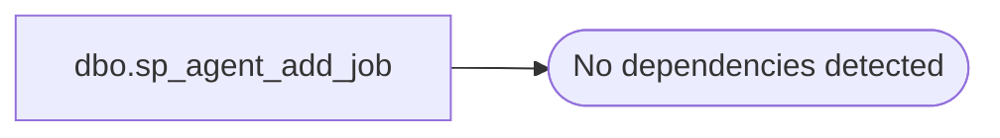

# dbo.sp_agent_add_job

**Database:** msdb  
**Server:** bearcluster01  

## Architecture Diagram



## Table Dependencies

_No table references detected._

## Stored Procedure Code

```sql
CREATE PROCEDURE dbo.sp_agent_add_job 
    @job_name               SYSNAME, 
    @enabled                TINYINT = 1, -- 0 = Disabled, 1 = Enabled 
    @description            NVARCHAR(512) = NULL, 
    @start_step_id          INT = 1, 
    @notify_level_eventlog  INT = 2, -- 0 = Never, 1 = On Success, 2 = On Failure, 3 = Always 
    @delete_level           INT = 0, -- 0 = Never, 1 = On Success, 2 = On Failure, 3 = Always 
    @job_id                 UNIQUEIDENTIFIER = NULL OUTPUT 
AS 
BEGIN 
    DECLARE @retval INT 

    EXEC @retval = sys.sp_sqlagent_add_job @job_name = @job_name, 
        @enabled = @enabled, 
        @description = @description, 
        @start_step_id = @start_step_id, 
        @notify_level_eventlog = @notify_level_eventlog, 
        @delete_level = @delete_level,
        @job_id = @job_id OUTPUT

     RETURN(@retval) -- 0 means success 
END
```

