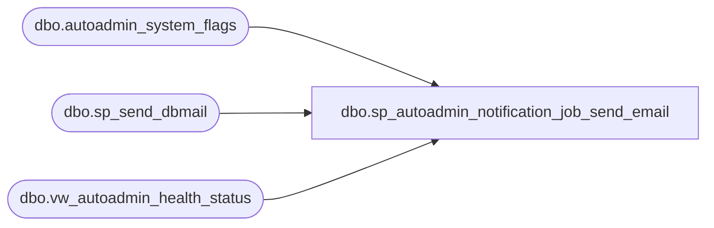

# dbo.sp_autoadmin_notification_job_send_email

**Database:** msdb  
**Server:** bearcluster01  

## Architecture Diagram



## Table Dependencies

| Referenced Table |
|---|
| dbo.autoadmin_system_flags |
| dbo.sp_send_dbmail |
| dbo.vw_autoadmin_health_status |

## Stored Procedure Code

```sql
CREATE PROCEDURE sp_autoadmin_notification_job_send_email
    @profile_name SYSNAME = null  -- If null, default mail profile is used
AS
BEGIN
    DECLARE @tableHTML  NVARCHAR(MAX) ;
    DECLARE @notification_email_ids NVARCHAR(MAX)

    SELECT @notification_email_ids = value
    FROM [msdb].[dbo].[autoadmin_system_flags]
    WHERE name = 'SSMBackup2WANotificationEmailIds'

    IF (@notification_email_ids IS NULL) OR (@notification_email_ids = N'')
    BEGIN
        RAISERROR (45209, 17, 1);
        RETURN
    END

        -- Construct HTML table; $ISSUE - Replace with Weiyun's Query
    SET @tableHTML =
        N'<H1>Smartadmin health check report</H1>' +
        N'<table border="1">' +
        N'<tr><th>Datetime</th>' +
        N'<th>Instance name</th>' +
        N'<th>Storage errors</th>' +
        N'<th>Sql errors</th>' +
        N'<th>Credential errors</th>' +
        N'<th>Other errors</th>' +
        N'<th>Deleted or invalid backup files</th>' +
        N'<th>Number of backup loops</th>' +
        N'<th>Number of retention loops</th></tr>' +
        CAST ( ( select  td = [Datetime],        '',
            td = [Instance name],       '',
            td =  [Storage errors],         '',
            td =  [Sql errors],         '',
            td =  [Credential errors],         '',
            td =  [Other errors],         '',
            td =  [Deleted or invalid backup files] ,  '',
            td =  [Number of backup loops],         '',
            td =  [Number of retention loops],         ''
            FROM msdb.dbo.vw_autoadmin_health_status
            FOR XML PATH('tr'), TYPE 
            ) AS NVARCHAR(MAX) ) +
        N'</table>' ;

    -- $ISSUE - Localize message
    DECLARE @subject NVARCHAR(255)
    SET @subject = 'Smartadmin health check on ' + @@servername + '  at ' + CONVERT(VARCHAR, GETDATE())

    EXEC [msdb].[dbo].[sp_send_dbmail]
            @profile_name = @profile_name,
            @recipients = @notification_email_ids,
            @subject = @subject,
            @body = @tableHTML,
            @body_format = 'HTML' ;

END

dbo,sp_change_monitor_role,CREATE PROCEDURE sp_change_monitor_role
  @primary_server     sysname,
  @secondary_server   sysname,
  @database           sysname,
  @new_source         NVARCHAR (128)
AS BEGIN
  SET NOCOUNT ON

  BEGIN TRANSACTION

  -- drop the secondary
  DELETE FROM msdb.dbo.log_shipping_secondaries 
    WHERE secondary_server_name = @secondary_server AND secondary_database_name = @database

  IF (@@ROWCOUNT <> 1)
  BEGIN
      ROLLBACK TRANSACTION
      RAISERROR (14442,-1,-1)
      return(1)
  END

  -- let everyone know that we are the new primary
  UPDATE msdb.dbo.log_shipping_primaries 
    SET primary_server_name = @secondary_server, primary_database_name = @database, source_directory = @new_source
    WHERE primary_server_name = @primary_server AND primary_database_name = @database

  IF (@@ROWCOUNT <> 1)
  BEGIN
      ROLLBACK TRANSACTION
      RAISERROR (14442,-1,-1)
      return(1)
  END
  COMMIT TRANSACTION

END

dbo,sp_check_for_owned_jobs,CREATE PROCEDURE sp_check_for_owned_jobs
  @login_name sysname,
  @table_name sysname
AS
BEGIN
  SET NOCOUNT ON

  -- This procedure is called by sp_droplogin to check if the login being dropped
  -- still owns jobs.  The return value (the number of jobs owned) is passed back
  -- via the supplied table name [this cumbersome approach is necessary because
  -- sp_check_for_owned_jobs is invoked via an EXEC() and because we always want
  -- sp_droplogin to work, even if msdb and/or sysjobs does not exist].

  IF (EXISTS (SELECT *
              FROM msdb.dbo.sysobjects
              WHERE (name = N'sysjobs')
                AND (type = 'U')))
  BEGIN
    DECLARE @sql NVARCHAR(1024)
    SET @sql = N'INSERT INTO ' + QUOTENAME(@table_name, N'[') + N' SELECT COUNT(*) FROM msdb.dbo.sysjobs WHERE (owner_sid = SUSER_SID(N' + QUOTENAME(@login_name, '''') + ', 0))' --force case insensitive comparation for NT users
    EXEC sp_executesql @statement = @sql  
  END
END

dbo,sp_check_for_owned_jobsteps,CREATE PROCEDURE sp_check_for_owned_jobsteps
  @login_name         sysname = NULL,  -- Supply this OR the database_X parameters, but not both
  @database_name      sysname = NULL,
  @database_user_name sysname = NULL
AS
BEGIN
  DECLARE @db_name            NVARCHAR(128)
  DECLARE @delimited_db_name  NVARCHAR(258)
  DECLARE @escaped_db_name    NVARCHAR(256) -- double sysname
  DECLARE @escaped_login_name NVARCHAR(256) -- double sysname

  SET NOCOUNT ON

  CREATE TABLE #work_table
  (
  database_name      sysname COLLATE database_default,
  database_user_name sysname COLLATE database_default
  )

  IF ((@login_name IS NOT NULL) AND (@database_name IS NULL) AND (@database_user_name IS NULL))
  BEGIN
    IF (SUSER_SID(@login_name, 0) IS NULL)--force case insensitive comparation for NT users
    BEGIN
      DROP TABLE #work_table

      RAISERROR(14262, -1, -1, '@login_name', @login_name)
      RETURN(1) -- Failure
    END

    DECLARE all_databases CURSOR LOCAL
    FOR
    SELECT name
    FROM master.dbo.sysdatabases

    OPEN all_databases
    FETCH NEXT FROM all_databases INTO @db_name

    -- Double up any single quotes in @login_name
    SELECT @escaped_login_name = REPLACE(@login_name, N'''', N'''''')

    WHILE (@@fetch_status = 0)
    BEGIN
      SELECT @delimited_db_name = QUOTENAME(@db_name, N'[')
      SELECT @escaped_db_name = REPLACE(@db_name, '''', '''''')
      EXECUTE(N'INSERT INTO #work_table
                SELECT N''' + @escaped_db_name + N''', name
                FROM ' + @delimited_db_name + N'.dbo.sysusers
                WHERE (sid = SUSER_SID(N''' + @escaped_login_name + N''', 0))')--force case insensitive comparation for NT users
      FETCH NEXT FROM all_databases INTO @db_name
    END

    DEALLOCATE all_databases

    -- If the login is an NT login, check for steps run as the login directly (as is the case with transient NT logins)
    IF (@login_name LIKE '%\%')
    BEGIN
      INSERT INTO #work_table
      SELECT database_name, database_user_name
      FROM msdb.dbo.sysjobsteps
      WHERE (database_user_name = @login_name)
    END
  END

  IF ((@login_name IS NULL) AND (@database_name IS NOT NULL) AND (@database_user_name IS NOT NULL))
  BEGIN
    INSERT INTO #work_table
    SELECT @database_name, @database_user_name
  END

  IF (EXISTS (SELECT *
              FROM #work_table wt,
                   msdb.dbo.sysjobsteps sjs
              WHERE (wt.database_name = sjs.database_name)
                AND (wt.database_user_name = sjs.database_user_name)))
  BEGIN
    SELECT sjv.job_id,
           sjv.name,
           sjs.step_id,
           sjs.step_name
    FROM #work_table           wt,
         msdb.dbo.sysjobsteps  sjs,
         msdb.dbo.sysjobs_view sjv
    WHERE (wt.database_name = sjs.database_name)
      AND (wt.database_user_name = sjs.database_user_name)
      AND (sjv.job_id = sjs.job_id)
    ORDER BY sjs.job_id
  END

  DROP TABLE #work_table
  RETURN(0) -- 0 means success
END
```

