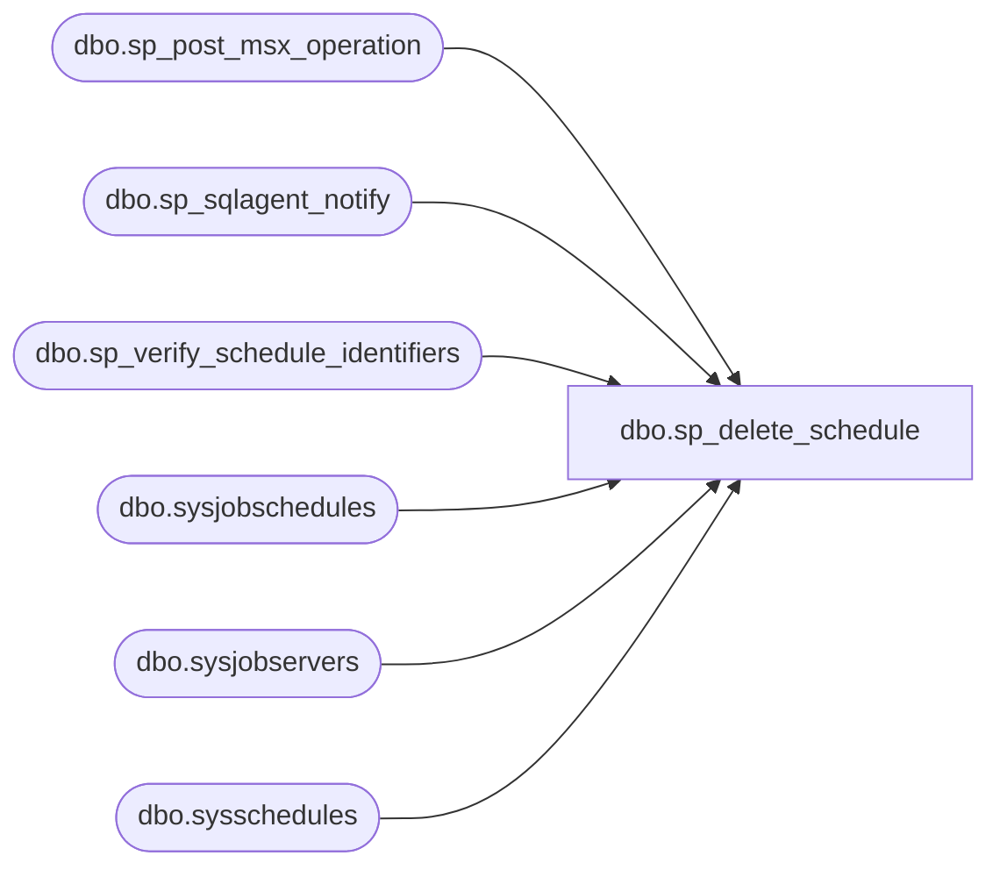

# dbo.sp_delete_schedule

**Database:** msdb  
**Server:** bearcluster01  

## Architecture Diagram



## Table Dependencies

| Referenced Table |
|---|
| dbo.sp_post_msx_operation |
| dbo.sp_sqlagent_notify |
| dbo.sp_verify_schedule_identifiers |
| dbo.sysjobschedules |
| dbo.sysjobservers |
| dbo.sysschedules |

## Stored Procedure Code

```sql
CREATE PROCEDURE sp_delete_schedule
(
  @schedule_id          INT                 = NULL,     -- Must provide either this or schedule_name
  @schedule_name        sysname             = NULL,     -- Must provide either this or schedule_id
  @force_delete         bit                 = 0,
  @automatic_post       BIT                 = 1         -- If 1 will post notifications to all tsx servers to that run this schedule
)   
AS
BEGIN
  DECLARE @retval           INT
  DECLARE @owner_sid        VARBINARY(85)
  DECLARE @job_count        INT
  DECLARE @targ_server_id   INT

  SET NOCOUNT ON
  --Get the owners sid       
  SELECT @job_count = 0

  -- Check that we can uniquely identify the schedule. This only returns a schedule that is visible to this user
  EXECUTE @retval = msdb.dbo.sp_verify_schedule_identifiers @name_of_name_parameter = '@schedule_name',
                                                            @name_of_id_parameter   = '@schedule_id',
                                                            @schedule_name          = @schedule_name    OUTPUT,
                                                            @schedule_id            = @schedule_id      OUTPUT,
                                                            @owner_sid              = @owner_sid        OUTPUT,
                                                            @orig_server_id         = NULL
  IF (@retval <> 0)
    RETURN(1) -- Failure 

  -- Non-sysadmins can only update jobs schedules they own. 
  -- Members of SQLAgentReaderRole and SQLAgentOperatorRole can view job schedules, 
  -- but they should not be able to delete them
  IF ((@owner_sid <> SUSER_SID()) AND
     (ISNULL(IS_SRVROLEMEMBER(N'sysadmin'),0) <> 1))
  BEGIN
   RAISERROR(14394, -1, -1)
   RETURN(1) -- Failure
  END
    
  --check if there are jobs using this schedule
  SELECT @job_count = count(*)
  FROM sysjobschedules 
  WHERE (schedule_id = @schedule_id)   
  
  -- If we aren't force deleting the schedule make sure no jobs are using it
  IF ((@force_delete = 0) AND (@job_count > 0))
  BEGIN 
    RAISERROR(14372, -1, -1)
    RETURN (1) -- Failure 
  END

  -- Get the one of the terget server_id's. 
  -- Getting MIN(jsvr.server_id) works here because we are only interested in this ID
  -- to determine if the schedule ID is for local jobs or MSX jobs. 
  -- Note, an MSX job can't be run on the local server
  SELECT @targ_server_id = MIN(jsvr.server_id)
  FROM msdb.dbo.sysjobschedules AS jsched 
   JOIN msdb.dbo.sysjobservers AS jsvr
      ON jsched.job_id = jsvr.job_id
  WHERE (jsched.schedule_id = @schedule_id)

  --OK to delete the job - schedule link
  DELETE sysjobschedules 
  WHERE schedule_id = @schedule_id

  --OK to delete the schedule 
  DELETE sysschedules 
  WHERE schedule_id = @schedule_id

  -- @targ_server_id would be null if no jobs use this schedule
  IF (@targ_server_id IS NOT NULL)
  BEGIN
   -- Notify SQLServerAgent of the change but only if it the schedule was used by a local job
   IF (@targ_server_id = 0)
   BEGIN 
      -- Only send a notification if the schedule is force deleted. If it isn't force deleted
      -- a notification would have already been sent while detaching the schedule (sp_detach_schedule)
      IF (@force_delete = 1)
      BEGIN
        EXECUTE msdb.dbo.sp_sqlagent_notify @op_type     = N'S',
                                   @schedule_id = @schedule_id,
                                   @action_type = N'D'
      END                   
   END
   ELSE
   BEGIN
    -- Instruct the tsx servers to pick up the altered schedule
    IF (@automatic_post = 1)
    BEGIN
      DECLARE @schedule_uid UNIQUEIDENTIFIER
      SELECT @schedule_uid = schedule_uid 
      FROM sysschedules 
      WHERE schedule_id = @schedule_id

      IF(NOT @schedule_uid IS NULL)
      BEGIN
        -- sp_post_msx_operation will do nothing if the schedule isn't assigned to any tsx machines 
        EXECUTE sp_post_msx_operation @operation = 'INSERT', @object_type = 'SCHEDULE', @schedule_uid = @schedule_uid
      END
    END
    ELSE
      RAISERROR(14547, 0, 1, N'INSERT', N'sp_post_msx_operation')
   END
  END
  
  RETURN(@retval) -- 0 means success
END

dbo,sp_delete_targetserver,CREATE PROCEDURE sp_delete_targetserver
  @server_name        sysname,
  @clear_downloadlist BIT = 1,
  @post_defection     BIT = 1
AS
BEGIN
  DECLARE @server_id INT

  SET NOCOUNT ON

  -- Remove any leading/trailing spaces from parameters
  SELECT @server_name = UPPER(LTRIM(RTRIM(@server_name)))

  -- Check server name
  SELECT @server_id = server_id
  FROM msdb.dbo.systargetservers
  WHERE (UPPER(server_name) = @server_name)

  IF (@server_id IS NULL)
  BEGIN
    RAISERROR(14262, -1, -1, '@server_name', @server_name)
    RETURN(1) -- Failure
  END

  BEGIN TRANSACTION

    IF (@clear_downloadlist = 1)
    BEGIN
      DELETE FROM msdb.dbo.sysdownloadlist
      WHERE (target_server = @server_name)
    END

    IF (@post_defection = 1)
    BEGIN
      -- Post a defect instruction to the server
      -- NOTE: We must do this BEFORE deleting the systargetservers row
      EXECUTE msdb.dbo.sp_post_msx_operation 'DEFECT', 'SERVER', 0x00, @server_name
    END

    DELETE FROM msdb.dbo.systargetservers
    WHERE (server_id = @server_id)

    DELETE FROM msdb.dbo.systargetservergroupmembers
    WHERE (server_id = @server_id)

    DELETE FROM msdb.dbo.sysjobservers
    WHERE (server_id = @server_id)

  COMMIT TRANSACTION

  RETURN(@@error) -- 0 means success
END

dbo,sp_delete_targetservergroup,CREATE PROCEDURE sp_delete_targetservergroup
  @name sysname
AS
BEGIN
  DECLARE @servergroup_id INT

  SET NOCOUNT ON

  -- Only a sysadmin can do this
  IF (ISNULL(IS_SRVROLEMEMBER(N'sysadmin'), 0) <> 1) 
  BEGIN
    RAISERROR(15003, 16, 1, N'sysadmin')
    RETURN(1) -- Failure
  END

  -- Remove any leading/trailing spaces from parameters
  SELECT @name = LTRIM(RTRIM(@name))

  -- Check if the group exists
  SELECT @servergroup_id = servergroup_id
  FROM msdb.dbo.systargetservergroups
  WHERE (name = @name)

  IF (@servergroup_id IS NULL)
  BEGIN
    RAISERROR(14262, -1, -1, '@name', @name)
    RETURN(1) -- Failure
  END

  -- Remove the group members
  DELETE FROM msdb.dbo.systargetservergroupmembers
  WHERE (servergroup_id = @servergroup_id)

  -- Remove the group
  DELETE FROM msdb.dbo.systargetservergroups
  WHERE (name = @name)

  RETURN(@@error) -- 0 means success
END

dbo,sp_delete_targetsvrgrp_member,CREATE PROCEDURE sp_delete_targetsvrgrp_member
  @group_name  sysname,
  @server_name sysname
AS
BEGIN
  DECLARE @servergroup_id INT
  DECLARE @server_id      INT

  SET NOCOUNT ON

  -- Remove any leading/trailing spaces from parameters
  SELECT @group_name = LTRIM(RTRIM(@group_name))
  SELECT @server_name = UPPER(LTRIM(RTRIM(@server_name)))

  -- Check if the group exists
  SELECT @servergroup_id = servergroup_id
  FROM msdb.dbo.systargetservergroups
  WHERE (name = @group_name)

  IF (@servergroup_id IS NULL)
  BEGIN
    RAISERROR(14262, -1, -1, '@group_name', @group_name)
    RETURN(1) -- Failure
  END

  -- Check if the server exists
  SELECT @server_id = server_id
  FROM msdb.dbo.systargetservers
  WHERE (UPPER(server_name) = @server_name)

  IF (@server_id IS NULL)
  BEGIN
    RAISERROR(14262, -1, -1, '@server_name', @server_name)
    RETURN(1) -- Failure
  END

  -- Check if the server is in the group
  IF (NOT EXISTS (SELECT *
                  FROM msdb.dbo.systargetservergroupmembers
                  WHERE (servergroup_id = @servergroup_id)
                    AND (server_id = @server_id)))
  BEGIN
    RAISERROR(14264, -1, -1, @server_name, @group_name)
    RETURN(1) -- Failure
  END

  -- Delete the row from systargetservergroupmembers
  DELETE FROM msdb.dbo.systargetservergroupmembers
  WHERE (servergroup_id = @servergroup_id)
    AND (server_id = @server_id)

  RETURN(@@error) -- 0 means success
END
```

