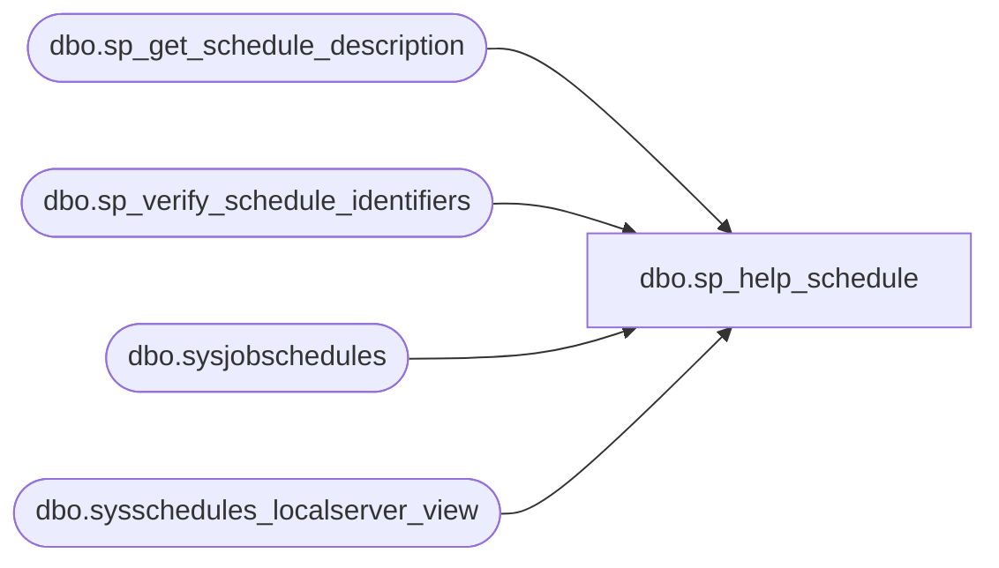

# dbo.sp_help_schedule

**Database:** msdb  
**Server:** bearcluster01  

## Architecture Diagram



## Table Dependencies

| Referenced Table |
|---|
| dbo.sp_get_schedule_description |
| dbo.sp_verify_schedule_identifiers |
| dbo.sysjobschedules |
| dbo.sysschedules_localserver_view |

## Stored Procedure Code

```sql
CREATE PROCEDURE sp_help_schedule
  @schedule_id              INT     = NULL, -- If both @schedule_id and @schedule_name are NULL retreive all schedules 
  @schedule_name            sysname = NULL,
  @attached_schedules_only  BIT     = 0,    -- If 1 only retreive all schedules that are attached to jobs
  @include_description      BIT     = 0     -- 1 if a schedule description is required (NOTE: It's expensive to generate the description)
AS
BEGIN
  DECLARE @retval                 INT
  DECLARE @schedule_description   NVARCHAR(255)
  DECLARE @name                   sysname
  DECLARE @freq_type              INT
  DECLARE @freq_interval          INT
  DECLARE @freq_subday_type       INT
  DECLARE @freq_subday_interval   INT
  DECLARE @freq_relative_interval INT
  DECLARE @freq_recurrence_factor INT
  DECLARE @active_start_date      INT
  DECLARE @active_end_date        INT
  DECLARE @active_start_time      INT
  DECLARE @active_end_time        INT
  DECLARE @schedule_id_as_char    VARCHAR(10)
  
  SET NOCOUNT ON
    
  -- If both @schedule_id and @schedule_name are NULL retreive all schedules (depending on @attached_schedules_only)
  -- otherwise verify the schedule exists
  IF (@schedule_id IS NOT NULL) OR (@schedule_name IS NOT NULL)  
  BEGIN    
    -- Check that we can uniquely identify the schedule
    EXECUTE @retval = msdb.dbo.sp_verify_schedule_identifiers @name_of_name_parameter = '@schedule_name',
                                                              @name_of_id_parameter   = '@schedule_id',
                                                              @schedule_name          = @schedule_name OUTPUT,
                                                              @schedule_id            = @schedule_id   OUTPUT,
                                                              @owner_sid              = NULL,
                                                              @orig_server_id         = NULL
    IF (@retval <> 0)
      RETURN(1) -- Failure
  END


  -- Get the schedule(s) that are attached to a job (or all schs if @attached_schedules_only = 0) into a temporary table
  SELECT schedule_id,
         schedule_uid,
        'schedule_name' = name,
         enabled,
         freq_type,
         freq_interval,
         freq_subday_type,
         freq_subday_interval,
         freq_relative_interval,
         freq_recurrence_factor,
         active_start_date,
         active_end_date,
         active_start_time,
         active_end_time,
         date_created,
        'schedule_description' = FORMATMESSAGE(14549)
  INTO #temp_jobschedule
  FROM msdb.dbo.sysschedules_localserver_view as sch
  WHERE ( (@attached_schedules_only = 0) 
         OR (EXISTS(SELECT * FROM sysjobschedules as jobsch WHERE sch.schedule_id = jobsch.schedule_id)) )
    AND((@schedule_id IS NULL) OR (schedule_id = @schedule_id))

  IF (@include_description = 1)
  BEGIN
    -- For each schedule, generate the textual schedule description and update the temporary
    -- table with it
    IF (EXISTS (SELECT *
                FROM #temp_jobschedule))
    BEGIN
      WHILE (EXISTS (SELECT *
                     FROM #temp_jobschedule
                     WHERE schedule_description = FORMATMESSAGE(14549)))
      BEGIN
        SET ROWCOUNT 1
        SELECT @name                   = schedule_name,
               @freq_type              = freq_type,
               @freq_interval          = freq_interval,
               @freq_subday_type       = freq_subday_type,
               @freq_subday_interval   = freq_subday_interval,
               @freq_relative_interval = freq_relative_interval,
               @freq_recurrence_factor = freq_recurrence_factor,
               @active_start_date      = active_start_date,
               @active_end_date        = active_end_date,
               @active_start_time      = active_start_time,
               @active_end_time        = active_end_time
        FROM #temp_jobschedule
        WHERE (schedule_description = FORMATMESSAGE(14549))
        SET ROWCOUNT 0

        EXECUTE sp_get_schedule_description
          @freq_type,
          @freq_interval,
          @freq_subday_type,
          @freq_subday_interval,
          @freq_relative_interval,
          @freq_recurrence_factor,
          @active_start_date,
          @active_end_date,
          @active_start_time,
          @active_end_time,
          @schedule_description OUTPUT

        UPDATE #temp_jobschedule
        SET schedule_description = ISNULL(LTRIM(RTRIM(@schedule_description)), FORMATMESSAGE(14205))
        WHERE (schedule_name = @name)
      END -- While
    END
  END

  -- Return the result set, adding job count
  SELECT *, (SELECT COUNT(*) FROM sysjobschedules WHERE sysjobschedules.schedule_id = #temp_jobschedule.schedule_id) as 'job_count'
  FROM #temp_jobschedule
  ORDER BY schedule_id

  RETURN(@@error) -- 0 means success
END

dbo,sp_help_targetserver,CREATE PROCEDURE sp_help_targetserver
  @server_name sysname = NULL
AS
BEGIN
  SET NOCOUNT ON

  -- Remove any leading/trailing spaces from parameters
  SELECT @server_name = UPPER(LTRIM(RTRIM(@server_name)))

  IF (@server_name IS NOT NULL)
  BEGIN
    IF (NOT EXISTS (SELECT *
                    FROM msdb.dbo.systargetservers
                    WHERE (UPPER(server_name) = @server_name)))
    BEGIN
      RAISERROR(14262, -1, -1, '@server_name', @server_name)
      RETURN(1) -- Failure
    END
  END

  DECLARE @unread_instructions TABLE
  (
  target_server       sysname COLLATE database_default,
  unread_instructions INT
  )

  INSERT INTO @unread_instructions
  SELECT target_server, COUNT(*)
  FROM msdb.dbo.sysdownloadlist
  WHERE (status = 0)
  GROUP BY target_server

  SELECT sts.server_id,
         sts.server_name,
         sts.location,
         sts.time_zone_adjustment,
         sts.enlist_date,
         sts.last_poll_date,
        'status' = sts.status |
                   CASE WHEN DATEDIFF(ss, sts.last_poll_date, GETDATE()) > (3 * sts.poll_interval) THEN 0x2 ELSE 0 END |
                   CASE WHEN ((SELECT COUNT(*)
                               FROM msdb.dbo.sysdownloadlist sdl
                               WHERE (sdl.target_server = sts.server_name)
                                 AND (sdl.error_message IS NOT NULL)) > 0) THEN 0x4 ELSE 0 END,
        'unread_instructions' = ISNULL(ui.unread_instructions, 0),
        'local_time' = DATEADD(SS, DATEDIFF(SS, sts.last_poll_date, GETDATE()), sts.local_time_at_last_poll),
        sts.enlisted_by_nt_user,
        sts.poll_interval
  FROM msdb.dbo.systargetservers sts LEFT OUTER JOIN
       @unread_instructions      ui  ON (sts.server_name = ui.target_server)
  WHERE ((@server_name IS NULL) OR (UPPER(sts.server_name) = @server_name))
  ORDER BY server_name

  RETURN(@@error) -- 0 means success
END

dbo,sp_help_targetservergroup,CREATE PROCEDURE sp_help_targetservergroup
  @name sysname = NULL
AS
BEGIN
  DECLARE @servergroup_id INT

  SET NOCOUNT ON

  -- Remove any leading/trailing spaces from parameters
  SELECT @name = LTRIM(RTRIM(@name))

  IF (@name IS NULL)
  BEGIN
    -- Show all groups
    SELECT servergroup_id, name
    FROM msdb.dbo.systargetservergroups
    RETURN(@@error) -- 0 means success
  END
  ELSE
  BEGIN
    -- Check if the group exists
    SELECT @servergroup_id = servergroup_id
    FROM msdb.dbo.systargetservergroups
    WHERE (name = @name)

    IF (@servergroup_id IS NULL)
    BEGIN
      RAISERROR(14262, -1, -1, '@name', @name)
      RETURN(1) -- Failure
    END

    -- Return the members of the group
    SELECT sts.server_id,
           sts.server_name
    FROM msdb.dbo.systargetservers sts,
         msdb.dbo.systargetservergroupmembers stsgm
    WHERE (stsgm.servergroup_id = @servergroup_id)
      AND (stsgm.server_id = sts.server_id)

    RETURN(@@error) -- 0 means success
  END
END

dbo,sp_is_sqlagent_starting,CREATE PROCEDURE sp_is_sqlagent_starting
AS
BEGIN
  DECLARE @retval INT

  SELECT @retval = 0
  EXECUTE master.dbo.xp_sqlagent_is_starting @retval OUTPUT
  IF (@retval = 1)
    RAISERROR(14258, -1, -1)

  RETURN(@retval)
END

dbo,sp_isprohibited,-- sp_isprohibited : To test if the attachment is prohibited or not.
--
CREATE PROCEDURE sp_isprohibited
   @attachment nvarchar(max),
   @prohibitedextensions nvarchar(1000)
AS

DECLARE @extensionIndex int
DECLARE @extensionName nvarchar(255)

IF (@attachment IS NOT NULL AND LEN(@attachment) > 0) 
BEGIN
    SET @prohibitedextensions = UPPER(@prohibitedextensions)

   -- find @extensionName: the substring between the last '.' and the end of the string
   SET @extensionIndex = 0
   WHILE (1=1)
   BEGIN
      DECLARE @lastExtensionIndex int
      SET @lastExtensionIndex = CHARINDEX('.', @attachment, @extensionIndex+1)
      IF (@lastExtensionIndex = 0)
         BREAK
      SET @extensionIndex = @lastExtensionIndex
   END

   IF (@extensionIndex > 0)
   BEGIN
      SET @extensionName = SUBSTRING(@attachment, @extensionIndex + 1, (LEN(@attachment) - @extensionIndex)) 
      SET @extensionName = UPPER(@extensionName)

      -- compare @extensionName with each extension in the comma-separated @prohibitedextensions list
      DECLARE @currentExtensionStart int
      DECLARE @currentExtensionEnd int

      SET @currentExtensionStart = 0
      SET @currentExtensionEnd = 0
      WHILE (@currentExtensionEnd < LEN(@prohibitedextensions))
      BEGIN
         SET @currentExtensionEnd = CHARINDEX(',', @prohibitedextensions, @currentExtensionStart)

         IF (@currentExtensionEnd = 0) -- we have reached the last extension of the list, or the list was empty
            SET @currentExtensionEnd = LEN(@prohibitedextensions)+1

         DECLARE @prohibitedExtension nvarchar(1000)
         SET @prohibitedExtension = SUBSTRING(@prohibitedextensions, @currentExtensionStart, @currentExtensionEnd - @currentExtensionStart) 
         SET @prohibitedExtension = RTRIM(LTRIM(@prohibitedExtension))

         IF( @extensionName = @prohibitedExtension )
            RETURN 1

         SET @currentExtensionStart = @currentExtensionEnd + 1
      END
   END

   RETURN 0
END

dbo,sp_jobhistory_row_limiter,CREATE PROCEDURE sp_jobhistory_row_limiter
  @job_id UNIQUEIDENTIFIER
AS
BEGIN
  DECLARE @max_total_rows         INT -- This value comes from the registry (MaxJobHistoryTableRows)
  DECLARE @max_rows_per_job       INT -- This value comes from the registry (MaxJobHistoryRows)
  DECLARE @rows_to_delete         INT
  DECLARE @current_rows           INT
  DECLARE @current_rows_per_job   INT

  SET NOCOUNT ON

  -- Get max-job-history-rows from the registry
  EXECUTE master.dbo.xp_instance_regread N'HKEY_LOCAL_MACHINE',
                                         N'SOFTWARE\Microsoft\MSSQLServer\SQLServerAgent',
                                         N'JobHistoryMaxRows',
                                         @max_total_rows OUTPUT,
                                         N'no_output'

  -- Check if we are limiting sysjobhistory rows
  IF (ISNULL(@max_total_rows, -1) = -1)
    RETURN(0)

  -- Check that max_total_rows is more than 1
  IF (ISNULL(@max_total_rows, 0) < 2)
  BEGIN
    -- It isn't, so set the default to 1000 rows
    SELECT @max_total_rows = 1000
    EXECUTE master.dbo.xp_instance_regwrite N'HKEY_LOCAL_MACHINE',
                                            N'SOFTWARE\Microsoft\MSSQLServer\SQLServerAgent',
                                            N'JobHistoryMaxRows',
                                            N'REG_DWORD',
                                            @max_total_rows
  END

  -- Get the per-job maximum number of rows to keep
  SELECT @max_rows_per_job = 0
  EXECUTE master.dbo.xp_instance_regread N'HKEY_LOCAL_MACHINE',
                                         N'SOFTWARE\Microsoft\MSSQLServer\SQLServerAgent',
                                         N'JobHistoryMaxRowsPerJob',
                                         @max_rows_per_job OUTPUT,
                                         N'no_output'

  -- Check that max_rows_per_job is <= max_total_rows
  IF ((@max_rows_per_job > @max_total_rows) OR (@max_rows_per_job < 1))
  BEGIN
    -- It isn't, so default the rows_per_job to max_total_rows
    SELECT @max_rows_per_job = @max_total_rows
    EXECUTE master.dbo.xp_instance_regwrite N'HKEY_LOCAL_MACHINE',
                                            N'SOFTWARE\Microsoft\MSSQLServer\SQLServerAgent',
                                            N'JobHistoryMaxRowsPerJob',
                                            N'REG_DWORD',
                                            @max_rows_per_job
  END

  BEGIN TRANSACTION

  SELECT @current_rows_per_job = COUNT(*)
  FROM msdb.dbo.sysjobhistory with (TABLOCKX)
  WHERE (job_id = @job_id)

  -- Delete the oldest history row(s) for the job being inserted if the new row has
  -- pushed us over the per-job row limit (MaxJobHistoryRows)
  SELECT @rows_to_delete = @current_rows_per_job - @max_rows_per_job

  IF (@rows_to_delete > 0)
  BEGIN
    WITH RowsToDelete AS (
      SELECT TOP (@rows_to_delete) *
      FROM msdb.dbo.sysjobhistory
      WHERE (job_id = @job_id)
      ORDER BY instance_id
    )
    DELETE FROM RowsToDelete;
  END

  -- Delete the oldest history row(s) if inserting the new row has pushed us over the
  -- global MaxJobHistoryTableRows limit.
  SELECT @current_rows = COUNT(*)
  FROM msdb.dbo.sysjobhistory

  SELECT @rows_to_delete = @current_rows - @max_total_rows

  IF (@rows_to_delete > 0)
  BEGIN
    WITH RowsToDelete AS (
      SELECT TOP (@rows_to_delete) *
      FROM msdb.dbo.sysjobhistory
      ORDER BY instance_id
    )
    DELETE FROM RowsToDelete;
  END

  IF (@@trancount > 0)
    COMMIT TRANSACTION

  RETURN(0) -- Success
END

dbo,sp_log_shipping_get_date_from_file,CREATE PROCEDURE sp_log_shipping_get_date_from_file 
  @db_name sysname,
  @filename NVARCHAR (500),
  @file_date DATETIME OUTPUT
AS
BEGIN
  SET NOCOUNT ON

  DECLARE @tempname NVARCHAR (500)
  IF (LEN (@filename) - (LEN(@db_name) + LEN ('_tlog_')) <= 0)
    RETURN(1) -- filename string isn't long enough
  SELECT @tempname = RIGHT (@filename, LEN (@filename) - (LEN(@db_name) + LEN ('_tlog_')))
  IF (CHARINDEX ('.',@tempname,0) > 0)
    SELECT @tempname = LEFT (@tempname, CHARINDEX ('.',@tempname,0) - 1)
  IF (LEN (@tempname) <>  8 AND LEN (@tempname) <> 12)
    RETURN (1) -- error must be yyyymmddhhmm or yyyymmdd
  IF (ISNUMERIC (@tempname) = 0 OR CHARINDEX ('.',@tempname,0) <> 0 OR CONVERT (FLOAT,SUBSTRING (@tempname, 1,8)) < 1 )
    RETURN (1) -- must be numeric, can't contain any '.' etc
  SELECT @file_date = CONVERT (DATETIME,SUBSTRING (@tempname, 1,8),112)
  IF (LEN (@tempname) = 12)
  BEGIN
    SELECT @file_date = DATEADD (hh, CONVERT (INT, SUBSTRING (@tempname,9,2)),@file_date)
    SELECT @file_date = DATEADD (mi, CONVERT (INT, SUBSTRING (@tempname,11,2)),@file_date)
  END
  RETURN (0) -- success
END

dbo,sp_log_shipping_in_sync,CREATE PROCEDURE sp_log_shipping_in_sync
  @last_updated        DATETIME,
  @compare_with        DATETIME,
  @threshold           INT,
  @outage_start_time   INT,
  @outage_end_time     INT,
  @outage_weekday_mask INT,
  @enabled             BIT = 1,
  @delta               INT = NULL OUTPUT
AS BEGIN
  SET NOCOUNT ON
  DECLARE @cur_time INT

  SELECT @delta = DATEDIFF (mi, @last_updated, @compare_with)
  -- in sync
  IF (@delta <= @threshold)
    RETURN (0) -- in sync

  IF (@enabled = 0) 
    RETURN(0) -- in sync

  IF (@outage_weekday_mask & DATEPART(dw, GETDATE ()) > 0) -- potentially in outage window
  BEGIN
    SELECT @cur_time = DATEPART (hh, GETDATE()) * 10000 +
                       DATEPART (mi, GETDATE()) * 100 + 
                       DATEPART (ss, GETDATE())
     -- outage doesn't span midnight
    IF (@outage_start_time < @outage_end_time)
    BEGIN
      IF (@cur_time >= @outage_start_time AND @cur_time < @outage_end_time)
        RETURN(1) -- in outage
    END
     -- outage does span midnight
   ELSE IF (@outage_start_time > @outage_end_time)
   BEGIN
     IF (@cur_time >= @outage_start_time OR @cur_time < @outage_end_time)
       RETURN(1) -- in outage
   END
  END
  RETURN(-1 ) -- not in outage, not in sync
END
```

