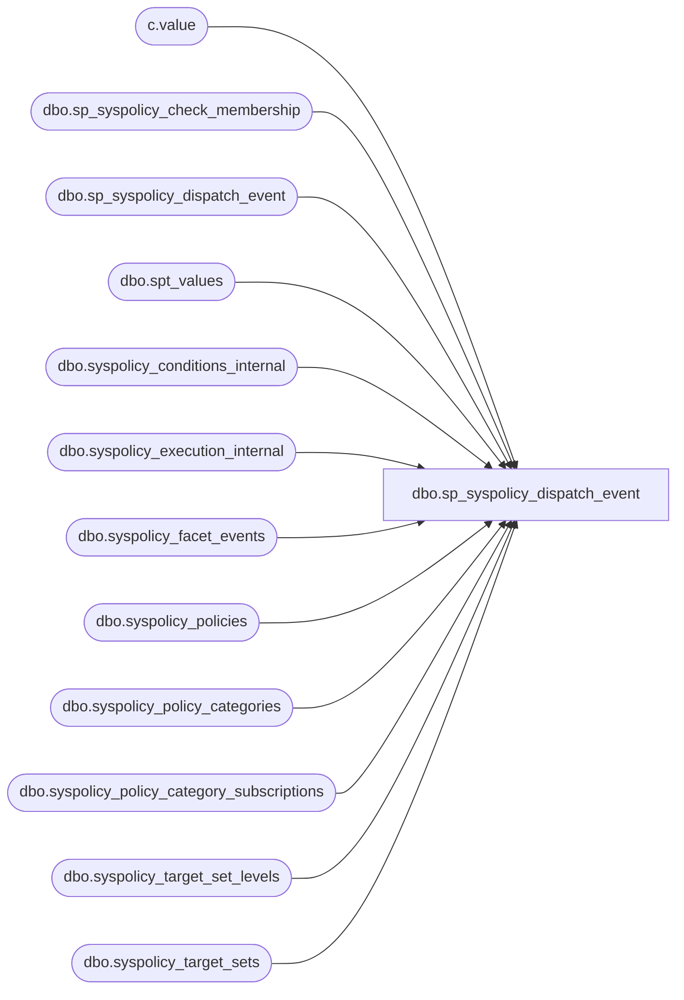

# dbo.sp_syspolicy_dispatch_event

**Database:** msdb  
**Server:** bearcluster01  

## Architecture Diagram



## Table Dependencies

| Referenced Table |
|---|
| c.value |
| dbo.sp_syspolicy_check_membership |
| dbo.sp_syspolicy_dispatch_event |
| dbo.spt_values |
| dbo.syspolicy_conditions_internal |
| dbo.syspolicy_execution_internal |
| dbo.syspolicy_facet_events |
| dbo.syspolicy_policies |
| dbo.syspolicy_policy_categories |
| dbo.syspolicy_policy_category_subscriptions |
| dbo.syspolicy_target_set_levels |
| dbo.syspolicy_target_sets |

## Stored Procedure Code

```sql
-- procedure that processes an event and decides 
-- what binding should handle it
CREATE PROCEDURE [dbo].[sp_syspolicy_dispatch_event]  @event_data xml, @synchronous bit
AS
BEGIN
	-- disable these as the caller may not have SHOWPLAN permission
	SET STATISTICS XML OFF
	SET STATISTICS PROFILE OFF

	DECLARE @retval_check int;
	EXECUTE @retval_check = [dbo].[sp_syspolicy_check_membership] 'PolicyAdministratorRole'
	IF ( 0!= @retval_check)
	BEGIN
		RETURN @retval_check
	END

	IF ( @synchronous = 0)
		PRINT CONVERT(nvarchar(max), @event_data)
	DECLARE @event_type sysname
	DECLARE @object_type sysname
	DECLARE @database sysname
	DECLARE @mode int
	DECLARE @filter_expression nvarchar(4000)
	DECLARE @filter_expression_skeleton nvarchar(4000)

    SET @mode = (case @synchronous when 1 then 1 else 2 end)

    -- These settings are necessary to read XML.
    SET ANSI_NULLS ON
    SET ANSI_PADDING ON
    SET ANSI_WARNINGS ON
    SET ARITHABORT ON
    SET CONCAT_NULL_YIELDS_NULL ON
    SET NUMERIC_ROUNDABORT OFF
    SET QUOTED_IDENTIFIER ON

    SET NOCOUNT ON 

    SELECT 
        @event_type = T.c.value('(EventType/text())[1]', 'sysname')
        , @database = T.c.value('(DatabaseName/text())[1]', 'sysname')
        , @object_type = T.c.value('(ObjectType/text())[1]', 'sysname')
    FROM   @event_data.nodes('/EVENT_INSTANCE') T(c)
    
    -- we are going to ignore events that affect subobjects
    IF  (@event_type = N'ALTER_DATABASE' AND 
        1 = @event_data.exist('EVENT_INSTANCE/AlterDatabaseActionList')) OR
        (@event_type = N'ALTER_TABLE' AND 
        1 = @event_data.exist('EVENT_INSTANCE/AlterTableActionList'))
    BEGIN
        RETURN;
    END

    -- convert trace numerical objecttypes to string
    IF (ISNUMERIC(@object_type) = 1)
        select @object_type = name from master.dbo.spt_values where type = 'EOB' and number = @object_type

    -- these events do not have ObjectType and ObjectName
    IF ((@object_type IS NULL) AND @event_type IN ('CREATE_DATABASE', 'DROP_DATABASE', 'ALTER_DATABASE'))
    BEGIN
        SET @object_type = 'DATABASE'
    END

    INSERT msdb.dbo.syspolicy_execution_internal
        SELECT p.policy_id , @synchronous, @event_data
        FROM dbo.syspolicy_policies p  -- give me all the policies
        INNER JOIN dbo.syspolicy_conditions_internal c ON c.condition_id = p.condition_id  -- and their conditions
        INNER JOIN dbo.syspolicy_facet_events fe ON c.facet_id = fe.management_facet_id  -- and the facet events that are affected by the condition
        INNER JOIN dbo.syspolicy_target_sets ts ON ts.object_set_id = p.object_set_id AND ts.type = fe.target_type  -- and the target sets in the object set of the policy, with event types that are affected by the condition
        LEFT JOIN dbo.syspolicy_policy_category_subscriptions pgs ON pgs.policy_category_id = p.policy_category_id -- and the policy category subscriptions, if any
        LEFT JOIN dbo.syspolicy_target_set_levels tsl ON tsl.target_set_id = ts.target_set_id AND tsl.level_name = 'Database' -- and the database target set levels associated with any of the target sets, if any
        LEFT JOIN dbo.syspolicy_conditions_internal lc ON lc.condition_id = tsl.condition_id -- and any conditions on the target set level, if any
        LEFT JOIN dbo.syspolicy_policy_categories cat ON p.policy_category_id = cat.policy_category_id -- and the policy categories, if any
        WHERE fe.event_name=@event_type AND -- event type matches the fired event
            p.is_enabled = 1 AND -- policy is enabled
            fe.target_type_alias = @object_type AND -- target type matches the object in the event
            ts.enabled = 1 AND -- target set is enabled
            -- 1 means Enforce, 2 means CheckOnChange
            (p.execution_mode & @mode) = @mode AND -- policy mode matches the requested mode
            ((p.policy_category_id IS NULL) OR (cat.mandate_database_subscriptions = 1) OR ( ts.type_skeleton NOT LIKE 'Server/Database%') OR (@database IS NOT NULL AND pgs.target_object = @database)) AND
            ((@database IS NULL) OR 
             (@database IS NOT NULL AND 
              (tsl.condition_id IS NULL OR 
               (tsl.condition_id IS NOT NULL AND 
                ((lc.is_name_condition=1 AND @database = lc.obj_name) OR
                 (lc.is_name_condition=2 AND @database LIKE lc.obj_name) OR
                 (lc.is_name_condition=3 AND @database != lc.obj_name) OR
                 (lc.is_name_condition=4 AND @database NOT LIKE lc.obj_name))
               )
              )
             )
            ) 

    -- NOTE: if we haven't subscribed via an Endpoint facet on those events 
    -- we know for sure they will not be processed by the ServerAreaFacet policies 
    -- because syspolicy_facet_events expects @target_type to be SERVER
    -- so the filter will leave them out, and we are going to generate a fake 
    -- event to make those policies run
    IF( @synchronous = 0 AND 
        (@event_type IN ('ALTER_ENDPOINT', 'CREATE_ENDPOINT', 'DROP_ENDPOINT')))
    BEGIN
        DECLARE @fake_event_data xml
        SET @fake_event_data = CONVERT(xml, '<EVENT_INSTANCE><EventType>SAC_ENDPOINT_CHANGE</EventType><ObjectType>21075</ObjectType><ObjectName/><DatabaseName>master</DatabaseName></EVENT_INSTANCE>')
        
        EXEC [dbo].[sp_syspolicy_dispatch_event]  @event_data = @fake_event_data, @synchronous = 0
    END
            
END              

dbo,sp_syspolicy_events_reader,CREATE PROCEDURE [dbo].[sp_syspolicy_events_reader] 
AS
BEGIN
	DECLARE @retval_check int;
	EXECUTE @retval_check = [dbo].[sp_syspolicy_check_membership] 'PolicyAdministratorRole'
	IF ( 0!= @retval_check)
	BEGIN
		RETURN @retval_check
	END

	DECLARE @dh uniqueidentifier;
	DECLARE @mt sysname;
	DECLARE @body varbinary(max);
	DECLARE @msg nvarchar(max)

    BEGIN TRANSACTION;
    WAITFOR (RECEIVE TOP (1)
        @dh = conversation_handle,
        @mt = message_type_name,
        @body = message_body
        FROM [syspolicy_event_queue]), timeout 5000;
    WHILE (@dh is not null)
    BEGIN
        IF (@mt = N'http://schemas.microsoft.com/SQL/ServiceBroker/Error')
        BEGIN
            -- @body contains the error
            DECLARE @bodyStr nvarchar(max)
            SET @bodyStr = convert(nvarchar(max), @body)
            RAISERROR (34001, 1,1, @bodyStr) with log;
            END CONVERSATION @dh;
        END
        IF (@mt = N'http://schemas.microsoft.com/SQL/ServiceBroker/EndDialog')
        BEGIN
            RAISERROR (34002, 1,1) with log;
            END CONVERSATION @dh;
        END
        IF (@mt = N'http://schemas.microsoft.com/SQL/Notifications/EventNotification')
        BEGIN
            -- process the event
            BEGIN TRY
                EXEC [dbo].[sp_syspolicy_dispatch_event]  @event_data = @body, @synchronous = 0
            END TRY
            BEGIN CATCH
                -- report the error

                DECLARE @errorNumber int
                DECLARE @errorMessage nvarchar(max)
                SET @errorNumber = ERROR_NUMBER()
                SET @errorMessage = ERROR_MESSAGE()

                RAISERROR (34003, 1,1, @errorNumber, @errorMessage ) with log;
            END CATCH
        END
        -- every message is handled in its own transaction
        COMMIT TRANSACTION;
        SELECT @dh = null;
        BEGIN TRANSACTION;
        WAITFOR (RECEIVE TOP (1)
            @dh = conversation_handle,
            @mt = message_type_name,
            @body = message_body
            FROM [syspolicy_event_queue]), TIMEOUT 5000;
    END
    COMMIT;
END

dbo,sp_syspolicy_log_policy_execution_detail,CREATE PROC [dbo].[sp_syspolicy_log_policy_execution_detail] 
 @history_id bigint, 
 @target_query_expression nvarchar(4000), 
 @target_query_expression_with_id nvarchar(4000), 
 @result bit, 
 @result_detail nvarchar(max),
 @exception_message nvarchar(max) = NULL,
 @exception nvarchar(max) = NULL
AS
BEGIN
	DECLARE @retval_check int;
	EXECUTE @retval_check = [dbo].[sp_syspolicy_check_membership] 'PolicyAdministratorRole', 0
	IF ( 0!= @retval_check)
	BEGIN
		RETURN @retval_check
	END
    BEGIN TRANSACTION
    DECLARE @is_valid_entry INT
    -- take an update lock on this table first to prevent deadlock
    SELECT @is_valid_entry = count(*) FROM syspolicy_policy_execution_history_internal
        WITH (UPDLOCK) 
        WHERE history_id = @history_id

    INSERT syspolicy_policy_execution_history_details_internal (
                                history_id, 
                                target_query_expression, 
                                target_query_expression_with_id, 
                                result, 
                                result_detail,
                                exception_message,
                                exception) 
                        VALUES (
                                @history_id, 
                                @target_query_expression, 
                                @target_query_expression_with_id, 
                                @result, 
                                @result_detail,
                                @exception_message,
                                @exception) 
    IF( @@TRANCOUNT > 0)
        COMMIT
END

dbo,sp_syspolicy_log_policy_execution_end,CREATE PROC [dbo].[sp_syspolicy_log_policy_execution_end] 
    @history_id bigint, 
    @result bit,
    @exception_message nvarchar(max) = NULL,
    @exception nvarchar(max) = NULL
AS
BEGIN
	DECLARE @retval_check int;
	EXECUTE @retval_check = [dbo].[sp_syspolicy_check_membership] 'PolicyAdministratorRole', 0
	IF ( 0!= @retval_check)
	BEGIN
		RETURN @retval_check
	END

    UPDATE syspolicy_policy_execution_history_internal 
      SET result = @result,
          end_date = GETDATE(),
          exception_message = @exception_message,
          exception = @exception
      WHERE history_id = @history_id
END

dbo,sp_syspolicy_log_policy_execution_start,CREATE PROC [dbo].[sp_syspolicy_log_policy_execution_start] 
    @policy_id int,
    @is_full_run bit,
    @history_id bigint OUTPUT 
AS
BEGIN
	DECLARE @retval_check int;
	EXECUTE @retval_check = [dbo].[sp_syspolicy_check_membership] 'PolicyAdministratorRole', 0
	IF ( 0!= @retval_check)
	BEGIN
		RETURN @retval_check
	END
    DECLARE @ret int

    SET @history_id = 0

    EXEC @ret = dbo.sp_syspolicy_verify_policy_identifiers NULL, @policy_id
    IF @ret <> 0 RETURN -1

    INSERT syspolicy_policy_execution_history_internal (policy_id, is_full_run) VALUES (@policy_id, @is_full_run) 
    SET @history_id = SCOPE_IDENTITY ()
END

dbo,sp_syspolicy_mark_system,CREATE PROC dbo.sp_syspolicy_mark_system @type sysname, @name sysname=NULL, @object_id int=NULL, @marker bit=NULL 
AS
BEGIN
	-- If @marker IS NULL simple return the state

    DECLARE @retval_check int;
    EXECUTE @retval_check = [dbo].[sp_syspolicy_check_membership] 'PolicyAdministratorRole'
    IF ( 0!= @retval_check)
    BEGIN
        RETURN @retval_check
    END

	DECLARE @retval int
	
	IF (UPPER(@type  collate SQL_Latin1_General_CP1_CS_AS) = N'POLICY')
	BEGIN
	    EXEC @retval = sp_syspolicy_verify_policy_identifiers @name, @object_id OUTPUT
		IF (@retval <> 0)
			RETURN (1)

		IF @marker IS NULL
		BEGIN
			SELECT policy_id, name, is_system FROM syspolicy_policies_internal WHERE policy_id = @object_id
		END
		ELSE
		BEGIN
			UPDATE msdb.dbo.syspolicy_policies_internal
			SET is_system = @marker 
			WHERE policy_id = @object_id
		END
	END
	ELSE IF (UPPER(@type collate SQL_Latin1_General_CP1_CS_AS) = N'CONDITION')
	BEGIN
	    EXEC @retval = sp_syspolicy_verify_condition_identifiers @name, @object_id OUTPUT
		IF (@retval <> 0)
			RETURN (1)

		IF @marker IS NULL
		BEGIN
			SELECT condition_id, name, is_system FROM syspolicy_conditions_internal WHERE condition_id = @object_id
		END
		ELSE
		BEGIN
			UPDATE msdb.dbo.syspolicy_conditions_internal
			SET is_system = @marker 
			WHERE condition_id = @object_id
		END
	END
	ELSE IF (UPPER(@type collate SQL_Latin1_General_CP1_CS_AS) = N'OBJECTSET')
	BEGIN
	    EXEC @retval = sp_syspolicy_verify_object_set_identifiers @name, @object_id OUTPUT
		IF (@retval <> 0)
			RETURN (1)

		IF @marker IS NULL
		BEGIN
			SELECT object_set_id, object_set_name, is_system FROM syspolicy_object_sets_internal WHERE object_set_id = @object_id
		END
		ELSE
		BEGIN
			UPDATE msdb.dbo.syspolicy_object_sets_internal
			SET is_system = @marker 
			WHERE object_set_id = @object_id
		END
	END
    ELSE
    BEGIN
		RAISERROR(14262, -1, -1, '@type', @type)
		RETURN(1) -- Failure
	END
	
    SELECT @retval = @@error
    RETURN(@retval)
END

dbo,sp_syspolicy_purge_health_state,CREATE PROCEDURE [dbo].[sp_syspolicy_purge_health_state]
    @target_tree_root_with_id nvarchar(400) = NULL
AS
BEGIN
	DECLARE @retval_check int;
	EXECUTE @retval_check = [dbo].[sp_syspolicy_check_membership] 'PolicyAdministratorRole';
	IF ( 0!= @retval_check)
	BEGIN
		RETURN @retval_check;
	END
	
	IF (@target_tree_root_with_id IS NULL)
	BEGIN
	    DELETE FROM msdb.dbo.syspolicy_system_health_state_internal;
	END
	ELSE
	BEGIN
	    DECLARE @target_mask nvarchar(801);
	    SET @target_mask = @target_tree_root_with_id;
	    -- we need to escape all the characters that can be part of the 
	    -- LIKE pattern
	    SET @target_mask = REPLACE(@target_mask, '[', '\[');
	    SET @target_mask = REPLACE(@target_mask, ']', '\]');
	    SET @target_mask = REPLACE(@target_mask, '_', '\_');
	    SET @target_mask = REPLACE(@target_mask, '%', '\%');
	    SET @target_mask = @target_mask + '%';
	    DELETE FROM msdb.dbo.syspolicy_system_health_state_internal
	        WHERE target_query_expression_with_id LIKE @target_mask ESCAPE '\';
	END
	
	RETURN 0;
END

dbo,sp_syspolicy_purge_history,CREATE PROCEDURE [dbo].[sp_syspolicy_purge_history] @include_system bit=0
AS
BEGIN
	DECLARE @retval_check int;
	EXECUTE @retval_check = [dbo].[sp_syspolicy_check_membership] 'PolicyAdministratorRole';
	IF ( 0!= @retval_check)
	BEGIN
		RETURN @retval_check;
	END

    DECLARE @retention_interval_in_days_variant sql_variant
    SET @retention_interval_in_days_variant = (SELECT current_value 
                                        FROM msdb.dbo.syspolicy_configuration
                                        WHERE name = N'HistoryRetentionInDays');
                                        
    DECLARE @retention_interval_in_days int;
    SET @retention_interval_in_days = CONVERT(int, @retention_interval_in_days_variant);
    
    IF( @retention_interval_in_days <= 0)
        RETURN 0;
	
	DECLARE @cutoff_date datetime;
	SET @cutoff_date = DATEADD(day, -@retention_interval_in_days, GETDATE());

    -- delete old policy history records
    BEGIN TRANSACTION
    
    DELETE d 
    FROM msdb.dbo.syspolicy_policy_execution_history_details_internal d
    INNER JOIN msdb.dbo.syspolicy_policy_execution_history_internal h ON d.history_id = h.history_id
    INNER JOIN msdb.dbo.syspolicy_policies p ON h.policy_id = p.policy_id
    WHERE h.end_date < @cutoff_date AND (p.is_system = 0 OR p.is_system = @include_system)
    
    DELETE h
    FROM msdb.dbo.syspolicy_policy_execution_history_internal h
    INNER JOIN msdb.dbo.syspolicy_policies p ON h.policy_id = p.policy_id
    WHERE h.end_date < @cutoff_date AND (p.is_system = 0 OR p.is_system = @include_system)
    
    COMMIT TRANSACTION
    
    -- delete policy subscriptions that refer to the nonexistent databases
    DELETE s
    FROM msdb.dbo.syspolicy_policy_category_subscriptions_internal s
    LEFT OUTER JOIN master.sys.databases d ON s.target_object = d.name
    WHERE s.target_type = 'DATABASE' AND d.database_id IS NULL
    
    RETURN 0;
END

dbo,sp_syspolicy_rename_condition,CREATE PROCEDURE [dbo].[sp_syspolicy_rename_condition] 
@name sysname = NULL,
@condition_id int = NULL,
@new_name sysname = NULL
AS
BEGIN
	DECLARE @retval_check int;
	EXECUTE @retval_check = [dbo].[sp_syspolicy_check_membership] 'PolicyAdministratorRole'
	IF ( 0!= @retval_check)
	BEGIN
		RETURN @retval_check
	END

    IF (@new_name IS NULL or LEN(@new_name) = 0)
    BEGIN
      RAISERROR(21263, -1, -1, '@new_name')
      RETURN(1) -- Failure
    END

    DECLARE @retval              INT

    EXEC @retval = sp_syspolicy_verify_condition_identifiers @name, @condition_id OUTPUT
    IF (@retval <> 0)
        RETURN (1)

    UPDATE msdb.[dbo].[syspolicy_conditions_internal] 
    SET name = @new_name
    WHERE condition_id = @condition_id

    SELECT @retval = @@error
    RETURN(@retval)
END

dbo,sp_syspolicy_rename_policy,CREATE PROCEDURE [dbo].[sp_syspolicy_rename_policy] 
@name sysname = NULL,
@policy_id int = NULL,
@new_name sysname = NULL
AS
BEGIN
	DECLARE @retval_check int;
	EXECUTE @retval_check = [dbo].[sp_syspolicy_check_membership] 'PolicyAdministratorRole'
	IF ( 0!= @retval_check)
	BEGIN
		RETURN @retval_check
	END

    IF (@new_name IS NULL or LEN(@new_name) = 0)
    BEGIN
      RAISERROR(21263, -1, -1, '@new_name')
      RETURN(1) -- Failure
    END

    DECLARE @retval              INT

    EXEC @retval = sp_syspolicy_verify_policy_identifiers @name, @policy_id OUTPUT
    IF (@retval <> 0)
        RETURN (1)

    UPDATE msdb.[dbo].[syspolicy_policies_internal] 
    SET name = @new_name
    WHERE policy_id = @policy_id

    SELECT @retval = @@error
    RETURN(@retval)
END

dbo,sp_syspolicy_rename_policy_category,CREATE PROCEDURE [dbo].[sp_syspolicy_rename_policy_category] 
@name sysname = NULL,
@policy_category_id int = NULL,
@new_name sysname = NULL
AS
BEGIN
	DECLARE @retval_check int;
	EXECUTE @retval_check = [dbo].[sp_syspolicy_check_membership] 'PolicyAdministratorRole'
	IF ( 0!= @retval_check)
	BEGIN
		RETURN @retval_check
	END

    IF (@new_name IS NULL or LEN(@new_name) = 0)
    BEGIN
      RAISERROR(21263, -1, -1, '@new_name')
      RETURN(1) -- Failure
    END

    DECLARE @retval              INT

    EXEC @retval = sp_syspolicy_verify_policy_category_identifiers @name, @policy_category_id OUTPUT
    IF (@retval <> 0)
        RETURN (1)

    UPDATE msdb.[dbo].[syspolicy_policy_categories_internal ]
    SET name = @new_name
    WHERE policy_category_id = @policy_category_id

    SELECT @retval = @@error
    RETURN(@retval)
END

dbo,sp_syspolicy_repair_policy_automation,CREATE PROCEDURE [dbo].[sp_syspolicy_repair_policy_automation]
AS
BEGIN
	DECLARE @retval_check int;
	EXECUTE @retval_check = [dbo].[sp_syspolicy_check_membership] 'PolicyAdministratorRole';
	IF ( 0!= @retval_check)
	BEGIN
		RETURN @retval_check;
	END

    BEGIN TRANSACTION;

    BEGIN TRY
        SET NOCOUNT ON
        
        DECLARE @policies_copy TABLE (
                            policy_id int ,
                            name sysname NOT NULL,
                            condition_id int NOT NULL,
                            root_condition_id int NULL,
                            execution_mode int NOT NULL,
                            policy_category_id int NULL,
                            schedule_uid uniqueidentifier NULL,
                            description nvarchar(max) NOT NULL ,
                            help_text nvarchar(4000) NOT NULL ,
                            help_link nvarchar(2083) NOT NULL ,
                            object_set_id INT NULL,
                            is_enabled bit NOT NULL,
                           	is_system bit NOT NULL);

        INSERT INTO @policies_copy 
            SELECT          policy_id,
                            name, 
                            condition_id, 
                            root_condition_id, 
                            execution_mode, 
                            policy_category_id, 
                            schedule_uid, 
                            description,
                            help_text,
                            help_link,
                            object_set_id,
                            is_enabled,
                            is_system
            FROM msdb.dbo.syspolicy_policies_internal;
        
        DELETE FROM syspolicy_policies_internal;
        
        SET IDENTITY_INSERT msdb.dbo.syspolicy_policies_internal ON
        INSERT INTO msdb.dbo.syspolicy_policies_internal (
                            policy_id,
                            name, 
                            condition_id, 
                            root_condition_id, 
                            execution_mode, 
                            policy_category_id, 
                            schedule_uid, 
                            description,
                            help_text,
                            help_link,
                            object_set_id,
                            is_enabled,
                            is_system)
            SELECT 
                            policy_id,
                            name, 
                            condition_id, 
                            root_condition_id, 
                            execution_mode, 
                            policy_category_id, 
                            schedule_uid, 
                            description,
                            help_text,
                            help_link,
                            object_set_id,
                            is_enabled,
                            is_system
            FROM @policies_copy;
            
        SET IDENTITY_INSERT msdb.dbo.syspolicy_policies_internal OFF;
        
        SET NOCOUNT OFF;
    END TRY
    BEGIN CATCH
        ROLLBACK TRANSACTION;
        RAISERROR (14351, -1, -1);
        RETURN 1;
    END CATCH

    -- commit the transaction we started
    COMMIT TRANSACTION;
    
END

dbo,sp_syspolicy_set_config_enabled,CREATE PROCEDURE [dbo].[sp_syspolicy_set_config_enabled] 
	@value sql_variant
AS
BEGIN
	DECLARE @retval_check int;
	
	SET NOCOUNT ON
	
	EXECUTE @retval_check = [dbo].[sp_syspolicy_check_membership] 'PolicyAdministratorRole'
	IF ( 0!= @retval_check)
	BEGIN
		RETURN @retval_check
	END
    
    DECLARE @val bit;
    SET @val = CONVERT(bit, @value);
    IF (@val = 1)
    BEGIN
	    DECLARE @engine_edition INT
		SELECT @engine_edition = CAST(SERVERPROPERTY('EngineEdition') AS INT)
		IF @engine_edition = 4 -- All SQL Express types + embedded
		BEGIN
			RAISERROR (34054, 16, 1)			
            RETURN 34054
		END
		
	    UPDATE [msdb].[dbo].[syspolicy_configuration_internal]
	    SET current_value = @value
	    WHERE name = N'Enabled';
    
        -- enable policy automation
        ALTER QUEUE [syspolicy_event_queue] WITH ACTIVATION (STATUS = ON)

        EXEC sys.sp_syspolicy_update_ddl_trigger;
        EXEC sys.sp_syspolicy_update_event_notification;
    END
    ELSE
    BEGIN
	    UPDATE [msdb].[dbo].[syspolicy_configuration_internal]
	    SET current_value = @value
	    WHERE name = N'Enabled';

        -- disable policy automation
        ALTER QUEUE [syspolicy_event_queue] WITH ACTIVATION (STATUS = OFF)

        IF EXISTS (SELECT * FROM sys.server_event_notifications WHERE name = N'syspolicy_event_notification')
	        DROP EVENT NOTIFICATION [syspolicy_event_notification] ON SERVER 

        IF EXISTS (SELECT * FROM sys.server_triggers WHERE name = N'syspolicy_server_trigger')
            DISABLE TRIGGER [syspolicy_server_trigger] ON ALL SERVER 
    END

END

dbo,sp_syspolicy_set_config_history_retention,CREATE PROCEDURE [dbo].[sp_syspolicy_set_config_history_retention] 
	@value sql_variant
AS
BEGIN
	DECLARE @retval_check int;
	EXECUTE @retval_check = [dbo].[sp_syspolicy_check_membership] 'PolicyAdministratorRole'
	IF ( 0!= @retval_check)
	BEGIN
		RETURN @retval_check
	END

    UPDATE [msdb].[dbo].[syspolicy_configuration_internal]
        SET current_value = @value
        WHERE name = N'HistoryRetentionInDays';
    
END

dbo,sp_syspolicy_set_log_on_success,CREATE PROCEDURE [dbo].[sp_syspolicy_set_log_on_success] 
	@value sql_variant
AS
BEGIN
	DECLARE @retval_check int;
	EXECUTE @retval_check = [dbo].[sp_syspolicy_check_membership] 'PolicyAdministratorRole'
	IF ( 0!= @retval_check)
	BEGIN
		RETURN @retval_check
	END

    UPDATE [msdb].[dbo].[syspolicy_configuration_internal]
        SET current_value = @value
        WHERE name = N'LogOnSuccess';
    
END

dbo,sp_syspolicy_update_condition,CREATE PROCEDURE [dbo].[sp_syspolicy_update_condition] 
@name sysname = NULL,
@condition_id int = NULL,
@facet nvarchar(max) = NULL,
@expression nvarchar(max) = NULL,
@description nvarchar(max) = NULL,
@is_name_condition smallint = NULL,
@obj_name sysname = NULL
AS
BEGIN
	DECLARE @retval_check int;
	EXECUTE @retval_check = [dbo].[sp_syspolicy_check_membership] 'PolicyAdministratorRole'
	IF ( 0!= @retval_check)
	BEGIN
		RETURN @retval_check
	END

	DECLARE @retval              INT
	DECLARE @facet_id            INT

    EXEC @retval = msdb.dbo.sp_syspolicy_verify_condition_identifiers @name, @condition_id OUTPUT
    IF (@retval <> 0)
        RETURN (1)

    IF (@facet IS NOT NULL)
    BEGIN
        SET @facet_id = (SELECT management_facet_id FROM [dbo].[syspolicy_management_facets] WHERE name = @facet)
        IF (@facet_id IS NULL)
        BEGIN
            RAISERROR (34014, -1, -1)
            RETURN(1)
        END
    END

    UPDATE msdb.[dbo].[syspolicy_conditions_internal] 
    SET
        description = ISNULL(@description, description),
        facet_id = ISNULL(@facet_id, facet_id),
        expression = ISNULL(@expression, expression),
        is_name_condition = ISNULL(@is_name_condition, is_name_condition),
        obj_name = ISNULL(@obj_name, obj_name)
    WHERE condition_id = @condition_id
END

dbo,sp_syspolicy_update_policy,CREATE PROCEDURE [dbo].[sp_syspolicy_update_policy] 
@name sysname = NULL,
@policy_id int = NULL,
@condition_id int=NULL,
@condition_name sysname = NULL,
@execution_mode int=NULL,
@policy_category sysname = NULL,
@schedule_uid uniqueidentifier = NULL,
@description nvarchar(max) = NULL,
@help_text nvarchar(4000) = NULL,
@help_link nvarchar(2083) = NULL,
@root_condition_id int = -1,
@root_condition_name sysname = NULL,
@object_set_id int = -1,
@object_set sysname = NULL,
@is_enabled bit = NULL
WITH EXECUTE AS OWNER
AS
BEGIN
	DECLARE @retval_check int;
	EXECUTE @retval_check = [dbo].[sp_syspolicy_check_membership] 'PolicyAdministratorRole'
	IF ( 0!= @retval_check)
	BEGIN
		RETURN @retval_check
	END

	--Check for the execution mode value
	IF (((@execution_mode IS NOT NULL)) AND (@execution_mode NOT IN (0,1,2,4,5,6)))
	BEGIN 
		RAISERROR(34004, -1, -1, @execution_mode)
		RETURN (1)
	END

    -- Turn [nullable] empty string parameters into NULLs
    IF @name = ''           SELECT @name = NULL
    IF @condition_name = '' SELECT @condition_name = NULL
    IF @root_condition_name = '' 
        BEGIN
        SELECT @root_condition_name = NULL
        IF @root_condition_id = -1
            -- root_condition is being reset
            SELECT @root_condition_id = NULL
        END
    IF @object_set = '' 
        BEGIN
        SELECT @object_set = NULL
        IF @object_set_id = -1
            -- object_set is being reset
            SELECT @object_set_id = NULL
        END

    DECLARE @retval              INT

    EXEC @retval = msdb.dbo.sp_syspolicy_verify_policy_identifiers @name, @policy_id OUTPUT
    IF (@retval <> 0)
        RETURN (1)

    SELECT  @execution_mode = ISNULL(@execution_mode, execution_mode),
            @is_enabled = ISNULL(@is_enabled, is_enabled) 
        FROM msdb.dbo.syspolicy_policies WHERE policy_id = @policy_id

    IF(@condition_id IS NOT NULL or @condition_name IS NOT NULL)
    BEGIN
        EXEC @retval = msdb.dbo.sp_syspolicy_verify_condition_identifiers @condition_name = @condition_name OUTPUT, @condition_id = @condition_id OUTPUT
        IF (@retval <> 0)
            RETURN (1)
    END

    IF((@root_condition_id IS NOT NULL and @root_condition_id != -1) or @root_condition_name IS NOT NULL)
    BEGIN
        IF (@root_condition_id = -1 and @root_condition_name IS NOT NULL)
            SET @root_condition_id = NULL
        EXEC @retval = msdb.dbo.sp_syspolicy_verify_condition_identifiers @condition_name = @root_condition_name OUTPUT, @condition_id = @root_condition_id OUTPUT
        IF (@retval <> 0)
            RETURN (1)
    END

    SET @schedule_uid = ISNULL (@schedule_uid, '{00000000-0000-0000-0000-000000000000}')

    IF (@schedule_uid = '{00000000-0000-0000-0000-000000000000}' AND (@execution_mode & 4) = 4)
    BEGIN
        RAISERROR (34011, -1, -1, 'schedule_uid', 4)
        RETURN(1)
    END

    IF (@is_enabled = 1 AND @execution_mode = 0)
    BEGIN
        RAISERROR (34011, -1, -1, 'is_enabled', @execution_mode)
        RETURN(1)
    END

    IF (@schedule_uid != '{00000000-0000-0000-0000-000000000000}')
    BEGIN
        -- verify the schedule exists
        IF NOT EXISTS (SELECT schedule_id FROM msdb.dbo.sysschedules WHERE schedule_uid = @schedule_uid)
        BEGIN
            RAISERROR (14365, -1, -1)
            RETURN(1)
        END
    END

    DECLARE @object_set_facet_id INT
    IF ((@object_set_id IS NOT NULL and @object_set_id != -1) or @object_set IS NOT NULL)
    BEGIN
        IF (@object_set_id = -1 and @object_set IS NOT NULL)
            SET @object_set_id = NULL
        EXEC @retval = msdb.dbo.sp_syspolicy_verify_object_set_identifiers @name = @object_set OUTPUT, @object_set_id = @object_set_id OUTPUT
        IF (@retval <> 0)
            RETURN (1)

        SELECT @object_set_facet_id = facet_id FROM msdb.dbo.syspolicy_object_sets WHERE object_set_name = @object_set
        -- Ensure the object set has been created from the same facet that the policy condition has been created
        IF (@object_set_facet_id <> (SELECT facet_id FROM msdb.dbo.syspolicy_conditions_internal WHERE condition_id = @condition_id))
        BEGIN
            -- TODO: RAISEERROR that specified object_set isn't created from the facet that the policy condition has been created from
            RAISERROR(N'specified object set does not match facet the policy condition was created off', -1, -1)
            RETURN(1) -- Failure
        END
    END

    DECLARE @policy_category_id INT
    SET @policy_category_id = NULL
    BEGIN TRANSACTION 

    DECLARE @old_policy_category_id INT
    SELECT @old_policy_category_id = policy_category_id 
        FROM syspolicy_policies 
        WHERE policy_id = @policy_id 

    IF ( (@policy_category IS NOT NULL and @policy_category != '') )
    BEGIN
        IF NOT EXISTS (SELECT * from syspolicy_policy_categories WHERE name = @policy_category)
        BEGIN
            RAISERROR(34015, -1, -1,@policy_category)
            RETURN(1) -- Failure
        END
        ELSE
            SELECT @policy_category_id = policy_category_id FROM msdb.dbo.syspolicy_policy_categories WHERE name = @policy_category
    END

        -- If the caller gave us an empty string for the
        -- @policy_category, then that means to remove the group.
    DECLARE @new_policy_category_id INT
        SELECT  @new_policy_category_id = @old_policy_category_id
    IF ( (@policy_category = '') )
                SELECT @new_policy_category_id = NULL
    ELSE IF (@policy_category_id IS NOT NULL)
                SELECT @new_policy_category_id = @policy_category_id

    UPDATE msdb.dbo.syspolicy_policies_internal
    SET 
        condition_id = ISNULL(@condition_id, condition_id),
        root_condition_id = CASE @root_condition_id WHEN -1 THEN root_condition_id ELSE @root_condition_id END,
        execution_mode = ISNULL(@execution_mode, execution_mode ),
        schedule_uid = @schedule_uid,
        policy_category_id = @new_policy_category_id, 
        description = ISNULL(@description, description),
        help_text = ISNULL(@help_text, help_text),
        help_link = ISNULL(@help_link, help_link),
        is_enabled = ISNULL(@is_enabled, is_enabled),
        object_set_id = CASE @object_set_id WHEN -1 THEN object_set_id ELSE @object_set_id END
    WHERE policy_id = @policy_id

    COMMIT TRANSACTION
    RETURN (0)
END

dbo,sp_syspolicy_update_policy_category,CREATE PROCEDURE [dbo].[sp_syspolicy_update_policy_category] 
@name sysname = NULL,
@policy_category_id int = NULL,
@mandate_database_subscriptions bit = NULL
AS
BEGIN
	DECLARE @retval_check int;
	EXECUTE @retval_check = [dbo].[sp_syspolicy_check_membership] 'PolicyAdministratorRole'
	IF ( 0!= @retval_check)
	BEGIN
		RETURN @retval_check
	END

    DECLARE @retval              INT

    EXEC @retval = sp_syspolicy_verify_policy_category_identifiers @name, @policy_category_id OUTPUT
    IF (@retval <> 0)
        RETURN (1)

    UPDATE msdb.[dbo].[syspolicy_policy_categories_internal ]
    SET mandate_database_subscriptions = ISNULL(@mandate_database_subscriptions, mandate_database_subscriptions)
    WHERE policy_category_id = @policy_category_id

    SELECT @retval = @@error
    RETURN(@retval)
END

dbo,sp_syspolicy_update_policy_category_subscription,CREATE PROCEDURE [dbo].[sp_syspolicy_update_policy_category_subscription] 
@policy_category_subscription_id int,
@target_type sysname = NULL,
@target_object sysname = NULL,
@policy_category sysname = NULL
AS
BEGIN
	DECLARE @retval_check int;
	EXECUTE @retval_check = [dbo].[sp_syspolicy_check_membership] 'PolicyAdministratorRole'
	IF ( 0!= @retval_check)
	BEGIN
		RETURN @retval_check
	END

	-- Turn [nullable] empty string parameters into NULLs
	IF @target_type = ''      SELECT @target_type = NULL
	IF @target_object = ''    SELECT @target_object = NULL
	IF @policy_category = ''  SELECT @policy_category = NULL

    IF(@target_type IS NOT NULL)
	BEGIN
		IF(LOWER(@target_type) <> 'database')
		BEGIN
			RAISERROR(34018,-1,-1,@target_type);
			RETURN(1)
		END
	END
	
	IF(@target_object IS NOT NULL AND NOT EXISTS(SELECT * FROM sys.databases WHERE name=@target_object))
	BEGIN
		RAISERROR(34019,-1,-1,@target_object);
		RETURN(1)
	END

    DECLARE @policy_category_id INT
    SET @policy_category_id = NULL
    BEGIN TRANSACTION 

    DECLARE @old_policy_category_id INT
    SET @old_policy_category_id = NULL

    IF ( (@policy_category IS NOT NULL) )
    BEGIN 
        IF NOT EXISTS (SELECT * from syspolicy_policy_categories WHERE name = @policy_category)
        BEGIN
            -- add a new policy category
            INSERT INTO syspolicy_policy_categories_internal(name) VALUES (@policy_category)
            SELECT @policy_category_id = SCOPE_IDENTITY()

            SELECT @old_policy_category_id = policy_category_id 
                FROM syspolicy_policy_category_subscriptions 
                WHERE policy_category_subscription_id = @policy_category_subscription_id 
        END
        ELSE
            SELECT @policy_category_id = policy_category_id FROM syspolicy_policy_categories WHERE name = @policy_category
    END
    
    DECLARE @group_usage_count INT
    SELECT @group_usage_count = COUNT(*) 
        FROM syspolicy_policy_category_subscriptions  
        WHERE policy_category_id = @old_policy_category_id

    SELECT @group_usage_count = @group_usage_count + COUNT(*) 
        FROM syspolicy_policies  
        WHERE policy_category_id = @old_policy_category_id

    UPDATE msdb.[dbo].[syspolicy_policy_category_subscriptions_internal] 
        SET
            target_type            = ISNULL(@target_type, target_type),
            target_object       = ISNULL(@target_object, target_object),
            policy_category_id        = ISNULL(@policy_category_id, policy_category_id)
        WHERE policy_category_subscription_id = @policy_category_subscription_id

    IF (@@ROWCOUNT = 0)
    BEGIN
        DECLARE @policy_category_subscription_id_as_char VARCHAR(36)
        SELECT @policy_category_subscription_id_as_char = CONVERT(VARCHAR(36), @policy_category_subscription_id)
        RAISERROR(14262, -1, -1, '@policy_category_subscription_id', @policy_category_subscription_id_as_char)
        ROLLBACK TRANSACTION
        RETURN(1) -- Failure
    END

    -- delete the old entry if it was used only by this policy
    DELETE syspolicy_policy_categories_internal WHERE 
        policy_category_id = @old_policy_category_id
        AND 1 = @group_usage_count

    COMMIT TRANSACTION
    RETURN (0)
END

dbo,sp_syspolicy_update_target_set,CREATE PROCEDURE [dbo].[sp_syspolicy_update_target_set]
@target_set_id int,
@enabled bit
AS
BEGIN
	DECLARE @retval_check int;
	EXECUTE @retval_check = [dbo].[sp_syspolicy_check_membership] 'PolicyAdministratorRole'
	IF ( 0!= @retval_check)
	BEGIN
		RETURN @retval_check
	END

	UPDATE [msdb].[dbo].[syspolicy_target_sets_internal]
	SET
		enabled = @enabled
	WHERE
		target_set_id = @target_set_id
	
	IF (@@ROWCOUNT = 0)
	BEGIN
		DECLARE @target_set_id_as_char VARCHAR(36)
		SELECT @target_set_id_as_char = CONVERT(VARCHAR(36), @target_set_id)
		RAISERROR(14262, -1, -1, '@target_set_id', @target_set_id_as_char)
		RETURN (1)
	END

    RETURN (0)
END

dbo,sp_syspolicy_update_target_set_level,CREATE PROCEDURE [dbo].[sp_syspolicy_update_target_set_level] 
@target_set_id int,
@type_skeleton nvarchar(max),
@condition_id int = NULL,
@condition_name sysname = NULL
AS
BEGIN
	DECLARE @retval_check int;
	EXECUTE @retval_check = [dbo].[sp_syspolicy_check_membership] 'PolicyAdministratorRole'
	IF ( 0!= @retval_check)
	BEGIN
		RETURN @retval_check
	END

	DECLARE @retval int

    IF @condition_name = '' SET @condition_name = NULL

    IF(@condition_id IS NOT NULL or @condition_name IS NOT NULL)
    BEGIN
        EXEC @retval = msdb.dbo.sp_syspolicy_verify_condition_identifiers @condition_name = @condition_name OUTPUT, @condition_id = @condition_id OUTPUT
        IF (@retval <> 0)
            RETURN (1)
    END

    UPDATE msdb.[dbo].[syspolicy_target_set_levels_internal] 
        SET condition_id = @condition_id
        WHERE target_set_id = @target_set_id AND type_skeleton = @type_skeleton
    
    IF (@@ROWCOUNT = 0)
    BEGIN
        DECLARE @id nvarchar(max)
        SET @id = '@target_set_id='+LTRIM(STR(@target_set_id))+' @type_skeleton='''+@type_skeleton+''''
        RAISERROR(14262, -1, -1, 'Target Set Level', @id)
        RETURN (1)
    END

    RETURN (0)
END

dbo,sp_syspolicy_verify_condition_identifiers,-----------------------------------------------------------
-- This procedure verifies if a condition exists
-- The caller can pass either the condition name or the id
-----------------------------------------------------------
CREATE PROCEDURE [dbo].[sp_syspolicy_verify_condition_identifiers]
@condition_name sysname = NULL OUTPUT, 
@condition_id int = NULL OUTPUT
AS
BEGIN
	DECLARE @retval_check int;
	EXECUTE @retval_check = [dbo].[sp_syspolicy_check_membership] 'PolicyAdministratorRole'
	IF ( 0!= @retval_check)
	BEGIN
		RETURN @retval_check
	END

  IF ((@condition_name IS NULL)     AND (@condition_id IS NULL)) OR
     ((@condition_name IS NOT NULL) AND (@condition_id IS NOT NULL))
  BEGIN
    RAISERROR(14524, -1, -1, '@condition_name', '@condition_id')
    RETURN(1) -- Failure
  END

  -- Check id
  IF (@condition_id IS NOT NULL)
  BEGIN
    SELECT @condition_name = name
    FROM msdb.dbo.syspolicy_conditions
    WHERE (condition_id = @condition_id)
    
    -- the view would take care of all the permissions issues.
    IF (@condition_name IS NULL) 
    BEGIN
      DECLARE @condition_id_as_char VARCHAR(36)
      SELECT @condition_id_as_char = CONVERT(VARCHAR(36), @condition_id)
      RAISERROR(14262, -1, -1, '@condition_id', @condition_id_as_char)
      RETURN(1) -- Failure
    END
  END
  ELSE
  -- Check name
  IF (@condition_name IS NOT NULL)
  BEGIN
    -- get the corresponding condition_id (if the condition exists)
    SELECT @condition_id = condition_id
    FROM msdb.dbo.syspolicy_conditions
    WHERE (name = @condition_name)
    
    -- the view would take care of all the permissions issues.
    IF (@condition_id IS NULL) 
    BEGIN
      RAISERROR(14262, -1, -1, '@condition_name', @condition_name)
      RETURN(1) -- Failure
    END
  END

  RETURN (0)
END

dbo,sp_syspolicy_verify_object_set_identifiers,CREATE PROCEDURE [dbo].[sp_syspolicy_verify_object_set_identifiers]
@name sysname = NULL OUTPUT, 
@object_set_id int = NULL OUTPUT
AS
BEGIN
	DECLARE @retval_check int;
	EXECUTE @retval_check = [dbo].[sp_syspolicy_check_membership] 'PolicyAdministratorRole'
	IF ( 0!= @retval_check)
	BEGIN
		RETURN @retval_check
	END

  IF ((@name IS NULL)     AND (@object_set_id IS NULL)) OR
     ((@name IS NOT NULL) AND (@object_set_id IS NOT NULL))
  BEGIN
    -- TODO: Verify the error message is appropriate for object sets as well and not specific to policies
    RAISERROR(14524, -1, -1, '@name', '@object_set_id')
    RETURN(1) -- Failure
  END

  -- Check id
  IF (@object_set_id IS NOT NULL)
  BEGIN
    SELECT @name = object_set_name
    FROM msdb.dbo.syspolicy_object_sets
    WHERE (object_set_id = @object_set_id)
    
    -- the view would take care of all the permissions issues.
    IF (@name IS NULL) 
    BEGIN
        -- TODO: Where did 36 come from? Is this the total lenght of characters for an int?
      DECLARE @object_set_id_as_char VARCHAR(36)
      SELECT @object_set_id_as_char = CONVERT(VARCHAR(36), @object_set_id)
      RAISERROR(14262, -1, -1, '@object_set_id', @object_set_id_as_char)
      RETURN(1) -- Failure
    END
  END
  ELSE
  -- Check name
  IF (@name IS NOT NULL)
  BEGIN
    -- get the corresponding object_set_id (if the object_set exists)
    SELECT @object_set_id = object_set_id
    FROM msdb.dbo.syspolicy_object_sets
    WHERE (object_set_name = @name)
    
    -- the view would take care of all the permissions issues.
    IF (@object_set_id IS NULL) 
    BEGIN
    -- TODO: Verify the error message is appropriate for object sets as well and not specific to policies
      RAISERROR(14262, -1, -1, '@name', @name)
      RETURN(1) -- Failure
    END
  END

  RETURN (0)
END

dbo,sp_syspolicy_verify_object_set_references,CREATE PROCEDURE [dbo].[sp_syspolicy_verify_object_set_references]
@object_set_id int,
@is_referenced int OUTPUT
AS
BEGIN
	DECLARE @retval_check int;
	EXECUTE @retval_check = [dbo].[sp_syspolicy_check_membership] 'PolicyAdministratorRole'
	IF ( 0!= @retval_check)
	BEGIN
		RETURN @retval_check
	END

	SELECT @is_referenced = count(*) FROM dbo.syspolicy_policies WHERE object_set_id = @object_set_id
END

dbo,sp_syspolicy_verify_policy_category_identifiers,-----------------------------------------------------------
-- This procedure verifies if a policy category exists
-- The caller can pass either the policy category name or the id
-----------------------------------------------------------
CREATE PROCEDURE [dbo].[sp_syspolicy_verify_policy_category_identifiers]
@policy_category_name sysname = NULL OUTPUT, 
@policy_category_id int = NULL OUTPUT
AS
BEGIN
	DECLARE @retval_check int;
	EXECUTE @retval_check = [dbo].[sp_syspolicy_check_membership] 'PolicyAdministratorRole'
	IF ( 0!= @retval_check)
	BEGIN
		RETURN @retval_check
	END

  IF ((@policy_category_name IS NULL)     AND (@policy_category_id IS NULL)) OR
     ((@policy_category_name IS NOT NULL) AND (@policy_category_id IS NOT NULL))
  BEGIN
    RAISERROR(14524, -1, -1, '@policy_category_name', '@policy_category_id')
    RETURN(1) -- Failure
  END

  -- Check id
  IF (@policy_category_id IS NOT NULL)
  BEGIN
    SELECT @policy_category_name = name
    FROM msdb.dbo.syspolicy_policy_categories
    WHERE (policy_category_id = @policy_category_id)
    
    -- the view would take care of all the permissions issues.
    IF (@policy_category_name IS NULL) 
    BEGIN
      DECLARE @policy_category_id_as_char VARCHAR(36)
      SELECT @policy_category_id_as_char = CONVERT(VARCHAR(36), @policy_category_id)
      RAISERROR(14262, -1, -1, '@policy_category_id', @policy_category_id_as_char)
      RETURN(1) -- Failure
    END
  END
  ELSE
  -- Check name
  IF (@policy_category_name IS NOT NULL)
  BEGIN
    -- get the corresponding policy_category_id (if the condition exists)
    SELECT @policy_category_id = policy_category_id
    FROM msdb.dbo.syspolicy_policy_categories
    WHERE (name = @policy_category_name)
    
    -- the view would take care of all the permissions issues.
    IF (@policy_category_id IS NULL) 
    BEGIN
      RAISERROR(14262, -1, -1, '@policy_category_name', @policy_category_name)
      RETURN(1) -- Failure
    END
  END

  RETURN (0)
END

dbo,sp_syspolicy_verify_policy_identifiers,-----------------------------------------------------------
-- This procedure verifies if a policy definition exists
-- The caller can pass either the name or the id
-----------------------------------------------------------
CREATE PROCEDURE [dbo].[sp_syspolicy_verify_policy_identifiers]
@name sysname = NULL OUTPUT, 
@policy_id int = NULL OUTPUT
AS
BEGIN
	DECLARE @retval_check int;
	EXECUTE @retval_check = [dbo].[sp_syspolicy_check_membership] 'PolicyAdministratorRole'
	IF ( 0!= @retval_check)
	BEGIN
		RETURN @retval_check
	END

  IF ((@name IS NULL)     AND (@policy_id IS NULL)) OR
     ((@name IS NOT NULL) AND (@policy_id IS NOT NULL))
  BEGIN
    RAISERROR(14524, -1, -1, '@name', '@policy_id')
    RETURN(1) -- Failure
  END

  -- Check id
  IF (@policy_id IS NOT NULL)
  BEGIN
    SELECT @name = name
    FROM msdb.dbo.syspolicy_policies
    WHERE (policy_id = @policy_id)
    
    -- the view would take care of all the permissions issues.
    IF (@name IS NULL) 
    BEGIN
      DECLARE @policy_id_as_char VARCHAR(36)
      SELECT @policy_id_as_char = CONVERT(VARCHAR(36), @policy_id)
      RAISERROR(14262, -1, -1, '@policy_id', @policy_id_as_char)
      RETURN(1) -- Failure
    END
  END
  ELSE
  -- Check name
  IF (@name IS NOT NULL)
  BEGIN
    -- get the corresponding policy_id (if the policy exists)
    SELECT @policy_id = policy_id
    FROM msdb.dbo.syspolicy_policies
    WHERE (name = @name)
    
    -- the view would take care of all the permissions issues.
    IF (@policy_id IS NULL) 
    BEGIN
      RAISERROR(14262, -1, -1, '@name', @name)
      RETURN(1) -- Failure
    END
  END

  RETURN (0)
END

dbo,sp_sysutility_mi_add_ucp_registration,CREATE PROCEDURE [dbo].[sp_sysutility_mi_add_ucp_registration]
    @ucp_instance_name SYSNAME,
    @mdw_database_name SYSNAME
WITH EXECUTE AS OWNER
AS
BEGIN
   
   DECLARE @null_column SYSNAME = NULL
   SET NOCOUNT ON;
   SET XACT_ABORT ON;

   IF (@ucp_instance_name IS NULL)
     SET @null_column = '@ucp_instance_name'
   ELSE IF (@mdw_database_name IS NULL)
     SET @null_column = '@mdw_database_name'

   IF @null_column IS NOT NULL
   BEGIN
     RAISERROR(14043, -1, -1, @null_column, 'sp_sysutility_mi_add_ucp_registration')
     RETURN(1)
   END
    
   BEGIN TRANSACTION;
    
     IF EXISTS (SELECT * FROM [msdb].[dbo].[sysutility_mi_configuration_internal])
    BEGIN
      UPDATE [msdb].[dbo].[sysutility_mi_configuration_internal]
      SET
         ucp_instance_name          = @ucp_instance_name,
         mdw_database_name          = @mdw_database_name
    END
    ELSE
    BEGIN
         INSERT INTO [msdb].[dbo].[sysutility_mi_configuration_internal] (ucp_instance_name, mdw_database_name)
         VALUES (@ucp_instance_name, @mdw_database_name);
    END          
    
   COMMIT TRANSACTION;

   ---- Add the MiUcpName registry key values.
   ---- If the value is already present this XP will update them.
   EXEC master.dbo.xp_instance_regwrite N'HKEY_LOCAL_MACHINE',
                                        N'SOFTWARE\Microsoft\MSSQLServer\MSSQLServer\Utility',
                                        N'MiUcpName',
                                        N'REG_SZ',
                                        @ucp_instance_name
                                         
END

dbo,sp_sysutility_mi_collect_dac_execution_statistics_internal,CREATE PROCEDURE [dbo].[sp_sysutility_mi_collect_dac_execution_statistics_internal]
AS
BEGIN
   DECLARE @current_collection_time datetimeoffset = SYSDATETIMEOFFSET();
   DECLARE @previous_collection_time datetimeoffset;
  
   -- At this point the session stats table should contain only rows from the prior collection time (or no 
   -- rows, in which case @previous_collection_time will be set to NULL). Retrieve the prior collection time. 
   SELECT TOP 1 @previous_collection_time = collection_time 
   FROM dbo.sysutility_mi_session_statistics_internal
   ORDER BY collection_time DESC; 

   -- Get a list of the DACs deployed on this instance.  In the sysdac_instances view, some of these values 
   -- are unindexed computed columns.  Store them in a temp table so that we get indexed retrieval by dbid 
   -- or db/instance name and stats on the columns we'll use as join columns. 
   CREATE TABLE #dacs (
      dac_instance_name sysname PRIMARY KEY, 
      database_name sysname UNIQUE, 
      database_id int UNIQUE, 
      date_created datetime, 
      [description] nvarchar(4000));
      
   INSERT INTO #dacs 
   SELECT DISTINCT 
      instance_name, 
      database_name, 
      DB_ID(database_name), 
      date_created, 
      [description]
   FROM dbo.sysdac_instances
   -- Filter out "orphaned" DACs that have had their database deleted or renamed
   WHERE DB_ID(database_name) IS NOT NULL;

   -- Step 1: Capture execution stats for all current sessions in DAC databases. Now this table should 
   -- hold two snapshots: one that we just inserted (referred to as the "current" data from here on), and 
   -- the immediately prior snapshot of the same data from ~15 seconds ago ("previous").  Note that we 
   -- include a dummy row with a fake spid number for any DACs that don't have any active sessions.  This 
   -- is because of a downstream requirement that we return a row for all DACs, even if there are no stats 
   -- to report for the DAC.  
   INSERT INTO dbo.sysutility_mi_session_statistics_internal 
      (collection_time, session_id, dac_instance_name, database_name, login_time, cumulative_cpu_ms)
   SELECT 
      @current_collection_time, 
      ISNULL (sp.spid, -10) AS session_id, 
      #dacs.dac_instance_name, 
      #dacs.database_name, 
      ISNULL (sp.login_time, GETDATE()) AS login_time, 
      ISNULL (SUM(sp.cpu), 0) AS cumulative_cpu_ms
   FROM #dacs 
   LEFT OUTER JOIN sys.sysprocesses AS sp ON #dacs.database_id = sp.[dbid]
   GROUP BY ISNULL (sp.spid, -10), #dacs.dac_instance_name, #dacs.database_name, ISNULL (sp.login_time, GETDATE()); 

   -- Step 2: If this is the first execution, set @prev_collection_time to @cur_collection_time. 
   -- This has the effect of generating stats that indicate no work done for all DACs.  This is 
   -- the best we can do on the first execution because we need to snapshots in order to calculate 
   -- correct resource consumption over a time interval.  We can't just return here, because we 
   -- need at least a "stub" row for each DAC, so they all DACs will appear in the UI if a DC 
   -- upload runs before our next collection time. 
   IF (@previous_collection_time IS NULL)
   BEGIN
      SET @previous_collection_time = @current_collection_time;
   END;

   -- Step 3: Determine the amount of new CPU time used by each DAC in the just-completed ~15 second interval 
   -- (this defines a CTE that is used in the following step). 
   WITH interval_dac_statistics AS (
      SELECT 
         #dacs.dac_instance_name, 
         -- Add up the approximate CPU time used by each session since the last execution of this proc. 
         -- The [current CPU] - [previous CPU] calculation for a session will return NULL if 
         -- [previous CPU] is NULL ([current CPU] should never be NULL).  Previous CPU might be 
         -- NULL if the session is new.  Previous CPU could also be NULL if an existing session 
         -- changed database context.  In either case, we will not charge any of the session's 
         -- CPU time to the database for this interval.  We will start charging any new session 
         -- CPU time to the session's current database on the next execution of this procedure, 
         -- assuming that the session doesn't change database context between now and then.  
         SUM (ISNULL (cur.cumulative_cpu_ms - prev.cumulative_cpu_ms, 0)) AS interval_cpu_time_ms, 
         #dacs.database_name, 
         #dacs.database_id, 
         #dacs.date_created, 
         #dacs.[description]
      FROM #dacs 
      LEFT OUTER JOIN dbo.sysutility_mi_session_statistics_internal AS cur   -- current snapshot, "right" side of time interval
         ON #dacs.dac_instance_name = cur.dac_instance_name AND cur.collection_time = @current_collection_time
      LEFT OUTER JOIN dbo.sysutility_mi_session_statistics_internal AS prev  -- previous snapshot, "left" side of time interval
         ON cur.dac_instance_name = prev.dac_instance_name AND prev.collection_time = @previous_collection_time 
            AND cur.session_id = prev.session_id AND cur.login_time = prev.login_time 
      GROUP BY #dacs.dac_instance_name, #dacs.database_name, #dacs.database_id, #dacs.date_created, #dacs.[description]
   )
   
   -- Step 4: Do an "upsert" to the staging table.  If the DAC is already represented in this table, we will 
   -- add our interval CPU time to that row's [lifetime_cpu_time_ms] value. If the DAC does not yet exist 
   -- in the staging table, we will insert a new row.  
   -- 
   -- A note about overflow risk for the [lifetime_cpu_time_ms] column (bigint).  A DAC that used 100% of 
   -- every CPU on a 500 processor machine 24 hours a day could run for more than half a million years without 
   -- overflowing this column.  
   MERGE [dbo].[sysutility_mi_dac_execution_statistics_internal] AS [target]
   USING interval_dac_statistics AS [source] 
      ON [source].dac_instance_name = [target].dac_instance_name 
         -- Filter out "orphaned" DACs that have had their database deleted or renamed
         AND DB_ID([target].database_name) IS NOT NULL 
   
   WHEN MATCHED THEN UPDATE 
      SET [target].lifetime_cpu_time_ms = ISNULL([target].lifetime_cpu_time_ms, 0) + [source].interval_cpu_time_ms, 
         [target].last_collection_time = @current_collection_time, 
         [target].first_collection_time = ISNULL ([target].first_collection_time, @previous_collection_time), 
         [target].database_name = [source].database_name, 
         [target].database_id = [source].database_id, 
         [target].date_created = [source].date_created, 
         [target].[description] = [source].[description] 
   
   WHEN NOT MATCHED BY TARGET THEN INSERT (  -- new DAC
      dac_instance_name, 
      first_collection_time, 
      last_collection_time, 
      last_upload_time, 
      lifetime_cpu_time_ms, 
      cpu_time_ms_at_last_upload, 
      database_name, 
      database_id, 
      date_created, 
      [description])
      VALUES (
         [source].dac_instance_name, 
         @previous_collection_time, 
         @current_collection_time, 
         @previous_collection_time, 
         [source].interval_cpu_time_ms, 
         0, 
         [source].database_name, 
         [source].database_id, 
         [source].date_created, 
         [source].[description])
   
   WHEN NOT MATCHED BY SOURCE THEN DELETE;   -- deleted or orphaned DAC

   -- Step 5: Delete the session stats from the previous collection time as we no longer need them (but keep the 
   -- current stats we just collected in Step 1; at the next collection time these will be the "previous" 
   -- stats that we'll use to calculate the stats for the next interval). 
   DELETE FROM dbo.sysutility_mi_session_statistics_internal WHERE collection_time != @current_collection_time;
END;
```

