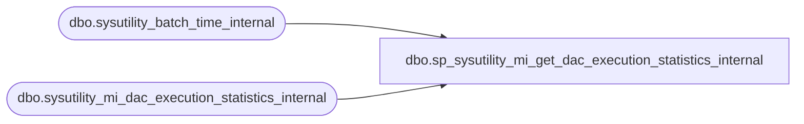

# dbo.sp_sysutility_mi_get_dac_execution_statistics_internal

**Database:** msdb  
**Server:** bearcluster01  

## Architecture Diagram



## Table Dependencies

| Referenced Table |
|---|
| dbo.sysutility_batch_time_internal |
| dbo.sysutility_mi_dac_execution_statistics_internal |

## Stored Procedure Code

```sql
CREATE PROCEDURE [dbo].[sp_sysutility_mi_get_dac_execution_statistics_internal]
AS
BEGIN
   SET NOCOUNT ON;   -- Required for SSIS to retrieve the proc's output rowset 
   DECLARE @logical_processor_count int;
   SELECT @logical_processor_count = cpu_count FROM sys.dm_os_sys_info;
   
   -- Get the shared "batch time" that will be a part of all data collection query rowsets.  On the UCP, this 
   -- will be used to tie together all of the data from one execution of the MI data collection job. 
   
   -- Check for the existance of the temp table.  If it is there, then the Utility is
   -- set up correctly.  If it is not there, do not fail the upload.  This handles the
   -- case when a user might run the collection set out-of-band from the Utility.
   -- The data may not be staged, but no sporratic errors should occur
   DECLARE @current_batch_time datetimeoffset(7) = SYSDATETIMEOFFSET();
   IF OBJECT_ID ('[tempdb].[dbo].[sysutility_batch_time_internal]') IS NOT NULL
   BEGIN
      SELECT @current_batch_time = latest_batch_time FROM tempdb.dbo.sysutility_batch_time_internal;
   END

   -- Temp storage for the DAC execution statistics for this data collection interval (typically, a 15 minute window). 
   -- This and the following table variable would be better as a temp table (b/c of the potentially large number 
   -- of rows), but this proc is run by DC with SET FMTONLY ON to get the output rowset schema.  That means no 
   -- temp tables.  
   DECLARE @upload_interval_dac_stats TABLE (
      dac_instance_name sysname PRIMARY KEY, 
      lifetime_cpu_time_ms bigint NULL,   -- amount of CPU time consumed since we started tracking this DAC
      interval_cpu_time_ms bigint NULL,   -- amount of CPU time used by the DAC in this ~15 min upload interval
      interval_start_time datetimeoffset NULL, 
      interval_end_time datetimeoffset NULL
   );
   
   -- We use an update with an OUTPUT clause to atomically update the staging table and retrieve data from it.  
   -- The use of the "inserted"/"deleted" pseudo-tables in this query ensures that we don't lose any data if the 
   -- collection job happens to be running at the same time. 
   UPDATE dbo.sysutility_mi_dac_execution_statistics_internal
   SET last_upload_time = SYSDATETIMEOFFSET(), 
       cpu_time_ms_at_last_upload = lifetime_cpu_time_ms 
   OUTPUT 
      inserted.dac_instance_name, 
      inserted.lifetime_cpu_time_ms, 
      -- Calculate the amount of CPU time consumed by this DAC since the last time we did an upload. 
      (inserted.cpu_time_ms_at_last_upload - ISNULL (deleted.cpu_time_ms_at_last_upload, 0)) AS interval_cpu_time_ms, 
      deleted.last_upload_time AS interval_start_time, 
      inserted.last_upload_time AS interval_end_time
   INTO @upload_interval_dac_stats;
   
   -- Return the data to the collection set
   SELECT 
      CONVERT (sysname, SERVERPROPERTY('ComputerNamePhysicalNetBIOS')) AS physical_server_name, 
      CONVERT (sysname, SERVERPROPERTY('ServerName')) AS server_instance_name, 
      CONVERT (sysname, dacs.database_name) AS dac_db, 
      dacs.date_created AS dac_deploy_date, 
      dacs.[description] AS dac_description, 
      dacs.dac_instance_name AS dac_name, 
      dac_stats.interval_start_time, 
      dac_stats.interval_end_time, 
      dac_stats.interval_cpu_time_ms, 
      CONVERT (real, CASE 
         WHEN dac_stats.interval_cpu_time_ms IS NOT NULL 
            AND DATEDIFF (second, dac_stats.interval_start_time, dac_stats.interval_end_time) > 0
            -- % CPU calculation is: [avg seconds of cpu time used per processor] / [interval duration in sec]
            -- The percentage value is returned as an int (e.g. 76 for 76%, not 0.76)
            THEN 100 * (dac_stats.interval_cpu_time_ms / @logical_processor_count) / 1000 / 
               DATEDIFF (second, dac_stats.interval_start_time, dac_stats.interval_end_time)
         ELSE 0
      END) AS interval_cpu_pct, 
      dac_stats.lifetime_cpu_time_ms, 
      @current_batch_time AS batch_time
   FROM dbo.sysutility_mi_dac_execution_statistics_internal AS dacs 
   LEFT OUTER JOIN @upload_interval_dac_stats AS dac_stats ON dacs.dac_instance_name = dac_stats.dac_instance_name;
END;

dbo,sp_sysutility_mi_initialize_collection,CREATE PROCEDURE [dbo].[sp_sysutility_mi_initialize_collection]
WITH EXECUTE AS OWNER
AS
BEGIN
   SET NOCOUNT ON;

   DECLARE @null_column sysname = NULL  

   IF ( 0 = (select [dbo].[fn_sysutility_ucp_get_instance_is_mi]()) )
   BEGIN
	  RAISERROR(37006, -1, -1)
     RETURN(1)
   END

   BEGIN TRY
   
   DECLARE @tran_name NVARCHAR(32) = N'sysutility_mi_initialize_collection' -- transaction names can be no more than 32 characters

   BEGIN TRANSACTION @tran_name

      -- Common variables
      DECLARE @job_category sysname       = N'Utility - Managed Instance';
      DECLARE @job_category_id INT        = (SELECT category_id FROM msdb.dbo.syscategories WHERE name=@job_category AND category_class=1)
      DECLARE @server_name sysname        = N'(local)';
      DECLARE @step_id INT;
      DECLARE @step_name sysname;

      -- Collect and upload job variables
      DECLARE @collect_and_upload_job_name sysname              = N'sysutility_mi_collect_and_upload';
      DECLARE @collect_and_upload_job_description nvarchar(max) = N'Collect configuration and performance information';
      DECLARE @collect_and_upload_schedule_name sysname         = N'sysutility_mi_collect_and_upload';
      DECLARE @collect_and_upload_schedule_minutes int          = 15;                                                              
      DECLARE @collect_and_upload_job_id uniqueidentifier       = (SELECT jobs.job_id
                                                                   FROM [msdb].[dbo].[sysjobs] jobs
                                                                   WHERE jobs.name = @collect_and_upload_job_name 
                                                                   AND jobs.category_id = @job_category_id);
                                                                     
      -- start the job one minute past midnight + some random set of minutes between the schedule interval
      -- for agent jobs, a schedule's time is encoded in an integer.  The minutes portion
      -- are stored in the the 100s and 1000s digits.
      DECLARE @collect_and_upload_schedule_start_time int       = CAST((1 + RAND() * (@collect_and_upload_schedule_minutes + 1)) AS INT) * 100; 
      -- end the job one minute before the start time
      DECLARE @collect_and_upload_schedule_end_time int         = @collect_and_upload_schedule_start_time - 100;
      
      -- Dac performance collection job variables
      DECLARE @dac_perf_job_name sysname              = N'sysutility_mi_collect_performance';
      DECLARE @dac_perf_job_description nvarchar(max) = N'Collect performance information';
      DECLARE @dac_perf_schedule_name sysname         = N'sysutility_mi_collect_performance';
      DECLARE @dac_perf_schedule_seconds int          = 15;
      DECLARE @dac_perf_job_id uniqueidentifier       = (SELECT jobs.job_id
                                                         FROM [msdb].[dbo].[sysjobs] jobs
                                                         WHERE jobs.name = @dac_perf_job_name 
                                                         AND jobs.category_id = @job_category_id);

      -------------------------------------------------------------------------
      -- Create the category for the jobs
      -------------------------------------------------------------------------
      IF (@job_category_id IS NULL)
      BEGIN
         RAISERROR('Creating utility job category ... %s', 0, 1, @job_category)  WITH NOWAIT;
         EXEC msdb.dbo.sp_add_category @class=N'JOB', @type=N'LOCAL', @name=@job_category
      END
                   
      -------------------------------------------------------------------------
      -- Prepare the jobs
      -------------------------------------------------------------------------
      IF (@collect_and_upload_job_id IS NULL)
      BEGIN
         RAISERROR('Creating utility job ... %s', 0, 1, @collect_and_upload_job_name)  WITH NOWAIT;
         -- The job doesn't exist yet, create the job
         EXEC msdb.dbo.sp_add_job 
            @job_name=@collect_and_upload_job_name,     
            @enabled=0,                               -- create the job disabled
            @notify_level_eventlog=0, 
            @notify_level_email=0, 
            @notify_level_netsend=0, 
            @notify_level_page=0, 
            @delete_level=0,
            @description=@collect_and_upload_job_description, 
            @category_name=@job_category, 
            @job_id = @collect_and_upload_job_id OUTPUT
      
         RAISERROR('Adding job to jobserver ... %s' , 0, 1, @collect_and_upload_job_name)  WITH NOWAIT;
         EXEC msdb.dbo.sp_add_jobserver @job_id = @collect_and_upload_job_id, @server_name = @server_name
      END
      ELSE
      BEGIN
         
         RAISERROR('Disabling utility job ... %s', 0, 1, @collect_and_upload_job_name)  WITH NOWAIT;
         -- Disable the job for now.  Disable is itempotent
         EXEC msdb.dbo.sp_update_job @job_id=@collect_and_upload_job_id, @enabled=0
         
         RAISERROR('Clearing job steps for utility job ... %s', 0, 1, @collect_and_upload_job_name)  WITH NOWAIT;
         -- The job exists, delete all of the job steps prior to recreating them
         -- Passing step_id = 0 to sp_delete_jobstep deletes all job steps for the job
         EXEC msdb.dbo.sp_delete_jobstep @job_id=@collect_and_upload_job_id, @step_id = 0
      END
      
      IF (@dac_perf_job_id IS NULL)
      BEGIN
         RAISERROR('Creating utility job ... %s', 0, 1, @dac_perf_job_name)  WITH NOWAIT;
         -- The job doesn't exist yet, create the job
         EXEC msdb.dbo.sp_add_job 
            @job_name=@dac_perf_job_name, 
            @enabled=0,                                -- create the job disabled
            @notify_level_eventlog=0, 
            @notify_level_email=0, 
            @notify_level_netsend=0, 
            @notify_level_page=0, 
            @delete_level=0,
            @description=@dac_perf_job_description, 
            @category_name=@job_category, 
            @job_id = @dac_perf_job_id OUTPUT
      
         RAISERROR('Adding job to jobserver ... %s' , 0, 1, @dac_perf_job_name)  WITH NOWAIT;
         EXEC msdb.dbo.sp_add_jobserver @job_id = @dac_perf_job_id, @server_name = @server_name
      END
      ELSE
      BEGIN
         RAISERROR('Disabling utility job ... %s', 0, 1, @dac_perf_job_name)  WITH NOWAIT;
         -- Disable the job for now.  Disable is itempotent
         EXEC msdb.dbo.sp_update_job @job_id=@dac_perf_job_id, @enabled=0
         
         RAISERROR('Clearing job steps for utility job ... %s', 0, 1, @dac_perf_job_name)  WITH NOWAIT;
         -- The job exists, delete all of the job steps prior to recreating them
         -- Passing step_id = 0 to sp_delete_jobstep deletes all job steps for the job
         EXEC msdb.dbo.sp_delete_jobstep @job_id=@dac_perf_job_id, @step_id = 0
      END
      
      -------------------------------------------------------------------------
      -- Add the schedules for the jobs
      -------------------------------------------------------------------------

      IF  NOT EXISTS (SELECT name FROM msdb.dbo.sysschedules_localserver_view WHERE name = @collect_and_upload_schedule_name)
      BEGIN
         RAISERROR('Creating schedule ... %s', 0, 1, @collect_and_upload_schedule_name)  WITH NOWAIT;
         EXEC dbo.sp_add_schedule
            @schedule_name = @collect_and_upload_schedule_name,            -- Schedule name
            @enabled=1,                                                    -- Enabled
            @freq_type = 4,                                                -- Daily
            @freq_interval = 1,                                            -- Recurs every 1 day
            @freq_subday_type = 0x4,                                       -- Frequency type is "minutes"
            @freq_subday_interval = @collect_and_upload_schedule_minutes,  -- Occurs every x minutes
            @active_start_time = @collect_and_upload_schedule_start_time,  -- Time to start the job
            @active_end_time = @collect_and_upload_schedule_end_time       -- Time to end the job
      END
      
      -- attach the schedule.  attach_schedule is itempotent if the job already has the schedule attached
      RAISERROR('Attaching schedule %s to job %s ...'  , 0, 1, @collect_and_upload_schedule_name, @collect_and_upload_job_name)  WITH NOWAIT;
      EXEC msdb.dbo.sp_attach_schedule @job_id=@collect_and_upload_job_id,@schedule_name=@collect_and_upload_schedule_name
      
      IF  NOT EXISTS (SELECT name FROM msdb.dbo.sysschedules_localserver_view WHERE name = @dac_perf_schedule_name)
      BEGIN
         RAISERROR('Creating schedule ... %s', 0, 1, @dac_perf_schedule_name)  WITH NOWAIT;
         EXEC dbo.sp_add_schedule
            @schedule_name = @dac_perf_schedule_name,            -- Schedule name
            @enabled=1,                                          -- Enabled
            @freq_type = 4,                                      -- Daily
            @freq_interval = 1,                                  -- Recurs every 1 day
            @freq_subday_type = 0x2,                             -- Frequency type is "seconds"
            @freq_subday_interval = @dac_perf_schedule_seconds   -- Occurs every x seconds
      END   
      
      -- attach the schedule.  attach_schedule is itempotent if the job already has the schedule attached
      RAISERROR('Attaching schedule %s to job %s ...'  , 0, 1, @dac_perf_schedule_name, @dac_perf_job_name)  WITH NOWAIT;
      EXEC msdb.dbo.sp_attach_schedule @job_id=@dac_perf_job_id,@schedule_name=@dac_perf_schedule_name     

      -------------------------------------------------------------------------
      -- Add the steps 
      -------------------------------------------------------------------------
      
      -------------------------------------------------------------------------      
      -- Steps for dac performance job
      -------------------------------------------------------------------------
      
      SET @step_id = 1;
      SET @step_name = N'Collect DAC execution statistics';
      RAISERROR('Adding step %i name %s to job %s', 0, 1, @step_id, @step_name, @dac_perf_job_name)  WITH NOWAIT;
      EXEC msdb.dbo.sp_add_jobstep 
         @job_id=@dac_perf_job_id, 
         @step_name=@step_name, 
         @step_id=1, 
         @cmdexec_success_code=0, 
         @on_success_action=1, 
         @on_fail_action=3, 
         @retry_attempts=0, 
         @retry_interval=0, 
         @os_run_priority=0, @subsystem=N'TSQL', 
         @command=N'EXEC [msdb].[dbo].[sp_sysutility_mi_collect_dac_execution_statistics_internal]', 
         @database_name=N'msdb', 
         @flags=0
            
      -------------------------------------------------------------------------      
      -- Steps for collect and upload job
      -------------------------------------------------------------------------
      
      -- Job step to record the current time on the managed instance.  This value will be included in the output of all of 
      -- the queries executed by the Utility collection set.  It will be used on the UCP to tie together all of the data from 
      -- a single execution of the data collection job. 
      -- 
      -- We create a table in tempdb to hold last batch start time and other transient data that does not 
      -- need to survive a service cycle.  Nothing uses this table except subsequent steps in this job; 
      -- it is safe to drop and recreate it here so that we do not need to worry about build-to-build 
      -- schema changes.
      
      SET @step_id = 1;
      SET @step_name = N'Record batch start time';
      RAISERROR('Adding step %i name %s to job %s', 0, 1, @step_id, @step_name, @collect_and_upload_job_name)  WITH NOWAIT;
      EXEC msdb.dbo.sp_add_jobstep @job_id=@collect_and_upload_job_id, @step_name=@step_name, 
            @step_id=@step_id, 
            @cmdexec_success_code=0, 
            @on_success_action=3, -- Go to next step
            @on_fail_action=2,    -- Quit the job reporting failure.  If something goes wrong here, something is messed up
            @retry_attempts=0, 
            @retry_interval=0, 
            @os_run_priority=0, 
            @subsystem=N'TSQL', 
            @command='
               USE tempdb
               
               IF OBJECT_ID (''[tempdb].[dbo].[sysutility_batch_time_internal]'') IS NOT NULL
               BEGIN
                  DROP TABLE [tempdb].[dbo].[sysutility_batch_time_internal];
               END;
               
               CREATE TABLE [tempdb].[dbo].[sysutility_batch_time_internal] (
                  latest_batch_time datetimeoffset(7) PRIMARY KEY NOT NULL
               );
                  
               -- The DC job needs to access the timestamp in this table, and it may not run under a login that 
               -- is mapped to a user in tempdb, so grant SELECT permissions to public.  The table contains no 
               -- sensitive data (only a single datetimeoffset value), so granting read permission to public 
               -- does create a security problem. 
               GRANT SELECT ON [tempdb].[dbo].[sysutility_batch_time_internal] TO PUBLIC;

               -- Save the start time for the current execution of the managed instance data collection job
               INSERT INTO [tempdb].[dbo].[sysutility_batch_time_internal] (latest_batch_time) VALUES (SYSDATETIMEOFFSET());', 
            @database_name=N'tempdb', 
            @flags=0
      
      DECLARE @psScript NVARCHAR(MAX) = (SELECT [dbo].[fn_sysutility_mi_get_collect_script]());
      SET @step_id = 2;
      SET @step_name = N'Stage Data Collected from PowerShell Script';  
      RAISERROR('Adding step %i name %s to job %s', 0, 1, @step_id, @step_name, @collect_and_upload_job_name)  WITH NOWAIT;
      EXEC msdb.dbo.sp_add_jobstep @job_id=@collect_and_upload_job_id, @step_name=@step_name, 
         @step_id=@step_id, 
         @cmdexec_success_code=0, 
         @on_success_action=3,   -- Go to next step
         @on_fail_action=2,      -- Quit the job reporting failure
         @retry_attempts=0, 
         @retry_interval=0, 
         @os_run_priority=0, 
         @subsystem=N'PowerShell', 
         @command=@psScript, 
         @database_name=N'master', 
         @flags=0

      SET @step_id = 3;
      SET @step_name = N'Upload to Utility Control Point';
      RAISERROR('Adding step %i name %s to job %s', 0, 1, @step_id, @step_name, @collect_and_upload_job_name)  WITH NOWAIT;
      EXEC msdb.dbo.sp_add_jobstep @job_id=@collect_and_upload_job_id, @step_name=@step_name, 
         @step_id=@step_id, 
         @cmdexec_success_code=0, 
         @on_success_action=1, -- Quit the job reporting success
         @on_fail_action=2, -- Quit the job reporting failure
         @retry_attempts=0, 
         @retry_interval=0, 
         @os_run_priority=0, 
         @subsystem=N'TSQL', 
         @command=N'EXEC [msdb].[dbo].[sp_sysutility_mi_upload]', 
         @database_name=N'msdb', 
         @flags=0
            
      -- Capture an initial snapshot of DAC statistics. This is not strictly necessary, but it will ensure that we 
      -- can calculate interval statistics immediately on the first execution of the every-15-second scheduled job. 
      RAISERROR('Collecting dac execution statistics for the first time ...', 0, 1, @collect_and_upload_job_name)  WITH NOWAIT;
      EXEC [msdb].[dbo].[sp_sysutility_mi_collect_dac_execution_statistics_internal]

      -- Enable the jobs
      RAISERROR('Enabling job ... %s', 0, 1, @collect_and_upload_job_name)  WITH NOWAIT;
      EXEC msdb.dbo.sp_update_job @job_id=@collect_and_upload_job_id, @enabled=1
      
      RAISERROR('Enabling job ... %s', 0, 1, @dac_perf_job_name)  WITH NOWAIT;   
      EXEC msdb.dbo.sp_update_job @job_id=@dac_perf_job_id, @enabled=1     
      
      -- Start the jobs
      RAISERROR('Starting job ... %s', 0, 1, @collect_and_upload_job_name)  WITH NOWAIT;
      EXEC msdb.dbo.sp_start_job @job_id=@collect_and_upload_job_id
      
      RAISERROR('Starting job ... %s', 0, 1, @dac_perf_job_name)  WITH NOWAIT;   
      EXEC msdb.dbo.sp_start_job @job_id=@dac_perf_job_id

  COMMIT TRANSACTION @tran_name
  
  END TRY
  
  BEGIN CATCH
        -- Roll back our transaction if it's still open
        IF (@@TRANCOUNT > 0)
        BEGIN
            ROLLBACK TRANSACTION;
        END;
 
        -- Rethrow the error.  Unfortunately, we can't retrow the exact same error number b/c RAISERROR 
        -- does not allow you to use error numbers below 13000.  We rethrow error 14684: 
        -- Caught error#: %d, Level: %d, State: %d, in Procedure: %s, Line: %d, with Message: %s
        DECLARE @ErrorMessage   NVARCHAR(4000);
        DECLARE @ErrorSeverity  INT;
        DECLARE @ErrorState     INT;
        DECLARE @ErrorNumber    INT;
        DECLARE @ErrorLine      INT;
        DECLARE @ErrorProcedure NVARCHAR(200);
        SELECT @ErrorLine = ERROR_LINE(),
               @ErrorSeverity = ERROR_SEVERITY(),
               @ErrorState = ERROR_STATE(),
               @ErrorNumber = ERROR_NUMBER(),
               @ErrorMessage = ERROR_MESSAGE(),
               @ErrorProcedure = ISNULL(ERROR_PROCEDURE(), '-');
        RAISERROR (14684, -1, -1 , @ErrorNumber, @ErrorSeverity, @ErrorState, @ErrorProcedure, @ErrorLine, @ErrorMessage);
    END CATCH;

END
```

