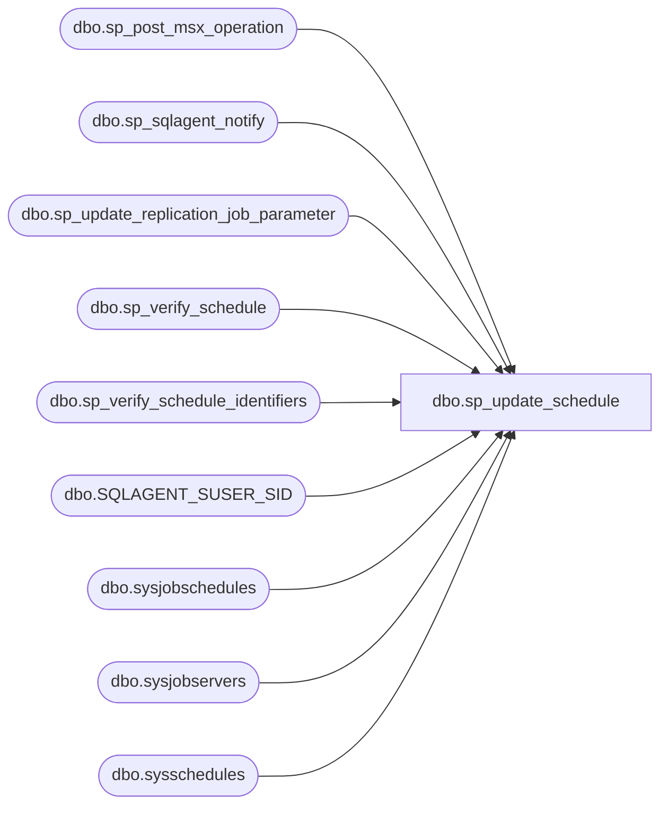

# dbo.sp_update_schedule

**Database:** msdb  
**Server:** bearcluster01  

## Architecture Diagram



## Table Dependencies

| Referenced Table |
|---|
| dbo.sp_post_msx_operation |
| dbo.sp_sqlagent_notify |
| dbo.sp_update_replication_job_parameter |
| dbo.sp_verify_schedule |
| dbo.sp_verify_schedule_identifiers |
| dbo.SQLAGENT_SUSER_SID |
| dbo.sysjobschedules |
| dbo.sysjobservers |
| dbo.sysschedules |

## Stored Procedure Code

```sql
CREATE PROCEDURE sp_update_schedule
(
  @schedule_id              INT             = NULL,     -- Must provide either this or schedule_name
  @name                     sysname         = NULL,     -- Must provide either this or schedule_id
  @new_name                 sysname         = NULL,
  @enabled                  TINYINT         = NULL,
  @freq_type                INT             = NULL,
  @freq_interval            INT             = NULL,
  @freq_subday_type         INT             = NULL,
  @freq_subday_interval     INT             = NULL,
  @freq_relative_interval   INT             = NULL,
  @freq_recurrence_factor   INT             = NULL,
  @active_start_date        INT             = NULL, 
  @active_end_date          INT             = NULL,
  @active_start_time        INT             = NULL,
  @active_end_time          INT             = NULL,
  @owner_login_name         sysname         = NULL,
  @automatic_post           BIT             = 1         -- If 1 will post notifications to all tsx servers to 
                                                        -- update all jobs that use this schedule
)
AS
BEGIN
  DECLARE @retval                   INT
  DECLARE @owner_sid                VARBINARY(85)
  DECLARE @cur_owner_sid            VARBINARY(85)
  DECLARE @x_name                   sysname
  DECLARE @enable_only_used         INT

  DECLARE @x_enabled                TINYINT
  DECLARE @x_freq_type              INT
  DECLARE @x_freq_interval          INT
  DECLARE @x_freq_subday_type       INT
  DECLARE @x_freq_subday_interval   INT
  DECLARE @x_freq_relative_interval INT
  DECLARE @x_freq_recurrence_factor INT
  DECLARE @x_active_start_date      INT
  DECLARE @x_active_end_date        INT
  DECLARE @x_active_start_time      INT
  DECLARE @x_active_end_time        INT
  DECLARE @schedule_uid             UNIQUEIDENTIFIER

  SET NOCOUNT ON

  -- Remove any leading/trailing spaces from parameters
  SELECT @name              = LTRIM(RTRIM(@name))
  SELECT @new_name          = LTRIM(RTRIM(@new_name))
  SELECT @owner_login_name  = LTRIM(RTRIM(@owner_login_name))
  -- Turn [nullable] empty string parameters into NULLs
  IF (@new_name = N'') SELECT @new_name = NULL

   -- If the owner is supplied get the sid and check it
  IF(@owner_login_name IS NOT NULL AND @owner_login_name <> '')
  BEGIN
      -- Get the sid for @owner_login_name SID 
      --force case insensitive comparation for NT users
      SELECT @owner_sid = dbo.SQLAGENT_SUSER_SID(@owner_login_name)
    -- Cannot proceed if @owner_login_name doesn't exist
    IF(@owner_sid IS NULL)
    BEGIN
      RAISERROR(14262, -1, -1, '@owner_login_name', @owner_login_name)
      RETURN(1) -- Failure
    END
  END

  -- Check that we can uniquely identify the schedule. This only returns a schedule that is visible to this user
  EXECUTE @retval = msdb.dbo.sp_verify_schedule_identifiers @name_of_name_parameter = '@name',
                                                            @name_of_id_parameter   = '@schedule_id',
                                                            @schedule_name          = @name             OUTPUT,
                                                            @schedule_id            = @schedule_id      OUTPUT,
                                                            @owner_sid              = @cur_owner_sid    OUTPUT,
                                                            @orig_server_id         = NULL
  IF (@retval <> 0)
      RETURN(1) -- Failure   

  -- Is @enable the only parameter used beside jobname and jobid?
  IF ((@enabled                   IS NOT NULL) AND
       (@new_name                 IS NULL) AND
      (@freq_type                 IS NULL) AND
      (@freq_interval             IS NULL) AND
      (@freq_subday_type          IS NULL) AND
      (@freq_subday_interval      IS NULL) AND
      (@freq_relative_interval    IS NULL) AND
      (@freq_recurrence_factor    IS NULL) AND
      (@active_start_date         IS NULL) AND
      (@active_end_date           IS NULL) AND
      (@active_start_time         IS NULL) AND
      (@active_end_time           IS NULL) AND
      (@owner_login_name          IS NULL))
    SELECT @enable_only_used = 1
  ELSE
    SELECT @enable_only_used = 0
      
  -- Non-sysadmins can only update jobs schedules they own. 
  -- Members of SQLAgentReaderRole and SQLAgentOperatorRole can view job schedules, 
  -- but they should not be able to delete them
  IF ((@cur_owner_sid <> SUSER_SID())
       AND (ISNULL(IS_SRVROLEMEMBER(N'sysadmin'),0) <> 1)
      AND (@enable_only_used <> 1 OR ISNULL(IS_MEMBER(N'SQLAgentOperatorRole'), 0) <> 1))
  BEGIN
   RAISERROR(14394, -1, -1)
   RETURN(1) -- Failure
  END
  
  -- If the param @owner_login_name is null or doesn't get resolved by SUSER_SID() set it to the current owner of the schedule
  if(@owner_sid IS NULL)
      SELECT @owner_sid = @cur_owner_sid
       
   -- Set the x_ (existing) variables
  SELECT @x_name                   = name,
         @x_enabled                = enabled,
         @x_freq_type              = freq_type,
         @x_freq_interval          = freq_interval,
         @x_freq_subday_type       = freq_subday_type,
         @x_freq_subday_interval   = freq_subday_interval,
         @x_freq_relative_interval = freq_relative_interval,
         @x_freq_recurrence_factor = freq_recurrence_factor,
         @x_active_start_date      = active_start_date,
         @x_active_end_date        = active_end_date,
         @x_active_start_time      = active_start_time,
         @x_active_end_time        = active_end_time
  FROM msdb.dbo.sysschedules
  WHERE (schedule_id = @schedule_id )     
  
  
    -- Fill out the values for all non-supplied parameters from the existing values
  IF (@new_name               IS NULL) SELECT @new_name               = @x_name
  IF (@enabled                IS NULL) SELECT @enabled                = @x_enabled
  IF (@freq_type              IS NULL) SELECT @freq_type              = @x_freq_type
  IF (@freq_interval          IS NULL) SELECT @freq_interval          = @x_freq_interval
  IF (@freq_subday_type       IS NULL) SELECT @freq_subday_type       = @x_freq_subday_type
  IF (@freq_subday_interval   IS NULL) SELECT @freq_subday_interval   = @x_freq_subday_interval
  IF (@freq_relative_interval IS NULL) SELECT @freq_relative_interval = @x_freq_relative_interval
  IF (@freq_recurrence_factor IS NULL) SELECT @freq_recurrence_factor = @x_freq_recurrence_factor
  IF (@active_start_date      IS NULL) SELECT @active_start_date      = @x_active_start_date
  IF (@active_end_date        IS NULL) SELECT @active_end_date        = @x_active_end_date
  IF (@active_start_time      IS NULL) SELECT @active_start_time      = @x_active_start_time
  IF (@active_end_time        IS NULL) SELECT @active_end_time        = @x_active_end_time
      
  -- Check schedule (frequency and owner) parameters
  EXECUTE @retval = sp_verify_schedule @schedule_id             = @schedule_id,
                                       @name                    = @new_name,
                                       @enabled                 = @enabled,
                                       @freq_type               = @freq_type,
                                       @freq_interval           = @freq_interval            OUTPUT,
                                       @freq_subday_type        = @freq_subday_type         OUTPUT,
                                       @freq_subday_interval    = @freq_subday_interval     OUTPUT,
                                       @freq_relative_interval  = @freq_relative_interval   OUTPUT,
                                       @freq_recurrence_factor  = @freq_recurrence_factor   OUTPUT,
                                       @active_start_date       = @active_start_date        OUTPUT,
                                       @active_start_time       = @active_start_time        OUTPUT,
                                       @active_end_date         = @active_end_date          OUTPUT,
                                       @active_end_time         = @active_end_time          OUTPUT,
                                       @owner_sid               = @owner_sid
  IF (@retval <> 0)
    RETURN(1) -- Failure  

  -- Update the sysschedules table
  UPDATE msdb.dbo.sysschedules
  SET name                   = @new_name,
      owner_sid              = @owner_sid,
      enabled                = @enabled,
      freq_type              = @freq_type,
      freq_interval          = @freq_interval,
      freq_subday_type       = @freq_subday_type,
      freq_subday_interval   = @freq_subday_interval,
      freq_relative_interval = @freq_relative_interval,
      freq_recurrence_factor = @freq_recurrence_factor,
      active_start_date      = @active_start_date,
      active_end_date        = @active_end_date,
      active_start_time      = @active_start_time,
      active_end_time        = @active_end_time,
      date_modified          = GETDATE(),
      version_number         = version_number + 1
  WHERE (schedule_id = @schedule_id)

  SELECT @retval = @@error

 -- update any job that has repl steps
  DECLARE @job_id UNIQUEIDENTIFIER
  DECLARE jobsschedule_cursor CURSOR LOCAL FOR
  SELECT job_id
  FROM msdb.dbo.sysjobschedules
  WHERE (schedule_id = @schedule_id)
  
  IF @x_freq_type <> @freq_type
  BEGIN
    OPEN jobsschedule_cursor
    FETCH NEXT FROM jobsschedule_cursor INTO @job_id

    WHILE (@@FETCH_STATUS = 0)
    BEGIN 
      EXEC  sp_update_replication_job_parameter @job_id = @job_id,
                                                @old_freq_type = @x_freq_type,
                                                @new_freq_type = @freq_type
      FETCH NEXT FROM jobsschedule_cursor INTO @job_id
    END
    CLOSE jobsschedule_cursor
  END
  DEALLOCATE jobsschedule_cursor
  
  -- Notify SQLServerAgent of the change if this is attached to a local job
  IF (EXISTS (SELECT *
                FROM msdb.dbo.sysjobschedules AS jsched 
              JOIN msdb.dbo.sysjobservers AS jsvr
                    ON jsched.job_id = jsvr.job_id
                WHERE (jsched.schedule_id = @schedule_id)
                  AND (jsvr.server_id = 0)) )
  BEGIN 
      EXECUTE msdb.dbo.sp_sqlagent_notify @op_type     = N'S',
                                          @schedule_id = @schedule_id,
                                          @action_type = N'U'              
  END


  -- Instruct the tsx servers to pick up the altered schedule
  IF (@automatic_post = 1)
  BEGIN
      SELECT @schedule_uid = schedule_uid 
      FROM sysschedules 
      WHERE schedule_id = @schedule_id

      IF(NOT @schedule_uid IS NULL)
      BEGIN
          -- sp_post_msx_operation will do nothing if the schedule isn't assigned to any tsx machines 
          EXECUTE @retval = sp_post_msx_operation @operation = 'INSERT', @object_type = 'SCHEDULE', @schedule_uid = @schedule_uid
      END
  END  

  RETURN(@retval) -- 0 means success
END

dbo,sp_update_targetservergroup,CREATE PROCEDURE sp_update_targetservergroup
  @name     sysname,
  @new_name sysname
AS
BEGIN
  SET NOCOUNT ON

  -- Only a sysadmin can do this
  IF (ISNULL(IS_SRVROLEMEMBER(N'sysadmin'), 0) <> 1) 
  BEGIN
    RAISERROR(15003, 16, 1, N'sysadmin')
    RETURN(1) -- Failure
  END

  -- Remove any leading/trailing spaces from parameters
  SELECT @name     = LTRIM(RTRIM(@name))
  SELECT @new_name = LTRIM(RTRIM(@new_name))

  -- Check if the group exists
  IF (NOT EXISTS (SELECT *
                  FROM msdb.dbo.systargetservergroups
                  WHERE (name = @name)))
  BEGIN
    RAISERROR(14262, -1, -1, '@name', @name)
    RETURN(1) -- Failure
  END

  -- Check if a group with the new name already exists
  IF (EXISTS (SELECT *
              FROM msdb.dbo.systargetservergroups
              WHERE (name = @new_name)))
  BEGIN
    RAISERROR(14261, -1, -1, '@new_name', @new_name)
    RETURN(1) -- Failure
  END

  -- Disallow names with commas in them (since sp_apply_job_to_targets parses a comma-separated list of group names)
  IF (@new_name LIKE N'%,%')
  BEGIN
    RAISERROR(14289, -1, -1, '@new_name', ',')
    RETURN(1) -- Failure
  END

  -- Update the group's name
  UPDATE msdb.dbo.systargetservergroups
  SET name = @new_name
  WHERE (name = @name)

  RETURN(@@error) -- 0 means success
END

dbo,sp_validate_user,CREATE PROCEDURE [dbo].[sp_validate_user]
    @send_request_user sysname,
    @user_sid varbinary(85) OUTPUT
  WITH EXECUTE AS 'dbo'
AS
BEGIN
    SET NOCOUNT ON
    -- And make sure ARITHABORT is on. This is the default for yukon DB's
    SET ARITHABORT ON

    declare @groupSid varbinary(85)
    declare @temp table
    ([account name] sysname, 
    [type] char(8),
    [privilege] char(9),
    [mapped login name] sysname,
    [permission path] sysname null)

    declare @sidlist table
    ([account name] sysname,
     [accountsid] varbinary(85) null,
     [permission path] sysname null)

    SET @user_sid = NULL
    SET @groupSid = NULL

    -- Lookup the Windows Group membership, if any, that grants this
    -- user access to SQL Server. xp_logininfo may fail if the sql
    -- server service account cannot talk to the domain controller to
    -- validate the windows username, or it may fail if the
    -- @send_request_user is not a valid windows user or group name.
    BEGIN TRY 
        insert @temp exec master.dbo.xp_logininfo @send_request_user, 'all'
        -- For a given account name, Get account name -> group accountsid mapping to a temp table variable
        insert @sidlist
            select [account name], suser_sid([permission path]),[permission path]
            from @temp
    END TRY
    BEGIN CATCH
        RETURN 2
    END CATCH

    -- for a given account name, there has to be atleast one account sid that is not null and
    -- there has to be atleast one mail profile for the list of account sids
    IF ((EXISTS(SELECT [account name] 
                FROM @sidlist
                WHERE accountsid is not NULL)
    AND (EXISTS(SELECT profile_id 
                FROM msdb.dbo.sysmail_principalprofile pp, @sidlist s
                WHERE s.accountsid = pp.principal_sid))))

    BEGIN
        -- Get the first account's sid that meets following criteria
        --  1) return first default profile (if available)
        --  2) if no default profile is  defined, then return the first non-default profile for this account
        SELECT TOP 1  @groupSid = accountsid 
        FROM @sidlist s, msdb.dbo.sysmail_principalprofile pp
        WHERE s.accountsid is not NULL
        AND s.accountsid = pp.principal_sid
        ORDER BY is_default DESC
    END

    -- Lookup a default profile for the Group. If there is one,
    -- then use the group's mail profile.
    IF (@groupSid IS NOT NULL)
    BEGIN
        SET @user_sid = @groupSid
        RETURN 0
    END
    RETURN 1
END

dbo,sp_verify_alert,CREATE PROCEDURE sp_verify_alert
  @name                          sysname,
  @message_id                    INT,
  @severity                      INT,
  @enabled                       TINYINT,
  @delay_between_responses       INT,
  @notification_message          NVARCHAR(512),
  @include_event_description_in  TINYINT,
  @database_name                 sysname,
  @event_description_keyword     NVARCHAR(100),
  @job_id                        UNIQUEIDENTIFIER OUTPUT,
  @job_name                      sysname          OUTPUT,
  @occurrence_count              INT,
  @raise_snmp_trap               TINYINT,
  @performance_condition         NVARCHAR(512),
  @category_name                 sysname,
  @category_id                   INT              OUTPUT,
  @count_reset_date              INT,
  @count_reset_time              INT,
  @wmi_namespace      NVARCHAR(512),      -- New for 9.0
  @wmi_query          NVARCHAR(512),      -- New for 9.0
  @event_id        INT     OUTPUT   -- New for 9.0
AS
BEGIN
  DECLARE @retval               INT
  DECLARE @non_alertable_errors VARCHAR(512)
  DECLARE @message_id_as_string VARCHAR(10)
  DECLARE @res_valid_range      NVARCHAR(100)
  DECLARE @alert_no_wmi_check   INT
  DECLARE @job_owner_sid      VARBINARY(85)

  SET NOCOUNT ON

  -- Remove any leading/trailing spaces from parameters
  SELECT @name                      = LTRIM(RTRIM(@name))
  SELECT @notification_message      = LTRIM(RTRIM(@notification_message))
  SELECT @database_name             = LTRIM(RTRIM(@database_name))
  SELECT @event_description_keyword = LTRIM(RTRIM(@event_description_keyword))
  SELECT @job_name                  = LTRIM(RTRIM(@job_name))
  SELECT @performance_condition     = LTRIM(RTRIM(@performance_condition))
  SELECT @category_name             = LTRIM(RTRIM(@category_name))
  SELECT @alert_no_wmi_check        = 0
  
  -- Only a sysadmin can do this
  
  IF ((ISNULL(IS_SRVROLEMEMBER(N'sysadmin'), 0) <> 1))
  BEGIN
    RAISERROR(15003, 16, 1, N'sysadmin')
    RETURN(1) -- Failure
  END

  -- Check if the NewName is unique
  IF (EXISTS (SELECT *
              FROM msdb.dbo.sysalerts
              WHERE (name = @name)))
  BEGIN
    RAISERROR(14261, 16, 1, '@name', @name)
    RETURN(1) -- Failure
  END

  -- Check if the user has supplied MessageID OR Severity OR Performance-Condition OR WMI namespace/query
  IF ((@performance_condition IS NULL) AND (@message_id = 0) AND (@severity = 0) AND ((@wmi_namespace IS NULL) OR (@wmi_query IS NULL))) OR
     ((@performance_condition IS NOT NULL) AND ((@message_id <> 0) OR (@severity <> 0) OR (@wmi_namespace IS NOT NULL) OR (@wmi_query IS NOT NULL))) OR
     ((@message_id <> 0) AND ((@performance_condition IS NOT NULL) OR (@severity <> 0) OR (@wmi_namespace IS NOT NULL) OR (@wmi_query IS NOT NULL))) OR
     ((@severity <> 0) AND ((@performance_condition IS NOT NULL) OR (@message_id <> 0) OR (@wmi_namespace IS NOT NULL) OR (@wmi_query IS NOT NULL)))
  BEGIN
    RAISERROR(14500, 16, 1)
    RETURN(1) -- Failure
  END

  -- Check the Severity
  IF ((@severity < 0) OR (@severity > 25))
  BEGIN
    RAISERROR(14266, 16, 1, '@severity', '0..25')
    RETURN(1) -- Failure
  END

    -- Check the MessageID
    -- Allow if message id = 50000 (RAISERROR called with no specific message id)
    IF(@message_id <> 50000)
    BEGIN
        IF (@message_id <> 0) AND
            (NOT EXISTS (SELECT message_id
                            FROM sys.messages
                            WHERE message_id = @message_id))
        BEGIN
            SELECT @message_id_as_string = CONVERT(VARCHAR, @message_id)
            RAISERROR(14262, 16, 1, '@message_id', @message_id_as_string)
            RETURN(1) -- Failure
        END
    END
  
  -- Check if it is legal to set an alert on this MessageID
  DECLARE @TempRetVal TABLE (RetVal INT)
  EXECUTE master.dbo.xp_instance_regread N'HKEY_LOCAL_MACHINE',
                                         N'SOFTWARE\Microsoft\MSSQLServer\SQLServerAgent',
                                         N'NonAlertableErrors',
                                         @non_alertable_errors OUTPUT,
                                         N'no_output'
  IF (ISNULL(@non_alertable_errors, N'NULL') <> N'NULL')
  BEGIN
    DECLARE @message_id_as_char VARCHAR(10)

    SELECT @message_id_as_char = CONVERT(VARCHAR(10), @message_id)
    INSERT INTO @TempRetVal
    EXECUTE ('IF (' + @message_id_as_char + ' IN (' + @non_alertable_errors + ')) SELECT 1')
  END

  IF (EXISTS (SELECT *
              FROM @TempRetVal))
  BEGIN
    RAISERROR(14506, 16, 1, @message_id)
    RETURN(1) -- Failure
  END

  -- Enabled must be 0 or 1
  IF (@enabled NOT IN (0, 1))
  BEGIN
    RAISERROR(14266, 16, 1, '@enabled', '0, 1')
    RETURN(1) -- Failure
  END

  -- DelayBetweenResponses must be > 0
  IF (@delay_between_responses < 0)
  BEGIN
    SELECT @res_valid_range = FORMATMESSAGE(14206)
    RAISERROR(14266, 16, 1, '@delay_between_responses', @res_valid_range)
    RETURN(1) -- Failure
  END

  -- NOTE: We don't check the notification message

  -- Check IncludeEventDescriptionIn
  IF ((@include_event_description_in < 0) OR (@include_event_description_in > 7))
  BEGIN
    SELECT @res_valid_range = FORMATMESSAGE(14208)
    RAISERROR(14266, 16, 1, '@include_event_description_in', @res_valid_range)
    RETURN(1) -- Failure
  END

  -- Check the database name
  IF (@database_name IS NOT NULL) AND (DB_ID(@database_name) IS NULL)
  BEGIN
    RAISERROR(15010, 16, 1, @database_name)
    RETURN(1) -- Failure
  END

  -- NOTE: We don't check the event description keyword

  -- Check JobName/ID
  IF ((@job_id IS NOT NULL) OR (@job_name IS NOT NULL))
  BEGIN
    -- We use '' as a special value which means 'no job' (we cannot use NULL since this forces
    -- sp_update_alert to use the existing value)
    IF (@job_name = N'')
      SELECT @job_id = 0x00
    ELSE
    BEGIN
      EXECUTE @retval = sp_verify_job_identifiers '@job_name',
                                                  '@job_id',
                                                   @job_name OUTPUT,
                                                   @job_id   OUTPUT,
                                       @owner_sid = @job_owner_sid OUTPUT
      IF (@retval <> 0)
        RETURN(1) -- Failure
        
     -- Check permissions beyond what's checked by the sysjobs_view
     -- SQLAgentReaderRole and SQLAgentOperatorRole can see all jobs but
     -- cannot modify them
     IF (@job_owner_sid <> SUSER_SID()                   -- does not own the job
        AND (ISNULL(IS_SRVROLEMEMBER(N'sysadmin'), 0) <> 1))   -- is not sysadmin
     BEGIN
       RAISERROR(14525, -1, -1); 
       RETURN(1) -- Failure
     END
        
      -- Check that the job is a local job
      IF (NOT EXISTS (SELECT *
                      FROM msdb.dbo.sysjobservers
                      WHERE (job_id = @job_id)
                        AND (server_id = 0)))
      BEGIN
        RAISERROR(14527, -1, -1, @job_name)
        RETURN(1) -- Failure
      END
    END
  END

  -- OccurrenceCount must be > 0
  IF (@occurrence_count < 0)
  BEGIN
    RAISERROR(14266, 16, 1, '@occurrence_count', '0..n')
    RETURN(1) -- Failure
  END

  -- RaiseSNMPTrap must be 0 or 1
  IF (@raise_snmp_trap NOT IN (0, 1))
  BEGIN
    RAISERROR(14266, 16, 1, '@raise_snmp_trap', '0, 1')
    RETURN(1) -- Failure
  END

  -- Check the performance condition (including invalid parameter combinations)
  IF (@performance_condition IS NOT NULL)
  BEGIN
    IF (@database_name IS NOT NULL)
    BEGIN
      RAISERROR(14505, 16, 1, '@database_name')
      RETURN(1) -- Failure
    END

    IF (@event_description_keyword IS NOT NULL)
    BEGIN
      RAISERROR(14505, 16, 1, '@event_description_keyword')
      RETURN(1) -- Failure
    END
    
    IF (@wmi_namespace IS NOT NULL)
    BEGIN
      RAISERROR(14505, 16, 1, '@wmi_namespace')
      RETURN(1) -- Failure
    END

    IF (@wmi_query IS NOT NULL)
    BEGIN
      RAISERROR(14505, 16, 1, '@wmi_query')
      RETURN(1) -- Failure
    END

    -- Verify the performance condition
    EXECUTE @retval = msdb.dbo.sp_verify_performance_condition @performance_condition
    IF (@retval <> 0)
      RETURN(1) -- Failure
  END

  -- Check category name
  IF (@category_name = N'[DEFAULT]')
    SELECT @category_id = 98
  ELSE
  BEGIN
    SELECT @category_id = category_id
    FROM msdb.dbo.syscategories
    WHERE (category_class = 2) -- Alerts
      AND (category_type = 3) -- None
      AND (name = @category_name)
  END
  IF (@category_id IS NULL)
  BEGIN
    RAISERROR(14262, -1, -1, '@category_name', @category_name)
    RETURN(1) -- Failure
  END

  -- Check count reset date
  IF (@count_reset_date <> 0)
  BEGIN
    EXECUTE @retval = msdb.dbo.sp_verify_job_date @count_reset_date, '@count_reset_date'
    IF (@retval <> 0)
      RETURN(1) -- Failure
  END

  -- Check count reset time
  IF (@count_reset_time <> 0)
  BEGIN
    EXECUTE @retval = msdb.dbo.sp_verify_job_time @count_reset_time, '@count_reset_time'
    IF (@retval <> 0)
      RETURN(1) -- Failure
  END

  -- Check WMI parameters. Both must exist
  IF (@wmi_namespace IS NOT NULL)
  BEGIN
    IF (@wmi_query IS NULL)
   BEGIN
      RAISERROR(14509, 16, 1, '@wmi_query') 
     RETURN(1) -- Failure
   END
   
    IF (@database_name IS NOT NULL)
    BEGIN
      RAISERROR(14510, 16, 1, '@database_name') 
      RETURN(1) -- Failure
    END

    IF (@event_description_keyword IS NOT NULL)
    BEGIN
      RAISERROR(14510, 16, 1, '@event_description_keyword')
      RETURN(1) -- Failure
    END

    --do not check WMI properties if a registry setting is present
    EXECUTE master.dbo.xp_instance_regread N'HKEY_LOCAL_MACHINE',
                                           N'SOFTWARE\Microsoft\MSSQLServer\SQLServerAgent',
                                           N'AlertNoWmiCheck',
                                           @alert_no_wmi_check OUTPUT,
                                           'no_output'
    if (@alert_no_wmi_check <> 1)
    BEGIN
      EXECUTE @retval = msdb.dbo.sp_sqlagent_notify @op_type = N'T',
                    @wmi_namespace = @wmi_namespace,
               @wmi_query  = @wmi_query,
               @error_flag = 0
      IF (@retval <> 0)
     BEGIN
       RAISERROR(14511, 16, 1)
         RETURN(1) -- Failure
     END
    END

   -- Set event_id to indicate WMI alert   
    SELECT @event_id = 8
  END
  ELSE IF (@wmi_query IS NOT NULL)
  BEGIN
    RAISERROR(14512, 16, 1, '@wmi_namespace')
    RETURN(1) -- Failure
  END
  
  RETURN(0) -- Success
END

dbo,sp_verify_category,CREATE PROCEDURE sp_verify_category
  @class          VARCHAR(8),
  @type           VARCHAR(12)  = NULL, -- Supply NULL only if you don't want it checked
  @name           sysname      = NULL, -- Supply NULL only if you don't want it checked
  @category_class INT OUTPUT,
  @category_type  INT OUTPUT           -- Supply NULL only if you don't want the return value
AS
BEGIN
  SET NOCOUNT ON

  -- Remove any leading/trailing spaces from parameters
  SELECT @class = LTRIM(RTRIM(@class))
  SELECT @type  = LTRIM(RTRIM(@type))
  SELECT @name  = LTRIM(RTRIM(@name))

  -- Turn [nullable] empty string parameters into NULLs
  IF (@type = '') SELECT @type = NULL
  IF (@name = N'') SELECT @name = NULL

  -- Check class
  SELECT @class = UPPER(@class collate SQL_Latin1_General_CP1_CS_AS)
  SELECT @category_class = CASE @class
                             WHEN 'JOB'      THEN 1
                             WHEN 'ALERT'    THEN 2
                             WHEN 'OPERATOR' THEN 3
                             ELSE 0
                           END
  IF (@category_class = 0)
  BEGIN
    RAISERROR(14266, -1, -1, '@class', 'JOB, ALERT, OPERATOR')
    RETURN(1) -- Failure
  END

  -- Check name
  IF ((@name IS NOT NULL) AND (@name = N'[DEFAULT]'))
  BEGIN
    RAISERROR(14200, -1, -1, '@name')
    RETURN(1) -- Failure
  END

  -- Check type [optionally]
  IF (@type IS NOT NULL)
  BEGIN
    IF (@class = 'JOB')
    BEGIN
      SELECT @type = UPPER(@type collate SQL_Latin1_General_CP1_CS_AS)
      SELECT @category_type = CASE @type
                                WHEN 'LOCAL'        THEN 1
                                WHEN 'MULTI-SERVER' THEN 2
                                ELSE 0
                              END
      IF (@category_type = 0)
      BEGIN
        RAISERROR(14266, -1, -1, '@type', 'LOCAL, MULTI-SERVER')
        RETURN(1) -- Failure
      END
    END
    ELSE
    BEGIN
      IF (@type <> 'NONE')
      BEGIN
        RAISERROR(14266, -1, -1, '@type', 'NONE')
        RETURN(1) -- Failure
      END
      ELSE
        SELECT @category_type = 3
    END
  END

  RETURN(0) -- Success
END
```

