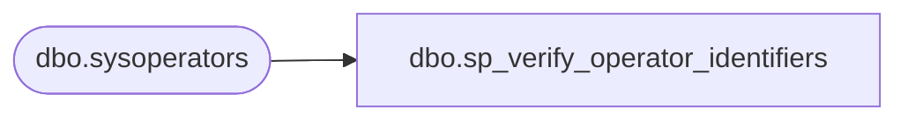

# dbo.sp_verify_operator_identifiers

**Database:** msdb  
**Server:** bearcluster01  

## Architecture Diagram



## Table Dependencies

| Referenced Table |
|---|
| dbo.sysoperators |

## Stored Procedure Code

```sql
CREATE PROCEDURE sp_verify_operator_identifiers
   @name_of_name_parameter [varchar](60),
   @name_of_id_parameter [varchar](60),
   @operator_name [sysname] OUTPUT,
   @operator_id [INT] OUTPUT
AS
BEGIN
  DECLARE @retval              INT
  DECLARE @operator_id_as_char NVARCHAR(36)

  SET NOCOUNT ON

  -- Remove any leading/trailing spaces from parameters
  SELECT @name_of_name_parameter = LTRIM(RTRIM(@name_of_name_parameter))
  SELECT @name_of_id_parameter   = LTRIM(RTRIM(@name_of_id_parameter))
  SELECT @operator_name             = LTRIM(RTRIM(@operator_name))

  IF (@operator_name = N'') SELECT @operator_name = NULL

  IF ((@operator_name IS NULL)     AND (@operator_id IS NULL)) OR
     ((@operator_name IS NOT NULL) AND (@operator_id IS NOT NULL))
  BEGIN
    RAISERROR(14524, -1, -1, @name_of_id_parameter, @name_of_name_parameter)
    RETURN(1) -- Failure
  END

  -- Check job id
  IF (@operator_id IS NOT NULL)
  BEGIN
    SELECT @operator_name = name
    FROM msdb.dbo.sysoperators
    WHERE (id = @operator_id)
    IF (@operator_name IS NULL)
    BEGIN
     SELECT @operator_id_as_char = CONVERT(nvarchar(36), @operator_id)
      RAISERROR(14262, -1, -1, '@operator_id', @operator_id_as_char)
      RETURN(1) -- Failure
    END
  END
  ELSE
  -- Check proxy name
  IF (@operator_name IS NOT NULL)
  BEGIN
    -- The name is not ambiguous, so get the corresponding operator_id (if the job exists)
    SELECT @operator_id = id
    FROM msdb.dbo.sysoperators
    WHERE (name = @operator_name)
    IF (@operator_id IS NULL)
    BEGIN
      RAISERROR(14262, -1, -1, '@operator_name', @operator_name)
      RETURN(1) -- Failure
    END
  END

  RETURN(0) -- Success
END

dbo,sp_verify_performance_condition,CREATE PROCEDURE sp_verify_performance_condition
  @performance_condition NVARCHAR(512)
AS
BEGIN
  DECLARE @delimiter_count INT
  DECLARE @temp_str        NVARCHAR(512)
  DECLARE @object_name     sysname
  DECLARE @counter_name    sysname
  DECLARE @instance_name   sysname
  DECLARE @pos             INT

  SET NOCOUNT ON
  
  -- The performance condition must have the format 'object|counter|instance|comparator|value'
  -- NOTE: 'instance' may be empty.
  IF (PATINDEX(N'%_|%_|%|[><=]|[0-9]%', @performance_condition) = 0)
  BEGIN
    RAISERROR(14507, 16, 1)
    RETURN(1) -- Failure
  END

  -- Parse the performance_condition
  SELECT @delimiter_count = 0
  
  --Ex: "SqlServer:General Statistics|User Connections||>|5" => "General Statistics|User Connections||>|5"
  SELECT @temp_str = SUBSTRING(@performance_condition, 
				PATINDEX('%:%', @performance_condition)+1, 
				DATALENGTH(@performance_condition) - (PATINDEX('%:%', @performance_condition)+1) )
  SELECT @pos = CHARINDEX(N'|', @temp_str)
  WHILE (@pos <> 0)
  BEGIN
    SELECT @delimiter_count = @delimiter_count + 1
    IF (@delimiter_count = 1) SELECT @object_name = SUBSTRING(@temp_str, 1, @pos - 1)
    IF (@delimiter_count = 2) SELECT @counter_name = SUBSTRING(@temp_str, 1, @pos - 1)
    IF (@delimiter_count = 3) SELECT @instance_name = SUBSTRING(@temp_str, 1, @pos - 1)
    SELECT @temp_str = SUBSTRING(@temp_str, @pos + 1, (DATALENGTH(@temp_str) / 2) - @pos)
    SELECT @pos = CHARINDEX(N'|', @temp_str)
  END
  IF (@delimiter_count <> 4)
  BEGIN
    RAISERROR(14507, 16, 1)
    RETURN(1) -- Failure
  END

  -- Check the object_name
  IF (NOT EXISTS (SELECT object_name
                  FROM dbo.sysalerts_performance_counters_view
                  WHERE (object_name = @object_name)))
  BEGIN
    RAISERROR(14262, 16, 1, 'object_name', @object_name)
    RETURN(1) -- Failure
  END

  -- Check the counter_name
  IF (NOT EXISTS (SELECT counter_name
                  FROM dbo.sysalerts_performance_counters_view
                  WHERE (object_name = @object_name)
                    AND (counter_name = @counter_name)))
  BEGIN
    RAISERROR(14262, 16, 1, 'counter_name', @counter_name)
    RETURN(1) -- Failure
  END

  -- Check the instance_name
  IF (@instance_name IS NOT NULL)
  BEGIN
    IF (NOT EXISTS (SELECT instance_name
                    FROM dbo.sysalerts_performance_counters_view
                    WHERE (object_name = @object_name)
                      AND (counter_name = @counter_name)
                      AND (instance_name = @instance_name)))
    BEGIN
      RAISERROR(14262, 16, 1, 'instance_name', @instance_name)
      RETURN(1) -- Failure
    END
  END

  RETURN(0) -- Success
END
```

