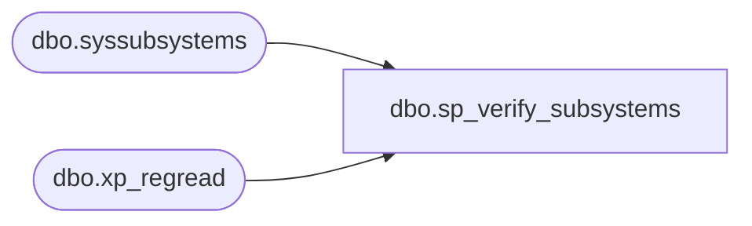

# dbo.sp_verify_subsystems

**Database:** msdb  
**Server:** bearcluster01  

## Architecture Diagram



## Table Dependencies

| Referenced Table |
|---|
| dbo.syssubsystems |
| dbo.xp_regread |

## Stored Procedure Code

```sql
CREATE PROCEDURE dbo.sp_verify_subsystems
   @syssubsytems_refresh_needed BIT = 0
AS
BEGIN
    SET NOCOUNT ON
   
    DECLARE @retval         INT
    DECLARE @VersionRootPath nvarchar(512)
    DECLARE @ComRootPath nvarchar(512)
    DECLARE @DtsRootPath nvarchar(512)
    DECLARE @SQLPSPath nvarchar(512)
    DECLARE @DTExec nvarchar(512)
    DECLARE @DTExecExists INT
    DECLARE @ToolsPath nvarchar(512)

    IF ( (@syssubsytems_refresh_needed=1) OR (NOT EXISTS(select * from syssubsystems)) )
    BEGIN
        EXEC master.dbo.xp_regread N'HKEY_LOCAL_MACHINE', N'SOFTWARE\Microsoft\Microsoft Sql Server\130', N'VerSpecificRootDir', @VersionRootPath OUTPUT
     
        IF @VersionRootPath IS NULL
        BEGIN
            RAISERROR(14659, -1, -1) WITH LOG
            RETURN(1)
        END

        EXEC master.dbo.xp_regread N'HKEY_LOCAL_MACHINE', N'SOFTWARE\Microsoft\Microsoft SQL Server\130\SSIS\Setup\DTSPath', N'', @DtsRootPath OUTPUT, N'no_output'
     
        IF (@DtsRootPath IS NOT NULL)
        BEGIN
            SELECT @DtsRootPath  = @DtsRootPath  + N'Binn\'
            SELECT @DTExec = @DtsRootPath + N'DTExec.exe'
            CREATE TABLE #t (file_exists int, is_directory int, parent_directory_exists int)
            INSERT #t EXEC xp_fileexist @DTExec
            SELECT TOP 1 @DTExecExists=file_exists from #t
            DROP TABLE #t
            IF ((@DTExecExists IS NULL) OR (@DTExecExists = 0))
            BEGIN
                SET @DtsRootPath = NULL
            END
        END

        SELECT @ComRootPath  = @VersionRootPath  + N'COM\'

        DECLARE @edition nvarchar(256)
        DECLARE @bitness int
        SELECT @edition = @@version
        SET @bitness = CASE WHEN @edition like '%(X64)%' THEN 64 ELSE 32 END
        IF (@bitness = 64)
        BEGIN
            EXEC master.dbo.xp_regread N'HKEY_LOCAL_MACHINE', N'SOFTWARE\Wow6432Node\Microsoft\Microsoft Sql Server\130\Tools\ClientSetup', N'SQLPath', @ToolsPath OUTPUT
        END
        ELSE
        BEGIN
            EXEC master.dbo.xp_regread N'HKEY_LOCAL_MACHINE', N'SOFTWARE\Microsoft\Microsoft Sql Server\130\Tools\ClientSetup', N'SQLPath', @ToolsPath OUTPUT
        END

        SELECT @SQLPSPath  = @ToolsPath  + N'\Binn\SQLPS.exe'
     
        -- Procedure must start its own transaction if we don't have one already.
        DECLARE @TranCounter INT;
        SET @TranCounter = @@TRANCOUNT;
        IF @TranCounter = 0
        BEGIN
            BEGIN TRANSACTION;
        END
	
        -- backup subsystem's max worker thread setting
        DECLARE @subsystemsettings TABLE
        (
            subsystem          NVARCHAR(40) COLLATE database_default NOT NULL,
            max_worker_threads INT           NULL
        )

        INSERT INTO @subsystemsettings
        SELECT 
        subsystem, max_worker_threads 
        FROM  syssubsystems

        -- Fix for #525111 - when MSDB is restored from any other sqlserver, it is possible that physical path to agent_exe, subsystem_dll may not be valid on current server
        --  It is better to delete all records in this table and reinsert them again
        -- perform delete and re-insert operations within a transaction
        TRUNCATE TABLE syssubsystems

        DECLARE @processor_count INT
        SELECT @processor_count=cpu_count FROM sys.dm_os_sys_info

        BEGIN TRY
            --create subsystems
            --TSQL subsystem
            INSERT syssubsystems
            VALUES
            (
                1, N'TSQL',14556, FORMATMESSAGE(14557), FORMATMESSAGE(14557), FORMATMESSAGE(14557), FORMATMESSAGE(14557), FORMATMESSAGE(14557), 20 * @processor_count
            )

            --CmdExec subsystem
            INSERT syssubsystems
            VALUES
            (
                3, N'CmdExec', 14550,  N'SQLCMDSS.DLL',NULL,N'CmdExecStart',N'CmdEvent',N'CmdExecStop', 10 * @processor_count
            )

            --Snapshot subsystem
            INSERT syssubsystems
            VALUES
            (
                4, N'Snapshot',   14551, N'SQLREPSS.DLL', @ComRootPath + N'SNAPSHOT.EXE', N'ReplStart',N'ReplEvent',N'ReplStop',100 * @processor_count
            )

            --LogReader subsystem
            INSERT syssubsystems
            VALUES
            (
                5, N'LogReader',  14552, N'SQLREPSS.DLL', @ComRootPath + N'logread.exe',N'ReplStart',N'ReplEvent',N'ReplStop',25 * @processor_count
            )

            --Distribution subsystem
            INSERT syssubsystems
            VALUES
            (
                6, N'Distribution',  14553,  N'SQLREPSS.DLL', @ComRootPath + N'DISTRIB.EXE',N'ReplStart',N'ReplEvent',N'ReplStop',100 * @processor_count
            )

            --Merge subsystem
            INSERT syssubsystems
            VALUES
            (
                7, N'Merge',   14554,  N'SQLREPSS.DLL',@ComRootPath + N'REPLMERG.EXE',N'ReplStart',N'ReplEvent',N'ReplStop',100 * @processor_count
            )

            --QueueReader subsystem
            INSERT syssubsystems
            VALUES
            (
                8, N'QueueReader',   14581,  N'SQLREPSS.dll',@ComRootPath + N'qrdrsvc.exe',N'ReplStart',N'ReplEvent',N'ReplStop',100 * @processor_count
            )

            --ANALYSISQUERY subsystem
            INSERT syssubsystems
            VALUES
            (
                9, N'ANALYSISQUERY', 14513, N'SQLOLAPSS.DLL',NULL,N'OlapStart',N'OlapQueryEvent',N'OlapStop',100 * @processor_count
            )

            --ANALYSISCOMMAND subsystem
            INSERT syssubsystems
            VALUES
            (
                10, N'ANALYSISCOMMAND', 14514, N'SQLOLAPSS.DLL',NULL,N'OlapStart',N'OlapCommandEvent',N'OlapStop',100 * @processor_count
            )

            IF(@DtsRootPath IS NOT NULL)
            BEGIN
                --DTS subsystem
                INSERT syssubsystems
                VALUES
                (
	                11, N'SSIS', 14538,  N'SQLDTSSS.DLL',@DtsRootPath + N'DTExec.exe',N'DtsStart',N'DtsEvent',N'DtsStop',100 * @processor_count
                )
            END
       
            --PowerShell subsystem     
            INSERT syssubsystems
            VALUES
            (
                    12, N'PowerShell', 14698,  N'SQLPOWERSHELLSS.DLL', @SQLPSPath, N'PowerShellStart',N'PowerShellEvent',N'PowerShellStop',2
            )

            -- restore back subsystem's max_worker thread setting(s)
            UPDATE syssubsystems
            SET max_worker_threads = se.max_worker_threads
            FROM syssubsystems sub, @subsystemsettings se
            WHERE sub.subsystem = se.subsystem
     
        END TRY
        BEGIN CATCH
            DECLARE @ErrorMessage NVARCHAR(400)
            DECLARE @ErrorSeverity INT
            DECLARE @ErrorState INT

            SELECT @ErrorMessage = ERROR_MESSAGE()
            SELECT @ErrorSeverity = ERROR_SEVERITY()
            SELECT @ErrorState = ERROR_STATE()

            -- Roll back the transaction that we started if we are not nested
            IF @TranCounter = 0
            BEGIN
                ROLLBACK TRANSACTION;
            END
       
            -- if we are nested inside another transaction just raise the 
            -- error and let the outer transaction do the rollback
            RAISERROR (@ErrorMessage, -- Message text.
                    @ErrorSeverity, -- Severity.
                    @ErrorState -- State.
                    )
            RETURN (1)                  
        END CATCH
    END --(NOT EXISTS(select * from syssubsystems))
  
    -- commit the transaction we started
    IF @TranCounter = 0
    BEGIN
        COMMIT TRANSACTION;
    END
  
    RETURN(0) -- Success
END

dbo,sp_write_sysjobstep_log,CREATE PROCEDURE sp_write_sysjobstep_log
  @job_id    UNIQUEIDENTIFIER, 
  @step_id   INT,
  @log_text  NVARCHAR(MAX),
  @append_to_last INT = 0
AS
BEGIN
  DECLARE @step_uid UNIQUEIDENTIFIER
  DECLARE @log_already_exists int
  SET @log_already_exists = 0

  SET @step_uid = ( SELECT step_uid FROM  msdb.dbo.sysjobsteps
      WHERE (job_id = @job_id)
        AND (step_id = @step_id) )
  

  IF(EXISTS(SELECT * FROM msdb.dbo.sysjobstepslogs
                      WHERE step_uid = @step_uid ))
  BEGIN
     SET @log_already_exists = 1
  END

  --Need create log if "overwrite is selected or log does not exists. 
  IF (@append_to_last = 0) OR (@log_already_exists = 0)
  BEGIN
     -- flag is overwrite
     
     --if overwrite and log exists, delete it
     IF (@append_to_last = 0 AND @log_already_exists = 1)
     BEGIN
        -- remove previous logs entries 
        EXEC sp_delete_jobsteplog @job_id, NULL, @step_id, NULL   
     END
   
     INSERT INTO msdb.dbo.sysjobstepslogs
      (
         log,
         log_size,
         step_uid
      )
      VALUES
      (
         @log_text,
         DATALENGTH(@log_text),
         @step_uid
      )
  END
  ELSE
  BEGIN
     DECLARE @log_id   INT
     --Selecting TOP is just a safety net - there is only one log entry row per step.
     SET @log_id = ( SELECT TOP 1 log_id FROM msdb.dbo.sysjobstepslogs
         WHERE (step_uid = @step_uid)
           ORDER BY log_id DESC ) 

      -- Append @log_text to the existing log record. Note that if this
      -- action would make the value of the log column longer than
      -- nvarchar(max), then the engine will raise error 599.
      UPDATE msdb.dbo.sysjobstepslogs
        SET 
             log .WRITE(@log_text,NULL,0),
             log_size = DATALENGTH(log) + DATALENGTH(@log_text) ,
             date_modified = getdate()
      WHERE log_id = @log_id
  END

  RETURN(@@error) -- 0 means success

END
```

