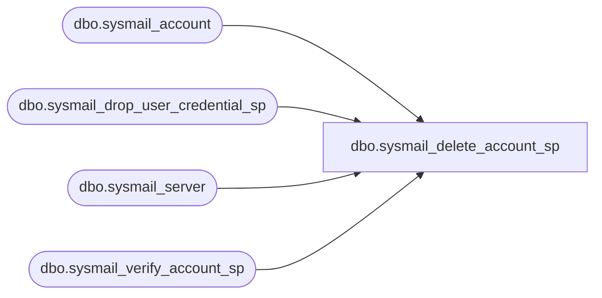

# dbo.sysmail_delete_account_sp

**Database:** msdb  
**Server:** bearcluster01  

## Architecture Diagram



## Table Dependencies

| Referenced Table |
|---|
| dbo.sysmail_account |
| dbo.sysmail_drop_user_credential_sp |
| dbo.sysmail_server |
| dbo.sysmail_verify_account_sp |

## Stored Procedure Code

```sql
CREATE PROCEDURE dbo.sysmail_delete_account_sp
   @account_id int = NULL, -- must provide either id or name
   @account_name sysname = NULL
AS
   SET NOCOUNT ON
  
   DECLARE @rc int
   DECLARE @accountid int
   DECLARE @credential_name sysname

   exec @rc = msdb.dbo.sysmail_verify_account_sp @account_id, @account_name, 0, 0, @accountid OUTPUT
   IF @rc <> 0
      RETURN(1)

   -- Get all the credentials has been stored for this account
   DECLARE cur CURSOR FOR
      SELECT c.name
      FROM sys.credentials as c
      JOIN msdb.dbo.sysmail_server as ms
         ON c.credential_id = ms.credential_id
      WHERE account_id = @accountid

   OPEN cur
   FETCH NEXT FROM cur INTO @credential_name
   WHILE @@FETCH_STATUS = 0
   BEGIN
      -- drop the credential
      EXEC msdb.dbo.sysmail_drop_user_credential_sp @credential_name = @credential_name

      FETCH NEXT FROM cur INTO @credential_name
   END

   CLOSE cur
   DEALLOCATE cur
     
   DELETE FROM msdb.dbo.sysmail_account
   WHERE account_id = @accountid
   
   RETURN(0)

dbo,sysmail_delete_log_sp,CREATE PROCEDURE sysmail_delete_log_sp
   @logged_before DATETIME   = NULL, 
   @event_type varchar(15)   = NULL
AS
BEGIN

   SET @event_type       = LTRIM(RTRIM(@event_type))
   IF @event_type        = '' SET @event_type = NULL
   DECLARE @event_type_numeric INT

   IF ( (@event_type IS NOT NULL) AND
         (LOWER(@event_type collate SQL_Latin1_General_CP1_CS_AS) NOT IN ( 'success', 'warning', 'error', 'information' ) ) )
   BEGIN
        RAISERROR(14266, -1, -1, '@event_type', 'success, warning, error, information')
      RETURN(1) -- Failure
   END   
   
   IF ( @event_type IS NOT NULL)
   BEGIN
      SET @event_type_numeric = ( SELECT CASE 
                           WHEN @event_type = 'success' THEN 0
                           WHEN @event_type = 'information' THEN 1
                           WHEN @event_type = 'warning' THEN 2
                           ELSE 3 END 
                        )
   END
   ELSE
      SET @event_type_numeric = NULL

   DELETE FROM msdb.dbo.sysmail_log 
   WHERE 
        ((@logged_before IS NULL) OR ( log_date < @logged_before))
   AND ((@event_type_numeric IS NULL) OR (@event_type_numeric = event_type))
END

dbo,sysmail_delete_mailitems_sp,CREATE PROCEDURE sysmail_delete_mailitems_sp
   @sent_before DATETIME   = NULL, -- sent before
   @sent_status varchar(8)   = NULL -- sent status
AS
BEGIN

   SET @sent_status       = LTRIM(RTRIM(@sent_status))
   IF @sent_status           = '' SET @sent_status = NULL

   IF ( (@sent_status IS NOT NULL) AND
         (LOWER(@sent_status collate SQL_Latin1_General_CP1_CS_AS) NOT IN ( 'unsent', 'sent', 'failed', 'retrying') ) )
   BEGIN
      RAISERROR(14266, -1, -1, '@sent_status', 'unsent, sent, failed, retrying')
      RETURN(1) -- Failure
   END

   IF ( @sent_before IS NULL AND @sent_status IS NULL )
   BEGIN
      RAISERROR(14608, -1, -1, '@sent_before', '@sent_status')  
      RETURN(1) -- Failure
   END

   DELETE FROM msdb.dbo.sysmail_allitems 
   WHERE 
        ((@sent_before IS NULL) OR ( send_request_date < @sent_before))
   AND ((@sent_status IS NULL) OR (sent_status = @sent_status))

   DECLARE @localmessage nvarchar(255)
    SET @localmessage = FORMATMESSAGE(14665, SUSER_SNAME(), @@ROWCOUNT)
    exec msdb.dbo.sysmail_logmailevent_sp @event_type=1, @description=@localmessage

END
```

