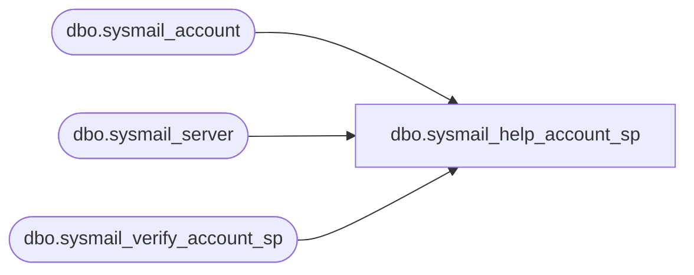

# dbo.sysmail_help_account_sp

**Database:** msdb  
**Server:** bearcluster01  

## Architecture Diagram



## Table Dependencies

| Referenced Table |
|---|
| dbo.sysmail_account |
| dbo.sysmail_server |
| dbo.sysmail_verify_account_sp |

## Stored Procedure Code

```sql
CREATE PROCEDURE dbo.sysmail_help_account_sp
   @account_id int = NULL,
   @account_name sysname = NULL
AS
   SET NOCOUNT ON

   DECLARE @rc int
   DECLARE @accountid int
   exec @rc = msdb.dbo.sysmail_verify_account_sp @account_id, @account_name, 1, 0, @accountid OUTPUT
   IF @rc <> 0
      RETURN(1)

   IF (@accountid IS NOT NULL)
      SELECT a.account_id, a.name, a.description, a.email_address, a.display_name, a.replyto_address, s.servertype, s.servername, s.port, s.username, s.use_default_credentials, s.enable_ssl 
      FROM msdb.dbo.sysmail_account a, msdb.dbo.sysmail_server s
      WHERE a.account_id = s.account_id AND a.account_id = @accountid
      
   ELSE
      SELECT a.account_id, a.name, a.description, a.email_address, a.display_name, a.replyto_address, s.servertype, s.servername, s.port, s.username, s.use_default_credentials, s.enable_ssl
      FROM msdb.dbo.sysmail_account a, msdb.dbo.sysmail_server s
      WHERE a.account_id = s.account_id

   RETURN(0)
```

