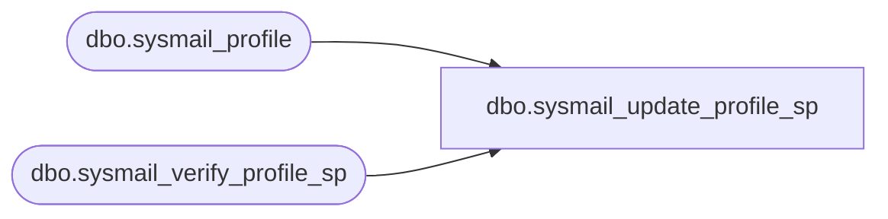

# dbo.sysmail_update_profile_sp

**Database:** msdb  
**Server:** bearcluster01  

## Architecture Diagram



## Table Dependencies

| Referenced Table |
|---|
| dbo.sysmail_profile |
| dbo.sysmail_verify_profile_sp |

## Stored Procedure Code

```sql
CREATE PROCEDURE dbo.sysmail_update_profile_sp
   @profile_id int = NULL, -- must provide either id or name
   @profile_name sysname = NULL,
   @description nvarchar(256) = NULL
AS
   SET NOCOUNT ON
  
   DECLARE @rc int
   DECLARE @profileid int
   exec @rc = msdb.dbo.sysmail_verify_profile_sp @profile_id, @profile_name, 0, 1, @profileid OUTPUT
   IF @rc <> 0
      RETURN(1)
   
   IF (@profile_name IS NOT NULL AND @description IS NOT NULL)
      UPDATE msdb.dbo.sysmail_profile 
      SET name=@profile_name, description = @description
      WHERE profile_id = @profileid
      
   ELSE IF (@profile_name IS NOT NULL)
      UPDATE msdb.dbo.sysmail_profile 
      SET name=@profile_name
      WHERE profile_id = @profileid

   ELSE IF (@description IS NOT NULL)
      UPDATE msdb.dbo.sysmail_profile 
      SET description = @description
      WHERE profile_id = @profileid
      
   ELSE
   BEGIN
      RAISERROR(14610, -1, -1)   
      RETURN(1)
   END

   RETURN(0)
```

