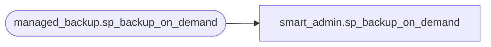

# smart_admin.sp_backup_on_demand

**Database:** msdb  
**Server:** bearcluster01  

## Architecture Diagram



## Table Dependencies

| Referenced Table |
|---|
| managed_backup.sp_backup_on_demand |

## Stored Procedure Code

```sql
-- Do a backup on-demand by piggybacking on Smart Backup's backup mechanism.
-- @type can be either 'DATABASE' or 'LOG'
--
CREATE PROCEDURE smart_admin.sp_backup_on_demand
	@database_name	SYSNAME,
	@type			NVARCHAR(32)
AS
BEGIN
	EXECUTE managed_backup.sp_backup_on_demand @database_name, @type
END
```

