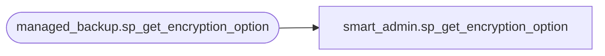

# smart_admin.sp_get_encryption_option

**Database:** msdb  
**Server:** bearcluster01  

## Architecture Diagram



## Table Dependencies

| Referenced Table |
|---|
| managed_backup.sp_get_encryption_option |

## Stored Procedure Code

```sql
CREATE PROCEDURE smart_admin.sp_get_encryption_option
	@encryption_algorithm	SYSNAME, -- NULL for NO_ENCRYPTION
	@encryptor_type			TINYINT, -- 0 = CERTIFICATE, 1 = ASYMMETRIC_KEY, NULL for NO_ENCRYPTION
	@encryptor_name			SYSNAME, -- NULL for NO_ENCRYPTION
	@encryption_option		NVARCHAR(MAX) = NULL OUTPUT
AS
BEGIN
	EXECUTE [managed_backup].[sp_get_encryption_option] @encryption_algorithm, 
		@encryptor_type, 
		@encryptor_name, 
		@encryption_option OUTPUT
END
```

