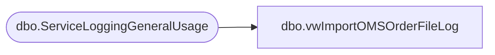

# dbo.vwImportOMSOrderFileLog

**Database:** ApplicationResources  
**Server:** bearcluster01  

## Architecture Diagram



## Table Dependencies

| Referenced Table |
|---|
| dbo.ServiceLoggingGeneralUsage |

## View Code

```sql
CREATE view [dbo].[vwImportOMSOrderFileLog]


as


with 
ImportLog as
	(
		SELECT 
			LogCreatedDate,
			IsAnException,
			substring(ExceptionMessage, 11, 10) as OrderNumber,
			substring(ExceptionMessage, charindex('|',ExceptionMessage)+2,100) OrderFileName,
			ExceptionMessage as ImportLog
		FROM [ApplicationResources].[dbo].[ServiceLoggingGeneralUsage] WITH (NOLOCK)
		WHERE FunctionName = 'LoadOrdersFromOMS'
	)
select 
	LogCreatedDate,
	cast(OrderNumber as varchar(10)) as OrderNumber,
	cast(OrderFileName as varchar(100)) as OrderFileName,
	case
		when left(OrderNumber,1) = 'U'
			then 'UK'
			else 'US'
		end
	as CountryCode
from ImportLog
where substring(OrderNumber, 9,1) = '_'
```

