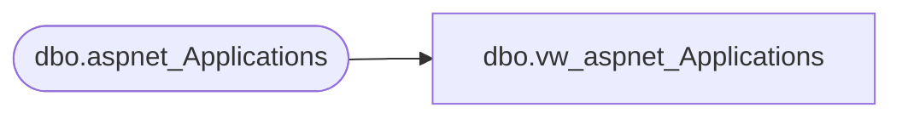

# dbo.vw_aspnet_Applications

**Database:** ApplicationResources  
**Server:** bearcluster01  

## Architecture Diagram



## Table Dependencies

| Referenced Table |
|---|
| dbo.aspnet_Applications |

## View Code

```sql
CREATE VIEW [dbo].[vw_aspnet_Applications]
  AS SELECT [dbo].[aspnet_Applications].[ApplicationName], [dbo].[aspnet_Applications].[LoweredApplicationName], [dbo].[aspnet_Applications].[ApplicationId], [dbo].[aspnet_Applications].[Description]
  FROM [dbo].[aspnet_Applications]
```

