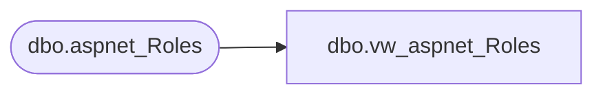

# dbo.vw_aspnet_Roles

**Database:** ApplicationResources  
**Server:** bearcluster01  

## Architecture Diagram



## Table Dependencies

| Referenced Table |
|---|
| dbo.aspnet_Roles |

## View Code

```sql
CREATE VIEW [dbo].[vw_aspnet_Roles]
  AS SELECT [dbo].[aspnet_Roles].[ApplicationId], [dbo].[aspnet_Roles].[RoleId], [dbo].[aspnet_Roles].[RoleName], [dbo].[aspnet_Roles].[LoweredRoleName], [dbo].[aspnet_Roles].[Description]
  FROM [dbo].[aspnet_Roles]
```

