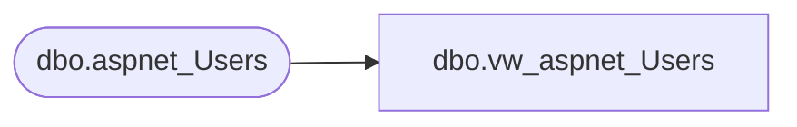

# dbo.vw_aspnet_Users

**Database:** ApplicationResources  
**Server:** bearcluster01  

## Architecture Diagram



## Table Dependencies

| Referenced Table |
|---|
| dbo.aspnet_Users |

## View Code

```sql
CREATE VIEW [dbo].[vw_aspnet_Users]
  AS SELECT [dbo].[aspnet_Users].[ApplicationId], [dbo].[aspnet_Users].[UserId], [dbo].[aspnet_Users].[UserName], [dbo].[aspnet_Users].[LoweredUserName], [dbo].[aspnet_Users].[MobileAlias], [dbo].[aspnet_Users].[IsAnonymous], [dbo].[aspnet_Users].[LastActivityDate]
  FROM [dbo].[aspnet_Users]
```

