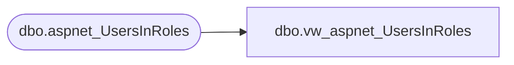

# dbo.vw_aspnet_UsersInRoles

**Database:** ApplicationResources  
**Server:** bearcluster01  

## Architecture Diagram



## Table Dependencies

| Referenced Table |
|---|
| dbo.aspnet_UsersInRoles |

## View Code

```sql
CREATE VIEW [dbo].[vw_aspnet_UsersInRoles]
  AS SELECT [dbo].[aspnet_UsersInRoles].[UserId], [dbo].[aspnet_UsersInRoles].[RoleId]
  FROM [dbo].[aspnet_UsersInRoles]
```

