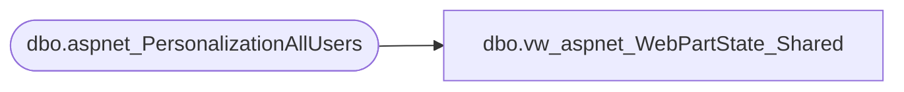

# dbo.vw_aspnet_WebPartState_Shared

**Database:** ApplicationResources  
**Server:** bearcluster01  

## Architecture Diagram



## Table Dependencies

| Referenced Table |
|---|
| dbo.aspnet_PersonalizationAllUsers |

## View Code

```sql
CREATE VIEW [dbo].[vw_aspnet_WebPartState_Shared]
  AS SELECT [dbo].[aspnet_PersonalizationAllUsers].[PathId], [DataSize]=DATALENGTH([dbo].[aspnet_PersonalizationAllUsers].[PageSettings]), [dbo].[aspnet_PersonalizationAllUsers].[LastUpdatedDate]
  FROM [dbo].[aspnet_PersonalizationAllUsers]
```

