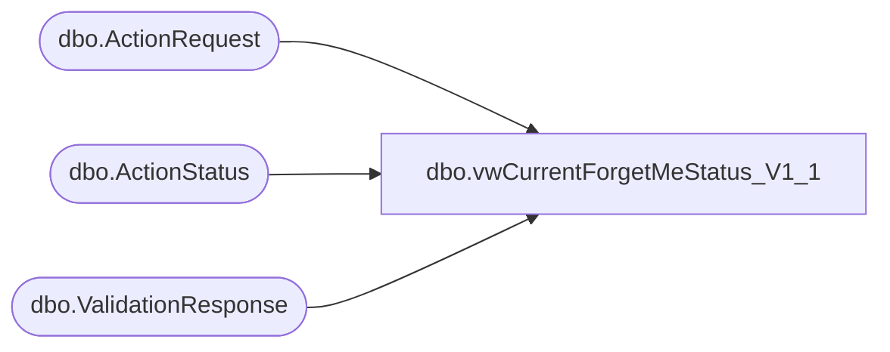

# dbo.vwCurrentForgetMeStatus_V1_1

**Database:** BABWForgetMe  
**Server:** bearcluster01  

## Architecture Diagram



## Table Dependencies

| Referenced Table |
|---|
| dbo.ActionRequest |
| dbo.ActionStatus |
| dbo.ValidationResponse |

## View Code

```sql
CREATE VIEW [dbo].[vwCurrentForgetMeStatus_V1_1]
AS
SELECT        TOP (100) PERCENT a.RecordKey, a.EmailAddress, a.InsertDate, a.ValidationDate, a.CompletionDate, a.RecordsFlaggedDate, r.ActionRequestName, v.ResponseName, r.ActionRequestID, a.ForgetMeAdminValidationDate
FROM            dbo.ActionStatus AS a LEFT OUTER JOIN
                         dbo.ActionRequest AS r ON a.ActionRequestID = r.ActionRequestID LEFT OUTER JOIN
                         dbo.ValidationResponse AS v ON a.ValidationResponseID = v.ResponseID
ORDER BY a.InsertDate DESC
```

