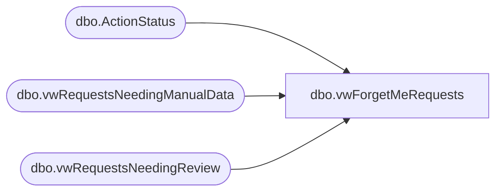

# dbo.vwForgetMeRequests

**Database:** BABWForgetMe  
**Server:** bearcluster01  

## Architecture Diagram



## Table Dependencies

| Referenced Table |
|---|
| dbo.ActionStatus |
| dbo.vwRequestsNeedingManualData |
| dbo.vwRequestsNeedingReview |

## View Code

```sql
CREATE VIEW [dbo].[vwForgetMeRequests]
AS


SELECT        ROW_NUMBER() OVER(ORDER BY ValidationDate ASC) AS ID,
			  dbo.ActionStatus.RecordKey, 
			  dbo.ActionStatus.EmailAddress,
			  dbo.ActionStatus.FirstName,
			  dbo.ActionStatus.LastName,
			  dbo.ActionStatus.ActionRequestID AS RetrieveRequest, 
			  dbo.ActionStatus.ValidationDate, 
			  dbo.ActionStatus.CompletionDate, 
			  dbo.ActionStatus.RecordsFlaggedDate,
              CASE ISNULL(isnull(dbo.vwRequestsNeedingManualData.RecordKey,dbo.vwRequestsNeedingReview.RecordKey),'Complete')  
					When 'Complete' then 1
			  Else 0
			  End AS ReviewStatus
FROM            dbo.ActionStatus 
				LEFT JOIN dbo.vwRequestsNeedingManualData 
					ON dbo.ActionStatus.RecordKey = dbo.vwRequestsNeedingManualData.RecordKey 
				LEFT JOIN dbo.vwRequestsNeedingReview 
					ON dbo.ActionStatus.RecordKey = dbo.vwRequestsNeedingReview.RecordKey
WHERE         (dbo.ActionStatus.RecordsFlaggedDate IS NOT NULL) AND (dbo.ActionStatus.ValidationDate IS NOT NULL)
```

