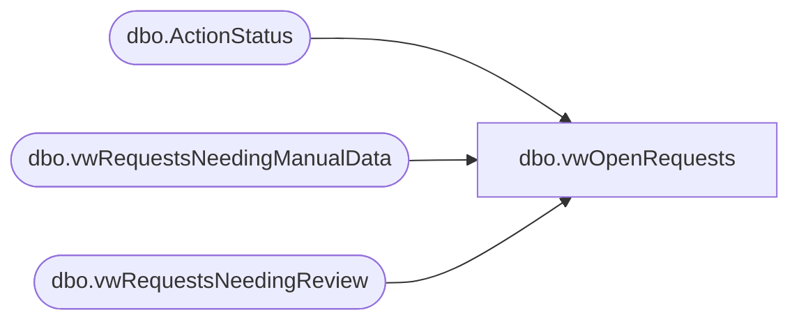

# dbo.vwOpenRequests

**Database:** BABWForgetMe  
**Server:** bearcluster01  

## Architecture Diagram



## Table Dependencies

| Referenced Table |
|---|
| dbo.ActionStatus |
| dbo.vwRequestsNeedingManualData |
| dbo.vwRequestsNeedingReview |

## View Code

```sql
CREATE VIEW [dbo].[vwOpenRequests]
AS
SELECT        dbo.ActionStatus.RecordKey
             ,dbo.ActionStatus.EmailAddress
			 ,dbo.ActionStatus.FirstName
			 ,dbo.ActionStatus.LastName
			 ,dbo.ActionStatus.Address1
			 ,dbo.ActionStatus.Address2
			 ,dbo.ActionStatus.City
			 ,dbo.ActionStatus.State
			 ,dbo.ActionStatus.PostalCode
			 ,dbo.ActionStatus.PhoneNumber
			 ,dbo.ActionStatus.ActionRequestID
			 ,dbo.ActionStatus.ValidationDate
			 ,dbo.ActionStatus.CompletionDate
			 ,dbo.ActionStatus.RecordsFlaggedDate
			 ,CASE ISNULL(isnull(dbo.vwRequestsNeedingManualData.RecordKey,dbo.vwRequestsNeedingReview.RecordKey),'Complete')
			    When 'Complete' then 'Review Complete' 
				Else 'Review Incomplete'
			  End AS ReviewStatus
			 ,dbo.ActionStatus.InsertDate
			 ,DATEADD(DAY, 30, dbo.ActionStatus.InsertDate) AS DueDate
			 ,CASE
				WHEN DATEDIFF(DAY, dbo.ActionStatus.InsertDate, GETDATE()) BETWEEN 0 AND 20  THEN 4
				WHEN DATEDIFF(DAY, dbo.ActionStatus.InsertDate, GETDATE()) BETWEEN 20 AND 25 THEN 3
				WHEN DATEDIFF(DAY, dbo.ActionStatus.InsertDate, GETDATE()) BETWEEN 25 AND 30 THEN 2 --DANGER
				ELSE 1 --OVERDUE
			 END  AS 'Status'
FROM            dbo.ActionStatus 
				lEFT JOIN dbo.vwRequestsNeedingManualData ON dbo.ActionStatus.RecordKey = dbo.vwRequestsNeedingManualData.RecordKey 
				lEFT JOIN dbo.vwRequestsNeedingReview ON dbo.ActionStatus.RecordKey = dbo.vwRequestsNeedingReview.RecordKey
WHERE         (dbo.ActionStatus.RecordsFlaggedDate IS NOT NULL) AND (dbo.ActionStatus.ValidationDate IS NOT NULL)
```

