# dbo.vwRequestsNeedingManualData

**Database:** BABWForgetMe  
**Server:** bearcluster01  

## Architecture Diagram

```mermaid
flowchart LR
    VIEW["dbo.vwRequestsNeedingManualData"]
    dbo_ActionQuery(["dbo.ActionQuery"]) --> VIEW
    dbo_ActionStatus(["dbo.ActionStatus"]) --> VIEW
    dbo_RequestCompletionLog(["dbo.RequestCompletionLog"]) --> VIEW
```



## Table Dependencies

| Referenced Table |
|---|
| dbo.ActionQuery |
| dbo.ActionStatus |
| dbo.RequestCompletionLog |

## View Code

```sql
CREATE VIEW [dbo].[vwRequestsNeedingManualData]
AS
SELECT        s.RecordKey
FROM            dbo.ActionStatus AS s CROSS JOIN
                         dbo.ActionQuery AS Q LEFT OUTER JOIN
                         dbo.RequestCompletionLog AS L ON s.RecordKey = L.RecordKey AND Q.AQKey = L.AQKey
WHERE        (s.ValidationDate IS NOT NULL) AND (s.RecordsFlaggedDate IS NOT NULL) AND (s.CompletionDate IS NULL) AND (L.RequestLogID IS NULL) AND (Q.FindRecordQuery = 'Manual')
and q.AQKey <> '112'
GROUP BY s.RecordKey
```

