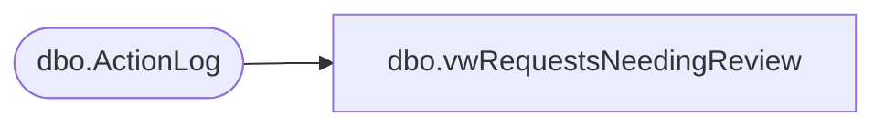

# dbo.vwRequestsNeedingReview

**Database:** BABWForgetMe  
**Server:** bearcluster01  

## Architecture Diagram



## Table Dependencies

| Referenced Table |
|---|
| dbo.ActionLog |

## View Code

```sql
CREATE VIEW [dbo].[vwRequestsNeedingReview]
AS
SELECT        RecordKey
FROM            dbo.ActionLog
WHERE        (RemoveData IS NULL) 
AND ActionTableKey <> 30
GROUP BY RecordKey
```

