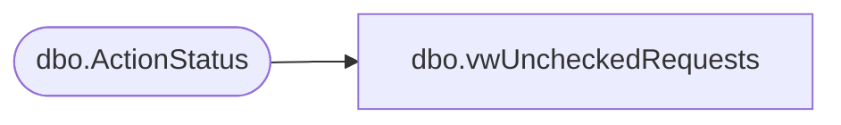

# dbo.vwUncheckedRequests

**Database:** BABWForgetMe  
**Server:** bearcluster01  

## Architecture Diagram



## Table Dependencies

| Referenced Table |
|---|
| dbo.ActionStatus |

## View Code

```sql
CREATE VIEW [dbo].[vwUncheckedRequests]
AS
SELECT        RecordKey, EmailAddress, FirstName, LastName, ValidationDate, ValidationResponseID, ActionRequestID, ForgetMeAdminRecordsFlaggedDate, ForgetMeAdminValidationDate, ForgetMeAdminHoldDate, ForgetMeAdminCancelledDate, Address1, 
                         Address2, City, State, PostalCode, PrivacyPolicyID, CountryID, PhoneNumber
FROM            dbo.ActionStatus
WHERE        (ForgetMeAdminRecordsFlaggedDate IS NOT NULL) AND (ForgetMeAdminValidationDate IS NULL) AND (ForgetMeAdminCancelledDate IS NULL)
```

